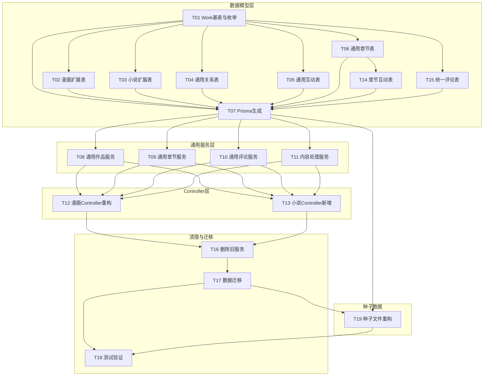

# Tasks

## T01 新增 Work 基表与作品类型常量
- [x] 创建 prisma/models/work/work.prisma 文件
  - [x] 定义 Work 模型包含公共字段：id, type, name, alias, cover, description, language, region, ageRating, serialStatus, publisher, originalSource, copyright, disclaimer, isPublished, publishAt, lastUpdated, viewCount, favoriteCount, likeCount, rating, ratingCount, popularity, isRecommended, isHot, isNew, recommendWeight, createdAt, updatedAt, deletedAt
  - [x] **重要**：type 字段使用 Int 类型（1=漫画, 2=小说），不使用 Prisma enum（数据表不允许使用枚举）
  - [x] 添加必要索引：isPublished+publishAt, popularity, language+region, serialStatus, lastUpdated, name, isRecommended, isHot+isNew
- [x] 创建 libs/base/src/constant/work-type.constant.ts 文件
  - [x] 定义 WorkTypeEnum 枚举（TypeScript 层面使用，值为 1 和 2）
- [x] 修改 libs/base/src/constant/index.ts 导出常量
- [x] 验证 Prisma schema 能生成 Work 模型

## T02 改造漫画主表为扩展表
- [x] 修改 prisma/models/work/comic/work-comic.prisma
  - [x] 新增 workId 外键关联 Work，建立一对一关系
  - [x] 移除已上移到 Work 的所有字段
  - [x] 仅保留 workId 和时间戳字段
- [x] 验证 WorkComic 与 Work 关联完整

## T03 新增小说扩展表
- [x] 创建 prisma/models/work/novel/work-novel.prisma
  - [x] 定义 workId 外键关联 Work
  - [x] 包含 wordCount 字段
  - [x] 包含时间戳字段
- [x] 验证 Prisma 模型可生成

## T04 通用化作者/分类/标签关系表
- [x] 创建 prisma/models/work/work-author-relation.prisma
  - [x] 使用 workId 作为主关联
  - [x] 包含 sortOrder, role 字段
  - [x] 添加唯一约束 (workId, authorId)
- [x] 创建 prisma/models/work/work-category-relation.prisma
  - [x] 使用 workId 作为主关联
  - [x] 包含 sortOrder 字段
  - [x] 添加唯一约束 (workId, categoryId)
- [x] 创建 prisma/models/work/work-tag-relation.prisma
  - [x] 使用 workId 作为主关联
  - [x] 添加唯一约束 (workId, tagId)
- [x] 删除 prisma/models/work/comic/work-comic-author.prisma
- [x] 删除 prisma/models/work/comic/work-comic-category.prisma
- [x] 删除 prisma/models/work/comic/work-comic-tag.prisma
- [x] 验证关系表可正常使用

## T05 通用化收藏/点赞关系表
- [x] 创建 prisma/models/work/work-favorite.prisma
  - [x] 使用 workId, userId 作为核心字段
  - [x] 使用 workType Int 字段（1=漫画, 2=小说）区分作品类型
  - [x] 添加唯一约束 (workId, userId)
- [x] 创建 prisma/models/work/work-like.prisma
  - [x] 使用 workId, userId 作为核心字段
  - [x] 添加唯一约束 (workId, userId)
- [x] 删除 prisma/models/work/comic/work-comic-favorite.prisma
- [x] 删除 prisma/models/work/comic/work-comic-like.prisma
- [x] 验证收藏/点赞表可正常使用

## T06 通用章节表设计
- [x] 创建 prisma/models/work/work-chapter.prisma
  - [x] 使用 workId 作为主关联
  - [x] 使用 workType Int 字段（1=漫画, 2=小说）区分作品类型
  - [x] 包含章节主字段：title, subtitle, description, sortOrder
  - [x] 包含权限字段：readRule, readPoints, downloadRule, downloadPoints, requiredReadLevelId, requiredDownloadLevelId
  - [x] 包含状态字段：isPublished, isPreview, canComment, publishAt
  - [x] 包含统计字段：viewCount, likeCount, commentCount, purchaseCount, wordCount
  - [x] 包含内容存储字段：contentPath
  - [x] 添加唯一约束 (workId, sortOrder)
- [x] 删除 prisma/models/work/comic/work-comic-chapter.prisma
- [x] 验证章节表可正常使用

## T07 Prisma 生成与类型导出同步
- [x] 执行 `pnpm prisma:update`
- [x] 验证类型生成正确
- [x] 验证新模型在服务层可正确导入

## T08 通用作品服务
- [x] 创建 libs/content/src/work/core/work.service.ts
  - [x] 实现 CRUD 方法：createWork, updateWork, getWorkDetail, getWorkPage, deleteWork
  - [x] 实现互动方法：incrementViewCount, incrementLikeCount, incrementFavoriteCount
  - [x] 实现用户状态方法：checkUserLiked, checkUserFavorited, getWorkUserStatus
  - [x] 实现我的记录方法：getMyFavoritePage, getMyLikedPage
- [x] 创建 libs/content/src/work/core/work.module.ts
- [x] 创建 libs/content/src/work/core/work.constant.ts
- [x] 创建 libs/content/src/work/core/index.ts
- [x] 创建 libs/content/src/work/core/dto/work.dto.ts
  - [x] 使用 BaseDto 继承
  - [x] 使用 IntersectionType, OmitType, PartialType, PickType 组合
  - [x] 使用自定义校验器：ValidateString, ValidateNumber, ValidateEnum, ValidateArray
- [x] 验证服务可正常注入和使用

## T09 通用章节服务
- [x] 创建 libs/content/src/work/chapter/work-chapter.service.ts
  - [x] 实现 CRUD 方法：createChapter, updateChapter, getChapterDetail, getChapterPage, deleteChapter, swapChapterNumbers
  - [x] 实现互动方法：incrementViewCount, incrementLikeCount, incrementPurchaseCount, reportDownload
  - [x] 实现用户状态方法：checkUserLiked, checkUserPurchased, checkUserDownloaded, getChapterUserStatus
  - [x] 实现我的记录方法：getMyPurchasedPage, getMyDownloadedPage, getMyReadPage
- [x] 创建 libs/content/src/work/chapter/work-chapter.module.ts
- [x] 创建 libs/content/src/work/chapter/work-chapter.constant.ts
- [x] 创建 libs/content/src/work/chapter/index.ts
- [x] 创建 libs/content/src/work/chapter/dto/work-chapter.dto.ts
  - [x] 复用 BaseWorkDto 的关联字段定义
  - [x] 使用 ChapterUserStatusFieldsDto 定义通用用户状态
  - [x] 使用自定义校验器
- [x] 验证服务可正常注入和使用

## T10 通用评论服务
- [x] 创建 libs/content/src/work/comment/work-comment.service.ts
  - [x] 实现 CRUD 方法：createComment, deleteComment, deleteCommentByAdmin
  - [x] 实现查询方法：getCommentPage, getCommentManagePage, getCommentDetail
  - [x] 实现审核方法：updateCommentAudit, updateCommentHidden, recalcCommentCount
  - [x] 实现举报方法：createCommentReport, getCommentReportPage, handleCommentReport
- [x] 创建 libs/content/src/work/comment/work-comment.module.ts
- [x] 创建 libs/content/src/work/comment/work-comment.constant.ts
- [x] 创建 libs/content/src/work/comment/work-comment.types.ts
- [x] 创建 libs/content/src/work/comment/index.ts
- [x] 创建 libs/content/src/work/comment/dto/work-comment.dto.ts
  - [x] 复用 BaseDto, IdDto, PageDto
  - [x] 使用 ValidateString 校验评论内容
  - [x] 使用 ValidateEnum 校验审核状态
- [x] 验证服务可正常注入和使用

## T11 内容处理服务
- [x] 创建 libs/content/src/work/content/comic-content.service.ts
  - [x] 实现方法：getChapterContents, addChapterContent, updateChapterContent, deleteChapterContent, moveChapterContent, clearChapterContents
- [x] 创建 libs/content/src/work/content/novel-content.service.ts
  - [x] 实现方法：getChapterContent, uploadChapterContent, deleteChapterContent
- [x] 创建 libs/content/src/work/content/content.module.ts
- [x] 创建 libs/content/src/work/content/index.ts
- [x] 创建 libs/content/src/work/content/dto/content.dto.ts
  - [x] 复用 IdDto 标识章节
  - [x] 使用 ValidateArray 校验图片列表
  - [x] 使用 ValidateString 校验文件路径
- [x] 验证服务可正常注入和使用

## T12 漫画 Controller 重构
- [x] 修改 apps/app-api/src/modules/comic/comic.controller.ts
  - [x] 注入 WorkService 替代 ComicService
  - [x] 调整接口调用方式
- [x] 修改 apps/app-api/src/modules/comic/comic-chapter.controller.ts
  - [x] 注入 WorkChapterService 替代 ComicChapterService
  - [x] 调整接口调用方式
- [x] 修改 apps/app-api/src/modules/comic/comic-chapter-comment.controller.ts
  - [x] 注入 WorkCommentService 替代 ComicChapterCommentService
  - [x] 调整接口调用方式
- [x] 修改 apps/app-api/src/modules/comic/comic.module.ts
  - [x] 导入 WorkModule, WorkChapterModule, WorkCommentModule
- [x] 修改 apps/admin-api/src/modules/content-management/comic/core/comic.controller.ts
  - [x] 注入 WorkService 替代 ComicService
- [x] 修改 apps/admin-api/src/modules/content-management/comic/chapter/comic-chapter.controller.ts
  - [x] 注入 WorkChapterService 替代 ComicChapterService
- [x] 修改 apps/admin-api/src/modules/content-management/comic/chapter-comment/comic-chapter-comment.controller.ts
  - [x] 注入 WorkCommentService 替代 ComicChapterCommentService
- [x] 修改 apps/admin-api/src/modules/content-management/comic/chapter-content/chapter-content.controller.ts
  - [x] 注入 ComicContentService
- [x] 修改 apps/admin-api/src/modules/content-management/comic/ 下所有模块文件
  - [x] 导入 WorkModule, WorkChapterModule, WorkCommentModule, ContentModule
- [x] 验证漫画接口功能正常

## T13 小说 Controller 新增
- [x] 创建 apps/app-api/src/modules/novel/novel.controller.ts
  - [x] 注入 WorkService
  - [x] 实现小说 CRUD 接口
- [x] 创建 apps/app-api/src/modules/novel/novel-chapter.controller.ts
  - [x] 注入 WorkChapterService
  - [x] 实现章节 CRUD 接口
- [x] 创建 apps/app-api/src/modules/novel/novel-chapter-comment.controller.ts
  - [x] 注入 WorkCommentService
  - [x] 实现评论接口
- [x] 创建 apps/app-api/src/modules/novel/novel.module.ts
  - [x] 导入 WorkModule, WorkChapterModule, WorkCommentModule
- [x] 创建 apps/app-api/src/modules/novel/index.ts
- [x] 创建 apps/admin-api/src/modules/content-management/novel/novel.controller.ts
  - [x] 注入 WorkService
  - [x] 实现小说管理接口
- [x] 创建 apps/admin-api/src/modules/content-management/novel/novel-chapter.controller.ts
  - [x] 注入 WorkChapterService
  - [x] 实现章节管理接口
- [x] 创建 apps/admin-api/src/modules/content-management/novel/novel-chapter-comment.controller.ts
  - [x] 注入 WorkCommentService
  - [x] 实现评论管理接口
- [x] 创建 apps/admin-api/src/modules/content-management/novel/novel-content.controller.ts
  - [x] 注入 NovelContentService
  - [x] 实现章节文件上传接口
- [x] 创建 apps/admin-api/src/modules/content-management/novel/novel.module.ts
  - [x] 导入 WorkModule, WorkChapterModule, WorkCommentModule, ContentModule
- [x] 创建 apps/admin-api/src/modules/content-management/novel/index.ts
- [x] 验证小说接口功能正常

## T14 通用化章节互动表
- [x] 创建 prisma/models/work/work-chapter-like.prisma
  - [x] 使用 chapterId, userId 作为核心字段
  - [x] 添加唯一约束
- [x] 创建 prisma/models/work/work-chapter-purchase.prisma
  - [x] 使用 chapterId, userId 作为核心字段
  - [x] 添加唯一约束
- [x] 创建 prisma/models/work/work-chapter-download.prisma
  - [x] 使用 chapterId, userId 作为核心字段
  - [x] 添加唯一约束
- [x] 删除 prisma/models/work/comic/work-comic-chapter-like.prisma
- [x] 删除 prisma/models/work/comic/work-comic-chapter-purchase.prisma
- [x] 删除 prisma/models/work/comic/work-comic-chapter-download.prisma
- [x] 验证章节互动表可正常使用

## T15 统一评论表设计
- [x] 创建 prisma/models/work/work-comment.prisma
  - [x] 核心字段：workId, workType(Int: 1=漫画, 2=小说), chapterId, userId, content
  - [x] 回复字段：replyToId, actualReplyToId, floor
  - [x] 审核字段：auditStatus, auditReason, auditAt, auditById, auditRole
  - [x] 其他字段：isHidden, sensitiveWordHits
  - [x] 添加索引：workId, chapterId, userId
- [x] 创建 prisma/models/work/work-comment-report.prisma
  - [x] 举报记录表
- [x] 删除 prisma/models/work/comic/work-comic-chapter-comment.prisma
- [x] 删除 prisma/models/work/comic/work-comic-chapter-comment-report.prisma
- [x] 验证评论表可正常使用

## T16 删除旧服务
- [ ] 删除 libs/content/src/comic/ 目录下所有文件
- [ ] 验证删除后无引用错误

## T17 数据迁移
- [ ] 创建 scripts/migrations/work-base-backfill.ts
  - [ ] 创建 Work 表
  - [ ] 迁移 WorkComic 数据到 Work
  - [ ] 更新 WorkComic 添加 workId 外键
  - [ ] 迁移关系表数据
  - [ ] 迁移互动表数据
  - [ ] 迁移章节表数据（contents 字段转为文件存储）
  - [ ] 迁移评论表数据
  - [ ] 验证数据完整性
- [ ] 创建 scripts/migrations/work-base-verify.ts
  - [ ] 验证迁移后数据总量与关系正确
- [ ] 验证迁移脚本可正常执行

## T18 测试验证
- [ ] 运行 Prisma 迁移
- [ ] 运行 lint 与 typecheck
- [ ] 验证漫画接口功能
- [ ] 验证小说接口功能

## T19 种子文件重构
- [ ] 修改 prisma/seed/index.ts
  - [ ] 调整执行顺序支持 Work 基表
- [ ] 重命名 prisma/seed/modules/work/comic.ts → prisma/seed/modules/work/work.ts
  - [ ] 创建 Work 基表种子数据
  - [ ] 创建 WorkComic/WorkNovel 扩展表种子数据
- [ ] 重命名 prisma/seed/modules/work/comic-author.ts → prisma/seed/modules/work/work-author-relation.ts
- [ ] 重命名 prisma/seed/modules/work/comic-category.ts → prisma/seed/modules/work/work-category-relation.ts
- [ ] 重命名 prisma/seed/modules/work/comic-tag.ts → prisma/seed/modules/work/work-tag-relation.ts
- [ ] 重命名 prisma/seed/modules/work/comic-chapter.ts → prisma/seed/modules/work/work-chapter.ts
- [ ] 创建 prisma/seed/modules/work/novel.ts
  - [ ] 创建小说示例数据
- [ ] 创建 prisma/seed/modules/work/work-comment.ts
  - [ ] 创建统一评论种子数据
- [ ] 删除 prisma/seed/modules/work/comic-chapter-comment.ts
- [ ] 删除 prisma/seed/modules/work/comic-chapter-comment-report.ts
- [ ] 验证种子数据可正常执行

# Task Dependencies

