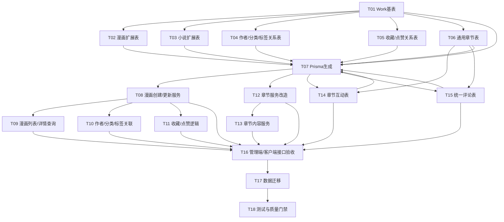

        # Tasks

## T01 新增 Work 基表与作品类型枚举
- [ ] 创建 prisma/models/work/work.prisma 文件
  - [ ] 定义 Work 模型包含公共字段：name, alias, cover, description, language, region, ageRating, serialStatus, publisher, originalSource, copyright, disclaimer, isPublished, isRecommended, isHot, isNew, popularity, rating, recommendWeight, viewCount, favoriteCount, likeCount, ratingCount, publishAt, lastUpdated, remark, createdAt, updatedAt, deletedAt
  - [ ] 定义 Work.type 字段标识作品类型（漫画/小说）
  - [ ] 添加必要索引
- [ ] 修改 libs/base/src/enum/base.enum.ts 新增 WorkTypeEnum
- [ ] 修改 libs/base/src/enum/index.ts 导出枚举
- [ ] 验证 Prisma schema 能生成 Work 模型与枚举类型
- [ ] 验证 Work.type 枚举在基础包对外可用且被正确导出

## T02 改造漫画主表为类型扩展表
- [ ] 修改 prisma/models/work/comic/work-comic.prisma
  - [ ] 新增 workId 外键关联 Work，建立一对一关系
  - [ ] 移除已上移到 Work 的字段：serialStatus, publisher, originalSource, copyright, disclaimer
  - [ ] 将通用索引迁移到 Work，仅保留漫画特有索引
- [ ] 验证 WorkComic 与 Work 关联完整
- [ ] 验证原漫画列表/详情查询能通过 Work 过滤且结果一致

## T03 新增小说扩展表（空壳或最小字段）
- [ ] 创建 prisma/models/work/novel/work-novel.prisma
  - [ ] 仅保留 workId 关联与时间戳字段
  - [ ] 不引入漫画字段，避免跨类型污染
- [ ] 验证 Prisma 模型可生成，结构最小可用且可被引用

## T04 通用化作者/分类/标签关系表
- [ ] 创建 prisma/models/work/work-author-relation.prisma
  - [ ] 使用 workId 作为主关联
  - [ ] 保留排序字段 sortOrder
  - [ ] 添加唯一约束 (workId, authorId)
- [ ] 创建 prisma/models/work/work-category-relation.prisma
  - [ ] 使用 workId 作为主关联
  - [ ] 保留排序字段 sortOrder
  - [ ] 添加唯一约束 (workId, categoryId)
- [ ] 创建 prisma/models/work/work-tag-relation.prisma
  - [ ] 使用 workId 作为主关联
  - [ ] 添加唯一约束 (workId, tagId)
- [ ] 修改 prisma/models/work/author/work-author.prisma 关系字段改为通用关系
- [ ] 修改 prisma/models/work/work-category.prisma 关系字段改为通用关系
- [ ] 修改 prisma/models/work/work-tag.prisma 关系字段改为通用关系
- [ ] 修改 prisma/seed/modules/work/comic-author.ts
- [ ] 修改 prisma/seed/modules/work/comic-category.ts
- [ ] 修改 prisma/seed/modules/work/comic-tag.ts
- [ ] 修改 prisma/seed/modules/work/index.ts
- [ ] 删除 prisma/models/work/comic/work-comic-author.prisma
- [ ] 删除 prisma/models/work/comic/work-comic-category.prisma
- [ ] 删除 prisma/models/work/comic/work-comic-tag.prisma
- [ ] 验证漫画作者/分类/标签可读写，旧数据映射正确

## T05 通用化收藏/点赞关系表
- [ ] 创建 prisma/models/work/work-favorite.prisma
  - [ ] 使用 workId 与 appUserId 作为关系核心字段
  - [ ] 添加时间戳与唯一约束
- [ ] 创建 prisma/models/work/work-like.prisma
  - [ ] 使用 workId 与 appUserId 作为关系核心字段
  - [ ] 添加时间戳与唯一约束
- [ ] 修改 prisma/models/app/app-user.prisma 关联字段改为通用关系
- [ ] 删除 prisma/models/work/comic/work-comic-favorite.prisma
- [ ] 删除 prisma/models/work/comic/work-comic-like.prisma
- [ ] 验证漫画收藏/点赞可用且统计正确

## T06 通用章节表设计与落库
- [ ] 创建 prisma/models/work/work-chapter.prisma
  - [ ] 以 workId 作为主关联
  - [ ] 增加 workType 字段区分作品类型
  - [ ] 包含章节主字段：title, subtitle, description, sortOrder, isPublished, isPreview, canComment, publishAt, viewCount, likeCount, commentCount, purchaseCount
  - [ ] 包含权限字段：readRule, downloadRule, readPoints, downloadPoints, requiredReadLevelId, requiredDownloadLevelId
  - [ ] 漫画章节特有字段：contents（JSON格式存储图片URL数组）
  - [ ] 小说章节特有字段：content（文本内容，后续扩展）
- [ ] 修改 prisma/models/work/comic/work-comic-chapter.prisma 关联字段调整为 workId
- [ ] 删除 prisma/models/work/comic/work-comic-chapter.prisma（迁移完成后）
- [ ] 验证章节可通过 workId 查询到所属作品
- [ ] 验证漫画章节功能与旧逻辑一致

## T07 Prisma 生成与类型导出同步
- [ ] 执行 Prisma 生成命令
- [ ] 验证 prisma/prismaClient/client.ts 生成正确
- [ ] 验证 prisma/prismaClient/models.ts 生成正确
- [ ] 验证 prisma/prismaClient/browser.ts 生成正确
- [ ] 验证 prisma/prismaClient/internal/prismaNamespace.ts 生成正确
- [ ] 验证 prisma/prismaClient/internal/prismaNamespaceBrowser.ts 生成正确
- [ ] 验证 prisma/prismaClient/internal/class.ts 生成正确
- [ ] 验证生成脚本完成且无类型缺失
- [ ] 验证新模型在服务层可正确导入

## T08 漫画创建/更新服务改造
- [ ] 修改 libs/content/src/comic/core/comic.service.ts
  - [ ] 创建：事务内先建 Work，再建 WorkComic
  - [ ] 更新：通用字段写 Work，漫画字段写 WorkComic
  - [ ] 查询：按 Work+WorkComic 组合返回
  - [ ] 校验：新增作品类型与状态的基础校验
- [ ] 修改 libs/content/src/comic/core/dto/comic.dto.ts DTO字段更新
- [ ] 修改 libs/content/src/comic/core/comic.constant.ts 枚举重命名 (Comic* -> Work*)
- [ ] 验证创建/更新/查询接口无字段缺失

## T09 漫画列表与详情查询重构
- [ ] 修改 libs/content/src/comic/core/comic.service.ts
  - [ ] 过滤字段拆分：通用字段走 Work，漫画特有字段走 WorkComic
  - [ ] 排序字段迁移到 Work，保持分页与统计一致
  - [ ] 详情查询以 workId 聚合返回
- [ ] 修改 libs/content/src/comic/core/dto/comic.dto.ts DTO字段更新
- [ ] 验证列表过滤/排序结果与旧逻辑一致

## T10 漫画作者/分类/标签关联逻辑迁移
- [ ] 修改 libs/content/src/comic/core/comic.service.ts
  - [ ] 原 WorkComicAuthor/Category/Tag 改为 WorkAuthorRelation/WorkCategoryRelation/WorkTagRelation
  - [ ] 处理新增/删除/替换逻辑
  - [ ] 关联写入使用 workId 作为主键关联
- [ ] 修改 libs/content/src/comic/core/dto/comic.dto.ts DTO字段更新
- [ ] 验证关联写入与查询结果与旧逻辑一致

## T11 漫画收藏/点赞逻辑迁移
- [ ] 修改 libs/content/src/comic/core/comic.service.ts
  - [ ] 读取/写入时增加 workType=漫画
  - [ ] 统计字段来源统一
- [ ] 修改 apps/app-api/src/modules/comic/comic.controller.ts
- [ ] 修改 libs/content/src/comic/core/dto/comic.dto.ts DTO字段更新
- [ ] 验证收藏/点赞接口无行为变化，数据落入通用表

## T12 章节相关服务联动改造
- [ ] 修改 libs/content/src/comic/chapter/comic-chapter.service.ts 章节服务逻辑迁移
- [ ] 修改 libs/content/src/comic/chapter/dto/comic-chapter.dto.ts DTO字段更新
- [ ] 修改 libs/content/src/comic/chapter/comic-chapter.constant.ts 枚举重命名
- [ ] 修改 apps/app-api/src/modules/comic/comic-chapter.controller.ts 接口适配
- [ ] 修改 apps/admin-api/src/modules/content-management/comic/chapter/comic-chapter.controller.ts 接口适配
- [ ] 修改 apps/app-api/src/modules/comic/comic.module.ts 模块导入更新
- [ ] 修改 apps/admin-api/src/modules/content-management/comic/chapter/comic-chapter.module.ts 模块导入更新
- [ ] 创建 libs/content/src/novel/chapter/novel-chapter.service.ts（如已存在则复用）
- [ ] 创建 libs/content/src/novel/chapter/dto/novel-chapter.dto.ts（如已存在则复用）
- [ ] 创建 apps/app-api/src/modules/novel/novel-chapter.controller.ts（如已存在则复用）
- [ ] 验证漫画/小说章节接口行为一致且稳定

## T13 章节内容服务与上传逻辑适配
- [ ] 修改 libs/content/src/comic/chapter-content/chapter-content.service.ts 章节内容服务逻辑迁移
- [ ] 修改 libs/content/src/comic/chapter-content/dto/chapter-content.dto.ts DTO字段更新
- [ ] 修改 apps/admin-api/src/modules/content-management/comic/chapter-content/chapter-content.controller.ts 接口适配
- [ ] 修改 apps/admin-api/src/modules/content-management/comic/chapter-content/chapter-content.module.ts 模块导入更新
- [ ] 验证章节内容读写与上传路径可用

## T14 通用化章节互动表（点赞/购买/下载）
- [ ] 创建 prisma/models/work/work-chapter-like.prisma
  - [ ] 使用 workId + chapterId + appUserId 作为关系核心字段
  - [ ] 增加 workType 字段区分作品类型
  - [ ] 添加时间戳与唯一约束
- [ ] 创建 prisma/models/work/work-chapter-purchase.prisma
  - [ ] 使用 workId + chapterId + appUserId 作为关系核心字段
  - [ ] 增加 workType 字段区分作品类型
  - [ ] 添加时间戳与唯一约束
- [ ] 创建 prisma/models/work/work-chapter-download.prisma
  - [ ] 使用 workId + chapterId + appUserId 作为关系核心字段
  - [ ] 增加 workType 字段区分作品类型
  - [ ] 添加时间戳与唯一约束
- [ ] 修改 prisma/models/work/comic/work-comic-chapter.prisma 关联字段改为通用互动表
- [ ] 修改 prisma/models/app/app-user.prisma 关联字段改为通用互动关系
- [ ] 修改 libs/content/src/comic/chapter/comic-chapter.service.ts 互动逻辑迁移
- [ ] 删除 prisma/models/work/comic/work-comic-chapter-like.prisma
- [ ] 删除 prisma/models/work/comic/work-comic-chapter-purchase.prisma
- [ ] 删除 prisma/models/work/comic/work-comic-chapter-download.prisma
- [ ] 验证漫画章节点赞/购买/下载可用且统计正确
- [ ] 验证数据正确落入通用表，查询结果与旧逻辑一致

## T15 统一评论表设计（作品评论 + 章节评论）
- [ ] 创建 prisma/models/work/work-comment.prisma
  - [ ] 核心字段：workId（必填）、workType（必填）、chapterId（可选）
  - [ ] 评论类型区分：chapterId IS NULL = 作品评论，chapterId NOT NULL = 章节评论
  - [ ] 包含审核字段：auditStatus, auditReason, auditAt, auditById, auditRole
  - [ ] 包含楼中楼字段：replyToId, actualReplyToId, floor
  - [ ] 包含敏感词字段：sensitiveWordHits
- [ ] 创建 prisma/models/work/work-comment-report.prisma
  - [ ] 举报记录表
- [ ] 修改 prisma/models/app/app-user.prisma 关联字段改为通用评论/举报关系
- [ ] 修改 libs/content/src/comic/chapter-comment/comic-chapter-comment.service.ts 评论逻辑迁移
- [ ] 修改 libs/content/src/comic/chapter-comment/comic-chapter-comment.constant.ts 枚举重命名
- [ ] 修改 libs/content/src/comic/chapter-comment/comic-chapter-comment.types.ts 类型定义更新
- [ ] 修改 libs/content/src/comic/chapter-comment/dto/comic-chapter-comment.dto.ts DTO字段更新
- [ ] 修改 apps/app-api/src/modules/comic/comic-chapter-comment.controller.ts 接口适配
- [ ] 修改 apps/admin-api/src/modules/content-management/comic/chapter-comment/comic-chapter-comment.controller.ts 接口适配
- [ ] 修改 apps/app-api/src/modules/comic/comic.module.ts 模块导入更新
- [ ] 修改 apps/admin-api/src/modules/content-management/comic/chapter-comment/comic-chapter-comment.module.ts 模块导入更新
- [ ] 删除 prisma/models/work/comic/work-comic-chapter-comment.prisma
- [ ] 删除 prisma/models/work/comic/work-comic-chapter-comment-report.prisma
- [ ] 验证漫画/小说作品评论可用
- [ ] 验证漫画/小说章节评论可用
- [ ] 验证评论查询、创建、审核、举报功能正常
- [ ] 验证用户评论历史可统一查询

## T16 管理端与客户端接口验收
- [ ] 修改 apps/admin-api/src/modules/content-management/comic/core/comic.controller.ts 管理端接口适配
- [ ] 修改 apps/app-api/src/modules/comic/comic.controller.ts 客户端接口适配
- [ ] 修改 apps/admin-api/src/modules/content-management/comic/comic.module.ts 管理端模块导入更新
- [ ] 修改 apps/app-api/src/modules/comic/comic.module.ts 客户端模块导入更新
- [ ] 验证客户端与管理端接口功能正常

## T17 数据迁移详细方案设计
- [ ] 创建 scripts/migrations/work-base-backfill.ts 主迁移脚本
  - [ ] 创建临时映射表 work_comic_id_mapping（comicId -> workId）
  - [ ] 迁移 WorkComic 数据到 Work 表
  - [ ] 更新 WorkComic 表，添加 workId 外键关联
  - [ ] 迁移关系表
  - [ ] 迁移互动表
  - [ ] 迁移章节表
  - [ ] 迁移章节互动表
  - [ ] 迁移章节评论表
  - [ ] 迁移章节评论举报表
  - [ ] 验证数据完整性与一致性
  - [ ] 清理临时映射表
- [ ] 创建 scripts/migrations/work-base-rollback.ts 回滚脚本
  - [ ] 从临时映射表恢复 comicId 映射关系
  - [ ] 删除 Work 表数据
  - [ ] 恢复所有表到旧结构
- [ ] 创建 scripts/migrations/work-base-verify.ts 验证脚本
- [ ] 验证迁移后数据总量与关系正确，无数据丢失
- [ ] 验证所有接口功能正常，无回归问题
- [ ] 验证回滚脚本可正常执行，数据可恢复

## T18 测试、校验与质量门禁
- [ ] 运行 Prisma 迁移与生成
- [ ] 运行 lint 与 typecheck
- [ ] 运行现有测试与关键接口手工验收
- [ ] 验证迁移/生成/测试全通过，关键接口稳定

# Task Dependencies

