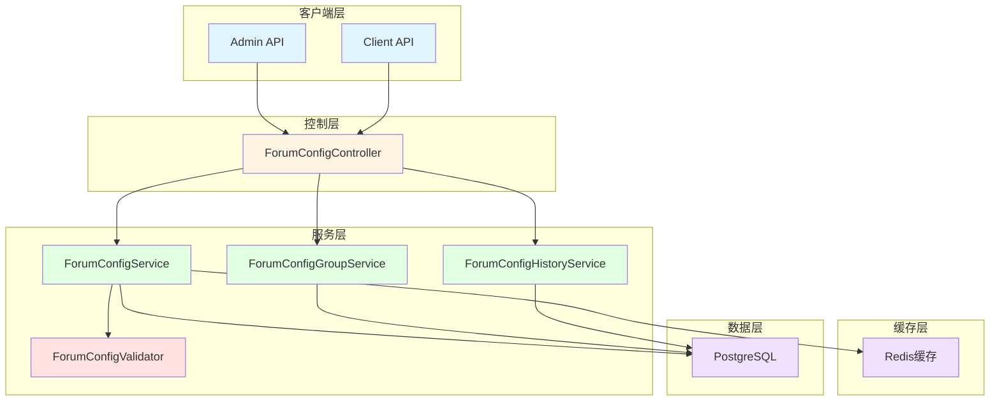
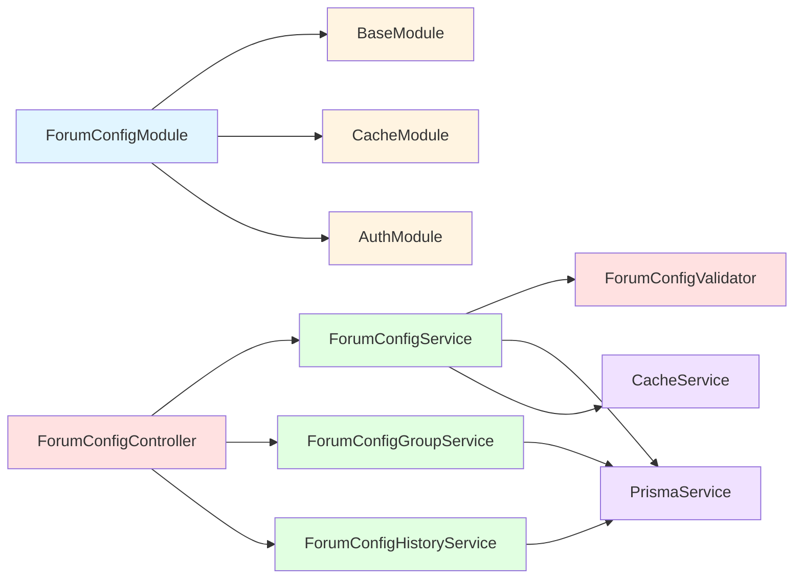
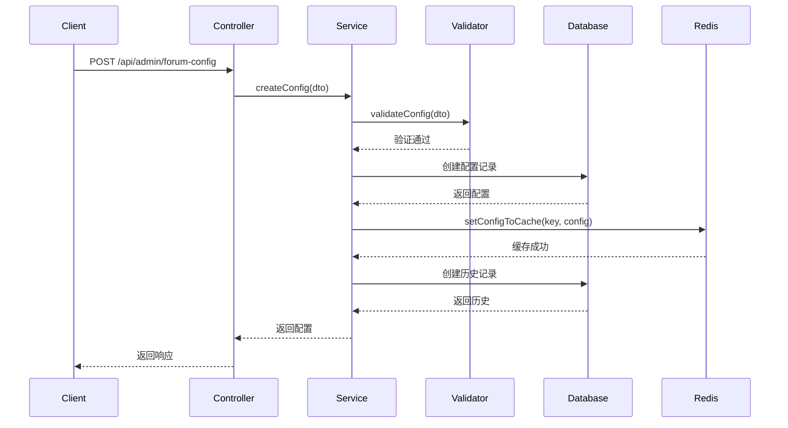
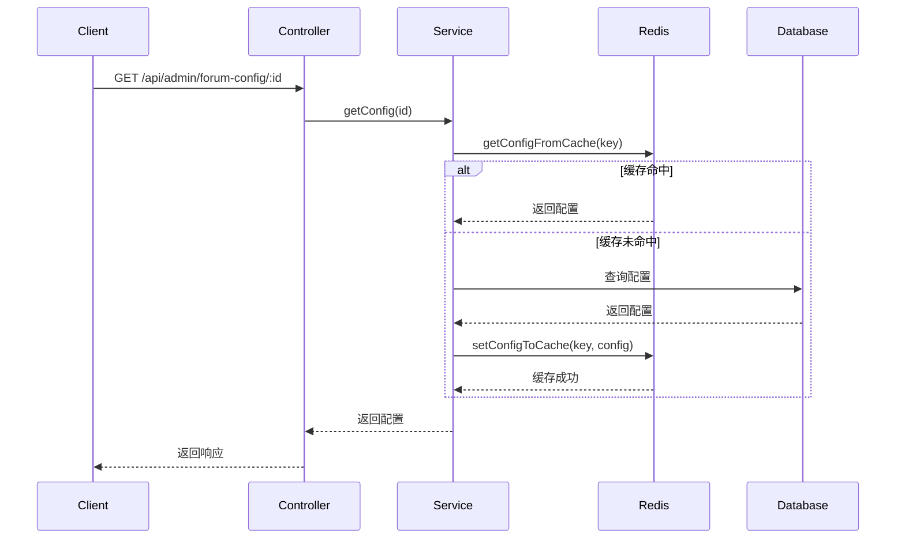
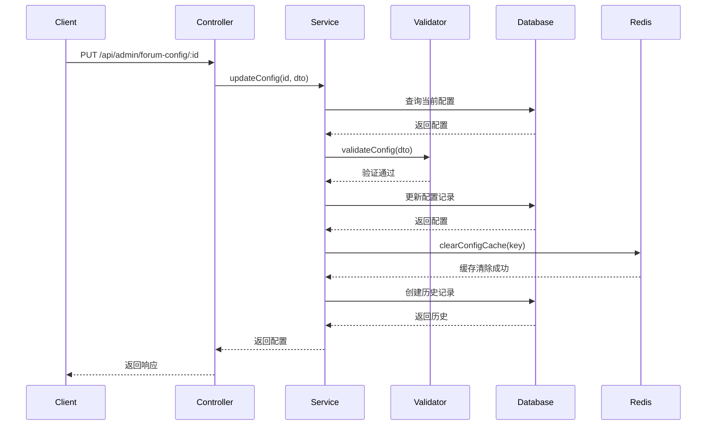
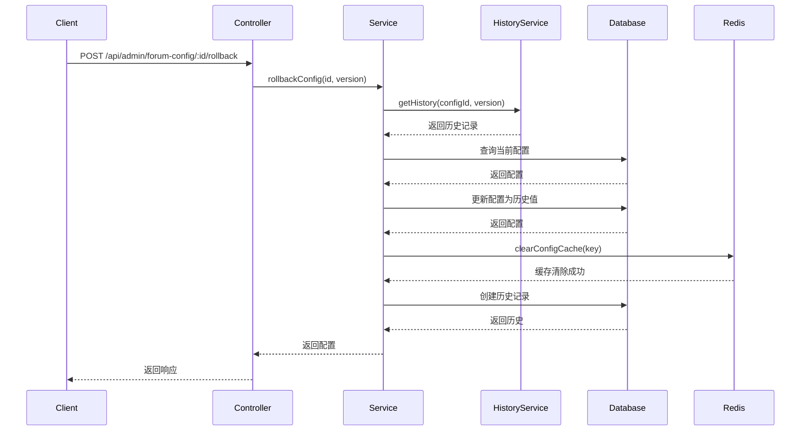
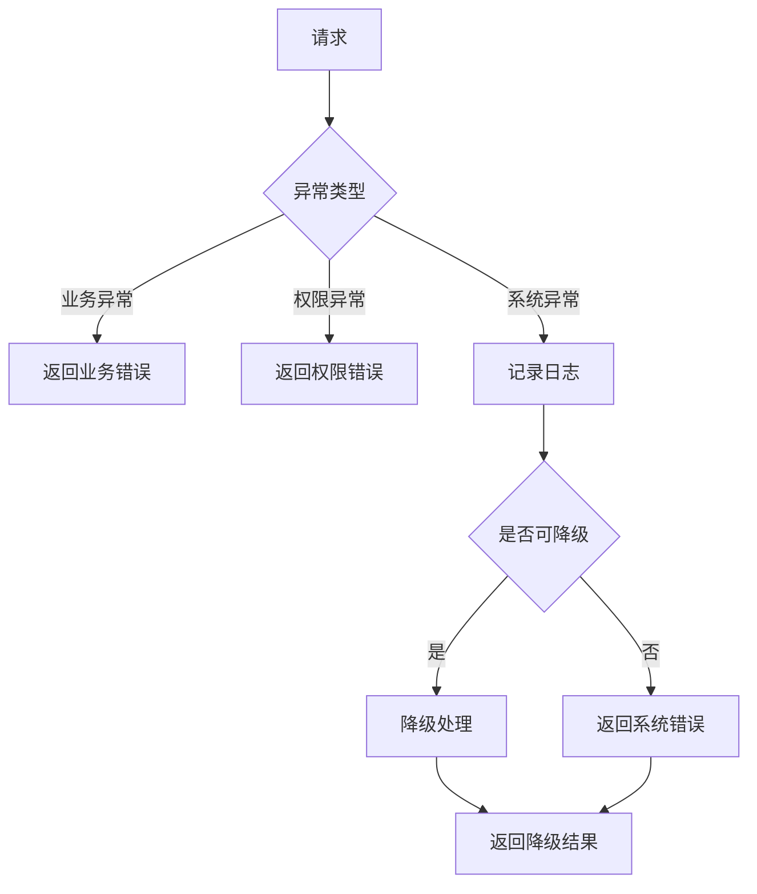

# Forum模块系统配置功能 - 设计文档

## 1. 整体架构设计

### 1.1 架构概览



### 1.2 分层设计

#### 1.2.1 控制层 (Controller Layer)

**职责**
- 接收HTTP请求
- 请求参数验证
- 调用服务层处理业务逻辑
- 返回响应结果

**核心组件**
- `ForumConfigController` - 配置管理控制器

#### 1.2.2 服务层 (Service Layer)

**职责**
- 实现业务逻辑
- 配置管理
- 权限控制
- 调用数据层访问数据
- 缓存管理

**核心组件**
- `ForumConfigService` - 配置服务
- `ForumConfigGroupService` - 配置分组服务
- `ForumConfigHistoryService` - 配置历史服务
- `ForumConfigValidator` - 配置验证器

#### 1.2.3 数据层 (Data Layer)

**职责**
- 数据访问
- 缓存管理
- 事务处理

**核心组件**
- `PrismaService` - 数据库服务
- `CacheService` - 缓存服务

### 1.3 核心组件设计

#### 1.3.1 ForumConfigService

**职责**
- 配置CRUD操作
- 配置缓存管理
- 配置验证
- 配置导入导出
- 配置回滚

**核心方法**
```typescript
class ForumConfigService extends BaseService {
  // 配置CRUD
  async createConfig(dto: CreateConfigDto): Promise<ForumConfig>
  async updateConfig(id: number, dto: UpdateConfigDto): Promise<ForumConfig>
  async deleteConfig(id: number): Promise<void>
  async getConfig(key: string, scope?: ConfigScope, scopeId?: number): Promise<ForumConfig>
  async getConfigList(dto: QueryConfigDto): Promise<PaginatedResult<ForumConfig>>

  // 配置缓存
  async getConfigFromCache(key: string): Promise<ForumConfig | null>
  async setConfigToCache(key: string, config: ForumConfig): Promise<void>
  async clearConfigCache(key: string): Promise<void>
  async preloadConfigs(): Promise<void>

  // 配置验证
  async validateConfig(dto: CreateConfigDto | UpdateConfigDto): Promise<void>

  // 配置导入导出
  async exportConfigs(group?: string): Promise<Buffer>
  async importConfigs(data: Buffer): Promise<void>

  // 配置回滚
  async rollbackConfig(configId: number, version: number): Promise<ForumConfig>
}
```

#### 1.3.2 ForumConfigGroupService

**职责**
- 配置分组CRUD操作
- 配置分组管理

**核心方法**
```typescript
class ForumConfigGroupService extends BaseService {
  async createGroup(dto: CreateConfigGroupDto): Promise<ForumConfigGroup>
  async updateGroup(id: number, dto: UpdateConfigGroupDto): Promise<ForumConfigGroup>
  async deleteGroup(id: number): Promise<void>
  async getGroup(key: string): Promise<ForumConfigGroup>
  async getGroupList(dto: QueryConfigGroupDto): Promise<PaginatedResult<ForumConfigGroup>>
}
```

#### 1.3.3 ForumConfigHistoryService

**职责**
- 配置历史记录
- 配置版本管理
- 配置回滚

**核心方法**
```typescript
class ForumConfigHistoryService extends BaseService {
  async createHistory(history: CreateConfigHistoryDto): Promise<ForumConfigHistory>
  async getHistoryList(configId: number): Promise<ForumConfigHistory[]>
  async getHistory(id: number): Promise<ForumConfigHistory>
  async rollbackToVersion(configId: number, version: number): Promise<void>
  async cleanupOldHistory(): Promise<void>
}
```

#### 1.3.4 ForumConfigValidator

**职责**
- 配置值验证
- 配置类型验证
- 配置范围验证
- 配置格式验证
- 配置依赖验证

**核心方法**
```typescript
class ForumConfigValidator {
  static validate(dataType: ConfigDataType, value: any): boolean
  static validateRange(key: string, value: any): boolean
  static validateFormat(key: string, value: any): boolean
  static validateDependency(key: string, value: any): boolean
}
```

## 2. 模块依赖关系

### 2.1 模块依赖图



### 2.2 模块定义

```typescript
@Module({
  imports: [
    BaseModule,
    CacheModule,
    AuthModule,
  ],
  controllers: [
    ForumConfigController,
  ],
  providers: [
    ForumConfigService,
    ForumConfigGroupService,
    ForumConfigHistoryService,
    ForumConfigValidator,
  ],
  exports: [
    ForumConfigService,
    ForumConfigGroupService,
    ForumConfigHistoryService,
  ],
})
export class ForumConfigModule {}
```

## 3. 接口契约定义

### 3.1 配置管理接口

#### 3.1.1 创建配置

**请求**
```http
POST /api/admin/forum-config
Content-Type: application/json
Authorization: Bearer {token}

{
  "key": "forum.name",
  "value": "我的论坛",
  "dataType": 1,
  "group": "basic",
  "scope": 0,
  "scopeId": null,
  "isEnabled": true,
  "description": "论坛名称",
  "remark": "系统配置"
}
```

**响应**
```json
{
  "code": 200,
  "message": "创建成功",
  "data": {
    "id": 1,
    "key": "forum.name",
    "value": "我的论坛",
    "dataType": 1,
    "group": "basic",
    "scope": 0,
    "scopeId": null,
    "isEnabled": true,
    "description": "论坛名称",
    "remark": "系统配置",
    "version": 1,
    "createdAt": "2026-01-10T10:00:00Z",
    "updatedAt": "2026-01-10T10:00:00Z",
    "createdBy": 1,
    "updatedBy": 1
  }
}
```

#### 3.1.2 更新配置

**请求**
```http
PUT /api/admin/forum-config/:id
Content-Type: application/json
Authorization: Bearer {token}

{
  "value": "新论坛名称",
  "isEnabled": false,
  "remark": "更新配置"
}
```

**响应**
```json
{
  "code": 200,
  "message": "更新成功",
  "data": {
    "id": 1,
    "key": "forum.name",
    "value": "新论坛名称",
    "dataType": 1,
    "group": "basic",
    "scope": 0,
    "scopeId": null,
    "isEnabled": false,
    "description": "论坛名称",
    "remark": "更新配置",
    "version": 2,
    "createdAt": "2026-01-10T10:00:00Z",
    "updatedAt": "2026-01-10T10:05:00Z",
    "createdBy": 1,
    "updatedBy": 1
  }
}
```

#### 3.1.3 删除配置

**请求**
```http
DELETE /api/admin/forum-config/:id
Authorization: Bearer {token}
```

**响应**
```json
{
  "code": 200,
  "message": "删除成功"
}
```

#### 3.1.4 查询配置

**请求**
```http
GET /api/admin/forum-config/:id
Authorization: Bearer {token}
```

**响应**
```json
{
  "code": 200,
  "message": "查询成功",
  "data": {
    "id": 1,
    "key": "forum.name",
    "value": "我的论坛",
    "dataType": 1,
    "group": "basic",
    "scope": 0,
    "scopeId": null,
    "isEnabled": true,
    "description": "论坛名称",
    "remark": "系统配置",
    "version": 1,
    "createdAt": "2026-01-10T10:00:00Z",
    "updatedAt": "2026-01-10T10:00:00Z",
    "createdBy": 1,
    "updatedBy": 1
  }
}
```

#### 3.1.5 查询配置列表

**请求**
```http
GET /api/admin/forum-config?page=1&pageSize=20&group=basic&isEnabled=true
Authorization: Bearer {token}
```

**响应**
```json
{
  "code": 200,
  "message": "查询成功",
  "data": {
    "items": [
      {
        "id": 1,
        "key": "forum.name",
        "value": "我的论坛",
        "dataType": 1,
        "group": "basic",
        "scope": 0,
        "scopeId": null,
        "isEnabled": true,
        "description": "论坛名称",
        "remark": "系统配置",
        "version": 1,
        "createdAt": "2026-01-10T10:00:00Z",
        "updatedAt": "2026-01-10T10:00:00Z",
        "createdBy": 1,
        "updatedBy": 1
      }
    ],
    "total": 1,
    "page": 1,
    "pageSize": 20
  }
}
```

#### 3.1.6 导出配置

**请求**
```http
GET /api/admin/forum-config/export?group=basic
Authorization: Bearer {token}
```

**响应**
```json
{
  "code": 200,
  "message": "导出成功",
  "data": {
    "version": "1.0.0",
    "exportedAt": "2026-01-10T10:00:00Z",
    "exportedBy": 1,
    "configs": [
      {
        "key": "forum.name",
        "value": "我的论坛",
        "dataType": 1,
        "group": "basic",
        "scope": 0,
        "scopeId": null,
        "isEnabled": true,
        "description": "论坛名称",
        "remark": "系统配置"
      }
    ]
  }
}
```

#### 3.1.7 导入配置

**请求**
```http
POST /api/admin/forum-config/import
Content-Type: application/json
Authorization: Bearer {token}

{
  "version": "1.0.0",
  "exportedAt": "2026-01-10T10:00:00Z",
  "exportedBy": 1,
  "configs": [
    {
      "key": "forum.name",
      "value": "我的论坛",
      "dataType": 1,
      "group": "basic",
      "scope": 0,
      "scopeId": null,
      "isEnabled": true,
      "description": "论坛名称",
      "remark": "系统配置"
    }
  ]
}
```

**响应**
```json
{
  "code": 200,
  "message": "导入成功",
  "data": {
    "successCount": 1,
    "failedCount": 0,
    "errors": []
  }
}
```

#### 3.1.8 回滚配置

**请求**
```http
POST /api/admin/forum-config/:id/rollback
Content-Type: application/json
Authorization: Bearer {token}

{
  "version": 1
}
```

**响应**
```json
{
  "code": 200,
  "message": "回滚成功",
  "data": {
    "id": 1,
    "key": "forum.name",
    "value": "我的论坛",
    "dataType": 1,
    "group": "basic",
    "scope": 0,
    "scopeId": null,
    "isEnabled": true,
    "description": "论坛名称",
    "remark": "系统配置",
    "version": 3,
    "createdAt": "2026-01-10T10:00:00Z",
    "updatedAt": "2026-01-10T10:10:00Z",
    "createdBy": 1,
    "updatedBy": 1
  }
}
```

### 3.2 配置分组接口

#### 3.2.1 创建配置分组

**请求**
```http
POST /api/admin/forum-config-group
Content-Type: application/json
Authorization: Bearer {token}

{
  "key": "basic",
  "name": "基础设置",
  "description": "论坛基础设置",
  "sortOrder": 1,
  "isEnabled": true
}
```

**响应**
```json
{
  "code": 200,
  "message": "创建成功",
  "data": {
    "id": 1,
    "key": "basic",
    "name": "基础设置",
    "description": "论坛基础设置",
    "sortOrder": 1,
    "isEnabled": true,
    "createdAt": "2026-01-10T10:00:00Z",
    "updatedAt": "2026-01-10T10:00:00Z"
  }
}
```

#### 3.2.2 查询配置分组列表

**请求**
```http
GET /api/admin/forum-config-group?page=1&pageSize=20
Authorization: Bearer {token}
```

**响应**
```json
{
  "code": 200,
  "message": "查询成功",
  "data": {
    "items": [
      {
        "id": 1,
        "key": "basic",
        "name": "基础设置",
        "description": "论坛基础设置",
        "sortOrder": 1,
        "isEnabled": true,
        "createdAt": "2026-01-10T10:00:00Z",
        "updatedAt": "2026-01-10T10:00:00Z"
      }
    ],
    "total": 1,
    "page": 1,
    "pageSize": 20
  }
}
```

### 3.3 配置历史接口

#### 3.3.1 查询配置历史

**请求**
```http
GET /api/admin/forum-config/:id/history?page=1&pageSize=20
Authorization: Bearer {token}
```

**响应**
```json
{
  "code": 200,
  "message": "查询成功",
  "data": {
    "items": [
      {
        "id": 1,
        "configId": 1,
        "key": "forum.name",
        "oldValue": "旧论坛名称",
        "newValue": "新论坛名称",
        "version": 2,
        "operation": 2,
        "remark": "更新配置",
        "createdAt": "2026-01-10T10:05:00Z",
        "createdBy": 1
      }
    ],
    "total": 1,
    "page": 1,
    "pageSize": 20
  }
}
```

### 3.4 客户端接口

#### 3.4.1 查询配置(客户端)

**请求**
```http
GET /api/client/forum-config?key=forum.name
```

**响应**
```json
{
  "code": 200,
  "message": "查询成功",
  "data": {
    "key": "forum.name",
    "value": "我的论坛",
    "dataType": 1
  }
}
```

#### 3.4.2 批量查询配置(客户端)

**请求**
```http
GET /api/client/forum-config/batch?keys=forum.name,forum.description
```

**响应**
```json
{
  "code": 200,
  "message": "查询成功",
  "data": [
    {
      "key": "forum.name",
      "value": "我的论坛",
      "dataType": 1
    },
    {
      "key": "forum.description",
      "value": "论坛描述",
      "dataType": 1
    }
  ]
}
```

## 4. 数据流向图

### 4.1 配置创建流程



### 4.2 配置查询流程



### 4.3 配置更新流程



### 4.4 配置回滚流程



## 5. 异常处理策略

### 5.1 异常分类

#### 5.1.1 业务异常

**配置已存在**
- 异常码: `CONFIG_EXISTS`
- HTTP状态码: 400
- 处理方式: 返回友好错误提示

**配置不存在**
- 异常码: `CONFIG_NOT_FOUND`
- HTTP状态码: 404
- 处理方式: 返回友好错误提示

**配置值无效**
- 异常码: `CONFIG_VALUE_INVALID`
- HTTP状态码: 400
- 处理方式: 返回验证错误详情

**配置分组不存在**
- 异常码: `CONFIG_GROUP_NOT_FOUND`
- HTTP状态码: 404
- 处理方式: 返回友好错误提示

**配置版本不存在**
- 异常码: `CONFIG_VERSION_NOT_FOUND`
- HTTP状态码: 404
- 处理方式: 返回友好错误提示

#### 5.1.2 权限异常

**无配置查看权限**
- 异常码: `NO_CONFIG_VIEW_PERMISSION`
- HTTP状态码: 403
- 处理方式: 返回权限不足提示

**无配置编辑权限**
- 异常码: `NO_CONFIG_EDIT_PERMISSION`
- HTTP状态码: 403
- 处理方式: 返回权限不足提示

**无配置删除权限**
- 异常码: `NO_CONFIG_DELETE_PERMISSION`
- HTTP状态码: 403
- 处理方式: 返回权限不足提示

**无配置导入导出权限**
- 异常码: `NO_CONFIG_IMPORT_EXPORT_PERMISSION`
- HTTP状态码: 403
- 处理方式: 返回权限不足提示

**无配置回滚权限**
- 异常码: `NO_CONFIG_ROLLBACK_PERMISSION`
- HTTP状态码: 403
- 处理方式: 返回权限不足提示

#### 5.1.3 系统异常

**数据库异常**
- 异常码: `DATABASE_ERROR`
- HTTP状态码: 500
- 处理方式: 记录日志,返回系统错误提示

**缓存异常**
- 异常码: `CACHE_ERROR`
- HTTP状态码: 500
- 处理方式: 降级到数据库,记录日志

**导入导出异常**
- 异常码: `IMPORT_EXPORT_ERROR`
- HTTP状态码: 500
- 处理方式: 记录日志,返回系统错误提示

### 5.2 异常处理流程



### 5.3 异常处理实现

```typescript
@Controller('forum-config')
export class ForumConfigController {
  @Post()
  @RequirePermission(ConfigPermission.EDIT)
  async createConfig(@Body() dto: CreateConfigDto) {
    try {
      return await this.configService.createConfig(dto)
    } catch (error) {
      if (error.code === 'P2002') {
        throw new BadRequestException('配置已存在')
      }
      throw error
    }
  }

  @Get(':id')
  @RequirePermission(ConfigPermission.VIEW)
  async getConfig(@Param('id') id: number) {
    try {
      return await this.configService.getConfig(id)
    } catch (error) {
      if (error.code === 'P2025') {
        throw new NotFoundException('配置不存在')
      }
      throw error
    }
  }
}
```

## 6. 设计原则

### 6.1 设计原则

1. **单一职责原则**
   - 每个服务只负责一个功能模块
   - 每个方法只做一件事

2. **开闭原则**
   - 对扩展开放,对修改关闭
   - 通过继承和组合实现功能扩展

3. **里氏替换原则**
   - 子类可以替换父类
   - 保持接口一致性

4. **接口隔离原则**
   - 接口应该小而专一
   - 不强迫依赖不需要的方法

5. **依赖倒置原则**
   - 依赖抽象而非具体实现
   - 使用依赖注入

### 6.2 代码规范

1. **命名规范**
   - 类名使用PascalCase
   - 方法名使用camelCase
   - 常量使用UPPER_SNAKE_CASE

2. **注释规范**
   - 公共方法必须添加注释
   - 复杂逻辑必须添加注释
   - 使用JSDoc格式

3. **错误处理规范**
   - 使用异常而非错误码
   - 异常信息清晰明确
   - 记录完整的错误日志

4. **日志规范**
   - 关键操作必须记录日志
   - 日志级别合理
   - 日志信息完整

### 6.3 性能优化原则

1. **缓存优先**
   - 优先从缓存读取
   - 合理设置缓存TTL
   - 及时清除过期缓存

2. **批量操作**
   - 支持批量查询
   - 支持批量更新
   - 减少数据库访问

3. **索引优化**
   - 合理创建索引
   - 避免全表扫描
   - 定期优化索引

4. **连接池优化**
   - 合理设置连接池大小
   - 及时释放连接
   - 避免连接泄漏

## 7. 安全设计

### 7.1 数据安全

**敏感配置加密**
- 使用AES加密存储敏感配置
- 加密密钥存储在环境变量中
- 解密只在内存中进行

**配置备份**
- 定期备份配置数据
- 备份数据加密存储
- 支持快速恢复

### 7.2 访问安全

**权限控制**
- 基于角色的访问控制(RBAC)
- 接口级别权限验证
- 操作级别权限验证

**审计日志**
- 记录所有配置变更
- 记录操作人、操作时间、操作内容
- 日志不可篡改

### 7.3 接口安全

**请求验证**
- 参数合法性验证
- 请求频率限制
- 防止SQL注入

**响应安全**
- 敏感信息脱敏
- 统一错误处理
- 防止XSS攻击

---

**文档版本**: v1.0
**创建时间**: 2026-01-10
**最后更新**: 2026-01-10
**更新内容**: 初始版本
