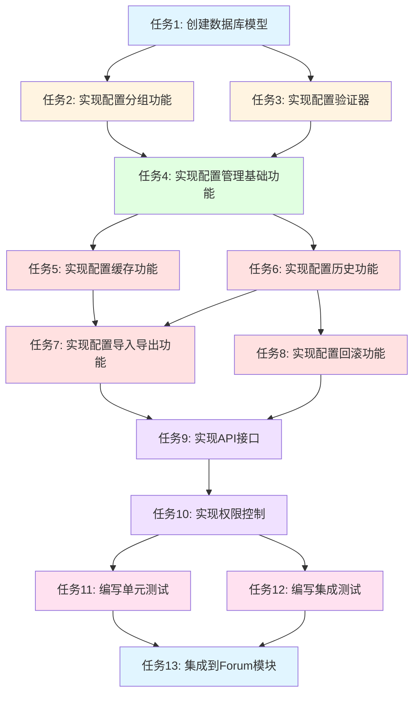

# Forum模块系统配置功能 - 任务拆分文档

## 1. 任务依赖图

## 2. 任务拆分

### 任务1: 创建数据库模型

**任务描述**
创建ForumConfig、ForumConfigHistory、ForumConfigGroup三个数据模型的Prisma schema定义和TypeScript类型定义。

**输入契约**
- 前置依赖: 无
- 输入数据: DESIGN文档中的数据库设计
- 环境依赖: Prisma ORM已配置

**输出契约**
- 输出数据:
  - `libs/base/src/database/prisma-client/models/ForumConfig.ts`
  - `libs/base/src/database/prisma-client/models/ForumConfigHistory.ts`
  - `libs/base/src/database/prisma-client/models/ForumConfigGroup.ts`
- 交付物: 三个数据模型的TypeScript类型定义文件
- 验收标准:
  - 所有字段定义正确
  - 索引定义正确
  - 类型定义完整
  - 符合Prisma规范

**实现约束**
- 技术栈: Prisma ORM
- 接口规范: 遵循现有Prisma模型定义规范
- 质量要求:
  - 字段命名使用snake_case
  - 必须包含所有索引
  - 必须包含所有关系定义

**依赖关系**
- 后置任务: 任务2、任务3
- 并行任务: 无

---

### 任务2: 实现配置分组功能

**任务描述**
实现配置分组的CRUD功能,包括创建、更新、删除、查询配置分组。

**输入契约**
- 前置依赖: 任务1完成
- 输入数据: DESIGN文档中的配置分组接口定义
- 环境依赖: ForumConfigGroup数据模型已创建

**输出契约**
- 输出数据:
  - `libs/forum/src/config/dto/forum-config-group.dto.ts`
  - `libs/forum/src/config/forum-config-group.service.ts`
  - `libs/forum/src/config/forum-config-group.module.ts`
- 交付物: 配置分组服务的完整实现
- 验收标准:
  - 支持创建配置分组
  - 支持更新配置分组
  - 支持删除配置分组
  - 支持查询配置分组
  - 支持分页查询
  - 所有接口正常工作

**实现约束**
- 技术栈: NestJS、TypeScript、Prisma
- 接口规范: 遵循RESTful API设计规范
- 质量要求:
  - 继承BaseService
  - 使用DTO验证
  - 使用Prisma扩展方法
  - 代码风格与现有代码一致

**依赖关系**
- 后置任务: 任务4
- 并行任务: 任务3

---

### 任务3: 实现配置验证器

**任务描述**
实现配置验证器,支持数据类型验证、值范围验证、格式验证、依赖验证。

**输入契约**
- 前置依赖: 任务1完成
- 输入数据: DESIGN文档中的配置验证设计
- 环境依赖: ForumConfig数据模型已创建

**输出契约**
- 输出数据:
  - `libs/forum/src/config/forum-config.validator.ts`
  - `libs/forum/src/config/forum-config.constant.ts`
- 交付物: 配置验证器的完整实现
- 验收标准:
  - 支持字符串类型验证
  - 支持数字类型验证
  - 支持布尔值类型验证
  - 支持JSON类型验证
  - 支持枚举类型验证
  - 支持数组类型验证
  - 支持值范围验证
  - 支持格式验证
  - 支持依赖验证
  - 验证错误信息友好

**实现约束**
- 技术栈: TypeScript、class-validator
- 接口规范: 遵循class-validator规范
- 质量要求:
  - 验证逻辑清晰
  - 错误信息友好
  - 支持自定义验证规则
  - 代码可测试

**依赖关系**
- 后置任务: 任务4
- 并行任务: 任务2

---

### 任务4: 实现配置管理基础功能

**任务描述**
实现配置管理的CRUD功能,包括创建、更新、删除、查询配置。

**输入契约**
- 前置依赖: 任务2、任务3完成
- 输入数据: DESIGN文档中的配置管理接口定义
- 环境依赖: ForumConfig数据模型已创建,配置验证器已实现

**输出契约**
- 输出数据:
  - `libs/forum/src/config/dto/forum-config.dto.ts`
  - `libs/forum/src/config/forum-config.service.ts`
  - `libs/forum/src/config/forum-config.module.ts`
- 交付物: 配置管理服务的完整实现
- 验收标准:
  - 支持创建配置
  - 支持更新配置
  - 支持删除配置
  - 支持查询配置
  - 支持分页查询
  - 支持按分组查询
  - 支持按作用域查询
  - 所有接口正常工作

**实现约束**
- 技术栈: NestJS、TypeScript、Prisma
- 接口规范: 遵循RESTful API设计规范
- 质量要求:
  - 继承BaseService
  - 使用DTO验证
  - 使用Prisma扩展方法
  - 调用配置验证器
  - 代码风格与现有代码一致

**依赖关系**
- 后置任务: 任务5、任务6
- 并行任务: 无

---

### 任务5: 实现配置缓存功能

**任务描述**
实现配置缓存功能,支持配置缓存读取、缓存写入、缓存清除、缓存预热。

**输入契约**
- 前置依赖: 任务4完成
- 输入数据: DESIGN文档中的缓存设计
- 环境依赖: ForumConfigService已实现,Redis已配置

**输出契约**
- 输出数据:
  - 更新 `libs/forum/src/config/forum-config.service.ts`
- 交付物: 配置缓存功能的完整实现
- 验收标准:
  - 支持从缓存读取配置
  - 支持将配置写入缓存
  - 支持清除配置缓存
  - 支持配置缓存预热
  - 缓存TTL设置为1小时
  - 配置更新时自动清除缓存
  - 缓存故障时降级到数据库

**实现约束**
- 技术栈: NestJS、Redis、@nestjs/cache-manager
- 接口规范: 遵循现有缓存管理规范
- 质量要求:
  - 缓存键格式统一
  - 缓存TTL合理
  - 缓存降级逻辑完善
  - 异常处理完善
  - 日志记录完整

**依赖关系**
- 后置任务: 任务7
- 并行任务: 任务6

---

### 任务6: 实现配置历史功能

**任务描述**
实现配置历史功能,支持配置变更历史记录、配置版本管理、配置历史查询。

**输入契约**
- 前置依赖: 任务4完成
- 输入数据: DESIGN文档中的配置历史设计
- 环境依赖: ForumConfigHistory数据模型已创建,ForumConfigService已实现

**输出契约**
- 输出数据:
  - `libs/forum/src/config/dto/forum-config-history.dto.ts`
  - `libs/forum/src/config/forum-config-history.service.ts`
  - 更新 `libs/forum/src/config/forum-config.service.ts`
- 交付物: 配置历史功能的完整实现
- 验收标准:
  - 支持记录配置变更历史
  - 支持查询配置历史列表
  - 支持查询配置历史详情
  - 支持配置版本管理
  - 历史数据保留90天
  - 支持清理过期历史数据

**实现约束**
- 技术栈: NestJS、TypeScript、Prisma
- 接口规范: 遵循RESTful API设计规范
- 质量要求:
  - 继承BaseService
  - 使用DTO验证
  - 使用Prisma扩展方法
  - 历史记录完整
  - 版本管理正确

**依赖关系**
- 后置任务: 任务7、任务8
- 并行任务: 任务5

---

### 任务7: 实现配置导入导出功能

**任务描述**
实现配置导入导出功能,支持配置导出为JSON格式、配置从JSON格式导入。

**输入契约**
- 前置依赖: 任务5、任务6完成
- 输入数据: DESIGN文档中的配置导入导出设计
- 环境依赖: ForumConfigService已实现,配置缓存已实现

**输出契约**
- 输出数据:
  - 更新 `libs/forum/src/config/forum-config.service.ts`
- 交付物: 配置导入导出功能的完整实现
- 验收标准:
  - 支持导出配置为JSON格式
  - 支持导出指定分组的配置
  - 支持从JSON格式导入配置
  - 导入时进行配置验证
  - 导出时包含配置元数据
  - 支持批量导入导出

**实现约束**
- 技术栈: NestJS、TypeScript
- 接口规范: 遵循RESTful API设计规范
- 质量要求:
  - JSON格式规范
  - 导入验证严格
  - 错误处理完善
  - 支持事务处理
  - 日志记录完整

**依赖关系**
- 后置任务: 任务9
- 并行任务: 任务8

---

### 任务8: 实现配置回滚功能

**任务描述**
实现配置回滚功能,支持配置回滚到指定版本。

**输入契约**
- 前置依赖: 任务6完成
- 输入数据: DESIGN文档中的配置回滚设计
- 环境依赖: ForumConfigHistoryService已实现,ForumConfigService已实现

**输出契约**
- 输出数据:
  - 更新 `libs/forum/src/config/forum-config.service.ts`
  - 更新 `libs/forum/src/config/forum-config-history.service.ts`
- 交付物: 配置回滚功能的完整实现
- 验收标准:
  - 支持回滚到上一个版本
  - 支持回滚到指定版本
  - 回滚时清除缓存
  - 回滚时记录历史
  - 回滚操作可审计

**实现约束**
- 技术栈: NestJS、TypeScript、Prisma
- 接口规范: 遵循RESTful API设计规范
- 质量要求:
  - 使用事务处理
  - 版本控制正确
  - 缓存清除及时
  - 历史记录完整
  - 异常处理完善

**依赖关系**
- 后置任务: 任务9
- 并行任务: 任务7

---

### 任务9: 实现API接口

**任务描述**
实现配置管理的所有API接口,包括管理端接口和客户端接口。

**输入契约**
- 前置依赖: 任务7、任务8完成
- 输入数据: DESIGN文档中的接口契约定义
- 环境依赖: 所有服务已实现

**输出契约**
- 输出数据:
  - `libs/forum/src/config/forum-config.controller.ts`
  - `libs/forum/src/config/forum-config-group.controller.ts`
  - `libs/forum/src/config/forum-config-history.controller.ts`
- 交付物: 所有API接口的完整实现
- 验收标准:
  - 管理端接口完整
  - 客户端接口完整
  - 接口参数验证正确
  - 接口响应格式统一
  - 接口异常处理完善
  - 所有接口正常工作

**实现约束**
- 技术栈: NestJS、TypeScript
- 接口规范: 遵循RESTful API设计规范
- 质量要求:
  - 接口命名规范
  - 参数验证严格
  - 响应格式统一
  - 异常处理完善
  - 代码风格一致

**依赖关系**
- 后置任务: 任务10
- 并行任务: 无

---

### 任务10: 实现权限控制

**任务描述**
实现配置管理的权限控制,包括配置查看、编辑、删除、导入导出、回滚权限。

**输入契约**
- 前置依赖: 任务9完成
- 输入数据: DESIGN文档中的权限控制设计
- 环境依赖: 所有API接口已实现

**输出契约**
- 输出数据:
  - 更新 `libs/forum/src/config/forum-config.controller.ts`
  - 更新 `libs/forum/src/config/forum-config-group.controller.ts`
  - 更新 `libs/forum/src/config/forum-config-history.controller.ts`
  - `libs/forum/src/config/forum-config.constant.ts`
- 交付物: 权限控制的完整实现
- 验收标准:
  - 配置查看权限控制正确
  - 配置编辑权限控制正确
  - 配置删除权限控制正确
  - 配置导入导出权限控制正确
  - 配置回滚权限控制正确
  - 无权限操作被拒绝
  - 权限操作被记录

**实现约束**
- 技术栈: NestJS、TypeScript
- 接口规范: 遵循现有权限控制规范
- 质量要求:
  - 使用装饰器验证权限
  - 权限定义清晰
  - 权限验证严格
  - 操作日志完整
  - 代码风格一致

**依赖关系**
- 后置任务: 任务11、任务12
- 并行任务: 无

---

### 任务11: 编写单元测试

**任务描述**
为配置管理的所有服务编写单元测试。

**输入契约**
- 前置依赖: 任务10完成
- 输入数据: 所有服务实现
- 环境依赖: Jest测试框架已配置

**输出契约**
- 输出数据:
  - `libs/forum/src/config/__tests__/forum-config.service.spec.ts`
  - `libs/forum/src/config/__tests__/forum-config-group.service.spec.ts`
  - `libs/forum/src/config/__tests__/forum-config-history.service.spec.ts`
  - `libs/forum/src/config/__tests__/forum-config.validator.spec.ts`
- 交付物: 所有服务的单元测试
- 验收标准:
  - 测试覆盖率 > 80%
  - 所有核心功能有测试
  - 所有边界条件有测试
  - 所有异常情况有测试
  - 所有测试通过

**实现约束**
- 技术栈: Jest、TypeScript
- 接口规范: 遵循Jest测试规范
- 质量要求:
  - 测试用例完整
  - 测试覆盖率达标
  - 测试可维护
  - Mock合理

**依赖关系**
- 后置任务: 任务13
- 并行任务: 任务12

---

### 任务12: 编写集成测试

**任务描述**
为配置管理的所有API接口编写集成测试。

**输入契约**
- 前置依赖: 任务10完成
- 输入数据: 所有API接口实现
- 环境依赖: Jest测试框架已配置

**输出契约**
- 输出数据:
  - `apps/admin-api/test/forum-config.e2e-spec.ts`
  - `apps/app-api/test/forum-config.e2e-spec.ts`
- 交付物: 所有API接口的集成测试
- 验收标准:
  - 所有API接口有测试
  - 所有正常流程有测试
  - 所有异常情况有测试
  - 所有权限控制有测试
  - 所有测试通过

**实现约束**
- 技术栈: Jest、TypeScript、Supertest
- 接口规范: 遵循Jest测试规范
- 质量要求:
  - 测试用例完整
  - 测试场景真实
  - 测试可维护
  - 数据清理完善

**依赖关系**
- 后置任务: 任务13
- 并行任务: 任务11

---

### 任务13: 集成到Forum模块

**任务描述**
将配置管理模块集成到Forum模块中,包括管理端和客户端。

**输入契约**
- 前置依赖: 任务11、任务12完成
- 输入数据: 所有功能实现和测试
- 环境依赖: Forum模块已存在

**输出契约**
- 输出数据:
  - 更新 `apps/admin-api/src/modules/forum-management/forum-management.module.ts`
  - 更新 `apps/app-api/src/modules/forum/forum.module.ts`
  - 更新 `libs/forum/src/index.ts`
- 交付物: 配置管理模块的完整集成
- 验收标准:
  - 管理端集成成功
  - 客户端集成成功
  - 模块导出正确
  - 所有接口可访问
  - 所有功能正常工作

**实现约束**
- 技术栈: NestJS、TypeScript
- 接口规范: 遵循现有模块集成规范
- 质量要求:
  - 模块导入正确
  - 依赖注入正确
  - 导出正确
  - 代码风格一致

**依赖关系**
- 后置任务: 无
- 并行任务: 无

---

## 3. 任务执行顺序

### 3.1 第一阶段: 基础设施建设
- 任务1: 创建数据库模型
- 任务2: 实现配置分组功能
- 任务3: 实现配置验证器

### 3.2 第二阶段: 核心功能实现
- 任务4: 实现配置管理基础功能
- 任务5: 实现配置缓存功能
- 任务6: 实现配置历史功能

### 3.3 第三阶段: 高级功能实现
- 任务7: 实现配置导入导出功能
- 任务8: 实现配置回滚功能

### 3.4 第四阶段: 接口和权限
- 任务9: 实现API接口
- 任务10: 实现权限控制

### 3.5 第五阶段: 测试和集成
- 任务11: 编写单元测试
- 任务12: 编写集成测试
- 任务13: 集成到Forum模块

## 4. 任务复杂度评估

| 任务ID | 任务名称 | 预估工时 | 复杂度 | 风险等级 |
|--------|---------|---------|--------|---------|
| 任务1 | 创建数据库模型 | 2小时 | 低 | 低 |
| 任务2 | 实现配置分组功能 | 4小时 | 中 | 低 |
| 任务3 | 实现配置验证器 | 6小时 | 中 | 中 |
| 任务4 | 实现配置管理基础功能 | 8小时 | 中 | 中 |
| 任务5 | 实现配置缓存功能 | 4小时 | 中 | 中 |
| 任务6 | 实现配置历史功能 | 6小时 | 中 | 中 |
| 任务7 | 实现配置导入导出功能 | 6小时 | 中 | 中 |
| 任务8 | 实现配置回滚功能 | 4小时 | 中 | 中 |
| 任务9 | 实现API接口 | 6小时 | 中 | 低 |
| 任务10 | 实现权限控制 | 4小时 | 低 | 低 |
| 任务11 | 编写单元测试 | 8小时 | 中 | 低 |
| 任务12 | 编写集成测试 | 6小时 | 中 | 低 |
| 任务13 | 集成到Forum模块 | 2小时 | 低 | 低 |
| **总计** | - | **66小时** | - | - |

## 5. 风险评估

### 5.1 高风险任务
- 无高风险任务

### 5.2 中风险任务
- 任务3: 实现配置验证器 - 验证逻辑复杂,需要考虑多种情况
- 任务4: 实现配置管理基础功能 - 核心功能,需要保证稳定性
- 任务5: 实现配置缓存功能 - 缓存一致性需要保证
- 任务6: 实现配置历史功能 - 历史数据量大,需要考虑性能
- 任务7: 实现配置导入导出功能 - 数据验证复杂,需要考虑异常情况
- 任务8: 实现配置回滚功能 - 事务处理复杂,需要保证数据一致性

### 5.3 低风险任务
- 任务1: 创建数据库模型 - 简单的模型定义
- 任务2: 实现配置分组功能 - 简单的CRUD功能
- 任务9: 实现API接口 - 简单的接口封装
- 任务10: 实现权限控制 - 简单的权限验证
- 任务11: 编写单元测试 - 标准的测试编写
- 任务12: 编写集成测试 - 标准的测试编写
- 任务13: 集成到Forum模块 - 简单的模块集成

## 6. 质量保证

### 6.1 代码质量
- 遵循现有代码规范
- 使用ESLint进行代码检查
- 使用Prettier进行代码格式化
- 代码审查通过

### 6.2 测试质量
- 单元测试覆盖率 > 80%
- 所有核心功能有测试
- 所有边界条件有测试
- 所有异常情况有测试

### 6.3 文档质量
- 所有公共方法有注释
- 复杂逻辑有注释
- API文档完整

### 6.4 性能质量
- 配置读取 < 100ms
- 配置写入 < 100ms
- 配置导入导出 < 5s
- 支持1000+ QPS

---

**文档版本**: v1.0
**创建时间**: 2026-01-10
**最后更新**: 2026-01-10
**更新内容**: 初始版本
