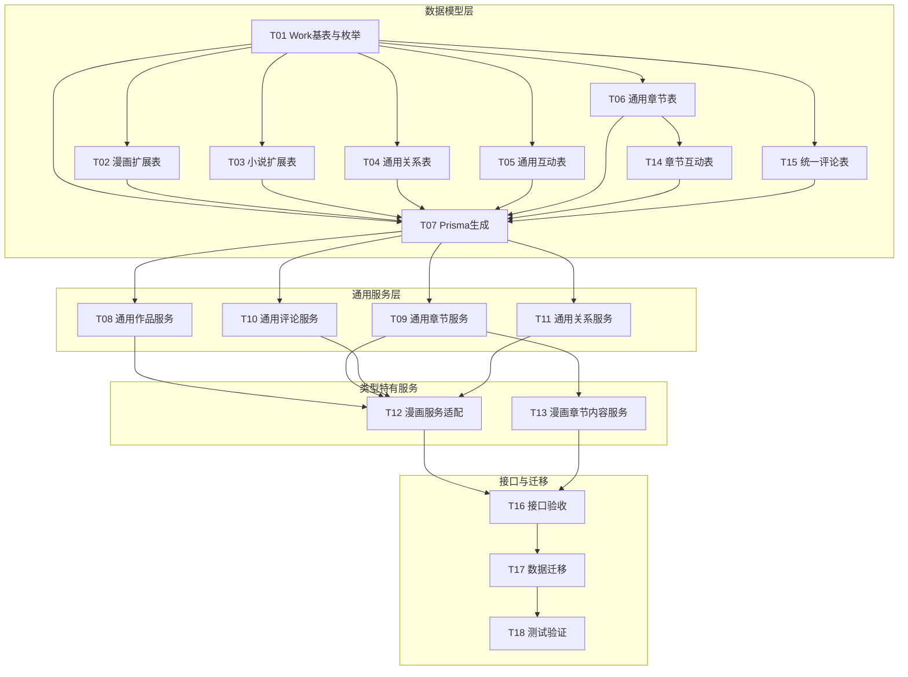

# 方案B原子化任务清单（服务层抽象 + 数据模型通用化）

## 目标
- 将漫画作品公共字段上移到 Work 基表
- 关系表与互动表通用化，为小说扩展打基础
- **服务层抽象**：抽取通用逻辑，避免重复代码
- 同步调整现有漫画服务与接口，保证功能不回归

## 说明
- 本方案仅支持漫画和小说两种作品类型，不包含插画
- 插画作为独立模块，后续如有需求可单独设计
- **核心改进**：服务层采用抽象模式，通用逻辑复用，类型特有逻辑独立

## 架构设计

### 服务层架构

```
libs/content/src/
├── work/                              # 通用作品服务层
│   ├── core/
│   │   ├── work.service.ts            # 通用作品 CRUD + 互动（点赞/收藏）
│   │   ├── work.module.ts
│   │   └── dto/
│   │       └── work.dto.ts            # 通用作品 DTO
│   ├── chapter/
│   │   ├── work-chapter.service.ts    # 通用章节 CRUD + 互动 + 权限验证
│   │   ├── work-chapter.module.ts
│   │   └── dto/
│   │       └── work-chapter.dto.ts    # 通用章节 DTO
│   ├── comment/
│   │   ├── work-comment.service.ts    # 通用评论服务（作品评论 + 章节评论）
│   │   ├── work-comment.module.ts
│   │   └── dto/
│   │       └── work-comment.dto.ts    # 通用评论 DTO
│   └── relation/
│       ├── work-relation.service.ts   # 通用关系管理（作者/分类/标签）
│       └── work-relation.module.ts
│
├── comic/                             # 漫画特有逻辑
│   ├── core/
│   │   ├── comic.service.ts           # 漫画特有逻辑（继承/组合通用服务）
│   │   └── comic.module.ts
│   └── chapter-content/
│       ├── chapter-content.service.ts # 漫画图片内容上传处理
│       └── chapter-content.module.ts
│
└── novel/                             # 小说特有逻辑（预留）
    ├── core/
    │   ├── novel.service.ts           # 小说特有逻辑
    │   └── novel.module.ts
    └── chapter-content/
        └── novel-content.service.ts   # 小说文本内容处理
```

### 数据模型架构

```
prisma/models/work/
├── work.prisma                        # Work 基表
├── work-comic.prisma                  # 漫画扩展表
├── work-novel.prisma                  # 小说扩展表
├── work-author-relation.prisma        # 作品-作者关系
├── work-category-relation.prisma      # 作品-分类关系
├── work-tag-relation.prisma           # 作品-标签关系
├── work-favorite.prisma               # 作品收藏
├── work-like.prisma                   # 作品点赞
├── work-chapter.prisma                # 通用章节表
├── work-chapter-like.prisma           # 章节点赞
├── work-chapter-purchase.prisma       # 章节购买
├── work-chapter-download.prisma       # 章节下载
├── work-comment.prisma                # 统一评论表
├── work-comment-report.prisma         # 评论举报
└── author/
    └── work-author.prisma             # 作者主表
```

## 任务依赖图



## 任务清单

### T01 新增 Work 基表与作品类型枚举
- 业务影响：所有作品（漫画/小说）共享公共字段与索引
- 新增文件
  - prisma/models/work/work.prisma
- 修改文件
  - libs/base/src/enum/base.enum.ts（新增作品类型枚举 WorkTypeEnum）
  - libs/base/src/enum/index.ts（导出枚举）
- 说明
  - Work 为各作品的唯一主表，扩展表通过 workId 一对一关联
  - Work 包含：name、alias、cover、description、language、region、ageRating、isPublished、publishAt、lastUpdated
  - Work 包含业务字段：serialStatus、publisher、originalSource、copyright、disclaimer
  - Work 包含统计字段：viewCount、favoriteCount、likeCount、rating、ratingCount、popularity
  - Work 包含标记字段：isRecommended、isHot、isNew、recommendWeight
  - Work.type 标识作品类型（COMIC/NOVEL），用于路由分发
- 验收要点
  - Prisma schema 能生成 Work 模型与枚举类型
  - Work.type 枚举在基础包对外可用且被正确导出

### T02 改造漫画主表为类型扩展表
- 业务影响：漫画业务仍用 WorkComic，但公共字段迁移到 Work
- 修改文件
  - prisma/models/work/comic/work-comic.prisma
- 变更要点
  - 新增 workId 外键关联 Work，建立一对一关系
  - 移除已上移到 Work 的公共字段
  - WorkComic 当前仅保留 workId 外键，为未来漫画特有字段预留
  - 将通用索引迁移到 Work
- 验收要点
  - WorkComic 与 Work 关联完整

### T03 新增小说扩展表（空壳）
- 业务影响：为后续扩展预留最小可用结构
- 新增文件
  - prisma/models/work/novel/work-novel.prisma
- 说明
  - 仅保留 workId 关联与时间戳字段
  - 不引入漫画字段，避免跨类型污染
- 验收要点
  - Prisma 模型可生成，结构最小可用

### T04 通用化作者/分类/标签关系表
- 业务影响：所有作品共享关联逻辑
- 新增文件
  - prisma/models/work/work-author-relation.prisma
  - prisma/models/work/work-category-relation.prisma
  - prisma/models/work/work-tag-relation.prisma
- 修改文件
  - prisma/models/work/author/work-author.prisma（关系字段改为通用关系）
  - prisma/models/work/work-category.prisma
  - prisma/models/work/work-tag.prisma
  - prisma/seed/modules/work/comic-author.ts
  - prisma/seed/modules/work/comic-category.ts
  - prisma/seed/modules/work/comic-tag.ts
  - prisma/seed/modules/work/index.ts
- 删除文件
  - prisma/models/work/comic/work-comic-author.prisma
  - prisma/models/work/comic/work-comic-category.prisma
  - prisma/models/work/comic/work-comic-tag.prisma
- 说明
  - 关系表统一使用 workId 作为主关联
  - 保留排序/角色字段
  - 统一索引与唯一约束
- 验收要点
  - 漫画作者/分类/标签可读写

### T05 通用化收藏/点赞关系表
- 业务影响：统一作品互动表
- 新增文件
  - prisma/models/work/work-favorite.prisma
  - prisma/models/work/work-like.prisma
- 修改文件
  - prisma/models/app/app-user.prisma（关联字段改为通用关系）
- 删除文件
  - prisma/models/work/comic/work-comic-favorite.prisma
  - prisma/models/work/comic/work-comic-like.prisma
- 说明
  - 统一使用 workId 与 appUserId 作为关系核心字段
  - 增加 workType 字段区分作品类型
  - 保留时间戳与唯一约束
- 验收要点
  - 漫画收藏/点赞可用且统计正确

### T06 通用章节表设计
- 业务影响：漫画和小说共享章节表
- 新增文件
  - prisma/models/work/work-chapter.prisma
- 修改文件
  - prisma/models/work/comic/work-comic-chapter.prisma（关联字段调整为 workId）
- 说明
  - 以 workId 作为主关联，增加 workType 字段
  - 章节主字段：title、subtitle、description、sortOrder、isPublished、publishAt
  - 权限字段：readRule、readPoints、downloadRule、downloadPoints、requiredReadLevelId、requiredDownloadLevelId
  - 统计字段：viewCount、likeCount、commentCount、purchaseCount
  - **漫画特有**：contents（JSON 格式存储图片 URL 数组）
  - **小说特有**：content（TEXT 文本内容，后续扩展）
- 验收要点
  - 章节可通过 workId 查询到所属作品

### T07 Prisma 生成与类型导出同步
- 业务影响：确保客户端类型完整可用
- 修改文件
  - prisma/prismaClient/client.ts（生成）
  - prisma/prismaClient/models.ts（生成）
  - prisma/prismaClient/browser.ts（生成）
  - prisma/prismaClient/internal/prismaNamespace.ts（生成）
  - prisma/prismaClient/internal/prismaNamespaceBrowser.ts（生成）
  - prisma/prismaClient/internal/class.ts（生成）
- 验收要点
  - 生成脚本完成且无类型缺失

### T08 通用作品服务（核心抽象）
- 业务影响：漫画/小说复用 90%+ 的作品逻辑
- 新增文件
  - libs/content/src/work/core/work.service.ts
  - libs/content/src/work/core/work.module.ts
  - libs/content/src/work/core/dto/work.dto.ts
  - libs/content/src/work/core/work.constant.ts
  - libs/content/src/work/core/index.ts
- 服务方法
  ```typescript
  class WorkService {
    // CRUD
    createWork(dto, workType)
    updateWork(dto, workType)
    getWorkDetail(id)
    getWorkPage(dto, workType)
    deleteWork(id)

    // 互动（通用）
    incrementViewCount(id, userId, workType)
    incrementLikeCount(id, userId, workType)
    incrementFavoriteCount(id, userId, workType)
    checkUserLiked(workId, userId)
    checkUserFavorited(workId, userId)
    getWorkUserStatus(ids, userId)
    getWorkPageWithUserStatus(dto, userId, workType)

    // 我的记录
    getMyFavoritePage(dto, userId, workType)
    getMyLikedPage(dto, userId, workType)
  }
  ```
- 说明
  - 服务层通过 workType 参数区分作品类型
  - 内部根据 workType 选择正确的扩展表关联
  - 成长事件 business 参数由 workType 映射
- 验收要点
  - 通用服务可被漫画服务正确调用

### T09 通用章节服务（核心抽象）
- 业务影响：漫画/小说复用 95%+ 的章节逻辑
- 新增文件
  - libs/content/src/work/chapter/work-chapter.service.ts
  - libs/content/src/work/chapter/work-chapter.module.ts
  - libs/content/src/work/chapter/dto/work-chapter.dto.ts
  - libs/content/src/work/chapter/work-chapter.constant.ts
  - libs/content/src/work/chapter/index.ts
- 服务方法
  ```typescript
  class WorkChapterService {
    // CRUD
    createChapter(dto, workType)
    updateChapter(dto, workType)
    getChapterDetail(id)
    getChapterPage(dto, workType)
    deleteChapter(id)
    swapChapterNumbers(dto)

    // 互动（通用）
    incrementViewCount(id, userId, workType)
    incrementLikeCount(id, userId, workType)
    incrementPurchaseCount(id, userId, workType)
    reportDownload(id, userId, workType)

    // 用户状态
    checkUserLiked(chapterId, userId)
    checkUserPurchased(chapterId, userId)
    checkUserDownloaded(chapterId, userId)
    getChapterUserStatus(ids, userId)
    getChapterPageWithUserStatus(dto, userId, workType)

    // 我的记录
    getMyPurchasedPage(dto, userId, workType)
    getMyDownloadedPage(dto, userId, workType)
    getMyReadPage(dto, userId, workType)
  }
  ```
- 说明
  - 权限验证逻辑（会员等级/积分）完全通用
  - 成长事件 business 参数由 workType 映射
  - **不处理内容差异**（内容由类型特有服务处理）
- 验收要点
  - 通用服务可被漫画章节服务正确调用

### T10 通用评论服务（核心抽象）
- 业务影响：作品评论 + 章节评论统一逻辑
- 新增文件
  - libs/content/src/work/comment/work-comment.service.ts
  - libs/content/src/work/comment/work-comment.module.ts
  - libs/content/src/work/comment/dto/work-comment.dto.ts
  - libs/content/src/work/comment/work-comment.constant.ts
  - libs/content/src/work/comment/work-comment.types.ts
  - libs/content/src/work/comment/index.ts
- 服务方法
  ```typescript
  class WorkCommentService {
    // 评论 CRUD
    createComment(dto, userId, workType)
    deleteComment(id, userId)
    deleteCommentByAdmin(id)

    // 查询
    getCommentPage(dto, workType)
    getCommentManagePage(dto, workType)
    getCommentDetail(id)

    // 审核
    updateCommentAudit(dto, adminUserId)
    updateCommentHidden(dto)
    recalcCommentCount(workId, workType)

    // 举报
    createCommentReport(dto, reporterId)
    getCommentReportPage(dto)
    handleCommentReport(dto, handlerId)
  }
  ```
- 说明
  - 评论类型区分：chapterId IS NULL = 作品评论，chapterId NOT NULL = 章节评论
  - 敏感词检测、审核流程、举报机制完全复用
- 验收要点
  - 作品评论和章节评论均可正常使用

### T11 通用关系服务
- 业务影响：作者/分类/标签关联逻辑复用
- 新增文件
  - libs/content/src/work/relation/work-relation.service.ts
  - libs/content/src/work/relation/work-relation.module.ts
- 服务方法
  ```typescript
  class WorkRelationService {
    // 作者关系
    updateAuthorRelations(workId, authorIds)
    getWorkAuthors(workId)

    // 分类关系
    updateCategoryRelations(workId, categoryIds)
    getWorkCategories(workId)

    // 标签关系
    updateTagRelations(workId, tagIds)
    getWorkTags(workId)

    // 批量查询
    getWorkRelations(workId)
  }
  ```
- 说明
  - 关系更新采用先删后建策略保证一致性
  - 支持排序字段维护
- 验收要点
  - 漫画关联逻辑正常工作

### T12 漫画服务适配层
- 业务影响：漫画业务接口保持不变，内部调用通用服务
- 修改文件
  - libs/content/src/comic/core/comic.service.ts
  - libs/content/src/comic/core/comic.module.ts
  - libs/content/src/comic/core/dto/comic.dto.ts
  - libs/content/src/comic/core/comic.constant.ts
  - libs/content/src/comic/chapter/comic-chapter.service.ts
  - libs/content/src/comic/chapter/comic-chapter.module.ts
  - libs/content/src/comic/chapter/dto/comic-chapter.dto.ts
  - libs/content/src/comic/chapter/comic-chapter.constant.ts
  - libs/content/src/comic/chapter-comment/comic-chapter-comment.service.ts
  - libs/content/src/comic/chapter-comment/comic-chapter-comment.module.ts
  - libs/content/src/comic/chapter-comment/dto/comic-chapter-comment.dto.ts
  - libs/content/src/comic/chapter-comment/comic-chapter-comment.constant.ts
  - libs/content/src/comic/chapter-comment/comic-chapter-comment.types.ts
- 改造方式
  ```typescript
  @Injectable()
  export class ComicService {
    constructor(
      private readonly workService: WorkService,
      private readonly workRelationService: WorkRelationService,
    ) {}

    // 薄封装，调用通用服务
    async createComic(dto: CreateComicDto) {
      return this.workService.createWork(dto, WorkTypeEnum.COMIC)
    }

    async getComicDetail(id: number) {
      return this.workService.getWorkDetail(id)
    }

    // ... 其他方法类似
  }
  ```
- 说明
  - ComicService 作为适配层，保持原有接口签名
  - 内部委托给通用服务处理
  - 仅处理漫画特有逻辑（如关联关系查询）
- 验收要点
  - 漫画所有接口功能正常

### T13 漫画章节内容服务（特有逻辑）
- 业务影响：仅处理漫画图片上传，不涉及通用逻辑
- 修改文件
  - libs/content/src/comic/chapter-content/chapter-content.service.ts
  - libs/content/src/comic/chapter-content/dto/chapter-content.dto.ts
  - libs/content/src/comic/chapter-content/chapter-content.module.ts
- 服务方法
  ```typescript
  class ChapterContentService {
    // 图片内容管理（漫画特有）
    getChapterContents(chapterId)
    addChapterContent(req, query)
    updateChapterContent(body)
    deleteChapterContent(dto)
    moveChapterContent(body)
    clearChapterContents(id)
  }
  ```
- 说明
  - 仅处理 contents JSON 数组的增删改查
  - 不涉及章节元数据（由通用章节服务处理）
  - 小说不需要此服务（直接操作 content 文本字段）
- 验收要点
  - 漫画图片上传功能正常

### T14 通用化章节互动表
- 业务影响：统一章节互动表
- 新增文件
  - prisma/models/work/work-chapter-like.prisma
  - prisma/models/work/work-chapter-purchase.prisma
  - prisma/models/work/work-chapter-download.prisma
- 修改文件
  - prisma/models/app/app-user.prisma
- 删除文件
  - prisma/models/work/comic/work-comic-chapter-like.prisma
  - prisma/models/work/comic/work-comic-chapter-purchase.prisma
  - prisma/models/work/comic/work-comic-chapter-download.prisma
- 说明
  - 统一使用 workId + chapterId + appUserId 作为关系核心字段
  - 增加 workType 字段区分作品类型
- 验收要点
  - 漫画章节点赞/购买/下载可用且统计正确

### T15 统一评论表设计
- 业务影响：作品评论和章节评论统一
- 新增文件
  - prisma/models/work/work-comment.prisma
  - prisma/models/work/work-comment-report.prisma
- 修改文件
  - prisma/models/app/app-user.prisma
- 删除文件
  - prisma/models/work/comic/work-comic-chapter-comment.prisma
  - prisma/models/work/comic/work-comic-chapter-comment-report.prisma
- 说明
  - workComment 合并作品评论和章节评论
  - 核心字段：workId（必填）、workType（必填）、chapterId（可选）
  - chapterId IS NULL = 作品评论，chapterId NOT NULL = 章节评论
- 验收要点
  - 漫画作品评论和章节评论功能正常

### T16 管理端与客户端接口验收
- 业务影响：确保外部 API 不破坏
- 修改文件
  - apps/admin-api/src/modules/content-management/comic/core/comic.controller.ts
  - apps/app-api/src/modules/comic/comic.controller.ts
  - apps/admin-api/src/modules/content-management/comic/chapter/comic-chapter.controller.ts
  - apps/app-api/src/modules/comic/comic-chapter.controller.ts
  - apps/admin-api/src/modules/content-management/comic/chapter-comment/comic-chapter-comment.controller.ts
  - apps/app-api/src/modules/comic/comic-chapter-comment.controller.ts
  - apps/admin-api/src/modules/content-management/comic/chapter-content/chapter-content.controller.ts
  - apps/admin-api/src/modules/content-management/comic/comic.module.ts
  - apps/app-api/src/modules/comic/comic.module.ts
- 说明
  - Controller 层保持路由分发职责
  - 接口签名保持不变
  - 模块导入更新为新的服务依赖
- 验收要点
  - 客户端与管理端接口功能正常

### T17 数据迁移详细方案设计
- 业务影响：确保旧数据平滑迁移到 Work 体系
- 新增文件
  - scripts/migrations/work-base-backfill.ts
  - scripts/migrations/work-base-rollback.ts
  - scripts/migrations/work-base-verify.ts
- 迁移步骤
  1. 创建临时映射表 work_comic_id_mapping（comicId -> workId）
  2. 迁移 WorkComic 数据到 Work 表
  3. 更新 WorkComic 表，添加 workId 外键关联
  4. 迁移关系表
  5. 迁移互动表
  6. 迁移章节表
  7. 迁移章节互动表
  8. 迁移评论表
  9. 验证数据完整性
  10. 清理临时映射表
- 验收要点
  - 迁移后数据总量与关系正确

### T18 测试、校验与质量门禁
- 业务影响：确保接口与迁移无回归
- 操作项
  - 运行 Prisma 迁移与生成
  - 运行 lint 与 typecheck
  - 运行现有测试与关键接口手工验收
- 验收要点
  - 迁移/生成/测试全通过，关键接口稳定

## 代码复用对比

| 功能模块 | 方案A（原方案） | 方案B（新方案） |
|---------|---------------|---------------|
| 作品 CRUD | 漫画独立服务 ~900 行 | 通用服务 ~400 行 + 适配层 ~100 行 |
| 作品互动 | 漫画独立实现 | 通用服务复用 |
| 章节 CRUD | 漫画独立服务 ~1000 行 | 通用服务 ~500 行 + 适配层 ~50 行 |
| 章节互动 | 漫画独立实现 | 通用服务复用 |
| 权限验证 | 漫画独立实现 | 通用服务复用 |
| 评论系统 | 漫画独立服务 ~850 行 | 通用服务 ~600 行 + 适配层 ~50 行 |
| **总代码量** | ~2750 行（仅漫画） | ~1200 行通用 + 200 行适配 = ~1400 行 |
| **小说扩展成本** | 复制 ~2750 行 | 新增 ~200 行适配 |

## 关键优势

1. **代码复用率高达 80%+**：通用逻辑一次实现，多类型复用
2. **扩展成本低**：新增作品类型只需创建适配层
3. **维护成本低**：Bug 修复和功能增强只需改一处
4. **架构清晰**：职责分离明确，通用逻辑与特有逻辑解耦
5. **向后兼容**：Controller 层接口保持不变，前端无需改动
