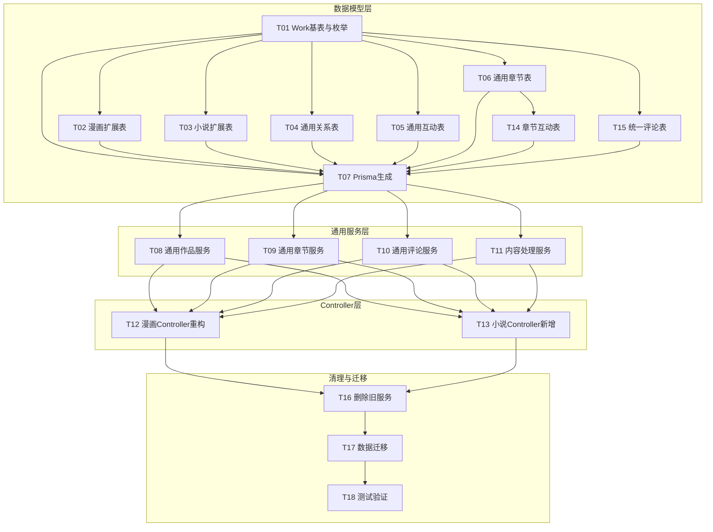

# 方案C原子化任务清单（彻底重构 - 无向后兼容）

## 目标
- 将漫画作品公共字段上移到 Work 基表
- 关系表与互动表通用化
- **服务层彻底抽象**：无适配层，直接使用通用服务
- **小说模块同步可用**：数据模型 + 服务层 + Controller 全部就绪
- **内容统一文件存储**：漫画图片、小说章节文件均采用文件存储

## 说明
- 本方案仅支持漫画和小说两种作品类型，不包含插画
- **无向后兼容要求**：接口可直接重构，DTO 可直接替换
- **小说模块完全可用**：重构完成后小说功能同步上线
- **内容存储策略**：所有内容采用文件存储，小说章节直接上传/读取文件

## 架构设计

### 服务层架构

```
libs/content/src/
├── work/                              # 通用作品服务层（唯一服务层）
│   ├── core/
│   │   ├── work.service.ts            # 通用作品 CRUD + 互动
│   │   ├── work.module.ts
│   │   └── dto/
│   │       └── work.dto.ts
│   ├── chapter/
│   │   ├── work-chapter.service.ts    # 通用章节 CRUD + 互动 + 权限
│   │   ├── work-chapter.module.ts
│   │   └── dto/
│   │       └── work-chapter.dto.ts
│   ├── comment/
│   │   ├── work-comment.service.ts    # 通用评论（作品 + 章节）
│   │   ├── work-comment.module.ts
│   │   └── dto/
│   │       └── work-comment.dto.ts
│   └── content/
│       ├── comic-content.service.ts   # 漫画图片内容处理
│       ├── novel-content.service.ts   # 小说章节文件处理
│       ├── content.module.ts
│       └── dto/
│           └── content.dto.ts
│
└── [删除] comic/                       # 漫画服务层完全删除
```

### Controller 层架构

```
apps/
├── app-api/src/modules/
│   ├── comic/                         # 漫画客户端接口
│   │   ├── comic.controller.ts
│   │   ├── chapter.controller.ts
│   │   ├── comment.controller.ts
│   │   └── comic.module.ts
│   └── novel/                         # 小说客户端接口（新增）
│       ├── novel.controller.ts
│       ├── chapter.controller.ts
│       ├── comment.controller.ts
│       └── novel.module.ts
│
└── admin-api/src/modules/content-management/
    ├── comic/                         # 漫画管理端接口
    │   ├── comic.controller.ts
    │   ├── chapter.controller.ts
    │   ├── comment.controller.ts
    │   ├── content.controller.ts      # 图片上传
    │   └── comic.module.ts
    └── novel/                         # 小说管理端接口（新增）
        ├── novel.controller.ts
        ├── chapter.controller.ts
        ├── comment.controller.ts
        ├── content.controller.ts      # 章节文件上传
        └── novel.module.ts
```

### 数据模型架构

```
prisma/models/work/
├── work.prisma                        # Work 基表
├── work-comic.prisma                  # 漫画扩展表
├── work-novel.prisma                  # 小说扩展表
├── work-author-relation.prisma        # 作品-作者关系
├── work-category-relation.prisma      # 作品-分类关系
├── work-tag-relation.prisma           # 作品-标签关系
├── work-favorite.prisma               # 作品收藏
├── work-like.prisma                   # 作品点赞
├── work-chapter.prisma                # 通用章节表
├── work-chapter-like.prisma           # 章节点赞
├── work-chapter-purchase.prisma       # 章节购买
├── work-chapter-download.prisma       # 章节下载
├── work-comment.prisma                # 统一评论表
├── work-comment-report.prisma         # 评论举报
└── author/
    └── work-author.prisma
```

### 文件存储结构

```
uploads/
├── comics/                            # 漫画内容
│   └── {workId}/
│       └── chapters/
│           └── {chapterId}/
│               ├── 001.jpg
│               ├── 002.jpg
│               └── ...
│
└── novels/                            # 小说内容
    └── {workId}/
        └── chapters/
            ├── chapter_001.txt        # 章节文件
            ├── chapter_002.txt
            └── ...
```

## 任务依赖图



## 任务清单

### T01 新增 Work 基表与作品类型枚举
- 新增文件
  - prisma/models/work/work.prisma
  - libs/base/src/enum/work-type.enum.ts
- 修改文件
  - libs/base/src/enum/index.ts
- 字段设计
  ```prisma
  model Work {
    id              Int       @id @default(autoincrement())
    type            WorkTypeEnum
    name            String    @db.VarChar(100)
    alias           String?   @db.VarChar(200)
    cover           String    @db.VarChar(500)
    description     String
    language        String    @db.VarChar(10)
    region          String    @db.VarChar(10)
    ageRating       String?   @db.VarChar(10)
    serialStatus    Int       @default(0)
    publisher       String?   @db.VarChar(100)
    originalSource  String?   @db.VarChar(100)
    copyright       String?   @db.VarChar(500)
    disclaimer      String?
    isPublished     Boolean   @default(true)
    publishAt       DateTime? @db.Date
    lastUpdated     DateTime? @db.Timestamptz(6)
    viewCount       Int       @default(0)
    favoriteCount   Int       @default(0)
    likeCount       Int       @default(0)
    rating          Float?
    ratingCount     Int       @default(0)
    popularity      Int       @default(0)
    isRecommended   Boolean   @default(false)
    isHot           Boolean   @default(false)
    isNew           Boolean   @default(false)
    recommendWeight Float     @default(1.0)
    createdAt       DateTime  @default(now())
    updatedAt       DateTime  @updatedAt
    deletedAt       DateTime?

    comic           WorkComic?
    novel           WorkNovel?
    authors         WorkAuthorRelation[]
    categories      WorkCategoryRelation[]
    tags            WorkTagRelation[]
    chapters        WorkChapter[]
    favorites       WorkFavorite[]
    likes           WorkLike[]
    comments        WorkComment[]

    @@index([isPublished, publishAt])
    @@index([popularity])
    @@index([language, region])
    @@index([serialStatus])
    @@index([lastUpdated])
    @@index([name])
    @@index([isRecommended])
    @@index([isHot, isNew])
    @@map("work")
  }

  enum WorkTypeEnum {
    COMIC
    NOVEL
  }
  ```

### T02 改造漫画主表为扩展表
- 修改文件
  - prisma/models/work/comic/work-comic.prisma
- 设计
  ```prisma
  model WorkComic {
    id        Int      @id @default(autoincrement())
    workId    Int      @unique
    work      Work     @relation(fields: [workId], references: [id], onDelete: Cascade)
    createdAt DateTime @default(now())
    updatedAt DateTime @updatedAt

    @@map("work_comic")
  }
  ```

### T03 新增小说扩展表
- 新增文件
  - prisma/models/work/novel/work-novel.prisma
- 设计
  ```prisma
  model WorkNovel {
    id           Int      @id @default(autoincrement())
    workId       Int      @unique
    work         Work     @relation(fields: [workId], references: [id], onDelete: Cascade)
    wordCount    Int      @default(0)
    createdAt    DateTime @default(now())
    updatedAt    DateTime @updatedAt

    @@map("work_novel")
  }
  ```

### T04 通用化作者/分类/标签关系表
- 新增文件
  - prisma/models/work/work-author-relation.prisma
  - prisma/models/work/work-category-relation.prisma
  - prisma/models/work/work-tag-relation.prisma
- 删除文件
  - prisma/models/work/comic/work-comic-author.prisma
  - prisma/models/work/comic/work-comic-category.prisma
  - prisma/models/work/comic/work-comic-tag.prisma
- 设计
  ```prisma
  model WorkAuthorRelation {
    id        Int         @id @default(autoincrement())
    workId    Int
    authorId  Int
    sortOrder Int         @default(0)
    role      String?     @db.VarChar(50)
    work      Work        @relation(fields: [workId], references: [id], onDelete: Cascade)
    author    WorkAuthor  @relation(fields: [authorId], references: [id])
    @@unique([workId, authorId])
    @@map("work_author_relation")
  }
  ```

### T05 通用化收藏/点赞关系表
- 新增文件
  - prisma/models/work/work-favorite.prisma
  - prisma/models/work/work-like.prisma
- 删除文件
  - prisma/models/work/comic/work-comic-favorite.prisma
  - prisma/models/work/comic/work-comic-like.prisma
- 设计
  ```prisma
  model WorkFavorite {
    id        Int           @id @default(autoincrement())
    workId    Int
    userId    Int
    workType  WorkTypeEnum
    createdAt DateTime      @default(now())
    work      Work          @relation(fields: [workId], references: [id], onDelete: Cascade)
    @@unique([workId, userId])
    @@map("work_favorite")
  }
  ```

### T06 通用章节表设计
- 新增文件
  - prisma/models/work/work-chapter.prisma
- 删除文件
  - prisma/models/work/comic/work-comic-chapter.prisma
- 设计
  ```prisma
  model WorkChapter {
    id                      Int           @id @default(autoincrement())
    workId                  Int
    workType                WorkTypeEnum
    title                   String        @db.VarChar(100)
    subtitle                String?       @db.VarChar(200)
    description             String?       @db.VarChar(1000)
    sortOrder               Int           @default(0)

    // 权限字段
    readRule                Int           @default(0)
    readPoints              Int?          @default(0)
    downloadRule            Int           @default(1)
    downloadPoints          Int?          @default(0)
    requiredReadLevelId     Int?
    requiredDownloadLevelId Int?

    // 状态字段
    isPublished             Boolean       @default(false)
    isPreview               Boolean       @default(false)
    canComment              Boolean       @default(true)
    publishAt               DateTime?

    // 统计字段
    viewCount               Int           @default(0)
    likeCount               Int           @default(0)
    commentCount            Int           @default(0)
    purchaseCount           Int           @default(0)
    wordCount               Int           @default(0)

    // 内容存储（文件路径）
    contentPath             String?       @db.VarChar(500)  // 章节文件路径

    remark                  String?
    createdAt               DateTime      @default(now())
    updatedAt               DateTime      @updatedAt
    deletedAt               DateTime?

    work                    Work          @relation(fields: [workId], references: [id], onDelete: Cascade)
    likes                   WorkChapterLike[]
    purchases               WorkChapterPurchase[]
    downloads               WorkChapterDownload[]
    comments                WorkComment[]

    @@unique([workId, sortOrder])
    @@index([workId])
    @@index([isPublished, publishAt])
    @@map("work_chapter")
  }
  ```

### T07 Prisma 生成与类型导出同步
- 执行 `pnpm prisma:update`
- 验证类型生成正确

### T08 通用作品服务
- 新增文件
  - libs/content/src/work/core/work.service.ts
  - libs/content/src/work/core/work.module.ts
  - libs/content/src/work/core/work.constant.ts
  - libs/content/src/work/core/index.ts
  - libs/content/src/work/core/dto/work.dto.ts
- 服务接口
  ```typescript
  @Injectable()
  export class WorkService {
    // CRUD
    createWork(dto: CreateWorkDto, workType: WorkTypeEnum)
    updateWork(dto: UpdateWorkDto)
    getWorkDetail(id: number)
    getWorkPage(dto: QueryWorkDto)
    deleteWork(id: number)

    // 互动
    incrementViewCount(id: number, userId: number, workType: WorkTypeEnum)
    incrementLikeCount(id: number, userId: number, workType: WorkTypeEnum)
    incrementFavoriteCount(id: number, userId: number, workType: WorkTypeEnum)

    // 用户状态
    checkUserLiked(workId: number, userId: number)
    checkUserFavorited(workId: number, userId: number)
    getWorkUserStatus(ids: number[], userId: number)

    // 我的记录
    getMyFavoritePage(dto: PageDto, userId: number, workType: WorkTypeEnum)
    getMyLikedPage(dto: PageDto, userId: number, workType: WorkTypeEnum)
  }
  ```

### T09 通用章节服务
- 新增文件
  - libs/content/src/work/chapter/work-chapter.service.ts
  - libs/content/src/work/chapter/work-chapter.module.ts
  - libs/content/src/work/chapter/work-chapter.constant.ts
  - libs/content/src/work/chapter/index.ts
  - libs/content/src/work/chapter/dto/work-chapter.dto.ts
- 服务接口
  ```typescript
  @Injectable()
  export class WorkChapterService {
    // CRUD
    createChapter(dto: CreateChapterDto, workType: WorkTypeEnum)
    updateChapter(dto: UpdateChapterDto)
    getChapterDetail(id: number)
    getChapterPage(dto: QueryChapterDto)
    deleteChapter(id: number)
    swapChapterNumbers(dto: SwapChapterDto)

    // 互动
    incrementViewCount(id: number, userId: number, workType: WorkTypeEnum)
    incrementLikeCount(id: number, userId: number, workType: WorkTypeEnum)
    incrementPurchaseCount(id: number, userId: number, workType: WorkTypeEnum)
    reportDownload(id: number, userId: number, workType: WorkTypeEnum)

    // 用户状态
    checkUserLiked(chapterId: number, userId: number)
    checkUserPurchased(chapterId: number, userId: number)
    checkUserDownloaded(chapterId: number, userId: number)
    getChapterUserStatus(ids: number[], userId: number)

    // 我的记录
    getMyPurchasedPage(dto: PageDto, userId: number, workType: WorkTypeEnum)
    getMyDownloadedPage(dto: PageDto, userId: number, workType: WorkTypeEnum)
    getMyReadPage(dto: PageDto, userId: number, workType: WorkTypeEnum)
  }
  ```

### T10 通用评论服务
- 新增文件
  - libs/content/src/work/comment/work-comment.service.ts
  - libs/content/src/work/comment/work-comment.module.ts
  - libs/content/src/work/comment/work-comment.constant.ts
  - libs/content/src/work/comment/work-comment.types.ts
  - libs/content/src/work/comment/index.ts
  - libs/content/src/work/comment/dto/work-comment.dto.ts
- 服务接口
  ```typescript
  @Injectable()
  export class WorkCommentService {
    // 评论 CRUD
    createComment(dto: CreateCommentDto, userId: number, workType: WorkTypeEnum)
    deleteComment(id: number, userId: number)
    deleteCommentByAdmin(id: number)

    // 查询
    getCommentPage(dto: QueryCommentDto, workType: WorkTypeEnum)
    getCommentManagePage(dto: QueryCommentDto, workType: WorkTypeEnum)
    getCommentDetail(id: number)

    // 审核
    updateCommentAudit(dto: UpdateCommentAuditDto, adminUserId: number)
    updateCommentHidden(dto: UpdateCommentHiddenDto)
    recalcCommentCount(workId: number, workType: WorkTypeEnum)

    // 举报
    createCommentReport(dto: CreateReportDto, reporterId: number)
    getCommentReportPage(dto: QueryReportDto)
    handleCommentReport(dto: HandleReportDto, handlerId: number)
  }
  ```

### T11 内容处理服务
- 新增文件
  - libs/content/src/work/content/comic-content.service.ts
  - libs/content/src/work/content/novel-content.service.ts
  - libs/content/src/work/content/content.module.ts
  - libs/content/src/work/content/index.ts
  - libs/content/src/work/content/dto/content.dto.ts
- 服务接口
  ```typescript
  // 漫画图片内容
  @Injectable()
  export class ComicContentService {
    // 图片数组管理
    getChapterContents(chapterId: number): Promise<string[]>
    addChapterContent(req: FastifyRequest, dto: AddContentDto): Promise<UploadResult>
    updateChapterContent(dto: UpdateContentDto): Promise<void>
    deleteChapterContent(dto: DeleteContentDto): Promise<void>
    moveChapterContent(dto: MoveContentDto): Promise<void>
    clearChapterContents(chapterId: number): Promise<void>
  }

  // 小说章节文件
  @Injectable()
  export class NovelContentService {
    // 章节文件管理
    getChapterContent(chapterId: number): Promise<string>
    uploadChapterContent(req: FastifyRequest, dto: UploadContentDto): Promise<UploadResult>
    deleteChapterContent(chapterId: number): Promise<void>
  }
  ```

### T12 漫画 Controller 重构
- 修改文件
  - apps/app-api/src/modules/comic/comic.controller.ts
  - apps/app-api/src/modules/comic/chapter.controller.ts
  - apps/app-api/src/modules/comic/comment.controller.ts
  - apps/app-api/src/modules/comic/comic.module.ts
  - apps/admin-api/src/modules/content-management/comic/comic.controller.ts
  - apps/admin-api/src/modules/content-management/comic/chapter.controller.ts
  - apps/admin-api/src/modules/content-management/comic/comment.controller.ts
  - apps/admin-api/src/modules/content-management/comic/content.controller.ts
  - apps/admin-api/src/modules/content-management/comic/comic.module.ts

### T13 小说 Controller 新增
- 新增文件
  - apps/app-api/src/modules/novel/novel.controller.ts
  - apps/app-api/src/modules/novel/chapter.controller.ts
  - apps/app-api/src/modules/novel/comment.controller.ts
  - apps/app-api/src/modules/novel/novel.module.ts
  - apps/app-api/src/modules/novel/index.ts
  - apps/admin-api/src/modules/content-management/novel/novel.controller.ts
  - apps/admin-api/src/modules/content-management/novel/chapter.controller.ts
  - apps/admin-api/src/modules/content-management/novel/comment.controller.ts
  - apps/admin-api/src/modules/content-management/novel/content.controller.ts
  - apps/admin-api/src/modules/content-management/novel/novel.module.ts
  - apps/admin-api/src/modules/content-management/novel/index.ts

### T14 通用化章节互动表
- 新增文件
  - prisma/models/work/work-chapter-like.prisma
  - prisma/models/work/work-chapter-purchase.prisma
  - prisma/models/work/work-chapter-download.prisma
- 删除文件
  - prisma/models/work/comic/work-comic-chapter-like.prisma
  - prisma/models/work/comic/work-comic-chapter-purchase.prisma
  - prisma/models/work/comic/work-comic-chapter-download.prisma

### T15 统一评论表设计
- 新增文件
  - prisma/models/work/work-comment.prisma
  - prisma/models/work/work-comment-report.prisma
- 删除文件
  - prisma/models/work/comic/work-comic-chapter-comment.prisma
  - prisma/models/work/comic/work-comic-chapter-comment-report.prisma
- 设计
  ```prisma
  model WorkComment {
    id              Int           @id @default(autoincrement())
    workId          Int
    workType        WorkTypeEnum
    chapterId       Int?
    userId          Int
    content         String        @db.Text
    replyToId       Int?
    actualReplyToId Int?
    floor           Int?
    auditStatus     Int           @default(0)
    auditReason     String?
    auditAt         DateTime?
    auditById       Int?
    auditRole       Int?
    isHidden        Boolean       @default(false)
    sensitiveWordHits Json?
    createdAt       DateTime      @default(now())
    updatedAt       DateTime      @updatedAt
    deletedAt       DateTime?

    @@index([workId])
    @@index([chapterId])
    @@index([userId])
    @@map("work_comment")
  }
  ```

### T16 删除旧服务
- 删除文件
  - libs/content/src/comic/ 目录下所有文件

### T17 数据迁移
- 新增文件
  - scripts/migrations/work-base-backfill.ts
  - scripts/migrations/work-base-verify.ts
- 迁移步骤
  1. 创建 Work 表
  2. 迁移 WorkComic 数据到 Work
  3. 更新 WorkComic 添加 workId 外键
  4. 迁移关系表数据
  5. 迁移互动表数据
  6. 迁移章节表数据（contents 字段转为文件存储）
  7. 迁移评论表数据
  8. 验证数据完整性

### T18 测试验证
- 运行 Prisma 迁移
- 运行 lint 与 typecheck
- 验证漫画接口功能
- 验证小说接口功能

## 小说模块可用性确认

| 功能模块 | 数据模型 | 服务层 | Controller | 状态 |
|---------|---------|-------|-----------|-----|
| 作品 CRUD | ✅ Work + WorkNovel | ✅ WorkService | ✅ NovelController | **可用** |
| 作品互动 | ✅ WorkLike/Favorite | ✅ WorkService | ✅ NovelController | **可用** |
| 章节 CRUD | ✅ WorkChapter | ✅ WorkChapterService | ✅ ChapterController | **可用** |
| 章节互动 | ✅ WorkChapter* | ✅ WorkChapterService | ✅ ChapterController | **可用** |
| 章节内容 | ✅ contentPath | ✅ NovelContentService | ✅ ContentController | **可用** |
| 评论系统 | ✅ WorkComment | ✅ WorkCommentService | ✅ CommentController | **可用** |
| 作者/分类/标签 | ✅ Work*Relation | ✅ WorkService | ✅ NovelController | **可用** |

**结论：小说模块在重构完成后完全可用。**

## 内容存储策略

| 内容类型 | 存储方式 | 服务 | 说明 |
|---------|---------|-----|-----|
| 漫画图片 | 文件存储 | ComicContentService | uploads/comics/{workId}/chapters/{chapterId}/ |
| 小说章节 | 文件存储 | NovelContentService | uploads/novels/{workId}/chapters/chapter_{n}.txt |

## 关键优势

1. **小说模块零成本扩展**：重构完成即上线
2. **内容存储统一**：所有内容采用文件存储，便于 CDN 加速
3. **架构最简洁**：Controller → 通用服务 → 数据模型
4. **维护成本最低**：单一服务层，修改一处生效全局
5. **接口统一**：漫画和小说 API 结构一致，前端开发友好
