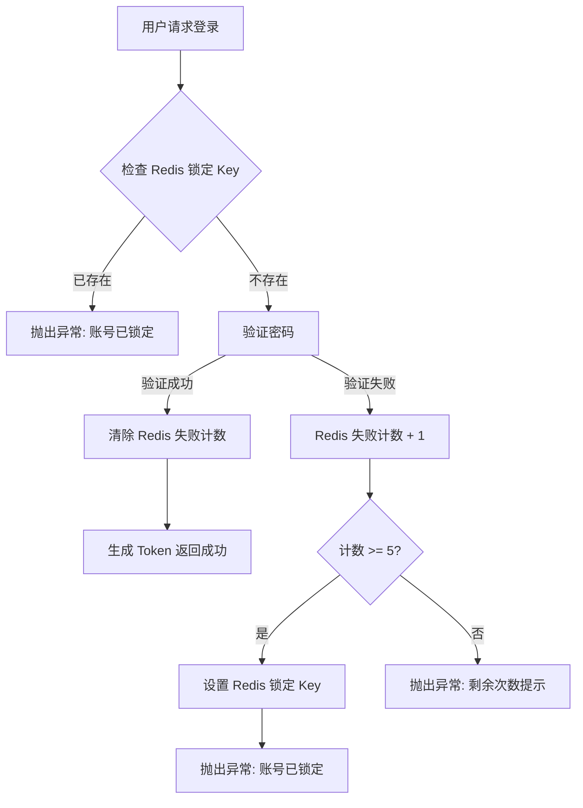

# 账号锁定功能设计 (DESIGN)

## 1. 模块设计

### 1.1 AuthService 修改
需在 `AuthService` 中增加私有方法处理 Redis 计数逻辑。

#### 新增常量 (`auth.constant.ts`)
```typescript
export const AuthConstants = {
  // ... existing
  LOGIN_MAX_ATTEMPTS: 5,
  LOGIN_FAIL_TTL: 5 * 60, // 5分钟
  ACCOUNT_LOCK_TTL: 30 * 60, // 30分钟
}

export const AuthRedisKeys = {
  LOGIN_FAIL_COUNT: (userId: number) => `auth:login:fail:${userId}`,
  LOGIN_LOCK: (userId: number) => `auth:login:lock:${userId}`,
}

export const AuthErrorMessages = {
  // ... existing
  ACCOUNT_LOCKED: (minutes: number) => `账号已锁定，请在 ${minutes} 分钟后重试`,
  PASSWORD_ERROR_WITH_REMAINING: (remaining: number) => `密码错误，还剩 ${remaining} 次机会`,
}
```

#### 逻辑流程图


## 2. 接口变动
无接口签名变更，仅行为变更（新增特定的错误响应）。

## 3. 依赖关系
- 依赖现有的 `Redis` 服务 (通过 `BaseService` 或注入 `Cache`).
- 依赖 `AuthService` 中的 `appUser` 查找逻辑（需先查到 User ID 才能记录 Redis）。

## 4. 异常处理
- 确保 Redis 操作异常不会导致整个登录服务不可用（可选：Redis 挂掉时降级为不锁定，或者报错，本系统倾向于 fail-safe 或报错，此处按常规处理，Redis 异常会抛出）。
