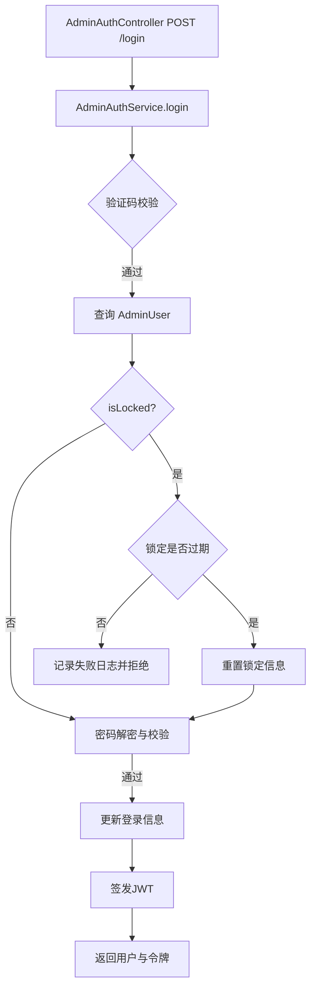

# 阶段 2: Architect（架构设计）

## 整体架构图（mermaid）

## 分层与核心组件

- Controller：`AdminAuthController`（路由入口）
- Service：`AdminAuthService`（登录业务、自动解锁、锁定更新）
- Config：`auth.config.ts`（锁定策略）
- Infra：`Prisma`（`AdminUser` 模型）、`RequestLogService`（审计）

## 模块依赖

- `AdminAuthService` 依赖：`CaptchaService`、`RsaService`、`CryptoService`、`AdminJwtService`、`RequestLogService`、`Prisma`。

## 接口契约定义（核心）

- `POST /api/admin/login`：请求体 `UserLoginDto`，返回 `LoginResponseDto`。
- 自动解锁为服务端内部行为，对外接口契约不变。

## 数据流向图

- 输入：用户名、密码（RSA 加密）、验证码。
- 持久化：`AdminUser`（`isLocked`、`loginFailAt`、`loginFailCount` 等）。
- 输出：用户基本信息（去除敏感字段）与访问/刷新令牌。

## 异常处理策略

- 验证码错误：`BadRequestException`
- 账号或密码错误：`BadRequestException`
- 账号锁定未过期：`UnauthorizedException` 并记录失败日志
