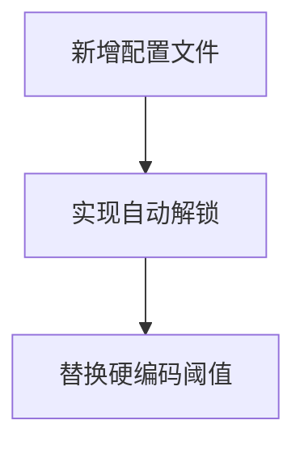

# 阶段 3: Atomize（原子化拆分）

## 原子任务清单

1. 新增锁定策略配置文件
   - 输入契约：环境变量 `ADMIN_LOGIN_LOCK_COUNT`、`ADMIN_LOGIN_LOCK_DURATION_MIN`
   - 输出契约：`ADMIN_LOGIN_POLICY`（`maxFailCount`、`lockDurationMs`）
   - 约束：TypeScript，保持与现有 config 模式一致
   - 依赖：dotenv、process.env

2. 登录流程增加自动解锁判断
   - 输入契约：`AdminUser`（`isLocked`、`loginFailAt`）
   - 输出契约：数据库状态重置（解锁）或拒绝登录
   - 约束：不改变现有审计与验证码逻辑
   - 依赖：Prisma、RequestLogService

3. 替换锁定阈值硬编码
   - 输入契约：`ADMIN_LOGIN_POLICY.maxFailCount`
   - 输出契约：根据策略判定锁定
   - 约束：仅替换相关判断，不扩展行为

## 任务依赖图（mermaid）

