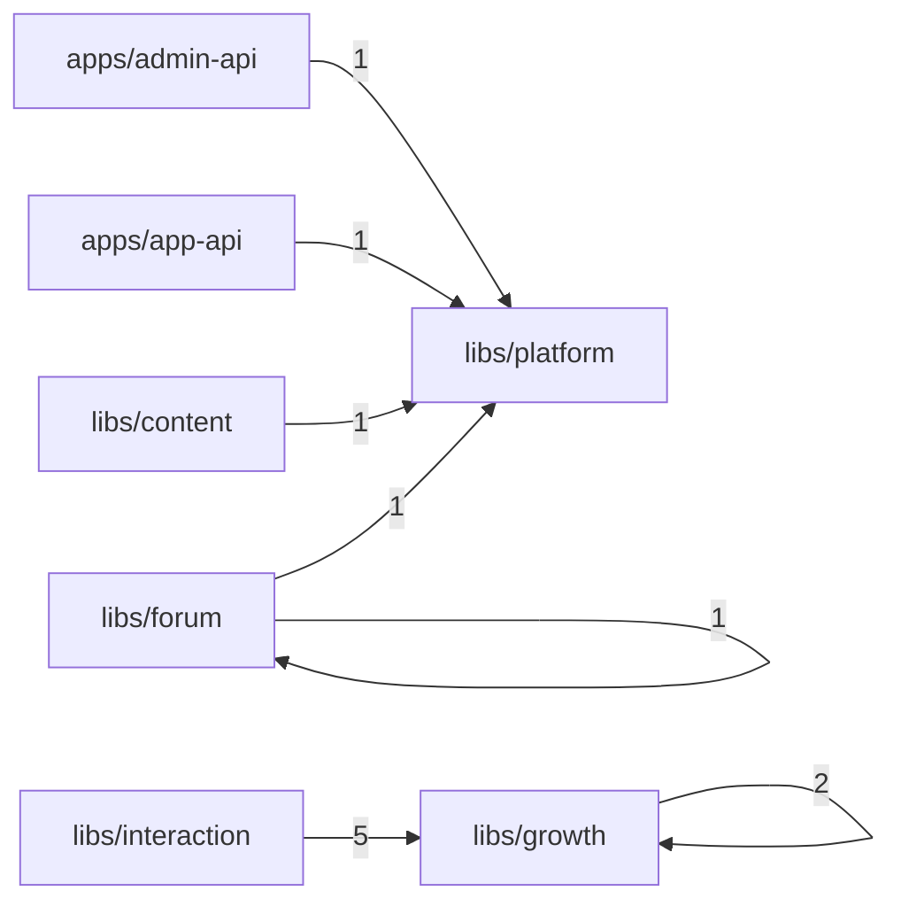
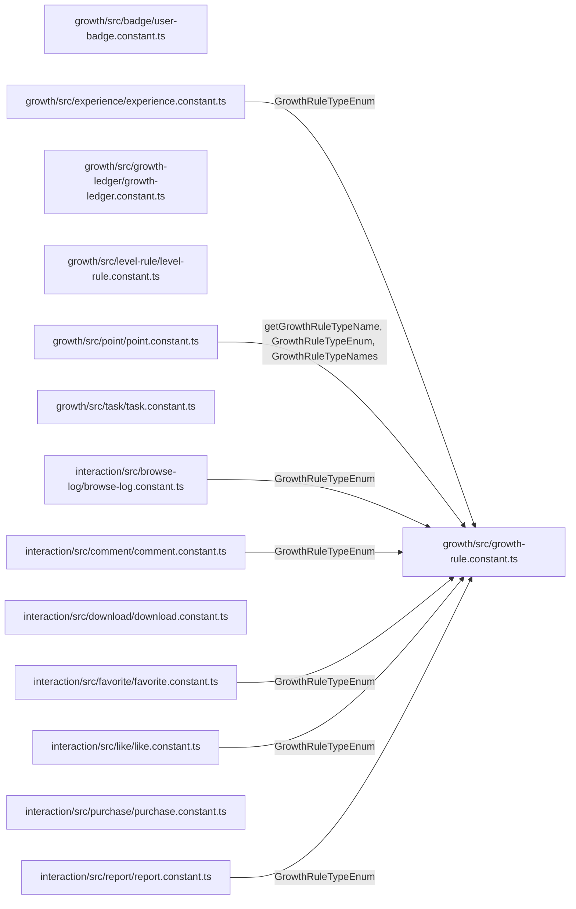

# 常量引用关系可视化报告

生成时间：2026-03-18T10:08:33.763Z

## 扫描范围

- 扫描对象：全部 `*.constant.ts` 文件，共 48 个。
- 导出符号：共 134 个。
- 常量文件之间的直接依赖边：共 12 条，其中跨域依赖 9 条。
- interaction / growth 重点文件：共 14 个。
- 疑似未使用导出：共 28 个。
- 循环依赖：共 0 组。

## 域级依赖图

## interaction / growth 子图

## 文件清单与导出符号

| 文件 | 重点标记 | 导出数 | 导出符号 | 外部消费者文件数 | 常量依赖数 | 问题标签 |
| --- | --- | --- | --- | --- | --- | --- |
| apps/admin-api/src/modules/admin-user/admin-user.constant.ts | - | 2 | AdminUserRoleEnum EXCLUDE_ADMIN_USER_FIELDS | 2 | 0 | mutable-export, unused-export |
| apps/admin-api/src/modules/auth/auth.constant.ts | - | 3 | AuthConstants AuthRedisKeys CacheKey | 3 | 1 | cross-domain-coupling |
| apps/admin-api/src/modules/content/comic/third-party/third-party.constant.ts | - | 1 | PLATFORMS | 1 | 0 | mutable-export |
| apps/admin-api/src/modules/system/audit/audit.constant.ts | - | 1 | ActionTypeEnum | 10 | 0 | - |
| apps/app-api/src/modules/auth/auth.constant.ts | - | 4 | AuthConstants AuthDefaultValue AuthErrorMessages AuthRedisKeys | 5 | 1 | cross-domain-coupling |
| libs/app-content/src/announcement/announcement.constant.ts | - | 2 | AnnouncementPriorityEnum AnnouncementTypeEnum | 1 | 0 | - |
| libs/app-content/src/page/page.constant.ts | - | 1 | PageRuleEnum | 1 | 0 | - |
| libs/config/src/app-config/config.constant.ts | - | 1 | DEFAULT_APP_CONFIG | 1 | 0 | - |
| libs/config/src/system-config/system-config.constant.ts | - | 4 | CACHE_KEY CACHE_TTL CONFIG_SECURITY_META DEFAULT_CONFIG | 2 | 0 | mutable-export |
| libs/content/src/author/author.constant.ts | - | 1 | AuthorTypeEnum | 1 | 0 | - |
| libs/content/src/permission/content-permission.constant.ts | - | 1 | PERMISSION_ERROR_MESSAGE | 1 | 0 | mutable-export |
| libs/content/src/work/core/work.constant.ts | - | 2 | WorkSerialStatusEnum WorkTypeMap | 1 | 1 | cross-domain-coupling, unused-export |
| libs/forum/src/action-log/action-log.constant.ts | - | 3 | ForumUserActionTargetTypeEnum ForumUserActionTypeDescriptionMap ForumUserActionTypeEnum | 2 | 0 | mutable-export, unused-export |
| libs/forum/src/config/forum-config-cache.constant.ts | - | 3 | FORUM_CONFIG_CACHE_KEYS FORUM_CONFIG_CACHE_METRICS FORUM_CONFIG_CACHE_TTL | 1 | 0 | mutable-export |
| libs/forum/src/config/forum-config.constant.ts | - | 3 | ChangeTypeEnum DEFAULT_FORUM_CONFIG ForumReviewPolicyEnum | 5 | 0 | - |
| libs/forum/src/moderator/moderator.constant.ts | - | 4 | ForumModeratorPermissionEnum ForumModeratorPermissionNames ForumModeratorRoleTypeEnum ForumModeratorRoleTypeNames | 2 | 0 | mutable-export, unused-export |
| libs/forum/src/search/search.constant.ts | - | 2 | ForumSearchSortTypeEnum ForumSearchTypeEnum | 2 | 0 | - |
| libs/forum/src/section/forum-section.constant.ts | - | 1 | ForumReviewPolicyEnum | 3 | 1 | re-export-shell |
| libs/forum/src/topic/forum-topic.constant.ts | - | 2 | AuditRoleEnum AuditStatusEnum | 8 | 1 | cross-domain-coupling, re-export-shell |
| libs/growth/src/badge/user-badge.constant.ts | 重点(growth) | 1 | UserBadgeTypeEnum | 1 | 0 | enum-member-style |
| libs/growth/src/experience/experience.constant.ts | 重点(growth) | 1 | GrowthRuleTypeEnum | 16 | 1 | re-export-shell |
| libs/growth/src/growth-ledger/growth-ledger.constant.ts | 重点(growth) | 4 | GrowthAssetTypeEnum GrowthLedgerActionEnum GrowthLedgerFailReasonEnum GrowthLedgerFailReasonLabel | 14 | 0 | mutable-export |
| libs/growth/src/growth-rule.constant.ts | 重点(growth) | 3 | getGrowthRuleTypeName GrowthRuleTypeEnum GrowthRuleTypeNames | 15 | 0 | mutable-export, unused-export |
| libs/growth/src/level-rule/level-rule.constant.ts | 重点(growth) | 2 | LevelRulePermissionNames UserLevelRulePermissionEnum | 2 | 0 | mutable-export, unused-export |
| libs/growth/src/point/point.constant.ts | 重点(growth) | 3 | getGrowthRuleTypeName GrowthRuleTypeEnum GrowthRuleTypeNames | 16 | 1 | re-export-shell, unused-export |
| libs/growth/src/task/task.constant.ts | 重点(growth) | 7 | TaskAssignmentStatusEnum TaskClaimModeEnum TaskCompleteModeEnum TaskProgressActionTypeEnum TaskRepeatTypeEnum TaskStatusEnum TaskTypeEnum | 2 | 0 | - |
| libs/interaction/src/browse-log/browse-log.constant.ts | 重点(interaction) | 2 | BROWSE_LOG_GROWTH_RULE_TYPE_MAP BrowseLogTargetTypeEnum | 9 | 1 | mutable-export, cross-domain-coupling |
| libs/interaction/src/comment/comment.constant.ts | 重点(interaction) | 2 | COMMENT_GROWTH_RULE_TYPE_MAP CommentTargetTypeEnum | 10 | 1 | mutable-export, cross-domain-coupling, unused-export |
| libs/interaction/src/download/download.constant.ts | 重点(interaction) | 1 | DownloadTargetTypeEnum | 7 | 0 | - |
| libs/interaction/src/favorite/favorite.constant.ts | 重点(interaction) | 2 | FAVORITE_GROWTH_RULE_TYPE_MAP FavoriteTargetTypeEnum | 9 | 1 | mutable-export, cross-domain-coupling |
| libs/interaction/src/like/like.constant.ts | 重点(interaction) | 2 | LIKE_GROWTH_RULE_TYPE_MAP LikeTargetTypeEnum | 11 | 1 | mutable-export, cross-domain-coupling |
| libs/interaction/src/purchase/purchase.constant.ts | 重点(interaction) | 3 | PaymentMethodEnum PurchaseStatusEnum PurchaseTargetTypeEnum | 7 | 0 | - |
| libs/interaction/src/report/report.constant.ts | 重点(interaction) | 7 | REPORT_GROWTH_RULE_TYPE_MAP ReportReasonEnum ReportReasonNames ReportStatusEnum ReportStatusNames ReportTargetTypeEnum ReportTargetTypeNames | 14 | 1 | mutable-export, cross-domain-coupling, unused-export |
| libs/message/src/chat/chat.constant.ts | - | 6 | CHAT_MESSAGE_PAGE_LIMIT_DEFAULT CHAT_MESSAGE_PAGE_LIMIT_MAX ChatConversationMemberRoleEnum ChatMessageStatusEnum ChatMessageTypeEnum MESSAGE_CHAT_SERVICE_TOKEN | 4 | 0 | - |
| libs/message/src/notification/notification.constant.ts | - | 2 | MessageNotificationSubjectTypeEnum MessageNotificationTypeEnum | 7 | 0 | - |
| libs/message/src/outbox/outbox.constant.ts | - | 5 | MESSAGE_OUTBOX_BATCH_SIZE MESSAGE_OUTBOX_MAX_RETRY MESSAGE_OUTBOX_PROCESSING_TIMEOUT_SECONDS MessageOutboxDomainEnum MessageOutboxStatusEnum | 4 | 0 | - |
| libs/moderation/sensitive-word/src/sensitive-word-cache.constant.ts | - | 2 | SENSITIVE_WORD_CACHE_KEYS SENSITIVE_WORD_CACHE_TTL | 1 | 0 | mutable-export |
| libs/platform/src/constant/audit.constant.ts | - | 4 | AuditRoleEnum AuditRoleNames AuditStatusEnum AuditStatusNames | 7 | 0 | mutable-export, unused-export |
| libs/platform/src/constant/base.constant.ts | - | 3 | ApiTypeEnum EnablePlatformEnum HttpMethodEnum | 5 | 0 | - |
| libs/platform/src/constant/business.constant.ts | - | 4 | BusinessModuleEnum FORUMTypeEnum WorkChapterTypeEnum WorkTypeEnum | 0 | 0 | unused-export |
| libs/platform/src/constant/content.constant.ts | - | 3 | BusinessModuleEnum ContentTypeEnum WorkViewPermissionEnum | 24 | 0 | unused-export |
| libs/platform/src/constant/interaction.constant.ts | - | 6 | CommentLevelEnum CommentLevelNames InteractionActionType InteractionTargetTypeEnum SceneTypeEnum SceneTypeNames | 22 | 0 | mutable-export, unused-export |
| libs/platform/src/constant/logger.constant.ts | - | 1 | LoggerLevel | 1 | 0 | - |
| libs/platform/src/constant/sort.constant.ts | - | 2 | SortOrderEnum SortOrderNames | 0 | 0 | mutable-export, unused-export |
| libs/platform/src/constant/user.constant.ts | - | 4 | AdminUserRoleEnum GenderEnum UserDefaults UserStatusEnum | 13 | 0 | mutable-export |
| libs/platform/src/decorators/response-dto.constant.ts | - | 3 | RESPONSE_DTO_METADATA_KEY ResponseDtoMetadata SetResponseDtoMetadata | 1 | 0 | unused-export |
| libs/platform/src/modules/auth/auth.constant.ts | - | 5 | AuthConstants AuthDefaultValue AuthErrorConstant createAuthRedisKeys RevokeTokenReasonEnum | 8 | 0 | mutable-export, unused-export |
| libs/platform/src/modules/sms/sms.constant.ts | - | 3 | SmsErrorMap SmsErrorMessages SmsTemplateCodeEnum | 3 | 0 | mutable-export |

## 同域依赖

| 源文件 | 目标文件 | 入口 | 符号 |
| --- | --- | --- | --- |
| libs/forum/src/section/forum-section.constant.ts | libs/forum/src/config/forum-config.constant.ts | ../config/forum-config.constant | ForumReviewPolicyEnum |
| libs/growth/src/experience/experience.constant.ts | libs/growth/src/growth-rule.constant.ts | ../growth-rule.constant | GrowthRuleTypeEnum |
| libs/growth/src/point/point.constant.ts | libs/growth/src/growth-rule.constant.ts | ../growth-rule.constant | getGrowthRuleTypeName, GrowthRuleTypeEnum, GrowthRuleTypeNames |

## 跨域依赖

| 源文件 | 目标文件 | 入口 | 符号 |
| --- | --- | --- | --- |
| apps/admin-api/src/modules/auth/auth.constant.ts | libs/platform/src/modules/auth/auth.constant.ts | @libs/platform/modules/auth | AuthConstants, createAuthRedisKeys |
| apps/app-api/src/modules/auth/auth.constant.ts | libs/platform/src/modules/auth/auth.constant.ts | @libs/platform/modules/auth | AuthConstants, AuthDefaultValue, createAuthRedisKeys |
| libs/content/src/work/core/work.constant.ts | libs/platform/src/constant/content.constant.ts | @libs/platform/constant | ContentTypeEnum |
| libs/forum/src/topic/forum-topic.constant.ts | libs/platform/src/constant/audit.constant.ts | @libs/platform/constant | AuditRoleEnum, AuditStatusEnum |
| libs/interaction/src/browse-log/browse-log.constant.ts | libs/growth/src/growth-rule.constant.ts | @libs/growth | GrowthRuleTypeEnum |
| libs/interaction/src/comment/comment.constant.ts | libs/growth/src/growth-rule.constant.ts | @libs/growth | GrowthRuleTypeEnum |
| libs/interaction/src/favorite/favorite.constant.ts | libs/growth/src/growth-rule.constant.ts | @libs/growth | GrowthRuleTypeEnum |
| libs/interaction/src/like/like.constant.ts | libs/growth/src/growth-rule.constant.ts | @libs/growth | GrowthRuleTypeEnum |
| libs/interaction/src/report/report.constant.ts | libs/growth/src/growth-rule.constant.ts | @libs/growth | GrowthRuleTypeEnum |

## 循环依赖

未发现 `*.constant.ts` 文件之间的循环依赖。

## 重复导出与命名冲突

| 导出名 | 涉及文件 |
| --- | --- |
| AdminUserRoleEnum | apps/admin-api/src/modules/admin-user/admin-user.constant.ts libs/platform/src/constant/user.constant.ts |
| AuditRoleEnum | libs/forum/src/topic/forum-topic.constant.ts libs/platform/src/constant/audit.constant.ts |
| AuditStatusEnum | libs/forum/src/topic/forum-topic.constant.ts libs/platform/src/constant/audit.constant.ts |
| AuthConstants | apps/admin-api/src/modules/auth/auth.constant.ts apps/app-api/src/modules/auth/auth.constant.ts libs/platform/src/modules/auth/auth.constant.ts |
| AuthDefaultValue | apps/app-api/src/modules/auth/auth.constant.ts libs/platform/src/modules/auth/auth.constant.ts |
| AuthRedisKeys | apps/admin-api/src/modules/auth/auth.constant.ts apps/app-api/src/modules/auth/auth.constant.ts |
| BusinessModuleEnum | libs/platform/src/constant/business.constant.ts libs/platform/src/constant/content.constant.ts |
| ForumReviewPolicyEnum | libs/forum/src/config/forum-config.constant.ts libs/forum/src/section/forum-section.constant.ts |
| getGrowthRuleTypeName | libs/growth/src/growth-rule.constant.ts libs/growth/src/point/point.constant.ts |
| GrowthRuleTypeEnum | libs/growth/src/experience/experience.constant.ts libs/growth/src/growth-rule.constant.ts libs/growth/src/point/point.constant.ts |
| GrowthRuleTypeNames | libs/growth/src/growth-rule.constant.ts libs/growth/src/point/point.constant.ts |

## 疑似未使用导出

| 文件 | 导出符号 | 类型 |
| --- | --- | --- |
| apps/admin-api/src/modules/admin-user/admin-user.constant.ts | EXCLUDE_ADMIN_USER_FIELDS | const |
| libs/content/src/work/core/work.constant.ts | WorkTypeMap | const |
| libs/forum/src/action-log/action-log.constant.ts | ForumUserActionTypeDescriptionMap | const |
| libs/forum/src/moderator/moderator.constant.ts | ForumModeratorPermissionNames | const |
| libs/forum/src/moderator/moderator.constant.ts | ForumModeratorRoleTypeNames | const |
| libs/growth/src/growth-rule.constant.ts | getGrowthRuleTypeName | function |
| libs/growth/src/growth-rule.constant.ts | GrowthRuleTypeNames | const |
| libs/growth/src/level-rule/level-rule.constant.ts | LevelRulePermissionNames | const |
| libs/growth/src/point/point.constant.ts | getGrowthRuleTypeName | function |
| libs/interaction/src/comment/comment.constant.ts | COMMENT_GROWTH_RULE_TYPE_MAP | const |
| libs/interaction/src/report/report.constant.ts | ReportReasonNames | const |
| libs/interaction/src/report/report.constant.ts | ReportStatusNames | const |
| libs/interaction/src/report/report.constant.ts | ReportTargetTypeNames | const |
| libs/platform/src/constant/audit.constant.ts | AuditRoleNames | const |
| libs/platform/src/constant/audit.constant.ts | AuditStatusNames | const |
| libs/platform/src/constant/business.constant.ts | BusinessModuleEnum | enum |
| libs/platform/src/constant/business.constant.ts | FORUMTypeEnum | enum |
| libs/platform/src/constant/business.constant.ts | WorkChapterTypeEnum | enum |
| libs/platform/src/constant/business.constant.ts | WorkTypeEnum | enum |
| libs/platform/src/constant/content.constant.ts | BusinessModuleEnum | enum |
| libs/platform/src/constant/interaction.constant.ts | CommentLevelNames | const |
| libs/platform/src/constant/interaction.constant.ts | InteractionActionType | enum |
| libs/platform/src/constant/interaction.constant.ts | SceneTypeNames | const |
| libs/platform/src/constant/sort.constant.ts | SortOrderEnum | enum |
| libs/platform/src/constant/sort.constant.ts | SortOrderNames | const |
| libs/platform/src/decorators/response-dto.constant.ts | RESPONSE_DTO_METADATA_KEY | const |
| libs/platform/src/decorators/response-dto.constant.ts | ResponseDtoMetadata | interface |
| libs/platform/src/modules/auth/auth.constant.ts | RevokeTokenReasonEnum | enum |

## interaction / growth 深度审查

| 文件 | 风险等级 | 导出符号 | 依赖常量文件 | 深审结论 |
| --- | --- | --- | --- | --- |
| libs/growth/src/badge/user-badge.constant.ts | Medium | UserBadgeTypeEnum | - | 枚举成员使用 `System/Achievement/Activity` 的 PascalCase，和仓库中绝大多数全大写枚举成员风格不一致。 徽章类型可以继续保留为封闭枚举，但需要统一成员命名和 JSDoc 说明。 |
| libs/growth/src/experience/experience.constant.ts | Medium | GrowthRuleTypeEnum | libs/growth/src/growth-rule.constant.ts (GrowthRuleTypeEnum) | 该文件只做 re-export，没有自己的常量定义，形成“空壳常量文件”。 重复暴露 `GrowthRuleTypeEnum` 会模糊真实归属，增加引用关系排查成本。 |
| libs/growth/src/growth-ledger/growth-ledger.constant.ts | Medium | GrowthAssetTypeEnum GrowthLedgerActionEnum GrowthLedgerFailReasonEnum GrowthLedgerFailReasonLabel | - | `GrowthLedgerFailReasonLabel` 为可变对象，建议改为 `as const` 或 `Readonly<Record<...>>`。 失败原因字符串值是跨模块可见协议，应该视为平台/核心常量而非只存在于 growth 子模块。 |
| libs/growth/src/growth-rule.constant.ts | High | getGrowthRuleTypeName GrowthRuleTypeEnum GrowthRuleTypeNames | - | 规则编码采用 `1/2/3/100/200/300/400/...` 分段硬编码，缺少集中说明和生成机制，属于高影响魔法数字簇。 该文件已经成为 interaction、growth 多模块共享核心，却仍留在业务域内部，导致其他业务域反向依赖 growth。 `GrowthRuleTypeNames` 为可变对象，且名称映射与枚举定义分离，维护时容易漏改。 |
| libs/growth/src/level-rule/level-rule.constant.ts | Medium | LevelRulePermissionNames UserLevelRulePermissionEnum | - | 权限 key 直接使用字符串字面量绑定业务配置字段，建议沉到核心权限常量层统一管理。 `LevelRulePermissionNames` 未冻结，仍存在运行时被篡改的可能。 |
| libs/growth/src/point/point.constant.ts | Medium | getGrowthRuleTypeName GrowthRuleTypeEnum GrowthRuleTypeNames | libs/growth/src/growth-rule.constant.ts (getGrowthRuleTypeName, GrowthRuleTypeEnum, GrowthRuleTypeNames) | 该文件只 re-export `growth-rule.constant.ts` 的内容，真实职责与 `experience.constant.ts` 类似，容易制造冗余入口。 如果继续保留，应明确说明“兼容入口”；否则应逐步收敛到单一核心常量源。 |
| libs/growth/src/task/task.constant.ts | Medium | TaskAssignmentStatusEnum TaskClaimModeEnum TaskCompleteModeEnum TaskProgressActionTypeEnum TaskRepeatTypeEnum TaskStatusEnum TaskTypeEnum | - | `TaskClaimModeEnum` 与 `TaskCompleteModeEnum` 同时定义 `AUTO/MANUAL`，存在重复语义，可考虑抽象为统一执行模式。 多个任务状态枚举拆散在同一文件内是合理的，但需要补充统一命名规则与状态流转注释。 |
| libs/interaction/src/browse-log/browse-log.constant.ts | High | BROWSE_LOG_GROWTH_RULE_TYPE_MAP BrowseLogTargetTypeEnum | libs/growth/src/growth-rule.constant.ts (GrowthRuleTypeEnum) | 与评论、举报、平台层交互目标类型存在重复定义，`COMIC/NOVEL/COMIC_CHAPTER/NOVEL_CHAPTER/FORUM_TOPIC` 编码再次散落。 直接依赖 `@libs/growth` 的 `GrowthRuleTypeEnum`，交互域把奖励规则硬编码在本域常量中，形成跨业务域隐式耦合。 `BROWSE_LOG_GROWTH_RULE_TYPE_MAP` 为可变对象，且用 `undefined` 占位章节浏览规则，后续补规则时容易发生静默漂移。 |
| libs/interaction/src/comment/comment.constant.ts | High | COMMENT_GROWTH_RULE_TYPE_MAP CommentTargetTypeEnum | libs/growth/src/growth-rule.constant.ts (GrowthRuleTypeEnum) | 评论目标类型与浏览/举报/平台交互常量重复，缺少统一的交互目标字典。 评论奖励映射直接依赖 growth 域枚举，导致交互域无法独立演进。 导出的映射对象未冻结，运行时仍可被修改。 |
| libs/interaction/src/download/download.constant.ts | Medium | DownloadTargetTypeEnum | - | 下载目标类型与购买/平台层章节目标重复，属于典型的分散式编码。 仅有两个导出成员，建议直接复用统一交互目标层而不是继续扩散局部枚举。 |
| libs/interaction/src/favorite/favorite.constant.ts | High | FAVORITE_GROWTH_RULE_TYPE_MAP FavoriteTargetTypeEnum | libs/growth/src/growth-rule.constant.ts (GrowthRuleTypeEnum) | 收藏目标类型与点赞/平台层常量含义重叠，但命名采用 `WORK_COMIC/WORK_NOVEL`，与 `COMIC/NOVEL` 体系不一致。 `FAVORITE_GROWTH_RULE_TYPE_MAP` 未显式声明 `Record<...>`，类型约束弱于其他文件，且仍直接依赖 growth 域。 导出的映射对象未做 `as const` 或 `Object.freeze`。 |
| libs/interaction/src/like/like.constant.ts | High | LIKE_GROWTH_RULE_TYPE_MAP LikeTargetTypeEnum | libs/growth/src/growth-rule.constant.ts (GrowthRuleTypeEnum) | 点赞目标类型与收藏/平台层交互目标语义重叠，但命名拆成 `WORK_COMIC`、`WORK_NOVEL`，增加了同义枚举数量。 奖励映射直接引用 growth 域规则，交互域与奖励域双向知识耦合明显。 导出的映射对象未冻结，且规则命名 `TOPIC_LIKED/COMMENT_LIKED` 与动作含义混杂。 |
| libs/interaction/src/purchase/purchase.constant.ts | Medium | PaymentMethodEnum PurchaseStatusEnum PurchaseTargetTypeEnum | - | 购买目标类型与下载、平台层章节类型重复，建议收敛到统一章节目标常量。 `PaymentMethodEnum` 当前只有 `POINTS` 一个成员，更像平台支付方式配置而非交互域私有常量。 状态枚举缺少名称映射与注释补充，后续接口透出时容易出现各处重复翻译。 |
| libs/interaction/src/report/report.constant.ts | High | REPORT_GROWTH_RULE_TYPE_MAP ReportReasonEnum ReportReasonNames ReportStatusEnum ReportStatusNames ReportTargetTypeEnum ReportTargetTypeNames | libs/growth/src/growth-rule.constant.ts (GrowthRuleTypeEnum) | 举报目标类型再次定义 `COMIC/NOVEL/COMIC_CHAPTER/NOVEL_CHAPTER/FORUM_TOPIC/COMMENT/USER`，与平台层交互目标体系重复。 `REPORT_GROWTH_RULE_TYPE_MAP` 直接依赖 growth 域；`ReportReasonEnum.OTHER = 99` 属于裸露兜底值，缺少集中说明。 三个名称映射对象都未冻结，且举报原因/状态的中文标签散落在本地文件内。 |

## 结论

- `libs/interaction` 的多个常量文件重复维护目标类型，并把 growth 奖励规则直接嵌在本域，耦合最重。
- `libs/growth/src/growth-rule.constant.ts` 已具备核心常量层属性，但当前仍位于业务域内部，导致其他业务域反向依赖 growth。
- `point.constant.ts`、`experience.constant.ts` 属于空壳 re-export 文件；`content.constant.ts` 与 `business.constant.ts` 都导出 `BusinessModuleEnum`，已出现明确命名冲突。
- 多个名称映射对象仍是可变导出，缺少 `as const`、`Readonly` 或冻结保护，不利于常量治理。