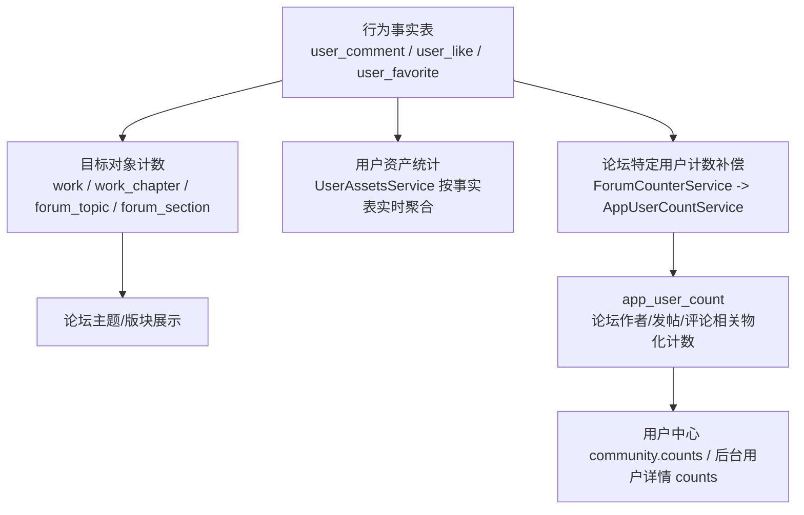

# USER_COUNT_用户计数架构全量审查报告_2026-03-20

## 1. 审查范围

本次审查聚焦“用户计数”相关的三层对象：

- 行为事实表：`user_comment`、`user_like`、`user_favorite`
- 目标对象计数：`work`、`work_chapter`、`forum_topic`、`forum_section`
- 用户侧聚合计数：`app_user_count`

重点核查以下链路：

- 评论创建、回复、删除
- 点赞、取消点赞
- 收藏、取消收藏
- 论坛主题创建、删除、审核、隐藏
- 用户中心与后台用户详情的计数读取

审查时间基线：2026-03-20  
结论基于当前仓库最新代码，不包含历史版本假设。

## 2. 核心结论

### 2.1 先给结论

当前真正的问题，不是“评论、点赞集中在一张表”本身。

当前更大的问题是：

1. `user_comment`、`user_like`、`user_favorite` 作为统一行为事实表是合理的。
2. `app_user_count` 现在却被当成“全局用户计数服务”的承载表，但里面只落了论坛域的一小部分指标。
3. 同一批用户相关指标，当前同时存在“按事实表实时统计”和“手工维护物化计数”两套体系，边界没有定义清楚。
4. 部分计数字段语义并不一致，已经出现“看上去都是用户计数，实际上统计口径不同”的问题。

### 2.2 一句话判断

当前架构里：

- 统一行为表的方向是对的
- 当前 `app_user_count` 的职责设计是不完整的
- `AppUserCountService` 目前更像“论坛用户扩展计数服务”，还不是一个真正定义清晰的全局用户计数服务

## 3. 当前架构梳理

### 3.1 角色分层

### 3.2 事实表

当前交互行为按“行为类型”统一建表，而不是按业务域拆表：

| 表 | 当前职责 | 说明 |
| --- | --- | --- |
| `user_comment` | 统一存储作品评论、章节评论、论坛评论 | 通过 `targetType + targetId` 区分挂载目标 |
| `user_like` | 统一存储作品、章节、论坛主题、评论点赞 | 同时记录 `sceneType + sceneId + commentLevel` |
| `user_favorite` | 统一存储作品、论坛主题收藏 | 当前未覆盖评论收藏这类场景 |

这类表本质上是“行为事实表”。  
它们是用户行为的真实来源，适合作为：

- 交互记录
- 去重约束
- 用户侧行为列表
- 用户资产统计
- 等级/权限日限额统计

不适合作为：

- 所有读场景都直接返回的聚合视图
- 任意域指标都堆进一个手工维护的扁平计数表

### 3.3 目标对象计数

当前各目标实体自身保留了自己的展示计数字段：

| 目标表 | 当前字段 |
| --- | --- |
| `work` | `viewCount` / `favoriteCount` / `likeCount` / `commentCount` |
| `work_chapter` | `viewCount` / `likeCount` / `commentCount` / `purchaseCount` / `downloadCount` |
| `forum_topic` | `viewCount` / `commentCount` / `likeCount` / `favoriteCount` |
| `forum_section` | `topicCount` / `commentCount` |

这些字段由各自 resolver 或领域服务在事务内增减，服务于列表页、详情页、排序和搜索。

### 3.4 用户侧聚合计数

当前用户侧有两套不同来源的“计数输出”：

| 输出位置 | 来源 | 当前内容 |
| --- | --- | --- |
| `community.counts` / 后台用户 `counts` | `app_user_count` | `forumTopicCount` / `commentCount` / `commentReceivedLikeCount` / `forumTopicReceivedLikeCount` / `forumTopicReceivedFavoriteCount` |
| `assets` | `UserAssetsService` 实时查询事实表 | `favoriteCount` / `likeCount` / `commentCount` / `viewCount` / `purchase/download` |

这说明当前已经不是“一套统一用户计数系统”，而是：

- 一套论坛域物化计数
- 一套交互域实时统计

两套都在对外提供“用户计数”，但没有统一词汇表和口径定义。

## 4. 当前写入链路

### 4.1 评论链路

评论主流程在 `libs/interaction/src/comment/comment.service.ts`：

1. 创建评论/回复时写入 `user_comment`
2. 评论可见时调用 resolver 的 `applyCountDelta`
3. 然后执行 resolver 的 `postCommentHook`

内容域评论 resolver 的模式比较一致：

- 作品评论：直接更新 `work.commentCount`
- 章节评论：直接更新 `work_chapter.commentCount`

论坛域是一个特殊分支：

- `ForumTopicCommentResolver.applyCountDelta()` 当前为空实现
- 实际计数变更依赖 `postCommentHook()` 和 `postDeleteCommentHook()`
- Hook 内部调用：
  - `ForumCounterService.syncTopicCommentState(...)`
  - `ForumCounterService.syncSectionVisibleState(...)`

也就是说：

- 内容评论走“增量更新目标计数”
- 论坛评论走“评论写入后重算主题/版块评论状态，用户评论数由通用评论链路维护”

这是当前第一处明显的计数架构分叉。

### 4.2 点赞链路

点赞主流程在 `libs/interaction/src/like/like.service.ts`：

1. 写入 `user_like`
2. 调用 resolver `applyCountDelta(+1)`
3. 可选执行 `postLikeHook`
4. 取消点赞时删除 `user_like` 并调用 `applyCountDelta(-1)`

内容域点赞：

- 作品/章节 resolver 只更新目标对象自身 `likeCount`

论坛主题点赞：

- `ForumTopicLikeResolver.applyCountDelta()` 会调用  
  `ForumCounterService.updateTopicLikeRelatedCounts(...)`
- 该方法同时更新：
  - `forum_topic.likeCount`
  - `app_user_count.forumTopicReceivedLikeCount`

评论点赞：

- `CommentLikeResolver` 只更新 `user_comment.likeCount`
- 不写 `app_user_count`

因此当前“收到的点赞数”并不是全局用户收到的点赞数，而只是：

- 论坛主题作者收到的点赞数
- 不含评论收到的点赞
- 不含作品/章节作者收到的点赞

### 4.3 收藏链路

收藏主流程在 `libs/interaction/src/favorite/favorite.service.ts`：

1. 写入 `user_favorite`
2. 调用 resolver `applyCountDelta(+1)`
3. 可选执行 `postFavoriteHook`
4. 取消收藏时删除 `user_favorite` 并调用 `applyCountDelta(-1)`

内容域收藏：

- 作品 resolver 只更新 `work.favoriteCount`

论坛主题收藏：

- `ForumTopicFavoriteResolver.applyCountDelta()` 会调用  
  `ForumCounterService.updateTopicFavoriteRelatedCounts(...)`
- 该方法同时更新：
  - `forum_topic.favoriteCount`
  - `app_user_count.forumTopicReceivedFavoriteCount`

因此当前“收到的收藏数”也只是：

- 论坛主题作者收到的收藏数
- 不含作品作者收到的收藏

### 4.4 论坛主题创建/删除链路

论坛主题创建在 `libs/forum/src/topic/forum-topic.service.ts`：

- 创建主题后调用 `ForumCounterService.updateTopicRelatedCounts(...)`
- 同时更新：
  - `forum_section.topicCount`
  - `app_user_count.forumTopicCount`

论坛主题删除时：

- 软删主题
- 软删该主题下所有评论
- 给主题作者 `forumTopicCount - 1`
- 按主题下评论逐用户补偿 `commentCount - N`
- 重算版块可见状态

这里说明当前论坛用户计数并不是完全基于事实表重算，而是高度依赖业务路径里的增量补偿。

## 5. 现状指标清单

### 5.1 当前已经对外暴露的用户计数

| 指标 | 当前来源 | 写入方式 | 统计口径 |
| --- | --- | --- | --- |
| `forumTopicCount` | `app_user_count` | 主题创建/删除时增减 | 作者名下未删除主题数，未区分可见性 |
| `commentCount` | `app_user_count` | 评论创建/删除、删主题时补偿 | 用户自己发出的评论数 |
| `forumTopicReceivedLikeCount` | `app_user_count` | 论坛主题点赞/取消点赞时增减 | 仅论坛主题作者收到的点赞 |
| `forumTopicReceivedFavoriteCount` | `app_user_count` | 论坛主题收藏/取消收藏时增减 | 仅论坛主题作者收到的收藏 |
| `assets.commentCount` | 实时查询 `user_comment` | 无物化 | 用户自己发出的评论数 |
| `assets.likeCount` | 实时查询 `user_like` | 无物化 | 用户自己发出的点赞数 |
| `assets.favoriteCount` | 实时查询 `user_favorite` | 无物化 | 用户自己发出的收藏数 |

### 5.2 当前最关键的语义不一致

最需要注意的一点：

- `forumTopicCount` 是“作者发布的主题数”
- `commentCount` 是“用户自己发出的评论数”
- `forumTopicReceivedLikeCount` 是“作者的论坛主题收到的点赞数”
- `assets.likeCount` 是“用户自己点过多少赞”

这些指标看上去都叫“用户计数”，但维度完全不同：

- 有的是“我发了多少”
- 有的是“我收到了多少”
- 有的是“实时统计”
- 有的是“物化缓存”
- 有的是“包含待审核/隐藏”
- 有的是“只算可见”

如果不先统一词汇表，后续继续扩展一定会越改越乱。

## 6. 当前存在的问题

### 问题 1：`app_user_count` 的命名是全局的，但实现仍然是论坛特化的

`app_user_count` 注释写的是“跨项目可复用的用户计数扩展字段”，但当前高频字段主要是：

- `forumTopicCount`
- `commentCount`
- `commentReceivedLikeCount`
- `forumTopicReceivedLikeCount`
- `forumTopicReceivedFavoriteCount`

这不是“清晰的全局用户计数模型”，而是“论坛主题计数与全局互动计数混搭的用户计数模型”。

问题不在于字段带 `forum` 前缀。  
问题在于服务命名已经上升到了全局，但模型语义并没有完成全局化设计。

### 问题 2：同一类用户统计，现在混用了“事实表实时统计”和“手工物化计数”两套机制

当前：

- 用户自己发出的评论/点赞/收藏，在 `UserAssetsService` 中直接查事实表
- 用户论坛发帖、用户评论数、收到的论坛主题点赞/收藏，在 `app_user_count` 中手工维护

这不是不能共存，但必须回答三个问题：

1. 哪些指标允许实时算？
2. 哪些指标必须物化？
3. 哪些指标的 source of truth 是事实表，哪些只是读模型缓存？

当前代码里没有这层约束文档，也没有统一服务边界。

### 问题 3：论坛评论链路绕开了通用 `applyCountDelta` 契约

`CommentService` 的抽象预期是：

- resolver 负责 `applyCountDelta`
- hook 负责附加副作用

但 `ForumTopicCommentResolver.applyCountDelta()` 当前为空。  
真正的计数维护依赖后续 hook 中的同步逻辑。

这带来的问题是：

- 同名接口，不同实现模型
- 论坛评论逻辑比内容评论多了一层隐式知识
- 后续接手的人很容易误判论坛评论计数已经在 `applyCountDelta` 里完成

### 问题 4：用户计数字段口径不一致

当前最典型的不一致：

- `forumTopicCount` 在创建主题时无条件 `+1`
- 主题待审核、隐藏时不会回滚该计数
- `commentCount` 承载的是用户自己发出的评论总数，不是论坛主题的专属评论数

所以：

- 主题数偏“作者总发布数”
- 评论数偏“跨目标评论总数”

这两个字段如果同时出现在一个“用户社区统计”对象里，前端和产品会天然认为它们口径相近，但实际上不是。

### 问题 5：当前没有用户计数的重建与校准机制

我在当前仓库中没有看到：

- 用户计数全量回填任务
- 单用户重建任务
- 定时对账任务
- 从事实表反推 `app_user_count` 的官方重建查询

这意味着：

- 一旦某条业务路径漏更新
- 一旦历史数据回填
- 一旦人工改数据

`app_user_count` 就可能永久漂移，而且没有标准修复入口。

### 问题 6：`AppUserCountService` 的减法没有下限保护

`InteractionTargetAccessService.applyTargetCountDelta()` 对负数增量有 `gte(column, amount)` 保护。  
但 `AppUserCountService` 当前是直接：

- `commentCount = commentCount + delta`
- `forumTopicReceivedLikeCount = forumTopicReceivedLikeCount + delta`

这意味着如果补偿链路重复执行或顺序异常，用户计数可能被减成负数。

### 问题 7：`ContentCounterService` 当前是错位抽象，且仓库中未发现实际引用

当前 `libs/content/src/content-counter.service.ts`：

- 名字叫内容计数服务
- 实际操作的却是 `forumSection`、`forumTopic`
- 方法名也是 `updateUserForumTopicCount` / `updateTopicFavoriteCount` 这一套论坛语义

按当前仓库检索结果，未发现它被业务代码实际引用。  
这更像是历史复制后的残留服务，而不是一个可信的内容域计数服务。

这会直接误导后续开发：

- 名字像全局/内容计数
- 实际做的是论坛计数

### 问题 8：接口与 DTO 词汇表仍然停留在“论坛资料”语义

例如：

- `UserForumProfileDto`
- `profile/forum`
- `getUserForumProfile`

这些命名还在使用“forum profile”视角。  
但 `app_user_count` 已经被命名成全局用户计数表，概念边界已经开始冲突。

这不是最严重的问题，但会持续放大认知成本。

## 7. 设计判断

### 7.1 什么是对的

下面这些方向我认为是正确的，应当保留：

1. `user_comment`、`user_like`、`user_favorite` 继续作为统一行为事实表。
2. 各目标对象自己保留展示计数，例如 `work.likeCount`、`forum_topic.favoriteCount`。
3. 用户中心里的“我发出过多少评论/点赞/收藏”继续允许由 `UserAssetsService` 按事实表实时统计。

### 7.2 什么是错位的

当前错位的是：

- 把 `app_user_count` 描述成全局用户计数，但实际只服务论坛作者侧指标
- 把 `AppUserCountService` 叫成全局服务，但缺少指标分层、口径约束、重建能力

### 7.3 应该如何重新定义

建议把“用户计数”拆成三类：

| 类别 | 含义 | 推荐来源 |
| --- | --- | --- |
| 行为事实 | 用户做过什么 | `user_comment` / `user_like` / `user_favorite` |
| 目标展示计数 | 某个内容对象当前有多少互动 | 目标表物化字段 |
| 用户读模型计数 | 用户主页/卡片需要高频读取的聚合统计 | `app_user_count` 或域拆分表 |

这里最重要的一条是：

**`app_user_count` 只能是读模型，不应该被理解成事实表。**

## 8. 推荐方案

### 8.1 总体原则

1. 统一行为表继续保留，不拆。
2. `app_user_count` 只承载“明确需要物化、且需要高频读取”的用户聚合指标。
3. 每一个写入 `app_user_count` 的字段，都必须有正式的口径定义、唯一写入责任方、以及可重建查询。

### 8.2 推荐的职责划分

#### A. 事实层

- `user_comment`
- `user_like`
- `user_favorite`

职责：

- 行为留痕
- 去重约束
- 用户自己的资产/行为统计
- 限额与成长计算

#### B. 目标对象计数层

- `work.likeCount`
- `work.favoriteCount`
- `work.commentCount`
- `work_chapter.likeCount`
- `forum_topic.commentCount`
- `forum_topic.favoriteCount`

职责：

- 列表排序
- 详情展示
- 搜索权重

#### C. 用户聚合读模型层

- `app_user_count`

职责：

- 用户主页/卡片/榜单所需的高频聚合读模型

限制：

- 只放真正高频、稳定、需要物化的指标
- 不把“所有可能的用户统计”都塞进来

### 8.3 对当前项目的具体建议

#### 建议 1：明确 `app_user_count` 当前只是一张“用户聚合读模型表”

建议在设计文档和代码注释里直接写清楚：

- 不是用户行为事实表
- 不是所有用户统计的唯一来源
- 不是所有模块都必须往里写数据

#### 建议 2：先定义字段语义，再决定是否继续单表承载

如果继续用单表 `app_user_count`，每个字段都要补一句正式定义，例如：

- `forumTopicCount`: 用户创建且未删除的论坛主题数
- `commentCount`: 用户发表且未删除的评论数
- `forumTopicReceivedLikeCount`: 用户论坛主题收到的点赞数

如果这些字段以后继续扩张到内容域，必须保持同样的粒度和命名方式。

#### 建议 3：不要把“用户自己发出的评论/点赞/收藏总数”也塞进 `app_user_count`

原因：

- 这些指标的真实来源已经在统一事实表
- 当前已有 `UserAssetsService`
- 这类统计天然适合按事实表聚合
- 如果也物化进 `app_user_count`，需要新增大量补偿逻辑和重建负担

我的建议是：

- 用户自己做过多少评论/点赞/收藏：继续实时统计或做专门缓存
- 用户收到多少互动、发了多少论坛主题/评论：按是否高频读取决定是否保留在 `app_user_count`

#### 建议 4：删除或重构 `ContentCounterService`

按当前代码，它不是一个可信的内容计数服务。  
建议二选一：

1. 直接删除
2. 重建成真正的内容域计数服务，只负责内容域目标和内容域用户读模型

在未完成重构前，不建议继续保留当前实现。

#### 建议 5：补一套标准重建能力

至少需要：

1. `rebuildUserCounts(userId)`
2. `rebuildAllUserCounts()`
3. 对账 SQL 或管理端脚本

否则 `app_user_count` 迟早会因为业务补偿遗漏而漂移。

#### 建议 6：统一负数保护策略

`app_user_count` 的减法更新建议也增加下限保护，避免计数被减成负数。  
否则用户计数的健壮性还不如目标对象计数。

## 9. 我给出的最终设计判断

### 9.1 这几个判断建议直接作为评审结论

1. 统一行为事实表没有问题，不建议拆。
2. 当前 `app_user_count` 不是“全局用户计数体系”，而是“论坛用户聚合读模型的起点版本”。
3. 当前最大问题是职责边界和口径不清，而不是表数量不够多。
4. 如果未来确实要扩展全项目用户计数，必须先建立“指标注册表”，而不是继续边写边加字段。

### 9.2 我更推荐的落地方向

短期建议：

- 保留 `app_user_count`
- 但把它重新定义成“用户聚合读模型”
- 只保留高频展示所需字段
- 删除残留的错误抽象
- 增加重建和校准能力

中期建议：

- 建立统一的“计数指标清单”
- 明确每个指标的：
  - 来源事实表
  - 口径定义
  - 写入责任服务
  - 对外消费者
  - 重建 SQL

长期建议：

- 如果内容域、社交域、消息域的用户聚合指标快速增长，再考虑拆成按域分表
- 不要过早把所有用户统计都压进一个扁平大表

## 10. 建议的后续整改顺序

### 第一阶段：先做定义收口

1. 输出正式的计数字段词汇表
2. 明确 `app_user_count` 每个字段的统计口径
3. 明确哪些字段属于“我发出的行为”，哪些属于“我收到的互动”

### 第二阶段：清理错误抽象

1. 删除或重构 `ContentCounterService`
2. 统一论坛评论计数的实现模式，避免空 `applyCountDelta()`
3. 收口命名，减少“forum profile / user count / assets”混杂表达

### 第三阶段：补运维能力

1. 增加 `app_user_count` 重建脚本
2. 增加后台对账入口或离线任务
3. 增加负数防护和异常日志

## 11. 关键文件清单

本次审查重点参考以下文件：

- `db/schema/app/user-comment.ts`
- `db/schema/app/user-like.ts`
- `db/schema/app/user-favorite.ts`
- `db/schema/app/app-user-count.ts`
- `db/schema/work/work.ts`
- `db/schema/work/work-chapter.ts`
- `db/schema/forum/forum-topic.ts`
- `libs/interaction/src/comment/comment.service.ts`
- `libs/interaction/src/like/like.service.ts`
- `libs/interaction/src/favorite/favorite.service.ts`
- `libs/interaction/src/comment/resolver/comment-like.resolver.ts`
- `libs/interaction/src/user-assets/user-assets.service.ts`
- `libs/forum/src/topic/resolver/forum-topic-comment.resolver.ts`
- `libs/forum/src/topic/resolver/forum-topic-like.resolver.ts`
- `libs/forum/src/topic/resolver/forum-topic-favorite.resolver.ts`
- `libs/forum/src/counter/forum-counter.service.ts`
- `libs/forum/src/topic/forum-topic.service.ts`
- `libs/content/src/content-counter.service.ts`
- `libs/user/src/app-user-count.service.ts`
- `libs/user/src/user.service.ts`
- `apps/app-api/src/modules/user/user.service.ts`
- `apps/app-api/src/modules/user/dto/user.dto.ts`

## 12. 最终结论

如果只保留一句话，这次审查的结论是：

**统一评论/点赞/收藏事实表是正确的；当前真正需要整改的，是 `app_user_count` 这套用户聚合计数模型的职责定义、口径一致性、重建能力和服务边界。**
