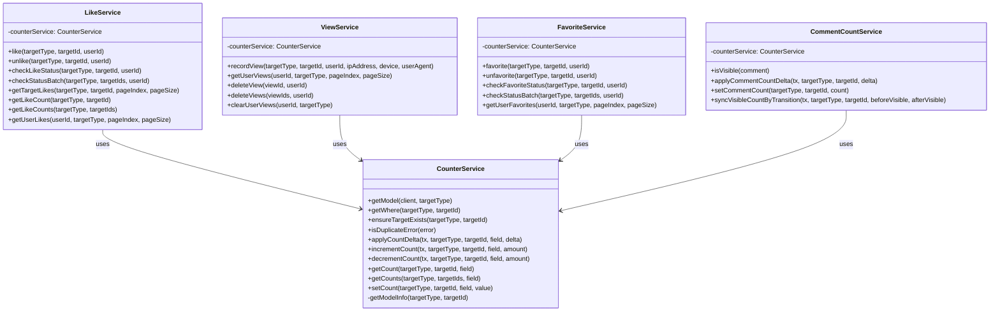
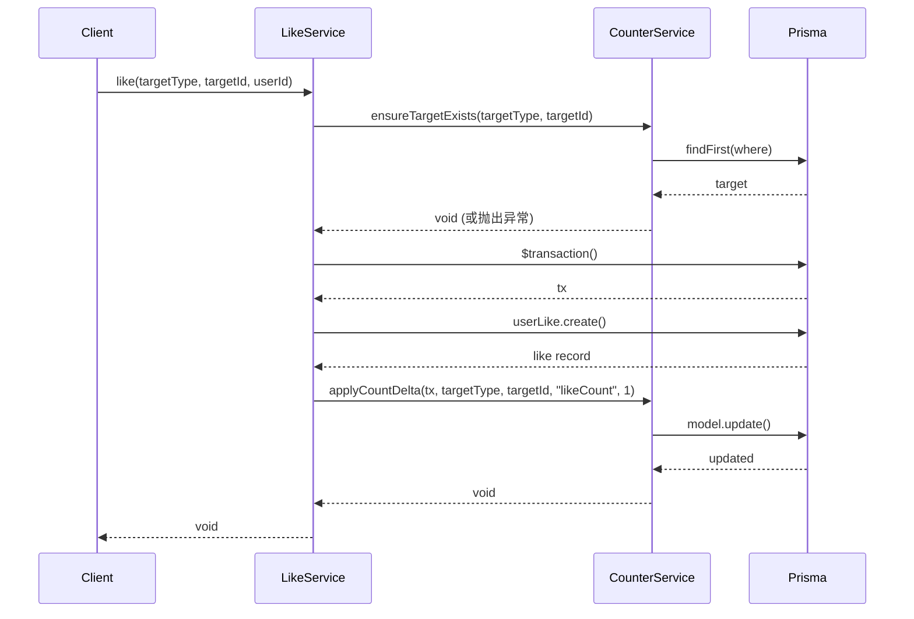
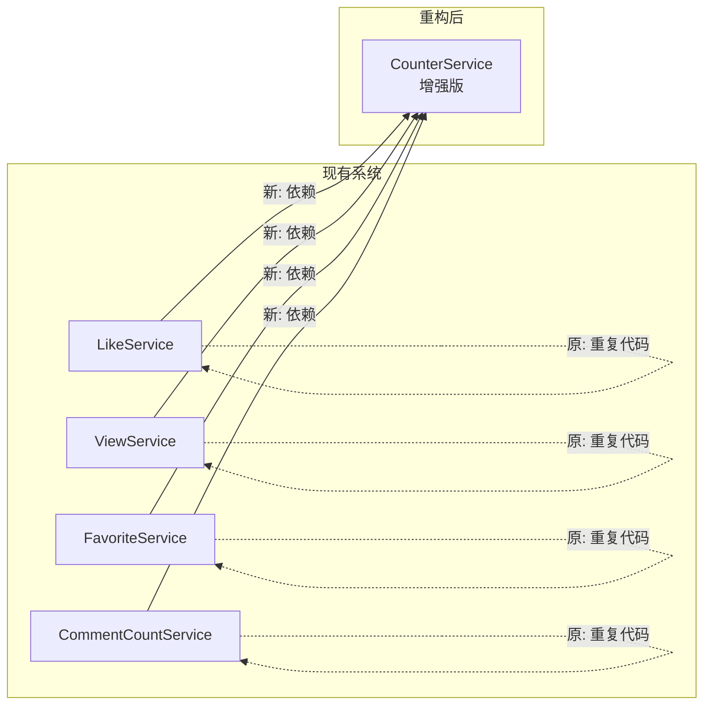

# 代码重构设计文档

## 整体架构图



## 分层设计

### 1. 基础层 - CounterService (增强)

位置: `libs/interaction/src/counter/counter.service.ts`

职责:
- 目标类型到 Prisma 模型的映射
- 目标存在性验证
- 通用计数更新
- 错误检测辅助

### 2. 业务层 - 各交互服务

位置: `libs/interaction/src/*/*.service.ts`

职责:
- 调用 CounterService 完成基础操作
- 实现业务特定逻辑
- 保持 API 接口不变

## 接口契约定义

### CounterService 新增接口

```typescript
interface ICounterService {
  /**
   * 根据目标类型获取 Prisma 模型
   * @param client - Prisma 客户端或事务对象
   * @param targetType - 目标类型枚举
   * @returns Prisma 模型对象
   */
  getModel(client: any, targetType: InteractionTargetTypeEnum): any

  /**
   * 根据目标类型获取查询条件
   * @param targetType - 目标类型枚举
   * @param targetId - 目标ID
   * @returns Prisma where 条件对象
   */
  getWhere(targetType: InteractionTargetTypeEnum, targetId: number): any

  /**
   * 确保目标存在，不存在则抛出 NotFoundException
   * @param targetType - 目标类型枚举
   * @param targetId - 目标ID
   * @throws NotFoundException 目标不存在时
   */
  ensureTargetExists(
    targetType: InteractionTargetTypeEnum,
    targetId: number,
  ): Promise<void>

  /**
   * 检测是否为 Prisma 重复键错误
   * @param error - 错误对象
   * @returns 是否为重复错误
   */
  isDuplicateError(error: unknown): boolean

  /**
   * 应用计数变化（支持增减）
   * @param tx - Prisma 事务对象
   * @param targetType - 目标类型枚举
   * @param targetId - 目标ID
   * @param field - 计数字段名
   * @param delta - 变化量（正数增加，负数减少）
   */
  applyCountDelta(
    tx: any,
    targetType: InteractionTargetTypeEnum,
    targetId: number,
    field: string,
    delta: number,
  ): Promise<void>
}
```

## 数据流向图



## 异常处理策略

1. **目标不存在**: `CounterService.ensureTargetExists()` 统一抛出 `NotFoundException`
2. **重复操作**: `CounterService.isDuplicateError()` 统一检测，业务层决定错误消息
3. **其他错误**: 保持原有处理逻辑

## 与现有系统的关系


