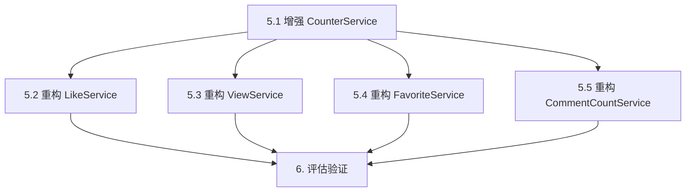

# 代码重构任务清单

## 任务依赖图

## 任务详情

### 任务 5.1: 增强 CounterService

**输入契约**:
- 前置依赖: 无
- 输入文件: `libs/interaction/src/counter/counter.service.ts`
- 环境依赖: NestJS, Prisma

**输出契约**:
- 交付物: 增强后的 `counter.service.ts`
- 新增方法:
  - `getModel(client, targetType)`
  - `getWhere(targetType, targetId)`
  - `ensureTargetExists(targetType, targetId)`
  - `isDuplicateError(error)`
  - `applyCountDelta(tx, targetType, targetId, field, delta)`
- 验收标准:
  - 所有新增方法有完整类型定义
  - 方法实现与原有重复代码逻辑一致
  - 通过编译检查

**实现约束**:
- 保持现有方法不变（向后兼容）
- 使用与原有代码相同的错误消息

---

### 任务 5.2: 重构 LikeService

**输入契约**:
- 前置依赖: 任务 5.1 完成
- 输入文件: `libs/interaction/src/like/like.service.ts`
- 环境依赖: CounterService

**输出契约**:
- 交付物: 重构后的 `like.service.ts`
- 删除方法:
  - `getTargetCountModel` → 使用 `counterService.getModel`
  - `getTargetCountWhere` → 使用 `counterService.getWhere`
  - `ensureTargetExists` → 使用 `counterService.ensureTargetExists`
  - `isDuplicateLikeError` → 使用 `counterService.isDuplicateError`
  - `applyLikeCountDelta` → 使用 `counterService.applyCountDelta`
- 验收标准:
  - 所有测试通过
  - API 行为与重构前一致
  - 代码行数减少

**实现约束**:
- 保持所有公共方法签名不变
- 保持错误消息不变

---

### 任务 5.3: 重构 ViewService

**输入契约**:
- 前置依赖: 任务 5.1 完成
- 输入文件: `libs/interaction/src/view/view.service.ts`
- 环境依赖: CounterService

**输出契约**:
- 交付物: 重构后的 `view.service.ts`
- 删除方法:
  - `getTargetModel` → 使用 `counterService.getModel`
  - `getTargetWhere` → 使用 `counterService.getWhere`
  - `isTargetValid` → 使用 `counterService.ensureTargetExists`（适配）
- 验收标准:
  - 所有测试通过
  - API 行为与重构前一致

---

### 任务 5.4: 重构 FavoriteService

**输入契约**:
- 前置依赖: 任务 5.1 完成
- 输入文件: `libs/interaction/src/favorite/favorite.service.ts`
- 环境依赖: CounterService

**输出契约**:
- 交付物: 重构后的 `favorite.service.ts`
- 删除方法:
  - `getTargetCountModel` → 使用 `counterService.getModel`
  - `getTargetCountWhere` → 使用 `counterService.getWhere`
  - `ensureTargetExists` → 使用 `counterService.ensureTargetExists`
  - `isDuplicateFavoriteError` → 使用 `counterService.isDuplicateError`
  - `applyFavoriteCountDelta` → 使用 `counterService.applyCountDelta`
- 验收标准:
  - 所有测试通过
  - API 行为与重构前一致

---

### 任务 5.5: 重构 CommentCountService

**输入契约**:
- 前置依赖: 任务 5.1 完成
- 输入文件: `libs/interaction/src/comment/comment-count.service.ts`
- 环境依赖: CounterService

**输出契约**:
- 交付物: 重构后的 `comment-count.service.ts`
- 删除方法:
  - `getTargetCountModel` → 使用 `counterService.getModel`
  - `applyCommentCountDelta` → 使用 `counterService.applyCountDelta`（适配）
- 验收标准:
  - 所有测试通过
  - API 行为与重构前一致

---

### 任务 6: 评估验证

**输入契约**:
- 前置依赖: 任务 5.2, 5.3, 5.4, 5.5 全部完成
- 输入: 所有重构后的服务文件

**输出契约**:
- 交付物: `ACCEPTANCE_code-refactor.md`
- 评估内容:
  - 代码行数统计对比
  - 重复代码消除情况
  - 功能验证结果
  - 测试通过率

**验收标准**:
- 交互模块代码行数减少 20% 以上
- 无重复的目标类型映射代码
- 所有现有功能正常
