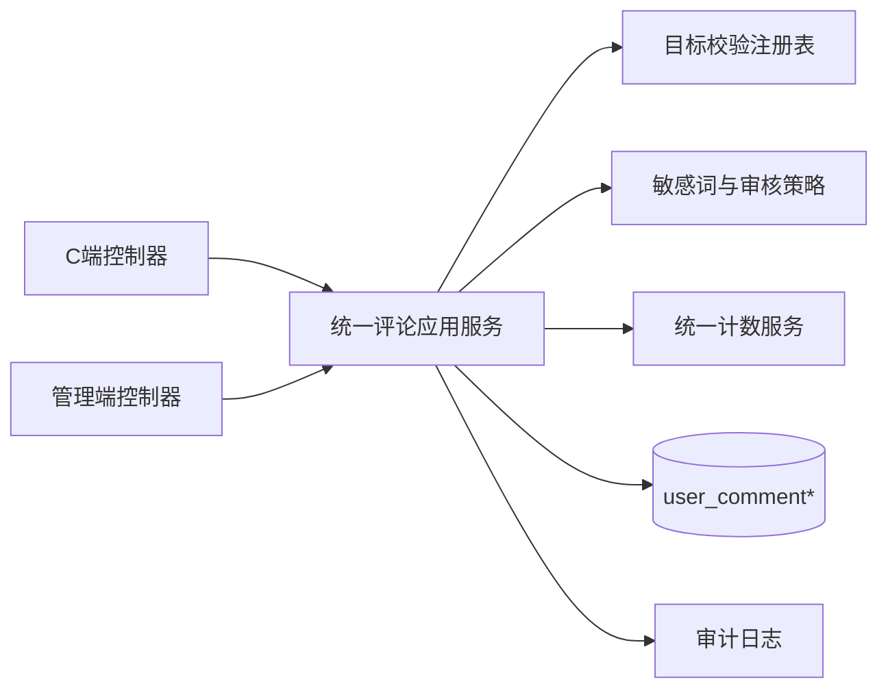
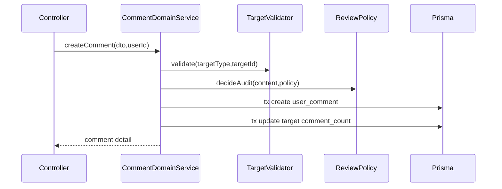

# 设计文档：评论模块统一重构

## 1. 整体架构

## 2. 分层设计

### 2.1 数据层（Prisma）
- 主表族：
  - `user_comment`
  - `user_comment_like`
  - `user_comment_report`
- 目标表：
  - `work`
  - `work_chapter`
  - `forum_topic`
- 旧表（待下线）：
  - `work_comment`
  - `work_comment_report`
  - `forum_reply`
  - `forum_reply_like`

### 2.2 领域服务层
- `CommentDomainService`（新增）
  - 负责评论创建/删除/可见性状态机/回复关系校验/楼层分配。
- `CommentModerationService`（新增）
  - 负责审核、隐藏、举报处理、批量治理。
- `CommentMigrationService`（新增，脚本或后台任务）
  - 负责全量迁移、增量迁移、对账、回滚。
- `CounterService`（扩展）
  - 支持按目标类型映射到正确的计数字段。

### 2.3 控制器层
- C 端：`app/work/comment`（统一入口）。
- 管理端：`admin/content/comment`（统一治理入口）。
- 兼容路由：
  - 保留旧路径短期代理到新服务，避免一次性破坏调用方。

## 3. 数据模型设计

### 3.1 字段与索引调整
- `work` 新增 `comment_count`（默认 0，索引）。
- `forum_topic` 新增 `comment_count`（默认 0，索引）。
- `user_comment` 增补或确认以下索引：
  - `(target_type, target_id, deleted_at, created_at)`
  - `(target_type, target_id, audit_status, is_hidden, deleted_at)`
  - `(actual_reply_to_id, deleted_at, created_at)`
- `user_comment_like` 保持 `(comment_id, user_id)` 唯一约束。

### 3.2 迁移映射规则
- `work_comment` -> `user_comment`
  - `workType/chapterId` 映射为 `targetType/targetId`。
- `forum_reply` -> `user_comment`
  - `topicId` 映射为 `targetType=FORUM_TOPIC, targetId=topicId`。
- 点赞映射：
  - `forum_reply_like` -> `user_comment_like`。
- 举报映射：
  - 回复举报统一入 `user_comment_report`。

## 4. 核心接口契约

### 4.1 C 端接口
- `POST /app/work/comment/create`
- `POST /app/work/comment/delete`
- `GET /app/work/comment/page`
- `GET /app/work/comment/replies`
- `POST /app/work/comment/like`
- `POST /app/work/comment/unlike`
- `POST /app/work/comment/report`

### 4.2 管理端接口
- `GET /admin/content/comment/page`
- `GET /admin/content/comment/detail`
- `POST /admin/content/comment/update-audit`
- `POST /admin/content/comment/update-hidden`
- `POST /admin/content/comment/delete`
- `GET /admin/content/comment/report/page`
- `POST /admin/content/comment/report/handle`
- `POST /admin/content/comment/recalc-count`

## 5. 关键流程设计

### 5.1 创建评论流程

### 5.2 审核/隐藏状态变更流程
- 变更前后计算可见性差异。
- 差异触发目标 `commentCount` 增减。
- 写入审计日志，记录操作人、原因、对象、前后状态。

## 6. 异常处理策略
- 统一业务异常语义：
  - 目标不存在
  - 回复目标不存在
  - 回复跨目标不合法
  - 评论不存在或无权限
  - 评论状态不可变更
- 不透出底层数据库错误细节，内部保留结构化日志。

## 7. 发布与切换策略

### 7.1 分阶段切换
1. Schema 变更与索引上线。
2. 全量迁移 + 对账。
3. 增量双写（旧+新）。
4. 读流量切新。
5. 写流量切新。
6. 下线旧表与旧服务引用。

### 7.2 回滚策略
- 任一阶段发现不一致可回滚到旧读写链路。
- 双写期保留回放脚本以补偿缺失数据。

## 8. 测试设计
- 单元测试：
  - 目标校验、回复关系、可见性状态机、计数更新。
- 集成测试：
  - 五类目标创建/查询/删除/审核全链路。
- 迁移测试：
  - 总量对账、抽样对账、边界数据（删除、隐藏、拒绝）。
- 回归测试：
  - 旧路径兼容、分页排序、举报处理。
