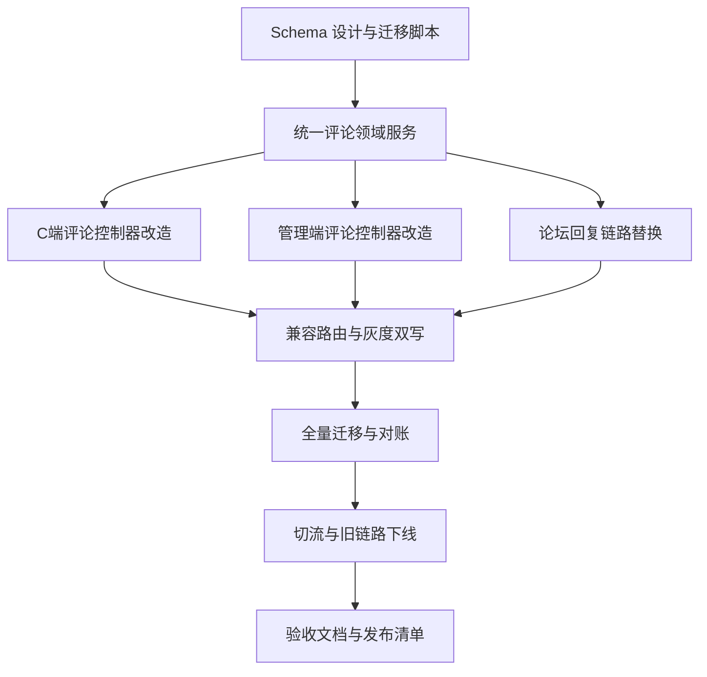

# 任务拆分文档：评论模块统一重构

## 1. 执行边界
- 本任务仅覆盖评论域统一重构，不扩展推荐算法与前端页面改造。
- 严格按“先数据、后服务、再控制器、最后迁移切换”执行。
- 每个阶段必须完成自测与对账后才能进入下一阶段。

## 2. 任务依赖图

## 3. 原子任务清单

## T1：完成评论域 Schema 与迁移脚本
- 输入契约：
  - 现有 `user_comment*`、`work_comment*`、`forum_reply*` 模型。
  - 已确认 `work/forum_topic` 需要新增 `commentCount`。
- 输出契约：
  - Prisma 模型更新完成。
  - 迁移脚本可在测试环境执行并通过。
- 实现约束：
  - 索引命名、字段命名、类型映射与现有规范一致。
  - 禁止破坏现有在线读写路径。
- 依赖关系：前置无；后置 T2。
- 验收标准：
  - Schema 校验通过，迁移可执行。
  - 新字段默认值与索引生效。

## T2：实现统一评论领域服务
- 输入契约：
  - `CommentService` 现有多目标基础能力。
  - `WorkCommentService`、`ForumReplyService` 现有治理能力。
- 输出契约：
  - 新统一评论服务覆盖创建、删除、查询、审核、隐藏、举报、点赞。
- 实现约束：
  - 复用 `TargetValidatorRegistry`。
  - 审核默认策略基于 `contentReviewPolicy`。
  - 计数更新统一走增强后的计数服务。
- 依赖关系：前置 T1；后置 T3/T4/T5。
- 验收标准：
  - 五类目标服务层能力完整可调用。
  - 单元测试覆盖关键状态流转。

## T3：改造 C 端评论控制器
- 输入契约：
  - app-api 现有控制器命名和路由风格。
  - 统一评论服务接口。
- 输出契约：
  - C 端评论接口统一可用（发评、删评、列表、回复、点赞、举报）。
- 实现约束：
  - DTO 校验、Swagger 文档、异常返回风格与现有一致。
- 依赖关系：前置 T2；后置 T6。
- 验收标准：
  - 五类目标在 C 端接口可完整走通。

## T4：改造管理端评论控制器
- 输入契约：
  - admin-api 现有审核与内容治理风格。
  - 统一评论服务接口。
- 输出契约：
  - 管理端统一评论治理接口可用。
- 实现约束：
  - 保留必要兼容别名路由，降低切换成本。
  - 审计装饰器与操作日志字段保持规范。
- 依赖关系：前置 T2；后置 T6。
- 验收标准：
  - 审核、隐藏、删除、举报处理、分页查询全部可用。

## T5：替换论坛回复服务依赖
- 输入契约：
  - `ForumReplyService`、`ForumReplyLikeService`、`ForumReportService`、`ForumNotificationService` 现有依赖关系。
- 输出契约：
  - 论坛帖子评论统一走评论域，不再依赖 `forum_reply` 为主链路。
- 实现约束：
  - 保持论坛通知、举报、搜索、计数可用。
  - 逐步替换，避免一次性大爆炸改动。
- 依赖关系：前置 T2；后置 T6。
- 验收标准：
  - 论坛帖子评论核心流程在新链路可用。

## T6：落地兼容路由与灰度双写
- 输入契约：
  - 新旧控制器与服务并存状态。
- 输出契约：
  - 旧入口可透明转发或双写到新链路。
- 实现约束：
  - 双写期间必须有一致性校验日志。
  - 提供开关控制读写切换。
- 依赖关系：前置 T3/T4/T5；后置 T7。
- 验收标准：
  - 线上灰度阶段业务可用，无阻塞故障。

## T7：执行全量迁移与对账
- 输入契约：
  - 迁移脚本、双写日志、数据基线。
- 输出契约：
  - 历史评论数据全部迁入统一评论域。
  - 输出对账报告。
- 实现约束：
  - 对账维度需包含总量、目标量、可见量、点赞量、举报量。
- 依赖关系：前置 T6；后置 T8。
- 验收标准：
  - 对账误差为 0。
  - 抽样数据内容与关系一致。

## T8：切流并下线旧链路
- 输入契约：
  - 对账通过报告。
- 输出契约：
  - 读写全部切至统一评论链路。
  - 旧评论表与旧服务移出主路径。
- 实现约束：
  - 先切读后切写，保留回滚预案。
- 依赖关系：前置 T7；后置 T9。
- 验收标准：
  - 新链路稳定运行，无严重回归问题。

## T9：完成交付与验收文档
- 输入契约：
  - 全部开发与验证结果。
- 输出契约：
  - `ACCEPTANCE`、`FINAL`、`TODO` 交付文档。
- 实现约束：
  - 文档与代码行为一致，包含回滚和观测建议。
- 依赖关系：前置 T8。
- 验收标准：
  - 可直接用于评审、上线、运维交接。

## 4. 统一验收清单
- 五类目标评论全链路能力可用。
- C 端与管理端接口均已切到统一评论服务。
- 迁移后对账通过且可回滚。
- 旧链路移出主路径且无遗留写入。
- 关键日志与监控具备可追踪性。

## 5. 本轮执行记录
- 已完成：T1、T2、T3、T4。
- 进行中：T5。
- 未开始：T6、T7、T8、T9。
