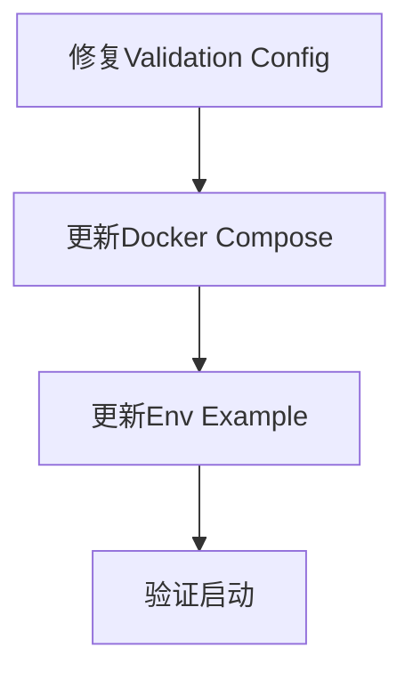

# 配置修复任务清单

## 任务依赖图

## 任务详情

### 1. 修复 Validation Config
- **文件**: `libs/base/src/config/validation.config.ts`
- **内容**: 将 `.required()` 修改为带默认值的配置，默认值需与 `*.config.ts` 中的逻辑保持一致。
    - DB: `DB_PAGINATION_PAGE_SIZE` (15), `DB_MAX_QUERY_LIST_LIMIT` (500), `DB_PAGINATION_PAGE_INDEX` (0)
    - Redis: `REDIS_NAMESPACE` ('ES')
    - JWT: `4h`, `7d`, `es` 等
    - Upload: `./uploads`, `100MB`

### 2. 更新 Docker Compose
- **文件**: `docker-compose.yml`
- **内容**:
    - 在 `admin-server` 服务中添加 `environment` 映射，优先读取 `ADMIN_*` 变量。
    - 在 `app-server` 服务中添加 `environment` 映射，优先读取 `APP_*` 变量。

### 3. 更新 Env Example
- **文件**: `.env.example`
- **内容**:
    - 添加 `ADMIN_` 和 `APP_` 前缀的变量示例。
    - 保留通用配置说明。

### 4. 验证
- 提示用户更新本地 `.env`。
- (AI) 检查修改后的代码语法正确性。
