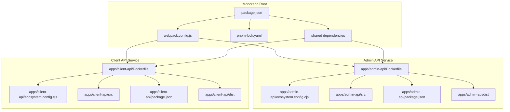
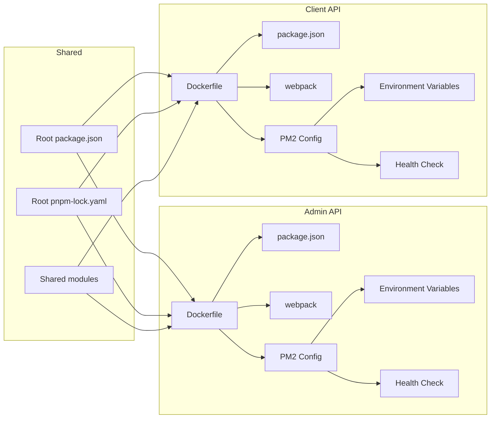
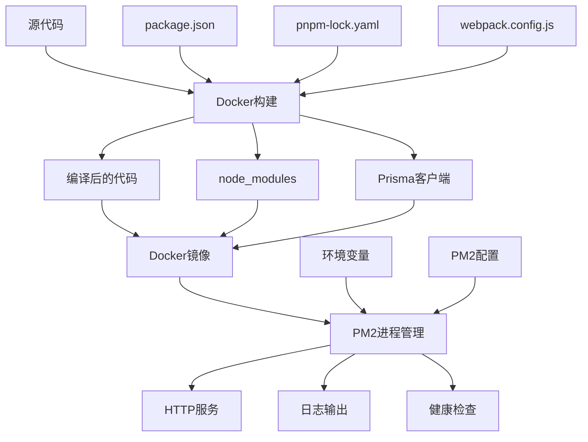

# Dockerfile和PM2配置文件拆分 - DESIGN文档
## 整体架构图



## 分层设计

### 1. 构建层（Builder Stage）
- **目标**：编译TypeScript代码，安装依赖
- **输入**：源代码、package.json、pnpm-lock.yaml
- **输出**：编译后的JavaScript、node_modules、Prisma客户端
- **优化**：使用BuildKit缓存、pnpm缓存、分层复制

### 2. 运行层（Runtime Stage）
- **目标**：运行编译后的应用
- **输入**：编译产物、生产依赖、配置文件
- **输出**：运行中的应用服务
- **安全**：非root用户、最小权限、安全配置

### 3. 进程管理层（PM2）
- **目标**：管理Node.js进程
- **功能**：进程监控、自动重启、日志管理、集群模式
- **配置**：独立的环境变量、日志轮转、健康检查

## 核心组件

### Dockerfile组件
1. **基础镜像**：`node:22-alpine`
2. **包管理器**：`pnpm@9.15.4`
3. **构建工具**：`webpack`
4. **进程管理**：`pm2@latest`
5. **系统工具**：`wget`（健康检查）

### PM2配置组件
1. **应用配置**：名称、脚本路径、实例数
2. **环境配置**：NODE_ENV、PORT、日志路径
3. **日志配置**：输出文件、错误文件、日志轮转
4. **健康检查**：HTTP端点、检查间隔

## 模块依赖关系图



## 接口契约定义

### Dockerfile接口
```yaml
inputs:
  - source_code: 服务源代码
  - package_json: 服务package.json
  - pnpm_lock: 根目录pnpm-lock.yaml
  - webpack_config: 根目录webpack.config.js

outputs:
  - docker_image: 包含服务的Docker镜像
  - build_cache: 构建缓存数据

environment:
  - NODE_ENV: 环境类型（production/development）
  - PORT: 服务端口
  - BUILD_ARGS: 构建参数
```

### PM2配置接口
```yaml
inputs:
  - app_name: 应用名称
  - script_path: 启动脚本路径
  - env_vars: 环境变量

outputs:
  - process_config: PM2进程配置
  - log_config: 日志配置
  - health_config: 健康检查配置

environment:
  - PM2_INSTANCES: 实例数量
  - PM2_EXEC_MODE: 执行模式（fork/cluster）
  - LOG_PATH: 日志路径
```

## 数据流向图



## 异常处理策略

### 构建时异常
1. **依赖安装失败**：检查pnpm-lock.yaml和package.json
2. **编译失败**：检查TypeScript配置和源代码
3. **缓存失效**：清理缓存重新构建

### 运行时异常
1. **端口冲突**：检查端口配置和防火墙设置
2. **权限问题**：检查用户权限和文件权限
3. **依赖缺失**：检查node_modules和Prisma客户端
4. **PM2启动失败**：检查配置文件和日志

### 健康检查异常
1. **端点无响应**：检查应用状态和端口配置
2. **数据库连接失败**：检查数据库配置和连接
3. **内存溢出**：检查内存限制和垃圾回收

## 设计原则验证

### 严格按照任务范围，避免过度设计
- ✅ 只拆分配置文件，不修改应用逻辑
- ✅ 保持现有的构建和部署流程
- ✅ 不引入新的技术栈

### 确保与现有系统架构一致
- ✅ 保持monorepo结构
- ✅ 保持webpack构建
- ✅ 保持PM2进程管理
- ✅ 保持Docker部署

### 复用现有组件和模式
- ✅ 复用现有的Dockerfile模式
- ✅ 复用现有的PM2配置模式
- ✅ 复用现有的安全配置
- ✅ 复用现有的缓存策略

## 质量门控

### 架构图清晰准确
- ✅ 明确展示了两个服务的独立配置
- ✅ 清晰表达了依赖关系
- ✅ 准确反映了数据流向

### 接口定义完整
- ✅ Dockerfile接口定义完整
- ✅ PM2配置接口定义完整
- ✅ 环境变量接口定义完整

### 与现有系统无冲突
- ✅ 不破坏现有的monorepo结构
- ✅ 不影响现有的构建流程
- ✅ 不改变现有的部署方式

### 设计可行性验证
- ✅ 基于现有的技术栈
- ✅ 符合Docker最佳实践
- ✅ 符合PM2配置规范
- ✅ 支持独立部署需求
