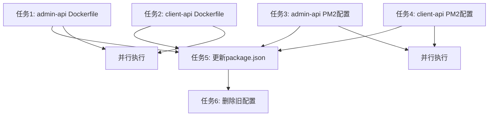

# Dockerfile和PM2配置文件拆分 - TASK文档
## 子任务拆分

### 任务1：创建admin-api的Dockerfile
**输入契约**：
- 前置依赖：根目录Dockerfile作为参考
- 输入数据：admin-api源代码结构、package.json
- 环境依赖：Node.js 22、pnpm、PM2

**输出契约**：
- 输出数据：`apps/admin-api/Dockerfile`
- 交付物：可独立构建的Dockerfile
- 验收标准：支持admin-api独立构建和运行

**实现约束**：
- 技术栈：Docker、Node.js、pnpm
- 接口规范：保持与现有Dockerfile相同的接口
- 质量要求：支持缓存优化、安全性、最小化镜像

**依赖关系**：
- 后置任务：admin-api PM2配置、构建脚本更新
- 并行任务：client-api Dockerfile创建

### 任务2：创建client-api的Dockerfile
**输入契约**：
- 前置依赖：根目录Dockerfile作为参考
- 输入数据：client-api源代码结构、package.json
- 环境依赖：Node.js 22、pnpm、PM2

**输出契约**：
- 输出数据：`apps/client-api/Dockerfile`
- 交付物：可独立构建的Dockerfile
- 验收标准：支持client-api独立构建和运行

**实现约束**：
- 技术栈：Docker、Node.js、pnpm
- 接口规范：保持与现有Dockerfile相同的接口
- 质量要求：支持缓存优化、安全性、最小化镜像

**依赖关系**：
- 后置任务：client-api PM2配置、构建脚本更新
- 并行任务：admin-api Dockerfile创建

### 任务3：创建admin-api的PM2配置文件
**输入契约**：
- 前置依赖：根目录ecosystem.config.cjs作为参考
- 输入数据：admin-api服务配置需求
- 环境依赖：PM2、Node.js环境变量

**输出契约**：
- 输出数据：`apps/admin-api/ecosystem.config.cjs`
- 交付物：admin-api专用的PM2配置
- 验收标准：支持admin-api独立进程管理

**实现约束**：
- 技术栈：PM2、CommonJS
- 接口规范：保持与现有PM2配置相同的接口
- 质量要求：支持日志轮转、健康检查、环境变量

**依赖关系**：
- 后置任务：构建脚本更新
- 并行任务：client-api PM2配置创建

### 任务4：创建client-api的PM2配置文件
**输入契约**：
- 前置依赖：根目录ecosystem.config.cjs作为参考
- 输入数据：client-api服务配置需求
- 环境依赖：PM2、Node.js环境变量

**输出契约**：
- 输出数据：`apps/client-api/ecosystem.config.cjs`
- 交付物：client-api专用的PM2配置
- 验收标准：支持client-api独立进程管理

**实现约束**：
- 技术栈：PM2、CommonJS
- 接口规范：保持与现有PM2配置相同的接口
- 质量要求：支持日志轮转、健康检查、环境变量

**依赖关系**：
- 后置任务：构建脚本更新
- 并行任务：admin-api PM2配置创建

### 任务5：更新根目录package.json脚本
**输入契约**：
- 前置依赖：新的Dockerfile和PM2配置文件
- 输入数据：现有package.json脚本配置
- 环境依赖：pnpm、Docker、PM2

**输出契约**：
- 输出数据：更新后的根目录`package.json`
- 交付物：支持独立服务构建和部署的脚本
- 验收标准：可以独立构建和部署两个服务

**实现约束**：
- 技术栈：JSON、Shell脚本
- 接口规范：保持现有脚本的兼容性
- 质量要求：脚本清晰、可维护、向后兼容

**依赖关系**：
- 前置任务：所有Dockerfile和PM2配置创建完成
- 后置任务：删除旧配置文件

### 任务6：删除根目录旧配置文件
**输入契约**：
- 前置依赖：新的配置文件已创建并测试
- 输入数据：根目录Dockerfile和ecosystem.config.cjs
- 环境依赖：确认新配置正常工作

**输出契约**：
- 输出数据：删除根目录旧配置文件
- 交付物：清理后的项目结构
- 验收标准：根目录不再有冗余的配置文件

**实现约束**：
- 技术栈：文件系统操作
- 接口规范：确保删除前新配置已验证
- 质量要求：安全删除，不影响现有功能

**依赖关系**：
- 前置任务：所有新配置创建和测试完成

## 任务依赖图

## 拆分原则验证

### 复杂度可控，便于 AI 高成功率交付
- ✅ 每个任务都是单一职责
- ✅ 任务间依赖关系清晰
- ✅ 技术栈相对简单明确
- ✅ 有明确的参考实现

### 按功能模块分解，确保任务原子性和独立性
- ✅ 每个Dockerfile创建是独立任务
- ✅ 每个PM2配置创建是独立任务
- ✅ 脚本更新是独立任务
- ✅ 文件删除是独立任务

### 有明确的验收标准，尽量可以独立编译和测试
- ✅ 每个Dockerfile可以独立测试构建
- ✅ 每个PM2配置可以独立验证
- ✅ 脚本更新可以独立验证
- ✅ 文件删除可以独立确认

### 依赖关系清晰
- ✅ Dockerfile创建可以并行执行
- ✅ PM2配置创建可以并行执行
- ✅ 脚本更新需要等待所有配置创建完成
- ✅ 文件删除需要等待所有验证完成

## 质量门控

### 任务覆盖完整需求
- ✅ 包含所有必要的配置文件创建
- ✅ 包含脚本更新和清理工作
- ✅ 覆盖admin-api和client-api两个服务
- ✅ 包含构建、运行、部署全流程

### 依赖关系无循环
- ✅ 依赖关系是单向的
- ✅ 没有循环依赖
- ✅ 并行任务明确
- ✅ 执行顺序合理

### 每个任务都可独立验证
- ✅ Dockerfile可以独立构建测试
- ✅ PM2配置可以独立验证
- ✅ 脚本可以独立运行测试
- ✅ 文件删除可以独立确认

### 复杂度评估合理
- ✅ 每个任务都是单一技术栈
- ✅ 有明确的参考实现
- ✅ 不需要复杂的设计决策
- ✅ 可以在合理时间内完成
