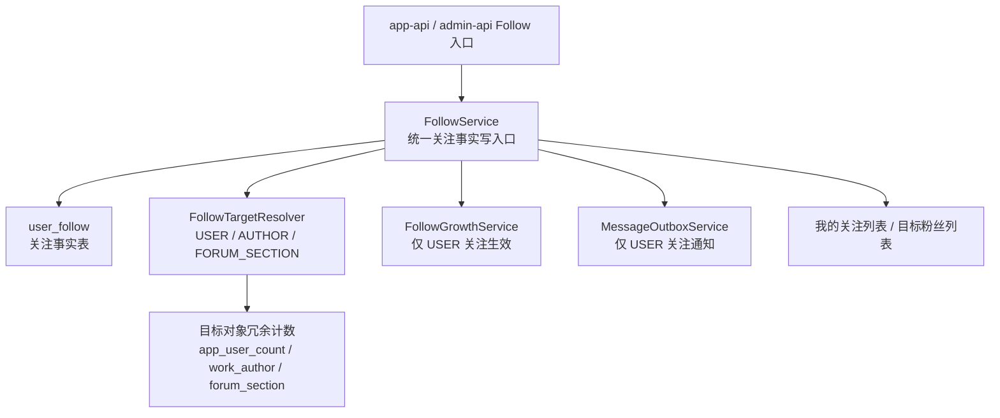

# Follow System Design



## 设计目标

本方案以“后续还会支持关注论坛板块、作者、用户，且未来可能继续扩展更多关注目标”为前提，设计一套可持续扩展的关注系统。

本方案目标：

- 不复用现有 `favorite` 语义，避免“关注”和“收藏”混用。
- 复用现有 interaction 模块的组织方式，降低接入成本。
- 支持多目标类型关注：`USER`、`AUTHOR`、`FORUM_SECTION`。
- 统一承载关注事实、关注状态、我的关注列表、目标粉丝数。
- 明确支持用户侧“我的关注列表”和“关注我的用户列表”。
- 在“关注我的用户列表”中直接返回“我是否已关注对方”的判断结果，前端可直接据此展示“回关 / 互关”按钮。
- 保持通知、成长、计数字段的边界清晰，不把所有 follow 行为硬塞进同一业务副作用。
- 允许后续继续扩展 `TAG`、`WORK`、`GROUP` 等 follow 目标，而不需要推翻基础模型。

## 当前现状审计

### 已有能力

- `libs/interaction` 已经形成了 `like`、`favorite`、`browse-log`、`comment` 等平行子模块模式。
- `db/schema/app/user-favorite.ts`、`db/schema/app/user-like.ts` 都采用“事实表 + targetType + targetId + userId + createdAt”的通用建模方式。
- `work_author.followersCount` 已存在，说明“目标对象维护粉丝数冗余字段”在仓库里是可接受模式。
- `MessageNotificationTypeEnum.USER_FOLLOW` 已存在。
- `GrowthRuleTypeEnum.FOLLOW_USER`、`GrowthRuleTypeEnum.BE_FOLLOWED` 已存在。

### 缺失能力

- 目前没有 `user_follow` 事实表。
- 目前没有 `follow` interaction 子模块。
- `forum_section` 没有 `followersCount`。
- `app_user_count` 没有 `followingCount`、`followersCount`。
- app-api 只有“当前用户中心”接口，没有标准的“公开用户详情 / 公开作者详情”能力。

### 关键判断

- 不能直接复用 `FavoriteService`。
  原因是它会更新 `favoriteCount`、触发收藏成长奖励、复用“我的收藏”列表语义，这和 follow 的业务语义不一致。
- 不建议为每个目标各建一张 follow 表。
  因为后续会有作者、用户、板块多个目标，单表 `user_follow` 更适合做统一事实层。
- 也不建议把 follow 强行塞进现有 `InteractionTargetTypeEnum` 共用逻辑。
  当前共享 interaction target 更偏向点赞、收藏、浏览、评论、举报等“内容交互”；follow 的通知、成长、计数边界明显不同，单独模块更清晰。

## 推荐总方案

### 核心结论

新增一套与 `favorite`、`like` 平行的通用 `follow` 子模块：

- 事实表：`user_follow`
- 模块：`libs/interaction/src/follow/*`
- 目标类型：`USER`、`AUTHOR`、`FORUM_SECTION`
- 扩展方式：resolver 注册式
- 统一入口：`FollowService`

### interaction 根目录公共文件约束

本方案补充一个明确约束：

- follow 模块不依赖 `libs/interaction/src` 根目录下现有那几份公共文件
- 尤其不使用：
  - `interaction-target-access.service.ts`
  - `interaction-target-growth-rule.ts`
  - `interaction-target-resolver.service.ts`
  - `interaction-target.definition.ts`

这条约束的原因是：

- follow 语义和现有内容交互目标解析并不完全一致
- 如果继续复用这些根级公共文件，follow 会再次被拉回“interaction 通用目标模型”
- 后续用户关注、作者关注、板块关注的边界会重新混乱

因此 follow 采用的策略是：

- 只复用 interaction 目录下成熟的模块组织方式
- 不复用 interaction 根目录的通用 target / growth / tx 公共文件
- follow 自己维护本模块需要的最小类型与 helper

补充约束：

- follow 新增代码禁止继续引入 `InteractionTx`
- follow 统一直接使用 `@db/core` 导出的共享事务类型
- 仓库内存量 `InteractionTx` 使用点已统一收敛到 `@db/core` 的 `Db`
- `libs/interaction/src/interaction-tx.type.ts` 已删除

### 为什么推荐通用 Follow 模块

相比“论坛板块一个表、作者一个表、用户一个表”的拆法，通用 Follow 模块有几个明显优势：

- 关注状态查询可以统一为一套接口和一套 service。
- “我的关注列表”天然是跨目标聚合的，单表更适合。
- 用户中心的 `followingCount` 只需要维护一条链路。
- 后续新增关注标签、关注专题，不需要再造一套 service/controller/dto。
- 与当前 `like` / `favorite` 的仓库组织习惯一致，团队更容易接手。

## 领域边界

### Follow 与 Favorite 的区别

两者都属于“用户对目标建立关系”的行为，但语义边界不同：

- `favorite`：更偏内容收藏，强调“我稍后回看 / 我喜欢这个内容”。
- `follow`：更偏订阅关系，强调“我持续关注这个主体后续动态”。

因此 Follow 不应继承 Favorite 的以下副作用：

- 不写入 `favoriteCount`
- 不复用“我的收藏”接口
- 不默认使用收藏成长规则
- 不默认发送内容收藏通知

### Follow 目标的业务差异

| 目标 | 是否有被关注者用户 | 是否需要通知 | 是否需要成长奖励 | 是否需要目标粉丝数 |
| --- | --- | --- | --- | --- |
| `USER` | 有 | 是 | 是 | 是 |
| `AUTHOR` | 默认无 | 否 | 否 | 是 |
| `FORUM_SECTION` | 无 | 否 | 否 | 是 |

这里最关键的点是：

- 作者目前是内容实体，不是 app user，本仓库没有 `author.userId`。
- 板块也不是用户拥有实体。
- 所以只有 `USER` follow 会产生“被关注者通知”和“被关注奖励”。

## 数据模型设计

### 1. 新增事实表 `user_follow`

建议位置：

- `db/schema/app/user-follow.ts`

建议字段：

| 字段 | 类型 | 说明 |
| --- | --- | --- |
| `id` | `integer pk identity` | 主键 |
| `targetType` | `smallint not null` | 关注目标类型 |
| `targetId` | `integer not null` | 目标 ID |
| `userId` | `integer not null` | 发起关注的用户 ID |
| `createdAt` | `timestamp not null default now()` | 创建时间 |

建议约束与索引：

- 唯一约束：`(targetType, targetId, userId)`
- 索引：`(targetType, targetId)`
- 索引：`(userId, createdAt desc)`
- 索引：`(targetType, targetId, createdAt desc)`

### 2. 新增目标类型枚举 `FollowTargetTypeEnum`

建议值：

```ts
export enum FollowTargetTypeEnum {
  USER = 1,
  AUTHOR = 2,
  FORUM_SECTION = 3,
}
```

说明：

- 不复用 `FavoriteTargetTypeEnum`
- 不强制与 `InteractionTargetTypeEnum` 共值
- follow 使用自己的 target enum，与 like/favorite 的做法一致

### 3. 目标对象冗余计数字段

#### `forum_section`

新增：

- `followersCount: integer().default(0).notNull()`

原因：

- 板块列表 / 详情是高频读接口
- 后续会展示“关注人数”并可能排序
- 与现有 `topicCount`、`replyCount` 模式一致

#### `work_author`

已有：

- `followersCount`

本方案只补维护链路，不重复改字段设计。

#### `app_user_count`

建议新增：

- `followingCount`
- `followersCount`

定义：

- `followingCount`：用户主动发起的全部关注总数，跨目标类型汇总
- `followersCount`：用户被其他用户关注的总数，仅统计 `targetType = USER`

不建议第一版就新增以下拆分字段：

- `followingUserCount`
- `followingAuthorCount`
- `followingForumSectionCount`

原因：

- 当前产品需求还未明确要按类型展示拆分数量
- 一开始就分拆会增加写路径和回填复杂度
- 需要时可以由 `user_follow` 事实表补做，或者二期再冗余

## 模块结构设计

### 1. `libs/interaction/src/follow`

建议目录：

```text
libs/interaction/src/follow/
  dto/
    follow.dto.ts
  interfaces/
    follow-target-resolver.interface.ts
  follow.constant.ts
  follow.type.ts
  follow.module.ts
  follow.service.ts
  follow-growth.service.ts
  index.ts
```

### 2. `FollowService`

职责：

- 注册 follow target resolver
- follow / unfollow
- 单个与批量关注状态查询
- 我的关注分页
- 目标粉丝分页
- 统一触发 follow 成长与通知

建议核心方法：

- `registerResolver(resolver)`
- `follow(input)`
- `unfollow(input)`
- `checkFollowStatus(input)`
- `checkStatusBatch(targetType, targetIds, userId)`
- `getUserFollows(query)`
- `getTargetFollowers(query)`

### 3. `IFollowTargetResolver`

建议接口职责：

```ts
interface IFollowTargetResolver {
  readonly targetType: FollowTargetTypeEnum

  ensureExists: (
    tx: Db,
    targetId: number,
    actorUserId: number,
  ) => Promise<{ ownerUserId?: number }>

  applyCountDelta: (
    tx: Db,
    targetId: number,
    delta: number,
  ) => Promise<void>

  batchGetDetails?: (targetIds: number[]) => Promise<Map<number, unknown>>

  postFollowHook?: (
    tx: Db,
    targetId: number,
    actorUserId: number,
    options: { ownerUserId?: number },
  ) => Promise<void>
}
```

说明：

- `ownerUserId` 只对 `USER` 目标天然有效。
- `AUTHOR`、`FORUM_SECTION` 可以返回空对象。
- 这样 FollowService 不需要知道各目标的通知/成长差异，resolver 自己表达上下文即可。
- `Db` 统一从 `@db/core` 引入
- follow 不再单独定义 `FollowTx`
- 不引用 `libs/interaction/src/interaction-tx.type.ts`

### 4. `FollowGrowthService`

建议完全独立于 `interaction-target-growth-rule.ts`，不要硬塞现有映射。

原因：

- 当前共享增长映射是给 `like`、`favorite`、`view`、`report` 用的。
- follow 的奖励规则只对 `USER` 关注成立。
- `AUTHOR` 和 `FORUM_SECTION` follow 目前没有增长规则。
- follow 不应再反向依赖 interaction 根目录公共增长映射。

建议行为：

- `USER` follow 成功：
  - 对关注者发 `FOLLOW_USER`
  - 对被关注者发 `BE_FOLLOWED`
- 其他 targetType：
  - 不发成长奖励

### 5. 通知策略

建议复用现有：

- `MessageNotificationTypeEnum.USER_FOLLOW`
- `MessageNotificationSubjectTypeEnum.USER`

通知只在 `targetType = USER` 且 `actorUserId !== targetUserId` 时发送。

`AUTHOR` / `FORUM_SECTION` 不发送通知，原因：

- 没有稳定的接收用户
- 当前消息模型主体枚举也没有作者 / 板块主体的必要表达

## 计数维护设计

### 1. 统一原则

- 关注事实写入与冗余计数更新必须在同一事务内完成
- 所有目标侧粉丝数更新都走集中 service，不散落在 resolver 里直接写表
- 用户关注数与粉丝数写入统一收口到 `AppUserCountService`

### 1.1 计数 helper 与计数 service 的关系

仓库里已经有通用计数扩展 `applyCountDelta`，这类 helper 应该复用，但不建议直接在业务代码里到处调用 `drizzle.ext.applyCountDelta` 来替代计数 service。

本方案在这里的最终定稿是：

- 统一保留计数 service
- 统一由计数 service 内部复用 helper
- 不在 resolver / 业务 service 中直接散落调用根级计数扩展

原因有两个：

- 当前 `drizzle.ext` 是绑定在根 `db` 上创建的，不携带调用链里的 `tx`，直接调用 `drizzle.ext.applyCountDelta` 不适合关注这种必须和事实表写入同事务提交的路径。
- follow 写路径不只是“目标表某个字段 +1/-1”，还会联动 `app_user_count`、通知、成长、批量状态查询等业务语义，直接散落调用 helper 会让责任边界变乱。

因此本方案统一采用的落地方式是：

- `AppUserCountService` 保持不变，继续作为 `app_user_count` 的唯一写入口。
- `ForumCounterService`、`AuthorCounterService` 这类领域计数 service 继续保留。
- 在这些 service 的内部，优先复用 `applyCountDelta(tx, table, where, field, delta)` 这类 helper，减少重复 SQL。

换句话说：

- helper 负责“怎么安全地改一个计数字段”
- service 负责“这次业务到底要改哪些计数、为什么改、和哪些副作用一起改”

### 2. 推荐新增计数入口

#### `AppUserCountService`

统一保留，并新增：

- `updateFollowingCount(tx, userId, delta)`
- `updateFollowersCount(tx, userId, delta)`

#### `ForumCounterService`

统一保留，并新增：

- `updateSectionFollowersCount(tx, sectionId, delta)`

实现建议：

- service 内部优先复用通用计数 helper
- 不建议在 resolver 里直接写裸 SQL，也不建议直接调用根级 `drizzle.ext.applyCountDelta`

#### 作者计数入口

统一新增一个轻量作者计数 service，而不是直接在 resolver 里更新作者表：

- `libs/content/src/author/author-counter.service.ts`
- 方法：`updateAuthorFollowersCount(tx, authorId, delta)`

原因：

- 作者已经有 `workCount`、`followersCount` 等典型计数字段
- 后续如果再加作者作品数回填、榜单逻辑，集中 service 更稳

### 3. Follow 写路径矩阵

| 行为 | 事实表 | 目标计数 | 用户计数 | 通知 | 成长 |
| --- | --- | --- | --- | --- | --- |
| 关注用户 | `user_follow +1` | 被关注用户 `followersCount +1` | 关注者 `followingCount +1` | 是 | 是 |
| 取消关注用户 | `user_follow -1` | 被关注用户 `followersCount -1` | 关注者 `followingCount -1` | 否 | 否 |
| 关注作者 | `user_follow +1` | 作者 `followersCount +1` | 关注者 `followingCount +1` | 否 | 否 |
| 取消关注作者 | `user_follow -1` | 作者 `followersCount -1` | 关注者 `followingCount -1` | 否 | 否 |
| 关注板块 | `user_follow +1` | 板块 `followersCount +1` | 关注者 `followingCount +1` | 否 | 否 |
| 取消关注板块 | `user_follow -1` | 板块 `followersCount -1` | 关注者 `followingCount -1` | 否 | 否 |

## 目标接入设计

### A. Forum Section Follow

#### resolver

新增：

- `libs/forum/src/section/resolver/forum-section-follow.resolver.ts`

职责：

- 校验板块存在、启用、未删除
- 可选复用 `ForumPermissionService`，确保用户可访问板块后才允许关注
- 更新 `forum_section.followersCount`
- 批量返回板块简要信息

#### app-api 接口影响

建议新增：

- `POST /api/app/follow/follow`
- `POST /api/app/follow/cancel`
- `GET /api/app/follow/status`
- `GET /api/app/follow/my/page`

并在板块列表 / 详情 DTO 中增加：

- `followersCount`
- `isFollowed`

说明：

- 当前论坛板块公开列表 / 详情已经是成熟入口，把关注态直接挂到现有接口上，前端接入成本最低。

#### 管理端影响

建议同步把 `followersCount` 加入论坛板块 admin DTO，便于后台查看。

### B. Author Follow

#### resolver

新增：

- `libs/interaction/src/follow/resolver/author-follow.resolver.ts`

说明：

- 实现时落在 `follow` 模块内部，避免内容域模块反向依赖 `follow` 造成循环装配

职责：

- 校验作者存在、启用、未删除
- 更新 `work_author.followersCount`
- 返回作者简要信息

#### 特殊说明

当前作者不是 app user，所以：

- 不发“被关注通知”
- 不发“被关注奖励”
- 不更新 `app_user_count.followersCount`

#### app-api 读路径建议

作者关注能力正式上线前，至少需要满足以下之一：

1. 有独立作者详情 / 列表 API
2. 作品详情中的作者 brief 支持 `isFollowed`
3. “我的关注”列表能返回可直接渲染的作者卡片信息

建议把第 2 项作为最小落地点，第 1 项作为二期增强。

### C. User Follow

#### resolver

新增：

- `libs/interaction/src/follow/resolver/user-follow.resolver.ts`

说明：

- 实现时优先落在 `follow` 模块内部，避免 `UserModule <-> FollowModule` 的循环依赖

职责：

- 校验被关注用户存在、可见、未删除
- 禁止自己关注自己
- 更新被关注用户 `followersCount`
- 返回用户简要信息
- 发送 `USER_FOLLOW` 通知
- 触发 `FOLLOW_USER / BE_FOLLOWED` 成长规则

#### app-api 读路径建议

用户 follow 业务完整落地时，建议同时提供：

- 我的关注列表
- 我的粉丝列表
- 用户卡片上的 `isFollowed`
- 粉丝列表中的“我是否已关注对方”

这里需要明确一个实现判断：

- “我关注的用户列表” = `user_follow.user_id = currentUserId and target_type = USER`
- “关注我的用户列表” = `user_follow.target_type = USER and target_id = currentUserId`
- “是否互关”不需要单独建表，本质上是两条单向 follow 记录同时存在

也就是说，针对当前用户场景：

- A 在“我的粉丝列表”里看到 B
- 只要再判断 A 是否也关注了 B
- 就可以得到：
  - `isFollowing = true/false`
  - `isMutualFollow = true/false`

其中：

- `isFollowing` 表示“当前登录用户是否已经关注该列表项用户”
- 在“我的粉丝列表”语境下，`isMutualFollow` 可以由 `isFollowing` 直接推导

因此后端应该直接返回这个布尔值，不建议让前端再额外请求一次关注状态。

当前仓库只有“当前用户中心”，没有“公开用户详情”标准接口。
因此用户 follow 的完整产品化落地，需要补一个可复用的“公开用户 brief/detail”输出模型。

## API 方案

### 推荐 app-api Controller

建议新增：

- `apps/app-api/src/modules/follow/follow.controller.ts`

标签建议：

- `关注`

推荐路由：

| 方法 | 路径 | 说明 |
| --- | --- | --- |
| `POST` | `app/follow/follow` | 关注目标 |
| `POST` | `app/follow/cancel` | 取消关注 |
| `GET` | `app/follow/status` | 查询关注状态 |
| `GET` | `app/follow/my/page` | 当前用户关注分页 |
| `GET` | `app/follow/my/following/page` | 当前用户关注的用户分页 |
| `GET` | `app/follow/my/follower/page` | 关注当前用户的用户分页 |

说明：

- `my/page` 保留给通用“我的关注列表”，支持跨目标类型
- `my/following/page` 是用户关注专用列表，便于前端做“我的关注的人”
- `my/follower/page` 是用户粉丝专用列表，便于前端做“关注我的人”
- 不建议拆成 `user-follow`、`author-follow`、`section-follow` 三个 controller，避免扩展时路由风格碎裂

### DTO 设计

#### libs 基础 DTO

新增：

- `BaseFollowDto`

字段：

- `id`
- `userId`
- `targetType`
- `targetId`
- `createdAt`

#### app-api DTO

建议：

- `FollowTargetDto`
- `FollowPageQueryDto`
- `FollowStatusResponseDto`
- `FollowPageItemDto`
- `MyFollowingUserPageQueryDto`
- `MyFollowingUserItemDto`
- `MyFollowerUserPageQueryDto`
- `MyFollowerUserItemDto`

`FollowPageItemDto.targetDetail` 采用和 favorite 类似的多态简要信息结构，但字段定义要覆盖：

- 用户：`nickname`、`avatarUrl`
- 作者：`name`、`avatar`
- 板块：`name`、`icon`

针对用户专用分页，建议单独定义用户列表项 DTO，而不是继续复用通用多态 DTO。

#### `MyFollowingUserItemDto`

建议字段：

- `targetUserId`
- `nickname`
- `avatarUrl`
- `signature`
- `followedAt`

说明：

- 列表语义是“我关注的人”
- 不需要再返回 `isFollowing`，因为该列表语义恒为 true

#### `MyFollowerUserItemDto`

建议字段：

- `userId`
- `nickname`
- `avatarUrl`
- `signature`
- `followedAt`
- `isFollowing`
- `isMutualFollow`

字段语义：

- `followedAt`：对方关注我的时间
- `isFollowing`：我当前是否已经关注对方
- `isMutualFollow`：是否互关

说明：

- `isMutualFollow` 在“我的粉丝列表”里本质上等价于 `isFollowing`
- 但单独返回该字段，对前端文案与按钮态更直接
- 前端可以按以下逻辑渲染：
  - `isMutualFollow = true` -> 展示“互关”
  - `isMutualFollow = false` -> 展示“回关”按钮

## 用户中心与读模型方案

### 1. `app_user_count`

建议新增字段：

- `followingCount`
- `followersCount`

对应 DTO：

- `BaseAppUserCountDto`
- `apps/app-api/src/modules/user/dto/user.dto.ts` 的 `UserCountDto`
- admin 侧 app-user DTO

用户语义定义：

- `followingCount`：我关注了多少对象，默认统计全部 targetType
- `followersCount`：有多少用户关注了我，仅统计 `targetType = USER`

这套口径与“我的关注列表 / 关注我的用户列表”可以天然对齐。

### 2. `UserStatus`

建议在用户状态摘要里增加：

- `canFollow`

原因：

- follow 本质上也是用户互动能力
- 当前状态摘要已有 `canLike`、`canFavorite`
- 对外口径保持一致更好

### 3. `UserAssetsService`

不建议把 follow 计数塞进 `UserAssetsService`。

原因：

- 资产统计更偏购买、下载、收藏、点赞、浏览、评论
- follow 更接近社交图谱与聚合读模型
- follow count 应优先挂在 `app_user_count` / 目标对象计数，而不是资产统计

## 权限与可见性规则

### Follow 前校验

统一要求：

- 发起关注用户必须存在且可互动
- 目标必须存在且未删除
- 目标若存在“可见性 / 是否启用 / 是否可访问”限制，则 follow 前必须校验

目标差异：

- `FORUM_SECTION`：应复用论坛板块访问权限判断
- `AUTHOR`：按作者启用状态判断
- `USER`：按用户存在和软删判断

### 已关注目标失效后的展示规则

推荐第一版策略：

- 关系不主动删除
- “我的关注列表”过滤掉不可见 / 不可访问目标
- 管理端或离线脚本可后续清理无效 follow

原因：

- 与当前软删除模型更一致
- 目标恢复后无需回填 follow 关系
- 对用户体验更稳，不做激进数据删改

## 回填与重建策略

### 为什么需要重建能力

`user_follow` 是事实表，`followersCount` / `followingCount` 是读模型。
只要存在冗余计数，就必须具备重建手段。

### 建议重建范围

- 单用户 `followingCount`
- 单用户 `followersCount`
- 单作者 `followersCount`
- 单板块 `followersCount`
- 全量重建脚本

### 当前落地形式

- `AppUserCountService.rebuildFollowCounts(userId)`
- `WorkAuthorService.rebuildAuthorFollowersCount(authorId)`
- `ForumCounterService.rebuildSectionFollowersCount(sectionId)`
- `scripts/rebuild-follow-counts.ts`

## 分阶段实施建议

### Phase 1：基础设施

目标：

- 新增 `user_follow`
- 新增 `libs/interaction/src/follow`
- 新增 `FollowService` / `FollowGrowthService`
- 新增 `FollowTargetTypeEnum`
- 新增 `BaseFollowDto`
- 新增 app-api follow controller

本阶段不直接给所有业务场景接 UI，只先把基础设施打通。

### Phase 2：论坛板块关注

目标：

- `forum_section.followersCount`
- `ForumSectionFollowResolver`
- 板块列表 / 详情增加 `followersCount`、`isFollowed`
- `我的关注` 支持板块卡片

原因：

- 板块关注最容易形成直接收益
- 板块本身已有成熟详情 / 列表接口
- 不依赖通知和复杂社交图谱

### Phase 3：作者关注

目标：

- 接入 `AuthorFollowResolver`
- 维护作者 `followersCount`
- 在作品详情作者信息或作者详情页暴露 `isFollowed`

原因：

- 作者已有 `followersCount` 字段，改造成本中等
- 不涉及被关注用户通知

### Phase 4：用户关注

目标：

- 接入 `UserFollowResolver`
- 打通通知和成长奖励
- `app_user_count` 加 `followingCount`、`followersCount`
- 用户中心和用户卡片支持 follow 状态与统计
- 支持粉丝 / 关注分页列表

原因：

- 用户 follow 是社交能力，牵涉通知、成长、列表、隐私边界
- 复杂度最高，放最后最稳

## 风险与注意事项

### 1. 作者不是用户

这是整个 follow 设计里最容易被误用的一点。

作者 follow 默认不能：

- 发被关注通知
- 发被关注成长奖励
- 复用用户粉丝列表

除非后续明确建立 `author -> appUser` 绑定关系。

### 2. 用户中心计数口径要先固定

`followingCount` 是统计全部 follow，还是只统计 follow 用户，需要尽早统一。

本方案推荐：

- `followingCount` = 全部 follow 总数
- `followersCount` = 被用户 follow 的总数

这样最稳定，也最适合先期落地。

如果产品后续明确要求“我的关注人数”只统计用户，不含作者和板块，则可以二期新增拆分字段：

- `followingUserCount`
- `followingAuthorCount`
- `followingForumSectionCount`

当前版本先不建议引入。

### 3. Follow 列表是多态列表

一旦 `my/page` 允许跨目标类型，前端渲染必须按 `targetType` 分支处理。

因此 DTO 设计不能只按“用户简要信息”去想，必须从一开始就考虑作者和板块卡片。

但用户 follow 是高频独立场景，建议额外提供用户专用分页接口，而不是让前端总从多态 `my/page` 中再筛一遍。

### 4. 粉丝列表中的“回关”判断必须由后端直接返回

这是当前用户需求里的关键点。

推荐实现：

- 先查询“关注我的用户列表”
- 再批量查询“我是否关注了这些用户”
- 在返回结构中补齐 `isFollowing`
- 同步返回 `isMutualFollow`

不建议前端对每个粉丝项单独调用一次 `status` 接口，否则会形成明显的 N+1 请求。

### 5. 不要把 follow 强塞进 favorite

短期看像是省事，长期会造成：

- 收藏数口径污染
- 用户中心 `favoriteCount` 失真
- “我的收藏”接口混入板块/作者
- 收藏成长规则误发

## 规范与现状的冲突说明

当前仓库已有：

- `USER_FOLLOW` 通知类型
- `FOLLOW_USER` / `BE_FOLLOWED` 成长规则

但缺失：

- follow 事实表
- follow service
- follow controller

这属于“领域信号已预留、基础设施未落地”的状态。
本方案的目标就是把这部分补齐，并且避免继续把 follow 语义扩散到 favorite 模块中。

## 建议最终落地顺序

1. 先做通用 `follow` 基础设施
2. 优先接论坛板块关注
3. 再接作者关注
4. 最后接用户关注与社交图谱能力

这个顺序的优点是：

- 先把最通用、最难改的基础层定型
- 先落最容易验证价值的板块关注
- 最后再接通知和成长最复杂的用户关注

## 最终结论

推荐方案不是“给论坛板块单独补一个关注表”，而是：

- 新建通用 `user_follow` 事实表
- 新建平行于 `favorite` 的 `follow` interaction 子模块
- 用 resolver 模式接入 `USER`、`AUTHOR`、`FORUM_SECTION`
- 只让 `USER` follow 触发通知和成长
- 在目标对象上维护 `followersCount`
- 在 `app_user_count` 上维护 `followingCount`、`followersCount`

这样做可以同时满足：

- 当前论坛板块关注落地
- 后续作者关注扩展
- 再后续用户关注与社交能力演进

而且不会把收藏语义、计数口径和成长规则一起污染掉。
