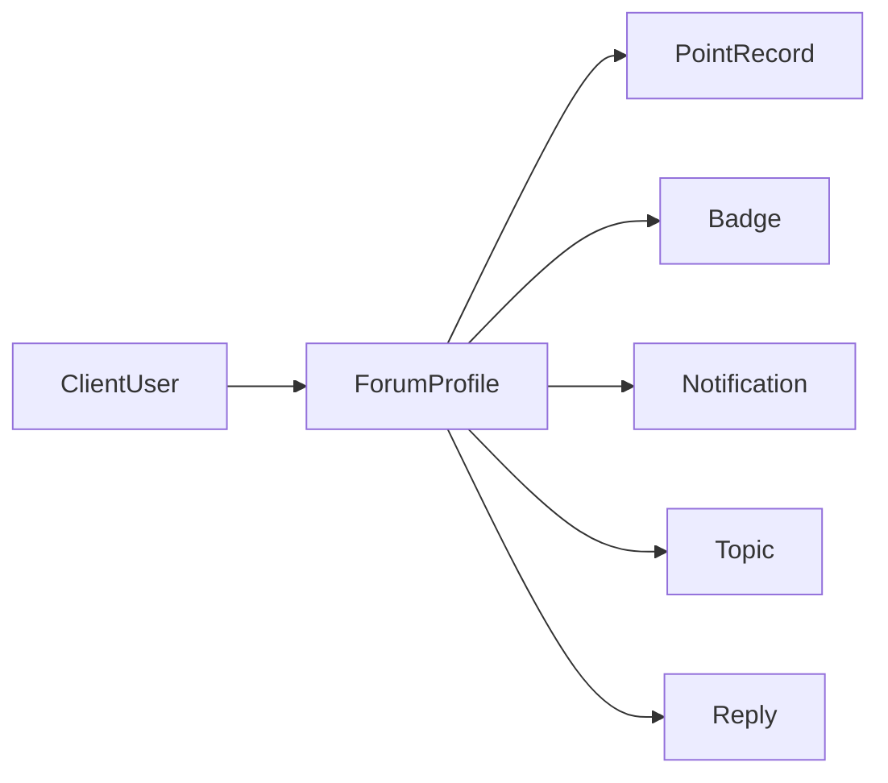
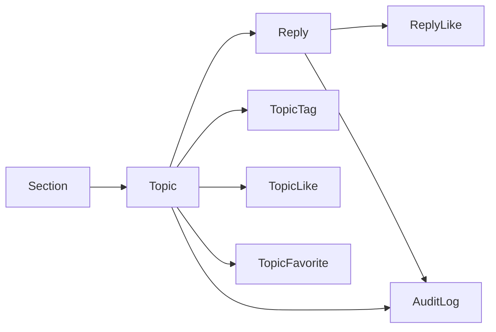
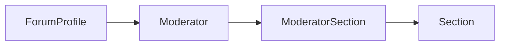
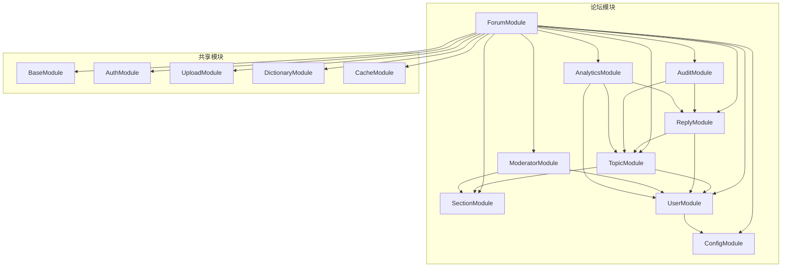
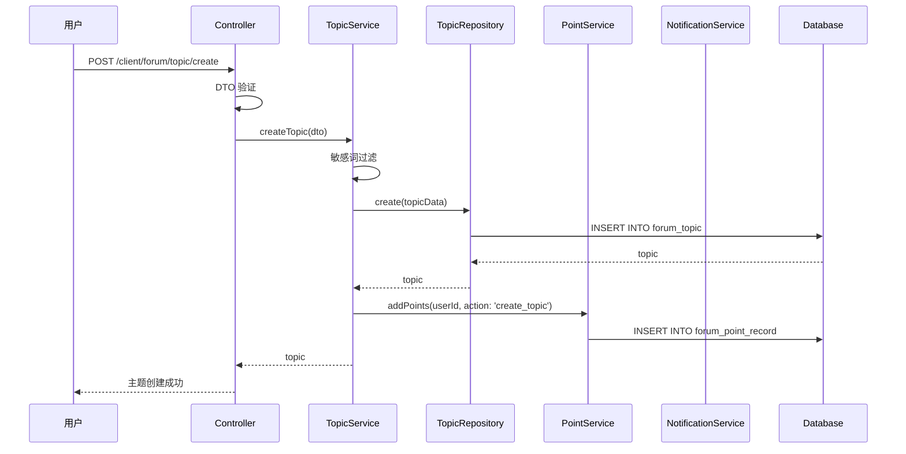
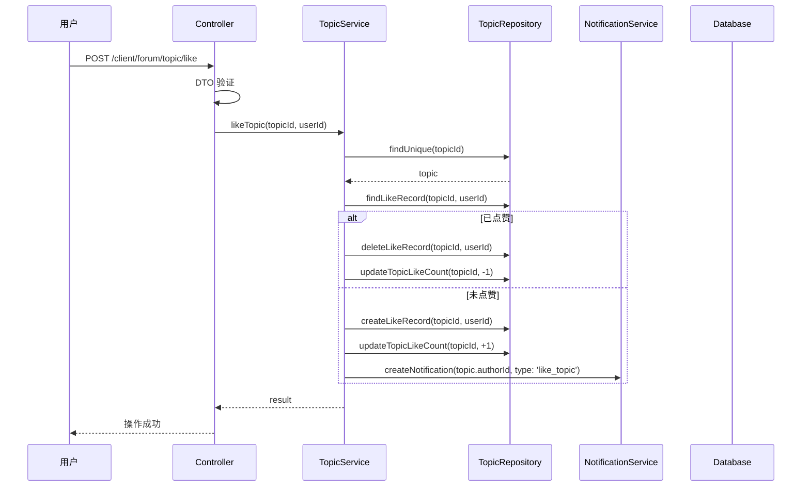
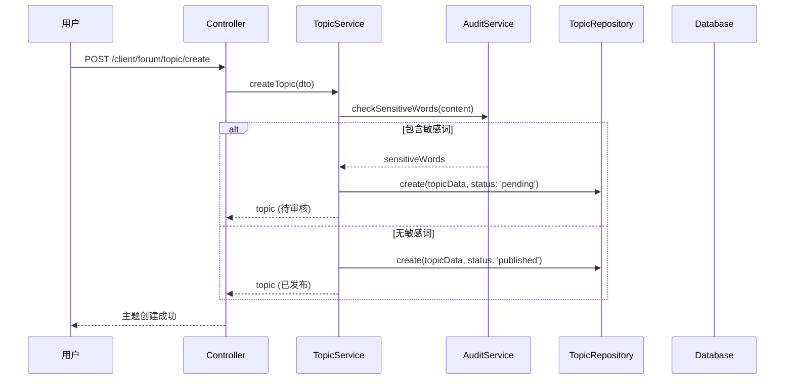
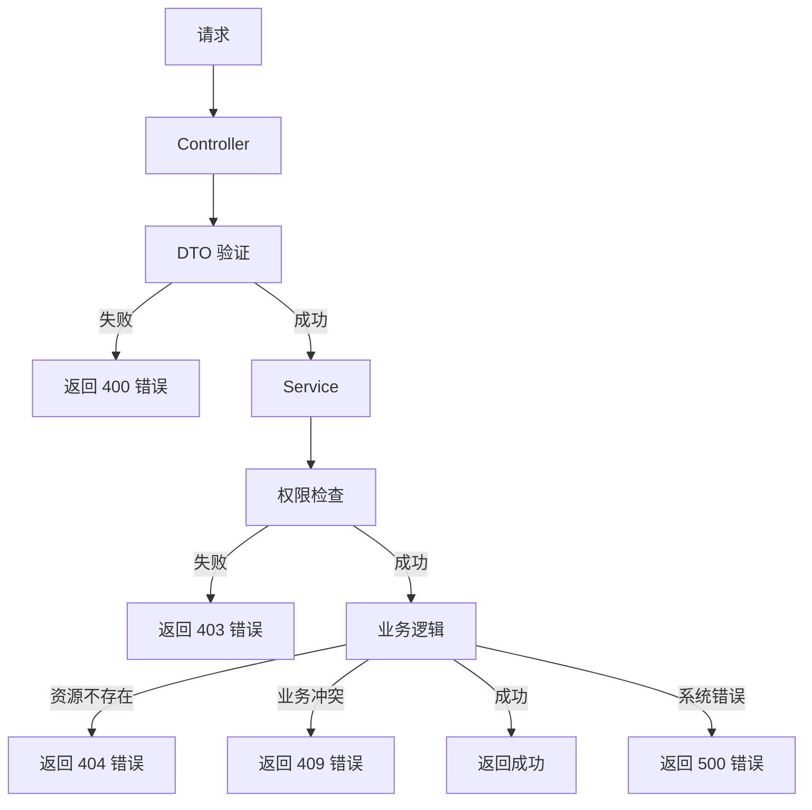

# 论坛系统接入 - 架构设计文档

## 1. 整体架构图

```mermaid
graph TB
    subgraph "客户端层"
        Client[客户端应用]
        Admin[管理后台]
    end

    subgraph "API 网关层"
        ClientAPI[Client API<br/>/client/forum/*]
        AdminAPI[Admin API<br/>/admin/forum/*]
    end

    subgraph "控制器层"
        ForumController[Forum Controller]
        SectionController[Section Controller]
        TopicController[Topic Controller]
        ReplyController[Reply Controller]
        UserController[User Controller]
        ModeratorController[Moderator Controller]
        AuditController[Audit Controller]
        ConfigController[Config Controller]
        AnalyticsController[Analytics Controller]
    end

    subgraph "服务层"
        ForumService[Forum Service]
        SectionService[Section Service]
        TopicService[Topic Service]
        ReplyService[Reply Service]
        UserService[User Service]
        ModeratorService[Moderator Service]
        AuditService[Audit Service]
        ConfigService[Config Service]
        AnalyticsService[Analytics Service]
        PointService[Point Service]
        NotificationService[Notification Service]
        SearchService[Search Service]
    end

    subgraph "数据访问层"
        ForumRepository[Forum Repository]
        SectionRepository[Section Repository]
        TopicRepository[Topic Repository]
        ReplyRepository[Reply Repository]
        UserRepository[User Repository]
        ModeratorRepository[Moderator Repository]
        AuditRepository[Audit Repository]
        ConfigRepository[Config Repository]
        PointRepository[Point Repository]
        NotificationRepository[Notification Repository]
    end

    subgraph "数据层"
        PostgreSQL[(PostgreSQL)]
        Redis[(Redis)]
    end

    subgraph "外部服务"
        UploadService[上传服务]
        DictionaryService[数据字典]
    end

    Client --> ClientAPI
    Admin --> AdminAPI

    ClientAPI --> ForumController
    ClientAPI --> SectionController
    ClientAPI --> TopicController
    ClientAPI --> ReplyController
    ClientAPI --> UserController

    AdminAPI --> SectionController
    AdminAPI --> TopicController
    AdminAPI --> ReplyController
    AdminAPI --> UserController
    AdminAPI --> ModeratorController
    AdminAPI --> AuditController
    AdminAPI --> ConfigController
    AdminAPI --> AnalyticsController

    ForumController --> ForumService
    SectionController --> SectionService
    TopicController --> TopicService
    ReplyController --> ReplyService
    UserController --> UserService
    ModeratorController --> ModeratorService
    AuditController --> AuditService
    ConfigController --> ConfigService
    AnalyticsController --> AnalyticsService

    ForumService --> ForumRepository
    SectionService --> SectionRepository
    TopicService --> TopicRepository
    ReplyService --> ReplyRepository
    UserService --> UserRepository
    ModeratorService --> ModeratorRepository
    AuditService --> AuditRepository
    ConfigService --> ConfigRepository
    AnalyticsService --> AnalyticsRepository

    ForumService --> PointService
    ForumService --> NotificationService
    ForumService --> SearchService

    ForumRepository --> PostgreSQL
    SectionRepository --> PostgreSQL
    TopicRepository --> PostgreSQL
    ReplyRepository --> PostgreSQL
    UserRepository --> PostgreSQL
    ModeratorRepository --> PostgreSQL
    AuditRepository --> PostgreSQL
    ConfigRepository --> PostgreSQL
    PointRepository --> PostgreSQL
    NotificationRepository --> PostgreSQL

    ForumService --> Redis
    TopicService --> Redis
    SectionService --> Redis

    ForumService --> UploadService
    ForumService --> DictionaryService
```



## 2. 分层设计

### 2.1 控制器层 (Controller Layer)

**职责:**
- 接收 HTTP 请求
- 参数验证 (DTO)
- 调用服务层处理业务逻辑
- 返回响应结果

**模块划分:**

| 模块 | 控制器 | 路由前缀 |
|------|--------|----------|
| 板块管理 | SectionController | `/admin/forum/section`<br/>`/client/forum/section` |
| 主题管理 | TopicController | `/admin/forum/topic`<br/>`/client/forum/topic` |
| 回复管理 | ReplyController | `/admin/forum/reply`<br/>`/client/forum/reply` |
| 用户管理 | UserController | `/admin/forum/user`<br/>`/client/forum/user` |
| 版主管理 | ModeratorController | `/admin/forum/moderator` |
| 内容审核 | AuditController | `/admin/forum/audit` |
| 系统配置 | ConfigController | `/admin/forum/config` |
| 数据分析 | AnalyticsController | `/admin/forum/analytics` |

### 2.2 服务层 (Service Layer)

**职责:**
- 实现业务逻辑
- 调用数据访问层
- 处理事务
- 缓存管理
- 权限验证

**核心服务:**

| 服务 | 职责 |
|------|------|
| SectionService | 板块 CRUD、排序、启用/禁用 |
| TopicService | 主题 CRUD、置顶、加精、锁定、移动 |
| ReplyService | 回复 CRUD、楼中楼 |
| UserService | 用户资料、积分、等级、徽章 |
| ModeratorService | 版主管理、权限分配 |
| AuditService | 敏感词管理、内容审核 |
| ConfigService | 积分规则、等级规则、徽章配置 |
| AnalyticsService | 数据统计、活跃度分析 |
| PointService | 积分获取、积分消费、积分记录 |
| NotificationService | 通知创建、通知查询、通知标记 |
| SearchService | 主题搜索、回复搜索、筛选 |

### 2.3 数据访问层 (Repository Layer)

**职责:**
- 数据库 CRUD 操作
- 复杂查询
- 事务管理

**继承关系:**
- 所有 Repository 继承 `RepositoryService`
- 复用通用方法 (findPagination, softDelete 等)

## 3. 核心组件

### 3.1 用户体系组件



**组件说明:**
- **ClientUser**: 现有用户表，存储基础用户信息
- **ForumProfile**: 论坛用户资料，存储论坛特定信息 (积分、等级、徽章等)
- **PointRecord**: 积分记录表，记录积分变动
- **Badge**: 徽章表，定义徽章类型
- **Notification**: 通知表，存储用户通知

### 3.2 内容管理组件



**组件说明:**
- **Section**: 板块表，存储板块信息
- **Topic**: 主题表，存储主题信息
- **Reply**: 回复表，存储回复信息
- **TopicTag**: 主题-标签关联表
- **TopicLike**: 主题点赞表
- **TopicFavorite**: 主题收藏表
- **ReplyLike**: 回复点赞表
- **AuditLog**: 审核日志表

### 3.3 权限管理组件



**组件说明:**
- **ForumProfile**: 论坛用户资料
- **Moderator**: 版主表，存储版主信息
- **ModeratorSection**: 版主-板块关联表，定义版主管理的板块
- **Section**: 板块表

## 4. 模块依赖关系图



## 5. 接口契约定义

### 5.1 板块管理接口

#### 管理后台

| 方法 | 路径 | 描述 | 权限 |
|------|------|------|------|
| POST | `/admin/forum/section/create` | 创建板块 | 管理员 |
| POST | `/admin/forum/section/update` | 更新板块 | 管理员 |
| POST | `/admin/forum/section/delete` | 删除板块 | 管理员 |
| POST | `/admin/forum/section/sort` | 板块排序 | 管理员 |
| POST | `/admin/forum/section/enable` | 启用/禁用板块 | 管理员 |
| GET | `/admin/forum/section/detail` | 查看板块详情 | 管理员 |
| GET | `/admin/forum/section/page` | 分页查询板块列表 | 管理员 |

#### 客户端

| 方法 | 路径 | 描述 | 权限 |
|------|------|------|------|
| GET | `/client/forum/section/list` | 查看板块列表 | 公开 |
| GET | `/client/forum/section/detail` | 查看板块详情 | 公开 |
| GET | `/client/forum/section/topic/page` | 查看板块下的主题列表 | 公开 |

### 5.2 主题管理接口

#### 管理后台

| 方法 | 路径 | 描述 | 权限 |
|------|------|------|------|
| GET | `/admin/forum/topic/page` | 分页查询主题列表 | 管理员 |
| GET | `/admin/forum/topic/detail` | 查看主题详情 | 管理员 |
| POST | `/admin/forum/topic/batch/delete` | 批量删除主题 | 管理员 |
| POST | `/admin/forum/topic/batch/pin` | 批量置顶/取消置顶 | 管理员 |
| POST | `/admin/forum/topic/batch/feature` | 批量加精/取消加精 | 管理员 |
| POST | `/admin/forum/topic/batch/lock` | 批量锁定/解锁 | 管理员 |
| POST | `/admin/forum/topic/batch/move` | 批量移动到其他板块 | 管理员 |

#### 客户端

| 方法 | 路径 | 描述 | 权限 |
|------|------|------|------|
| POST | `/client/forum/topic/create` | 创建主题 | 登录用户 |
| POST | `/client/forum/topic/update` | 编辑主题 | 作者本人 |
| POST | `/client/forum/topic/delete` | 删除主题 | 作者本人 |
| GET | `/client/forum/topic/detail` | 查看主题详情 | 公开 |
| POST | `/client/forum/topic/like` | 点赞/取消点赞主题 | 登录用户 |
| POST | `/client/forum/topic/favorite` | 收藏/取消收藏主题 | 登录用户 |
| POST | `/client/forum/topic/share` | 分享主题 | 登录用户 |

### 5.3 回复管理接口

#### 管理后台

| 方法 | 路径 | 描述 | 权限 |
|------|------|------|------|
| GET | `/admin/forum/reply/page` | 分页查询回复列表 | 管理员 |
| GET | `/admin/forum/reply/detail` | 查看回复详情 | 管理员 |
| POST | `/admin/forum/reply/batch/delete` | 批量删除回复 | 管理员 |

#### 客户端

| 方法 | 路径 | 描述 | 权限 |
|------|------|------|------|
| POST | `/client/forum/reply/create` | 发布回复 | 登录用户 |
| POST | `/client/forum/reply/update` | 编辑回复 | 作者本人 |
| POST | `/client/forum/reply/delete` | 删除回复 | 作者本人 |
| POST | `/client/forum/reply/like` | 点赞/取消点赞回复 | 登录用户 |

### 5.4 用户管理接口

#### 管理后台

| 方法 | 路径 | 描述 | 权限 |
|------|------|------|------|
| GET | `/admin/forum/user/profile` | 查看用户论坛资料 | 管理员 |
| POST | `/admin/forum/user/points/update` | 修改用户积分 | 管理员 |
| POST | `/admin/forum/user/level/update` | 修改用户等级 | 管理员 |
| POST | `/admin/forum/user/badge/grant` | 授予/撤销徽章 | 管理员 |
| GET | `/admin/forum/user/points/log` | 查看用户积分记录 | 管理员 |
| GET | `/admin/forum/user/action/log` | 查看用户行为日志 | 管理员 |

#### 客户端

| 方法 | 路径 | 描述 | 权限 |
|------|------|------|------|
| GET | `/client/forum/user/my/topics` | 查看我的主题 | 登录用户 |
| GET | `/client/forum/user/my/replies` | 查看我的回复 | 登录用户 |
| GET | `/client/forum/user/my/favorites` | 查看我的收藏 | 登录用户 |
| GET | `/client/forum/user/my/points` | 查看我的积分 | 登录用户 |
| GET | `/client/forum/user/my/level` | 查看我的等级 | 登录用户 |
| GET | `/client/forum/user/my/badges` | 查看我的徽章 | 登录用户 |
| GET | `/client/forum/user/my/points/log` | 查看积分记录 | 登录用户 |
| GET | `/client/forum/user/notification/page` | 查看通知列表 | 登录用户 |
| POST | `/client/forum/user/notification/read` | 标记通知已读 | 登录用户 |

### 5.5 版主管理接口

| 方法 | 路径 | 描述 | 权限 |
|------|------|------|------|
| POST | `/admin/forum/moderator/add` | 添加版主 | 管理员 |
| POST | `/admin/forum/moderator/remove` | 移除版主 | 管理员 |
| POST | `/admin/forum/moderator/section/assign` | 分配版主管理的板块 | 管理员 |
| GET | `/admin/forum/moderator/list` | 查看版主列表 | 管理员 |
| GET | `/admin/forum/moderator/action/log` | 查看版主操作日志 | 管理员 |

### 5.6 内容审核接口

| 方法 | 路径 | 描述 | 权限 |
|------|------|------|------|
| POST | `/admin/forum/audit/sensitive-word/create` | 创建敏感词 | 管理员 |
| POST | `/admin/forum/audit/sensitive-word/update` | 更新敏感词 | 管理员 |
| POST | `/admin/forum/audit/sensitive-word/delete` | 删除敏感词 | 管理员 |
| GET | `/admin/forum/audit/sensitive-word/page` | 分页查询敏感词列表 | 管理员 |
| GET | `/admin/forum/audit/queue/page` | 分页查询审核队列 | 管理员 |
| POST | `/admin/forum/audit/batch/approve` | 批量通过 | 管理员 |
| POST | `/admin/forum/audit/batch/reject` | 批量拒绝 | 管理员 |
| GET | `/admin/forum/audit/history/page` | 分页查询审核历史 | 管理员 |

### 5.7 系统配置接口

| 方法 | 路径 | 描述 | 权限 |
|------|------|------|------|
| POST | `/admin/forum/config/point-rule/create` | 创建积分规则 | 管理员 |
| POST | `/admin/forum/config/point-rule/update` | 更新积分规则 | 管理员 |
| POST | `/admin/forum/config/point-rule/delete` | 删除积分规则 | 管理员 |
| GET | `/admin/forum/config/point-rule/page` | 分页查询积分规则 | 管理员 |
| POST | `/admin/forum/config/level-rule/create` | 创建等级规则 | 管理员 |
| POST | `/admin/forum/config/level-rule/update` | 更新等级规则 | 管理员 |
| POST | `/admin/forum/config/level-rule/delete` | 删除等级规则 | 管理员 |
| GET | `/admin/forum/config/level-rule/page` | 分页查询等级规则 | 管理员 |
| POST | `/admin/forum/config/badge/create` | 创建徽章 | 管理员 |
| POST | `/admin/forum/config/badge/update` | 更新徽章 | 管理员 |
| POST | `/admin/forum/config/badge/delete` | 删除徽章 | 管理员 |
| GET | `/admin/forum/config/badge/page` | 分页查询徽章列表 | 管理员 |
| POST | `/admin/forum/config/basic/update` | 更新论坛基础设置 | 管理员 |
| GET | `/admin/forum/config/basic/detail` | 查看论坛基础设置 | 管理员 |

### 5.8 数据分析接口

| 方法 | 路径 | 描述 | 权限 |
|------|------|------|------|
| GET | `/admin/forum/analytics/overview` | 论坛概览 | 管理员 |
| GET | `/admin/forum/analytics/activity/trend` | 活跃度趋势 | 管理员 |
| GET | `/admin/forum/analytics/topic/hot` | 热门主题排行 | 管理员 |
| GET | `/admin/forum/analytics/user/active` | 活跃用户排行 | 管理员 |
| GET | `/admin/forum/analytics/section/stats` | 板块数据统计 | 管理员 |

### 5.9 搜索接口

| 方法 | 路径 | 描述 | 权限 |
|------|------|------|------|
| GET | `/client/forum/search/topic` | 搜索主题 | 公开 |
| GET | `/client/forum/search/reply` | 搜索回复 | 公开 |

## 6. 数据流向图

### 6.1 创建主题流程



### 6.2 点赞主题流程



### 6.3 内容审核流程



## 7. 异常处理策略

### 7.1 异常分类

| 异常类型 | HTTP 状态码 | 描述 |
|----------|-------------|------|
| BadRequestException | 400 | 请求参数错误 |
| UnauthorizedException | 401 | 未授权 |
| ForbiddenException | 403 | 禁止访问 |
| NotFoundException | 404 | 资源不存在 |
| ConflictException | 409 | 资源冲突 |
| InternalServerErrorException | 500 | 服务器内部错误 |

### 7.2 异常处理流程



### 7.3 异常处理规范

**Controller 层:**
- 使用 try-catch 捕获异常
- 使用标准异常类
- 返回统一的错误响应格式

**Service 层:**
- 业务逻辑异常抛出标准异常
- 数据库异常由框架处理
- 记录异常日志

**统一错误响应格式:**
```typescript
{
  "code": 400,
  "message": "请求参数错误",
  "data": null,
  "timestamp": "2026-01-03T10:00:00.000Z"
}
```

## 8. 缓存策略

### 8.1 缓存键命名规范

| 类型 | 前缀 | 示例 |
|------|------|------|
| 板块 | `forum:section:` | `forum:section:1` |
| 主题 | `forum:topic:` | `forum:topic:100` |
| 回复 | `forum:reply:` | `forum:reply:1000` |
| 用户资料 | `forum:user:profile:` | `forum:user:profile:10` |
| 热门主题 | `forum:hot:topics:` | `forum:hot:topics:section:1` |

### 8.2 缓存过期策略

| 数据类型 | 过期时间 | 策略 |
|----------|----------|------|
| 板块信息 | 1 小时 | 主动更新 |
| 主题详情 | 30 分钟 | 主动更新 |
| 回复列表 | 10 分钟 | 主动更新 |
| 用户资料 | 1 小时 | 主动更新 |
| 热门主题 | 5 分钟 | 定时刷新 |

### 8.3 缓存更新策略

- **主动更新**: 数据变更时主动更新缓存
- **定时刷新**: 热门数据定时刷新
- **懒加载**: 缓存不存在时从数据库加载

## 9. 安全策略

### 9.1 XSS 防护

- 输入过滤: 使用正则表达式过滤恶意脚本
- 输出转义: 使用 HTML 实体编码
- CSP 策略: 配置内容安全策略

### 9.2 CSRF 防护

- 使用 @nestjs/csrf 模块
- 验证 CSRF Token
- SameSite Cookie 策略

### 9.3 防刷机制

- 频率限制: 使用 @nestjs/throttler
- IP 限制: 限制单个 IP 的请求频率
- 验证码: 关键操作使用验证码

### 9.4 内容安全

- 敏感词过滤
- 内容审核
- 用户举报机制

## 10. 性能优化

### 10.1 数据库优化

- 合理使用索引
- 分页查询
- 避免 N+1 查询
- 使用连接查询

### 10.2 缓存优化

- 热点数据缓存
- 缓存预热
- 缓存穿透防护
- 缓存雪崩防护

### 10.3 接口优化

- 分页查询
- 字段过滤
- 压缩响应
- CDN 加速 (第二阶段)
