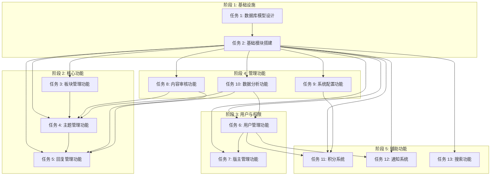

# 论坛系统接入 - 任务拆分文档

## 1. 任务依赖图

## 2. 原子任务清单

### 任务 1: 数据库模型设计

**任务描述**: 设计论坛系统的数据库模型，包括所有表结构、索引、关系，参考漫画模块的设计模式

**输入契约:**
- 前置依赖: 无
- 输入数据: CONSENSUS 文档、DESIGN 文档、漫画模块数据库模型
- 环境依赖: Prisma ORM 7.2.0、PostgreSQL

**输出契约:**
- 输出数据: 完整的 Prisma schema 文件
- 交付物:
  - `prisma/models/forum/forum-section.prisma`
  - `prisma/models/forum/forum-topic.prisma`
  - `prisma/models/forum/forum-reply.prisma`
  - `prisma/models/forum/forum-profile.prisma`
  - `prisma/models/forum/forum-moderator.prisma`
  - `prisma/models/forum/forum-moderator-section.prisma`
  - `prisma/models/forum/forum-sensitive-word.prisma`
  - `prisma/models/forum/forum-point-rule.prisma`
  - `prisma/models/forum/forum-point-record.prisma`
  - `prisma/models/forum/forum-level-rule.prisma`
  - `prisma/models/forum/forum-badge.prisma`
  - `prisma/models/forum/forum-notification.prisma`
  - `prisma/models/forum/forum-topic-like.prisma`
  - `prisma/models/forum/forum-topic-favorite.prisma`
  - `prisma/models/forum/forum-reply-like.prisma`
  - `prisma/models/forum/forum-topic-tag.prisma`
  - `prisma/models/forum/forum-tag.prisma`
  - `prisma/models/forum/forum-audit-log.prisma`
- 验收标准:
  - 所有表结构符合 Prisma 规范
  - 字段命名遵循 `forum_` 前缀（参考漫画模块的 `work_` 前缀）
  - 索引设计合理（参考漫画模块的索引设计）
  - 关系定义正确
  - 支持软删除（deletedAt 字段）
  - 字段注释完整（参考漫画模块的注释风格）
  - 字段类型使用 @db.VarChar、@db.Integer、@db.Text 等（参考漫画模块）
  - 时间字段使用 @db.Timestamptz（参考漫画模块）
  - 布尔字段使用 @default(false) 或 @default(true)（参考漫画模块）
  - 排序字段使用 @db.SmallInt（参考漫画模块）

**实现约束:**
- 技术栈: Prisma ORM 7.2.0
- 命名规范: 小写 + 下划线（参考漫画模块）
- 必须包含软删除字段 `deletedAt`
- 必须包含时间字段 `createdAt`, `updatedAt`
- 必须添加合理的索引（参考漫画模块的索引设计）
- 字段注释必须完整（参考漫画模块）
- 字段类型必须与漫画模块保持一致的风格

**依赖关系:**
- 后置任务: 任务 2 (基础模块搭建)
- 并行任务: 无

---

### 任务 2: 基础模块搭建

**任务描述**: 搭建论坛模块的基础结构，包括模块入口、常量定义、DTO 基类，参考漫画模块的实现模式

**输入契约:**
- 前置依赖: 任务 1 (数据库模型设计)
- 输入数据: 漫画模块实现模式、DESIGN 文档
- 环境依赖: NestJS 11.x、TypeScript 5.x

**输出契约:**
- 输出数据: 完整的模块基础结构
- 交付物:
  - `apps/admin-api/src/modules/forum-management/forum.module.ts`
  - `apps/admin-api/src/modules/forum-management/forum.constant.ts`
  - `apps/admin-api/src/modules/forum-management/forum.dto.ts`
  - `apps/client-api/src/modules/forum/forum.module.ts`
  - `apps/client-api/src/modules/forum/forum.constant.ts`
  - `apps/client-api/src/modules/forum/forum.dto.ts`
- 验收标准:
  - 模块结构符合项目规范（参考漫画模块）
  - 常量定义完整（枚举、状态码）
  - DTO 基类定义完整（参考漫画模块的 DTO 结构）
  - 模块可以正常导入
  - 编译通过

**实现约束:**
- 技术栈: NestJS 11.x、TypeScript 5.x
- 必须遵循现有模块结构（参考漫画模块）
- 必须使用装饰器进行 API 文档（参考漫画模块）
- 必须使用 class-validator 进行验证（参考漫画模块）
- 代码风格与现有代码一致（参考漫画模块）
- 使用 @libs/base/decorators 中的验证装饰器（参考漫画模块）

**依赖关系:**
- 后置任务: 任务 3-13 (所有后续任务)
- 并行任务: 无

---

### 任务 3: 板块管理功能

**任务描述**: 实现板块管理的完整功能，包括 CRUD、排序、启用/禁用，参考漫画模块的分类管理实现

**输入契约:**
- 前置依赖: 任务 1 (数据库模型设计)、任务 2 (基础模块搭建)
- 输入数据: DESIGN 文档中的接口定义、漫画模块分类管理实现
- 环境依赖: NestJS 11.x、Prisma ORM 7.2.0

**输出契约:**
- 输出数据: 完整的板块管理功能
- 交付物:
  - `apps/admin-api/src/modules/forum-management/section/section.module.ts`
  - `apps/admin-api/src/modules/forum-management/section/section.controller.ts`
  - `apps/admin-api/src/modules/forum-management/section/section.service.ts`
  - `apps/admin-api/src/modules/forum-management/section/dto/section.dto.ts`
  - `apps/admin-api/src/modules/forum-management/section/section.constant.ts`
  - `apps/client-api/src/modules/forum/section/section.module.ts`
  - `apps/client-api/src/modules/forum/section/section.controller.ts`
  - `apps/client-api/src/modules/forum/section/section.service.ts`
  - `apps/client-api/src/modules/forum/section/dto/section.dto.ts`
- 验收标准:
  - 管理后台: 创建板块、更新板块、删除板块、板块排序、启用/禁用、查看详情、分页查询
  - 客户端: 查看板块列表、查看板块详情、查看板块下的主题列表
  - 所有接口有完整的 API 文档（使用 @ApiDoc、@ApiPageDoc 装饰器）
  - DTO 验证完整（使用 @ValidateString、@ValidateNumber 等装饰器）
  - 软删除实现正确（使用 RepositoryService 的 softDelete 方法）
  - Service 继承 RepositoryService（参考漫画模块）
  - 分页查询使用 findPagination（参考漫画模块）
  - 编译通过

**实现约束:**
- 技术栈: NestJS 11.x、Prisma ORM 7.2.0
- 必须继承 RepositoryService（参考漫画模块）
- 必须使用装饰器进行 API 文档（参考漫画模块）
- 必须使用 DTO 验证（参考漫画模块）
- 必须实现软删除（参考漫画模块）
- 必须实现分页查询（参考漫画模块）
- 代码风格与漫画模块一致

**依赖关系:**
- 后置任务: 任务 4 (主题管理功能)
- 并行任务: 无

---

### 任务 4: 主题管理功能

**任务描述**: 实现主题管理的完整功能，包括 CRUD、置顶、加精、锁定、移动、点赞、收藏，参考漫画模块的漫画管理实现

**输入契约:**
- 前置依赖: 任务 1 (数据库模型设计)、任务 2 (基础模块搭建)、任务 3 (板块管理功能)
- 输入数据: DESIGN 文档中的接口定义、漫画模块漫画管理实现
- 环境依赖: NestJS 11.x、Prisma ORM 7.2.0

**输出契约:**
- 输出数据: 完整的主题管理功能
- 交付物:
  - `apps/admin-api/src/modules/forum-management/topic/topic.module.ts`
  - `apps/admin-api/src/modules/forum-management/topic/topic.controller.ts`
  - `apps/admin-api/src/modules/forum-management/topic/topic.service.ts`
  - `apps/admin-api/src/modules/forum-management/topic/dto/topic.dto.ts`
  - `apps/admin-api/src/modules/forum-management/topic/topic.constant.ts`
  - `apps/client-api/src/modules/forum/topic/topic.module.ts`
  - `apps/client-api/src/modules/forum/topic/topic.controller.ts`
  - `apps/client-api/src/modules/forum/topic/topic.service.ts`
  - `apps/client-api/src/modules/forum/topic/dto/topic.dto.ts`
- 验收标准:
  - 管理后台: 查看所有主题、批量删除、批量置顶、批量加精、批量锁定、批量移动、分页查询、查看详情
  - 客户端: 创建主题、编辑主题、删除主题、查看主题详情、点赞/取消点赞、收藏/取消收藏、分享
  - 所有接口有完整的 API 文档（使用 @ApiDoc、@ApiPageDoc 装饰器）
  - DTO 验证完整（使用 @ValidateString、@ValidateNumber 等装饰器）
  - 软删除实现正确（使用 RepositoryService 的 softDelete 方法）
  - 权限验证正确 (作者本人才能编辑/删除)
  - Service 继承 RepositoryService（参考漫画模块）
  - 分页查询使用 findPagination（参考漫画模块）
  - 编译通过

**实现约束:**
- 技术栈: NestJS 11.x、Prisma ORM 7.2.0
- 必须继承 RepositoryService（参考漫画模块）
- 必须使用装饰器进行 API 文档（参考漫画模块）
- 必须使用 DTO 验证（参考漫画模块）
- 必须实现软删除（参考漫画模块）
- 必须实现分页查询（参考漫画模块）
- 必须实现权限验证
- 代码风格与漫画模块一致

**依赖关系:**
- 后置任务: 任务 5 (回复管理功能)、任务 8 (内容审核功能)、任务 10 (数据分析功能)
- 并行任务: 无

---

### 任务 5: 回复管理功能

**任务描述**: 实现回复管理的完整功能，包括 CRUD、楼中楼、点赞，参考漫画模块的章节管理实现

**输入契约:**
- 前置依赖: 任务 1 (数据库模型设计)、任务 2 (基础模块搭建)、任务 4 (主题管理功能)
- 输入数据: DESIGN 文档中的接口定义、漫画模块章节管理实现
- 环境依赖: NestJS 11.x、Prisma ORM 7.2.0

**输出契约:**
- 输出数据: 完整的回复管理功能
- 交付物:
  - `apps/admin-api/src/modules/forum-management/reply/reply.module.ts`
  - `apps/admin-api/src/modules/forum-management/reply/reply.controller.ts`
  - `apps/admin-api/src/modules/forum-management/reply/reply.service.ts`
  - `apps/admin-api/src/modules/forum-management/reply/dto/reply.dto.ts`
  - `apps/admin-api/src/modules/forum-management/reply/reply.constant.ts`
  - `apps/client-api/src/modules/forum/reply/reply.module.ts`
  - `apps/client-api/src/modules/forum/reply/reply.controller.ts`
  - `apps/client-api/src/modules/forum/reply/reply.service.ts`
  - `apps/client-api/src/modules/forum/reply/dto/reply.dto.ts`
- 验收标准:
  - 管理后台: 查看所有回复、批量删除、分页查询、查看详情
  - 客户端: 发布回复、编辑回复、删除回复、回复回复(楼中楼)、点赞/取消点赞
  - 所有接口有完整的 API 文档（使用 @ApiDoc、@ApiPageDoc 装饰器）
  - DTO 验证完整（使用 @ValidateString、@ValidateNumber 等装饰器）
  - 软删除实现正确（使用 RepositoryService 的 softDelete 方法）
  - 权限验证正确 (作者本人才能编辑/删除)
  - 楼中楼功能实现正确
  - Service 继承 RepositoryService（参考漫画模块）
  - 分页查询使用 findPagination（参考漫画模块）
  - 编译通过

**实现约束:**
- 技术栈: NestJS 11.x、Prisma ORM 7.2.0
- 必须继承 RepositoryService（参考漫画模块）
- 必须使用装饰器进行 API 文档（参考漫画模块）
- 必须使用 DTO 验证（参考漫画模块）
- 必须实现软删除（参考漫画模块）
- 必须实现分页查询（参考漫画模块）
- 必须实现权限验证
- 代码风格与漫画模块一致

**依赖关系:**
- 后置任务: 任务 8 (内容审核功能)、任务 10 (数据分析功能)
- 并行任务: 无

---

### 任务 6: 用户管理功能

**任务描述**: 实现论坛用户管理的完整功能，包括资料查看、积分管理、等级管理、徽章管理，参考漫画模块的作者管理实现

**输入契约:**
- 前置依赖: 任务 1 (数据库模型设计)、任务 2 (基础模块搭建)
- 输入数据: DESIGN 文档中的接口定义、漫画模块作者管理实现
- 环境依赖: NestJS 11.x、Prisma ORM 7.2.0

**输出契约:**
- 输出数据: 完整的用户管理功能
- 交付物:
  - `apps/admin-api/src/modules/forum-management/user/user.module.ts`
  - `apps/admin-api/src/modules/forum-management/user/user.controller.ts`
  - `apps/admin-api/src/modules/forum-management/user/user.service.ts`
  - `apps/admin-api/src/modules/forum-management/user/dto/user.dto.ts`
  - `apps/admin-api/src/modules/forum-management/user/user.constant.ts`
  - `apps/client-api/src/modules/forum/user/user.module.ts`
  - `apps/client-api/src/modules/forum/user/user.controller.ts`
  - `apps/client-api/src/modules/forum/user/user.service.ts`
  - `apps/client-api/src/modules/forum/user/dto/user.dto.ts`
- 验收标准:
  - 管理后台: 查看用户论坛资料、修改用户积分、修改用户等级、授予/撤销徽章、查看积分记录、查看行为日志
  - 客户端: 查看我的主题、查看我的回复、查看我的收藏、查看我的积分、查看我的等级、查看我的徽章、查看积分记录
  - 所有接口有完整的 API 文档（使用 @ApiDoc、@ApiPageDoc 装饰器）
  - DTO 验证完整（使用 @ValidateString、@ValidateNumber 等装饰器）
  - Service 继承 RepositoryService（参考漫画模块）
  - 分页查询使用 findPagination（参考漫画模块）
  - 必须复用 ClientUser 表
  - 编译通过

**实现约束:**
- 技术栈: NestJS 11.x、Prisma ORM 7.2.0
- 必须继承 RepositoryService（参考漫画模块）
- 必须使用装饰器进行 API 文档（参考漫画模块）
- 必须使用 DTO 验证（参考漫画模块）
- 必须实现分页查询（参考漫画模块）
- 必须复用 ClientUser 表
- 代码风格与漫画模块一致

**依赖关系:**
- 后置任务: 任务 7 (版主管理功能)、任务 11 (积分系统)、任务 12 (通知系统)
- 并行任务: 无

---

### 任务 7: 版主管理功能

**任务描述**: 实现版主管理的完整功能，包括添加/移除版主、分配管理板块、查看操作日志，参考漫画模块的作者关联实现

**输入契约:**
- 前置依赖: 任务 1 (数据库模型设计)、任务 2 (基础模块搭建)、任务 3 (板块管理功能)、任务 6 (用户管理功能)
- 输入数据: DESIGN 文档中的接口定义、漫画模块作者关联实现
- 环境依赖: NestJS 11.x、Prisma ORM 7.2.0

**输出契约:**
- 输出数据: 完整的版主管理功能
- 交付物:
  - `apps/admin-api/src/modules/forum-management/moderator/moderator.module.ts`
  - `apps/admin-api/src/modules/forum-management/moderator/moderator.controller.ts`
  - `apps/admin-api/src/modules/forum-management/moderator/moderator.service.ts`
  - `apps/admin-api/src/modules/forum-management/moderator/dto/moderator.dto.ts`
  - `apps/admin-api/src/modules/forum-management/moderator/moderator.constant.ts`
- 验收标准:
  - 添加版主、移除版主、分配版主管理的板块、查看版主列表、查看版主操作日志
  - 所有接口有完整的 API 文档（使用 @ApiDoc、@ApiPageDoc 装饰器）
  - DTO 验证完整（使用 @ValidateString、@ValidateNumber 等装饰器）
  - 软删除实现正确（使用 RepositoryService 的 softDelete 方法）
  - Service 继承 RepositoryService（参考漫画模块）
  - 分页查询使用 findPagination（参考漫画模块）
  - 编译通过

**实现约束:**
- 技术栈: NestJS 11.x、Prisma ORM 7.2.0
- 必须继承 RepositoryService（参考漫画模块）
- 必须使用装饰器进行 API 文档（参考漫画模块）
- 必须使用 DTO 验证（参考漫画模块）
- 必须实现软删除（参考漫画模块）
- 必须实现分页查询（参考漫画模块）
- 代码风格与漫画模块一致

**依赖关系:**
- 后置任务: 无
- 并行任务: 无

---

### 任务 8: 内容审核功能

**任务描述**: 实现内容审核的完整功能，包括敏感词管理、审核队列、批量处理，参考漫画模块的内容管理实现

**输入契约:**
- 前置依赖: 任务 1 (数据库模型设计)、任务 2 (基础模块搭建)、任务 4 (主题管理功能)、任务 5 (回复管理功能)
- 输入数据: DESIGN 文档中的接口定义、漫画模块内容管理实现
- 环境依赖: NestJS 11.x、Prisma ORM 7.2.0

**输出契约:**
- 输出数据: 完整的内容审核功能
- 交付物:
  - `apps/admin-api/src/modules/forum-management/audit/audit.module.ts`
  - `apps/admin-api/src/modules/forum-management/audit/audit.controller.ts`
  - `apps/admin-api/src/modules/forum-management/audit/audit.service.ts`
  - `apps/admin-api/src/modules/forum-management/audit/dto/audit.dto.ts`
  - `apps/admin-api/src/modules/forum-management/audit/audit.constant.ts`
- 验收标准:
  - 敏感词管理 (CRUD)、审核队列 (待审核内容)、批量通过/拒绝、查看审核历史
  - 敏感词过滤功能正确（使用正则表达式）
  - 所有接口有完整的 API 文档（使用 @ApiDoc、@ApiPageDoc 装饰器）
  - DTO 验证完整（使用 @ValidateString、@ValidateNumber 等装饰器）
  - 软删除实现正确（使用 RepositoryService 的 softDelete 方法）
  - Service 继承 RepositoryService（参考漫画模块）
  - 分页查询使用 findPagination（参考漫画模块）
  - 编译通过

**实现约束:**
- 技术栈: NestJS 11.x、Prisma ORM 7.2.0
- 必须继承 RepositoryService（参考漫画模块）
- 必须使用装饰器进行 API 文档（参考漫画模块）
- 必须使用 DTO 验证（参考漫画模块）
- 必须实现软删除（参考漫画模块）
- 必须实现分页查询（参考漫画模块）
- 必须实现敏感词过滤 (正则表达式)
- 代码风格与漫画模块一致

**依赖关系:**
- 后置任务: 无
- 并行任务: 无

---

### 任务 9: 系统配置功能

**任务描述**: 实现系统配置的完整功能，包括积分规则、等级规则、徽章配置、基础设置，参考漫画模块的分类配置实现

**输入契约:**
- 前置依赖: 任务 1 (数据库模型设计)、任务 2 (基础模块搭建)
- 输入数据: DESIGN 文档中的接口定义、漫画模块分类配置实现
- 环境依赖: NestJS 11.x、Prisma ORM 7.2.0

**输出契约:**
- 输出数据: 完整的系统配置功能
- 交付物:
  - `apps/admin-api/src/modules/forum-management/config/config.module.ts`
  - `apps/admin-api/src/modules/forum-management/config/config.controller.ts`
  - `apps/admin-api/src/modules/forum-management/config/config.service.ts`
  - `apps/admin-api/src/modules/forum-management/config/dto/config.dto.ts`
  - `apps/admin-api/src/modules/forum-management/config/config.constant.ts`
- 验收标准:
  - 积分规则配置 (CRUD)、等级规则配置 (CRUD)、徽章配置 (CRUD)、论坛基础设置
  - 所有接口有完整的 API 文档（使用 @ApiDoc、@ApiPageDoc 装饰器）
  - DTO 验证完整（使用 @ValidateString、@ValidateNumber 等装饰器）
  - 软删除实现正确（使用 RepositoryService 的 softDelete 方法）
  - Service 继承 RepositoryService（参考漫画模块）
  - 分页查询使用 findPagination（参考漫画模块）
  - 编译通过

**实现约束:**
- 技术栈: NestJS 11.x、Prisma ORM 7.2.0
- 必须继承 RepositoryService（参考漫画模块）
- 必须使用装饰器进行 API 文档（参考漫画模块）
- 必须使用 DTO 验证（参考漫画模块）
- 必须实现软删除（参考漫画模块）
- 必须实现分页查询（参考漫画模块）
- 代码风格与漫画模块一致

**依赖关系:**
- 后置任务: 任务 11 (积分系统)
- 并行任务: 无

---

### 任务 10: 数据分析功能

**任务描述**: 实现数据分析的完整功能，包括论坛概览、活跃度趋势、热门排行、板块统计，参考漫画模块的数据统计实现

**输入契约:**
- 前置依赖: 任务 1 (数据库模型设计)、任务 2 (基础模块搭建)、任务 4 (主题管理功能)、任务 5 (回复管理功能)、任务 6 (用户管理功能)
- 输入数据: DESIGN 文档中的接口定义、漫画模块数据统计实现
- 环境依赖: NestJS 11.x、Prisma ORM 7.2.0

**输出契约:**
- 输出数据: 完整的数据分析功能
- 交付物:
  - `apps/admin-api/src/modules/forum-management/analytics/analytics.module.ts`
  - `apps/admin-api/src/modules/forum-management/analytics/analytics.controller.ts`
  - `apps/admin-api/src/modules/forum-management/analytics/analytics.service.ts`
  - `apps/admin-api/src/modules/forum-management/analytics/dto/analytics.dto.ts`
  - `apps/admin-api/src/modules/forum-management/analytics/analytics.constant.ts`
- 验收标准:
  - 论坛概览 (主题数、回复数、用户数)、活跃度趋势、热门主题排行、活跃用户排行、板块数据统计
  - 所有接口有完整的 API 文档（使用 @ApiDoc、@ApiPageDoc 装饰器）
  - DTO 验证完整（使用 @ValidateString、@ValidateNumber 等装饰器）
  - Service 继承 RepositoryService（参考漫画模块）
  - 聚合查询实现正确
  - 编译通过

**实现约束:**
- 技术栈: NestJS 11.x、Prisma ORM 7.2.0
- 必须继承 RepositoryService（参考漫画模块）
- 必须使用装饰器进行 API 文档（参考漫画模块）
- 必须使用 DTO 验证（参考漫画模块）
- 必须实现聚合查询
- 代码风格与漫画模块一致

**依赖关系:**
- 后置任务: 无
- 并行任务: 无

---

### 任务 11: 积分系统

**任务描述**: 实现积分系统的完整功能，包括积分获取、积分消费、积分记录、与漫画系统互通接口，参考漫画模块的积分实现

**输入契约:**
- 前置依赖: 任务 1 (数据库模型设计)、任务 2 (基础模块搭建)、任务 6 (用户管理功能)、任务 9 (系统配置功能)
- 输入数据: DESIGN 文档中的接口定义、漫画模块积分实现
- 环境依赖: NestJS 11.x、Prisma ORM 7.2.0

**输出契约:**
- 输出数据: 完整的积分系统
- 交付物:
  - `libs/forum/src/point/point.module.ts`
  - `libs/forum/src/point/point.service.ts`
  - `libs/forum/src/point/dto/point.dto.ts`
  - `libs/forum/src/point/point.constant.ts`
- 验收标准:
  - 积分获取 (发布主题、回复、被点赞等)
  - 积分消费 (预留接口)
  - 积分记录查询
  - 与漫画系统互通接口 (预留)
  - 积分规则可配置
  - Service 继承 RepositoryService（参考漫画模块）
  - 事务处理实现正确
  - 编译通过

**实现约束:**
- 技术栈: NestJS 11.x、Prisma ORM 7.2.0
- 必须继承 RepositoryService（参考漫画模块）
- 必须使用 DTO 验证（参考漫画模块）
- 必须实现事务处理
- 必须预留与漫画系统互通接口
- 代码风格与漫画模块一致

**依赖关系:**
- 后置任务: 无
- 并行任务: 任务 12 (通知系统)

---

### 任务 12: 通知系统

**任务描述**: 实现通知系统的完整功能，包括通知创建、通知查询、通知标记已读，参考漫画模块的通知实现

**输入契约:**
- 前置依赖: 任务 1 (数据库模型设计)、任务 2 (基础模块搭建)、任务 6 (用户管理功能)
- 输入数据: DESIGN 文档中的接口定义、漫画模块通知实现
- 环境依赖: NestJS 11.x、Prisma ORM 7.2.0

**输出契约:**
- 输出数据: 完整的通知系统
- 交付物:
  - `libs/forum/src/notification/notification.module.ts`
  - `libs/forum/src/notification/notification.service.ts`
  - `libs/forum/src/notification/dto/notification.dto.ts`
  - `libs/forum/src/notification/notification.constant.ts`
- 验收标准:
  - 通知创建 (回复通知、点赞通知等)
  - 通知查询 (分页)
  - 通知标记已读
  - Service 继承 RepositoryService（参考漫画模块）
  - 分页查询使用 findPagination（参考漫画模块）
  - 编译通过

**实现约束:**
- 技术栈: NestJS 11.x、Prisma ORM 7.2.0
- 必须继承 RepositoryService（参考漫画模块）
- 必须使用 DTO 验证（参考漫画模块）
- 必须实现分页查询（参考漫画模块）
- 代码风格与漫画模块一致

**依赖关系:**
- 后置任务: 无
- 并行任务: 任务 11 (积分系统)

---

### 任务 13: 搜索功能

**任务描述**: 实现搜索功能的完整功能，包括主题搜索、回复搜索、筛选，参考漫画模块的搜索实现

**输入契约:**
- 前置依赖: 任务 1 (数据库模型设计)、任务 2 (基础模块搭建)、任务 4 (主题管理功能)、任务 5 (回复管理功能)
- 输入数据: DESIGN 文档中的接口定义、漫画模块搜索实现
- 环境依赖: NestJS 11.x、Prisma ORM 7.2.0

**输出契约:**
- 输出数据: 完整的搜索功能
- 交付物:
  - `libs/forum/src/search/search.module.ts`
  - `libs/forum/src/search/search.service.ts`
  - `libs/forum/src/search/dto/search.dto.ts`
  - `libs/forum/src/search/search.constant.ts`
- 验收标准:
  - 搜索主题 (标题、内容)
  - 搜索回复 (内容)
  - 按板块筛选
  - 按标签筛选
  - 按时间筛选
  - Service 继承 RepositoryService（参考漫画模块）
  - 分页查询使用 findPagination（参考漫画模块）
  - 编译通过

**实现约束:**
- 技术栈: NestJS 11.x、Prisma ORM 7.2.0
- 必须继承 RepositoryService（参考漫画模块）
- 必须使用数据库 LIKE 查询（参考漫画模块）
- 必须实现分页查询（参考漫画模块）
- 不使用 Elasticsearch
- 代码风格与漫画模块一致

**依赖关系:**
- 后置任务: 无
- 并行任务: 无

---

## 3. 任务执行顺序

### 阶段 1: 基础设施
1. 任务 1: 数据库模型设计
2. 任务 2: 基础模块搭建

### 阶段 2: 核心功能
3. 任务 3: 板块管理功能
4. 任务 4: 主题管理功能
5. 任务 5: 回复管理功能

### 阶段 3: 用户与权限
6. 任务 6: 用户管理功能
7. 任务 7: 版主管理功能

### 阶段 4: 管理功能
8. 任务 8: 内容审核功能
9. 任务 9: 系统配置功能
10. 任务 10: 数据分析功能

### 阶段 5: 辅助功能
11. 任务 11: 积分系统
12. 任务 12: 通知系统
13. 任务 13: 搜索功能

---

## 4. 验收标准总结

### 功能完整性
- ✅ 所有核心功能已实现
- ✅ 所有接口已实现
- ✅ 所有业务逻辑正确

### 代码质量
- ✅ 代码符合项目规范
- ✅ 代码风格与漫画模块一致
- ✅ 代码可读性良好
- ✅ 代码复杂度可控

### 技术要求
- ✅ Service 继承 RepositoryService
- ✅ 使用装饰器进行 API 文档
- ✅ 使用 DTO 验证
- ✅ 实现软删除
- ✅ 实现分页查询
- ✅ 使用事务处理

### 性能和安全
- ✅ 数据库索引设计合理
- ✅ 查询性能优化
- ✅ 权限验证正确
- ✅ 敏感词过滤实现

### 集成要求
- ✅ 与现有系统集成良好
- ✅ 与漫画系统积分互通接口预留
- ✅ 复用 ClientUser 表
- ✅ 未引入技术债务
