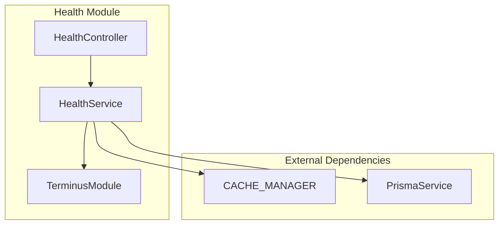
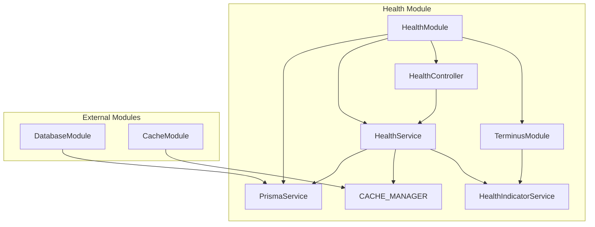
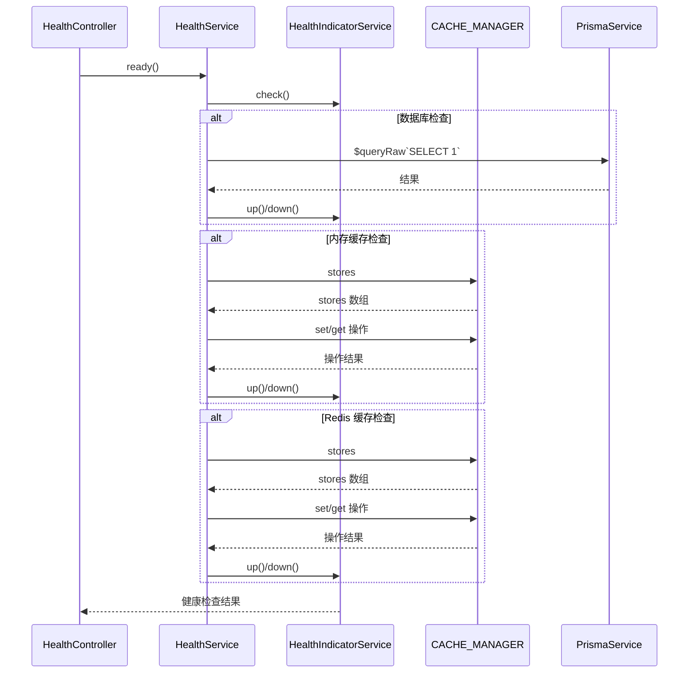

# DESIGN - Health Service 重构设计文档
## 整体架构图



## 分层设计和核心组件

### 1. HealthService (新的核心服务)
**职责:**
- 统一的健康检查服务入口
- 整合缓存和数据库健康检查功能
- 提供标准化的健康检查接口

**依赖:**
- `HealthIndicatorService`: Terminus 健康检查服务
- `Cache`: cache-manager 缓存实例
- `PrismaService`: 数据库服务

### 2. 方法设计

#### `ping(key: string = 'database')`
- **来源**: DatabaseHealthIndicator.ping()
- **功能**: 检查数据库连接健康状态
- **实现**: 执行 `SELECT 1` 查询
- **返回**: HealthIndicatorResult

#### `checkMemory(key: string = 'cache_memory')`
- **来源**: CacheHealthIndicator.checkMemory()
- **功能**: 检查内存缓存健康状态
- **实现**: 测试内存缓存的 set/get 操作
- **返回**: HealthIndicatorResult

#### `checkRedis(key: string = 'cache_redis')`
- **来源**: CacheHealthIndicator.checkRedis()
- **功能**: 检查 Redis 缓存健康状态
- **实现**: 测试 Redis 缓存的 set/get 操作
- **返回**: HealthIndicatorResult

## 模块依赖关系图



## 接口契约定义

### HealthService 接口
```typescript
interface IHealthService {
  /**
   * 检查数据库健康状态
   * @param key 健康检查标识符
   * @returns HealthIndicatorResult
   */
  ping(key?: string): Promise<HealthIndicatorResult>

  /**
   * 检查内存缓存健康状态
   * @param key 健康检查标识符
   * @returns HealthIndicatorResult
   */
  checkMemory(key?: string): Promise<HealthIndicatorResult>

  /**
   * 检查 Redis 缓存健康状态
   * @param key 健康检查标识符
   * @returns HealthIndicatorResult
   */
  checkRedis(key?: string): Promise<HealthIndicatorResult>
}
```

## 数据流向图



## 异常处理策略

### 1. 数据库异常处理
- 捕获 Prisma 查询异常
- 返回 `indicator.down({ error: String(error) })`

### 2. 缓存异常处理
- 捕获缓存操作异常
- 检查存储类型是否正确
- 处理删除操作的兼容性（delete/del 方法）

### 3. 通用异常处理
- 使用 try-catch 包装所有异步操作
- 统一的错误信息格式化
- 保持与原有错误处理的一致性

## 设计验证要点

### 1. 向后兼容性
✅ 方法签名保持不变  
✅ 返回值类型一致  
✅ 错误处理方式相同  

### 2. 功能完整性
✅ 包含所有原有功能  
✅ 依赖注入正确配置  
✅ 模块注册完整  

### 3. 代码质量
✅ 遵循单一职责原则  
✅ 保持代码可读性  
✅ 适当的注释和文档  
