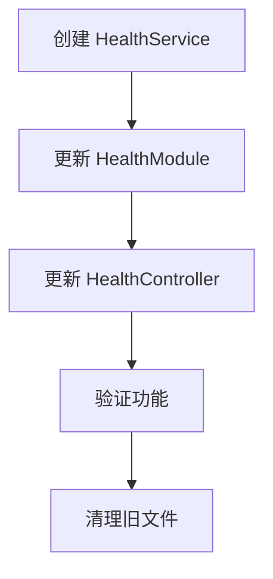

# TASK - Health Service 重构任务分解
## 任务依赖图

## 原子任务分解

### T1: 创建 HealthService 文件
**任务ID**: create_health_service  
**输入契约**: 
- 前置依赖: 无
- 输入数据: 原有两个健康检查指示器的代码
- 环境依赖: TypeScript, NestJS

**输出契约**:
- 输出数据: `libs/health/src/health.service.ts` 文件
- 交付物: 完整的 HealthService 类实现
- 验收标准: 包含所有原有功能，代码编译通过

**实现约束**:
- 技术栈: TypeScript, NestJS
- 接口规范: 保持原有方法签名
- 质量要求: 代码规范，注释完整

**依赖关系**:
- 后置任务: T2, T3, T4, T5
- 并行任务: 无

### T2: 更新 HealthModule 配置
**任务ID**: update_health_module  
**输入契约**: 
- 前置依赖: T1 完成
- 输入数据: 新的 HealthService 类
- 环境依赖: NestJS 模块系统

**输出契约**:
- 输出数据: 更新后的 `health.module.ts`
- 交付物: 模块配置更新
- 验收标准: 正确导入和注册 HealthService

**实现约束**:
- 技术栈: NestJS 模块系统
- 接口规范: 遵循 NestJS 模块模式
- 质量要求: 依赖注入正确配置

**依赖关系**:
- 前置任务: T1
- 后置任务: T3, T4, T5
- 并行任务: 无

### T3: 更新 HealthController 依赖
**任务ID**: update_health_controller  
**输入契约**: 
- 前置依赖: T1, T2 完成
- 输入数据: 新的 HealthService
- 环境依赖: NestJS 控制器

**输出契约**:
- 输出数据: 更新后的 `health.controller.ts`
- 交付物: 控制器依赖注入更新
- 验收标准: 正确注入 HealthService，方法调用正确

**实现约束**:
- 技术栈: NestJS 控制器
- 接口规范: 保持原有 API 接口
- 质量要求: 向后兼容

**依赖关系**:
- 前置任务: T1, T2
- 后置任务: T4, T5
- 并行任务: 无

### T4: 验证功能完整性
**任务ID**: verify_functionality  
**输入契约**: 
- 前置依赖: T1, T2, T3 完成
- 输入数据: 重构后的代码
- 环境依赖: 测试环境

**输出契约**:
- 输出数据: 验证报告
- 交付物: 功能验证结果
- 验收标准: 所有健康检查功能正常工作

**实现约束**:
- 技术栈: TypeScript 编译器，测试工具
- 接口规范: 验证现有 API
- 质量要求: 无编译错误，功能正常

**依赖关系**:
- 前置任务: T1, T2, T3
- 后置任务: T5
- 并行任务: 无

### T5: 清理旧文件
**任务ID**: cleanup_old_files  
**输入契约**: 
- 前置依赖: T4 验证通过
- 输入数据: 旧的健康检查指示器文件
- 环境依赖: 文件系统

**输出契约**:
- 输出数据: 删除旧文件
- 交付物: 清理完成确认
- 验收标准: 旧文件已删除，不影响功能

**实现约束**:
- 技术栈: 文件系统操作
- 接口规范: 安全删除
- 质量要求: 确认功能正常后再删除

**依赖关系**:
- 前置任务: T4
- 后置任务: 无
- 并行任务: 无

## 复杂度评估

### T1: 创建 HealthService 文件
- **复杂度**: 中等
- **风险**: 低
- **预估时间**: 30 分钟
- **关键风险点**: 确保所有功能完整迁移

### T2: 更新 HealthModule 配置
- **复杂度**: 低
- **风险**: 低
- **预估时间**: 10 分钟
- **关键风险点**: 依赖注入配置正确

### T3: 更新 HealthController 依赖
- **复杂度**: 低
- **风险**: 低
- **预估时间**: 10 分钟
- **关键风险点**: 保持向后兼容

### T4: 验证功能完整性
- **复杂度**: 中等
- **风险**: 中
- **预估时间**: 20 分钟
- **关键风险点**: 确保所有功能正常

### T5: 清理旧文件
- **复杂度**: 低
- **风险**: 低
- **预估时间**: 5 分钟
- **关键风险点**: 确认删除时机正确

## 总体评估
- **总复杂度**: 中等
- **总风险**: 低
- **预估总时间**: 75 分钟
- **关键成功因素**: 保持向后兼容性，确保功能完整性
