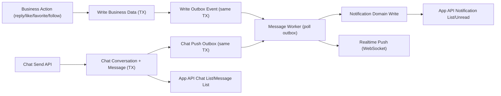

# Message Center Unified Plan (Notification + Chat) v1

## 0. Document Meta

- Date: 2026-03-07
- Scope: `es-server` monorepo
- Goal: Build a unified message center that supports:
  - system notifications (comment reply/like/favorite/follow/etc.)
  - chat (direct messaging first)
  - unified inbox experience in App side

---

## 1. Background and Core Requirement

You need a mechanism where:

1. User B replies to user A's comment -> user A gets notified.
2. Not only comment reply, but also like/favorite/follow and future actions should notify.
3. You are planning chatroom/chat capability and want to evaluate whether it can be placed in the same architecture.

Current codebase facts:

1. There is existing forum-oriented notification capability:
   - `prisma/models/forum/forum-notification.prisma`
   - `libs/forum/src/notification/*`
2. Comment feature is in interaction domain:
   - `libs/interaction/src/comment/comment.service.ts`
3. App API currently has no dedicated notification/chat APIs.

Problem with directly extending current forum notification model:

1. Semantics are forum-centric (`topicId`, `replyId`), not generic enough for comment/like/follow across domains.
2. If chat is also stuffed into the same table, model complexity explodes.
3. No reliable asynchronous delivery mechanism (outbox) for high-volume notification generation.

---

## 2. Recommended Direction (Important)

Use **one product-level Message Center**, but **two domain-level stores**:

1. `Notification Domain` for event-driven system notices.
2. `Chat Domain` for user-to-user real-time messages.

Do not merge notification rows and chat rows into one table.

Why:

1. Notification and chat have different lifecycle and query patterns.
2. Notification needs dedupe/aggregation rules; chat needs conversation/message sequencing and read cursors.
3. Domain separation keeps future features maintainable while preserving a unified user inbox.

---

## 3. Overall Architecture

Key principle:

1. Business transaction only guarantees core data + outbox event.
2. Notification/chat push is async, retriable, idempotent.
3. UI sees one message center, backend keeps clean domain boundaries.

---

## 4. Domain Models (Prisma Design)

## 4.1 Notification Domain

### 4.1.1 `user_notification`

Purpose:

1. Durable in-app notifications.
2. Supports unread/read, dedupe, and future aggregation.

Suggested fields:

1. `id` Int PK
2. `userId` Int (receiver)
3. `type` String(40) (e.g. `COMMENT_REPLY`, `COMMENT_LIKE`, `CONTENT_FAVORITE`, `USER_FOLLOW`)
4. `bizKey` String(160) (idempotency key per receiver)
5. `actorUserId` Int? (who triggered event)
6. `targetType` SmallInt? (reuse existing target enum when possible)
7. `targetId` Int?
8. `subjectType` String(40)? (e.g. `comment`, `work`, `user`)
9. `subjectId` Int?
10. `title` String(200)
11. `content` String(1000)
12. `payload` Json?
13. `aggregateKey` String(160)? (for merge-window updates)
14. `aggregateCount` Int @default(1)
15. `isRead` Boolean @default(false)
16. `readAt` DateTime?
17. `expiredAt` DateTime?
18. `createdAt` DateTime @default(now())

Indexes:

1. Unique: `(user_id, biz_key)`
2. Index: `(user_id, is_read, created_at desc)`
3. Index: `(user_id, created_at desc)`
4. Index: `(type, created_at desc)`
5. Optional aggregation index: `(user_id, aggregate_key, created_at desc)`

### 4.1.2 `message_outbox`

Purpose:

1. Reliable event delivery.
2. Retry and dead-letter style handling.

Suggested fields:

1. `id` BigInt PK
2. `domain` String(20) (`notification` / `chat`)
3. `eventType` String(60)
4. `bizKey` String(180) unique
5. `payload` Json
6. `status` String(20) (`PENDING`/`PROCESSING`/`SUCCESS`/`FAILED`)
7. `retryCount` Int @default(0)
8. `nextRetryAt` DateTime?
9. `lastError` String(500)?
10. `createdAt` DateTime @default(now())
11. `processedAt` DateTime?

Indexes:

1. Unique: `(biz_key)`
2. Index: `(status, next_retry_at, id)`
3. Index: `(domain, status, created_at)`

---

## 4.2 Chat Domain

Phase-1 scope: direct chat only (`1:1`).

### 4.2.1 `chat_conversation`

Fields:

1. `id` Int PK
2. `type` SmallInt (`DIRECT=1`, `GROUP=2`, phase-1 only DIRECT)
3. `bizKey` String(100) unique (for direct chat: `direct:{minUserId}:{maxUserId}`)
4. `lastMessageId` Int?
5. `lastMessageAt` DateTime?
6. `lastSenderId` Int?
7. `createdAt` DateTime @default(now())
8. `updatedAt` DateTime @updatedAt

Indexes:

1. Unique: `(biz_key)`
2. Index: `(last_message_at desc)`

### 4.2.2 `chat_conversation_member`

Fields:

1. `id` Int PK
2. `conversationId` Int
3. `userId` Int
4. `role` SmallInt (`OWNER`, `MEMBER`)
5. `joinedAt` DateTime @default(now())
6. `leftAt` DateTime?
7. `isMuted` Boolean @default(false)
8. `lastReadMessageId` Int?
9. `lastReadAt` DateTime?
10. `unreadCount` Int @default(0) (cache field, optional but recommended for fast badge)

Indexes:

1. Unique: `(conversation_id, user_id)`
2. Index: `(user_id, unread_count, conversation_id)`

### 4.2.3 `chat_message`

Fields:

1. `id` BigInt PK
2. `conversationId` Int
3. `messageSeq` BigInt (monotonic inside conversation)
4. `senderId` Int
5. `messageType` SmallInt (`TEXT`, `IMAGE`, `SYSTEM`)
6. `content` Text
7. `payload` Json?
8. `status` SmallInt (`NORMAL`, `REVOKED`, `DELETED`)
9. `createdAt` DateTime @default(now())
10. `editedAt` DateTime?
11. `revokedAt` DateTime?

Indexes:

1. Unique: `(conversation_id, message_seq)`
2. Index: `(conversation_id, created_at desc)`
3. Index: `(sender_id, created_at desc)`

---

## 5. Notification Event Catalog

Suggested v1 event types:

1. `COMMENT_REPLY`
2. `COMMENT_LIKE`
3. `CONTENT_FAVORITE`
4. `USER_FOLLOW`
5. `SYSTEM_ANNOUNCEMENT`
6. `CHAT_MESSAGE` (inbox summary use only; raw chat data still from chat tables)

Per-event rules:

1. Never notify self (`actorUserId == receiverUserId` skip).
2. Always build receiver-scoped `bizKey`.
3. For high-frequency events (`LIKE`, `FAVORITE`), support merge window.

BizKey examples:

1. Reply comment: `comment:reply:{replyCommentId}:to:{receiverUserId}`
2. Like comment: `comment:like:{likeId}:to:{receiverUserId}`
3. Favorite content: `favorite:{favoriteId}:to:{receiverUserId}`
4. Follow user: `follow:{followRelationId}:to:{receiverUserId}`

Aggregation key examples:

1. `comment_like:to:{receiverUserId}:target:{targetType}:{targetId}`
2. `favorite:to:{receiverUserId}:target:{targetType}:{targetId}`

---

## 6. Core Flow Design

## 6.1 Comment Reply -> Notification

Producer point:

1. `libs/interaction/src/comment/comment.service.ts` in `replyComment`.

Flow:

1. Create reply in transaction.
2. Check visibility policy (approved/not hidden/not deleted).
3. Resolve receiver as `replyTo.userId`.
4. If receiver != actor, insert outbox row in same transaction.
5. Worker consumes outbox and writes/upserts `user_notification`.
6. Worker emits realtime event to receiver channel.

Why async outbox:

1. Avoid reply API latency inflation.
2. Notification failure should not rollback reply data.
3. Can retry safely.

## 6.2 Like/Favorite/Follow -> Notification

Use same producer pattern:

1. Business write + outbox in one transaction.
2. Worker handles rendering template and notification persistence.
3. Optional aggregation for noisy event types.

## 6.3 Chat Send Message

Flow:

1. Resolve/create direct conversation by deterministic bizKey.
2. Insert `chat_message` with next `messageSeq` in transaction.
3. Update conversation last message snapshot.
4. Update members unread counters.
5. Insert chat outbox events (for realtime push/inbox sync).
6. Worker pushes websocket events.

---

## 7. API Design (App)

Base path suggestion: `/app/message`.

## 7.1 Notification APIs

1. `GET /app/message/notification/list`
   - query: `pageIndex`, `pageSize`, `isRead?`, `type?`
2. `GET /app/message/notification/unread-count`
3. `POST /app/message/notification/read`
   - body: `{ id }`
4. `POST /app/message/notification/read-all`
5. `POST /app/message/notification/delete` (optional v1)

## 7.2 Chat APIs

1. `POST /app/message/chat/direct/open`
   - body: `{ targetUserId }`
2. `GET /app/message/chat/conversation/list`
3. `GET /app/message/chat/conversation/messages`
   - query: `conversationId`, `cursor?`, `limit`
4. `POST /app/message/chat/conversation/send`
   - body: `{ conversationId, messageType, content, payload? }`
5. `POST /app/message/chat/conversation/read`
   - body: `{ conversationId, messageId }`
6. `POST /app/message/chat/message/revoke` (phase-2 optional)

## 7.3 Unified Inbox APIs (optional but recommended)

1. `GET /app/message/inbox/summary`
   - returns notification unread + chat unread + latest entries
2. `GET /app/message/inbox/timeline`
   - mixed timeline list with `sourceType` (`notification`/`chat`)

---

## 8. Realtime Push Design

Transport:

1. WebSocket namespace `/message`.
2. User-authenticated room: `user:{userId}`.

Server push events:

1. `notification.new`
2. `notification.read.sync`
3. `chat.message.new`
4. `chat.conversation.update`
5. `inbox.summary.update`

Reliability:

1. Push is best effort.
2. Final consistency always guaranteed by list APIs.
3. Client reconnect pulls incremental state from APIs.

---

## 9. Module and Code Organization (Current Repo Mapping)

New module suggestion:

1. `libs/message/src/notification/*`
2. `libs/message/src/chat/*`
3. `libs/message/src/outbox/*`
4. `libs/message/src/inbox/*`
5. `libs/message/src/index.ts`

App API integration:

1. `apps/app-api/src/modules/message/message.module.ts`
2. `apps/app-api/src/modules/message/message.controller.ts`

Producer integration points:

1. Comment reply: `libs/interaction/src/comment/comment.service.ts`
2. Comment like: `libs/interaction/src/comment/comment-interaction.service.ts`
3. Favorite/Follow: corresponding interaction/user services

Legacy forum notification handling:

1. Keep existing `libs/forum/src/notification/*` only as compatibility layer in transition.
2. New business should write unified notification domain directly.
3. Later remove forum-specific notification table and service.

---

## 10. Data Consistency, Idempotency, and Performance

Idempotency:

1. Outbox unique `bizKey`.
2. Notification unique `(userId, bizKey)`.

Worker strategy:

1. Poll `PENDING` with batch size 100.
2. Use `FOR UPDATE SKIP LOCKED` to support multi-worker.
3. Exponential retry for failures.
4. Move hard failures to `FAILED` with alert.

Performance:

1. Notification list only hits indexed receiver partitions.
2. Chat list uses conversation snapshot + member unread cache.
3. Large payload fields stay in `payload` JSON, avoid wide-row selects by default.

---

## 11. Security and Policy

1. Self-action skip (no self notify).
2. Block/blacklist check before chat delivery and follow notify.
3. Sensitive/deleted content should not produce user-facing notification text.
4. Notification payload should avoid exposing private fields.

---

## 12. Rollout Plan (Recommended: Single Track)

Phase 1 (foundation):

1. Add new Prisma models:
   - `user_notification`
   - `message_outbox`
   - `chat_conversation`
   - `chat_conversation_member`
   - `chat_message`
2. Add message domain services + worker.
3. Add app notification list/read APIs.

Phase 2 (business producer integration):

1. Connect comment reply notification.
2. Connect comment like/favorite/follow notification.
3. Enable realtime push.

Phase 3 (chat):

1. Open direct conversation and message APIs.
2. Add inbox summary aggregation.

Phase 4 (legacy cleanup):

1. Remove/retire old forum-only notification path after all callers migrate.

---

## 13. Explicit Non-Goals for v1

1. Full group chat permissions matrix.
2. Message search at scale.
3. Multi-channel delivery (email/sms/push) fanout.
4. Complex moderation workflow for chat content.

---

## 14. Decisions Needed From You

Recommended options are marked as `RECOMMENDED`.

1. Notification storage strategy
   - A. New unified `user_notification` (RECOMMENDED)
   - B. Keep extending `forum_notification`

2. Delivery strategy
   - A. Outbox async delivery (RECOMMENDED)
   - B. Direct synchronous write from business service

3. Chat scope for first release
   - A. Direct chat only (RECOMMENDED)
   - B. Direct + group chat in one release

4. Legacy migration style
   - A. Single-track migration, no dual-write (RECOMMENDED)
   - B. Temporary dual-write compatibility

5. API product shape
   - A. Unified `/app/message/*` with notification + chat (RECOMMENDED)
   - B. Keep separate notification/chat root routes

---

## 15. Implementation Notes for Your Current Constraints

1. Database migration should follow your existing rule:
   - use `pnpm prisma:update` only.
2. Keep comments/docstrings explicit and consistent with project coding style.
3. Prioritize functional availability first, then optimization.

