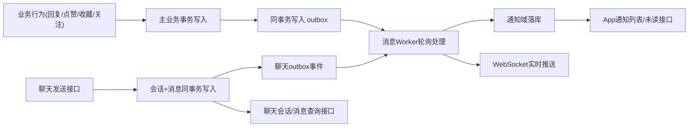

# 消息中心统一方案 v1（通知 + 聊天室）

## 0. 文档信息

- 日期：2026-03-07
- 适用范围：`es-server` 单体仓（monorepo）
- 目标：
  - 支持评论回复、点赞、收藏、关注等系统通知
  - 支持私聊（明确不做群聊）
  - 在产品上提供统一“消息中心”

---

## 1. 背景与需求

你当前的核心诉求：

1. 用户 B 回复用户 A 的评论时，要通知用户 A。
2. 不仅评论回复，点赞、收藏、关注等行为都要通知。
3. 后续还要做聊天室，希望评估是否能与通知放在一起建设。

当前项目现状：

1. 已有论坛通知能力（偏论坛场景）：
   - `prisma/models/forum/forum-notification.prisma`
   - `libs/forum/src/notification/*`
2. 评论能力在互动域：
   - `libs/interaction/src/comment/comment.service.ts`
3. `app-api` 目前没有统一的通知/聊天 API 入口。

直接继续扩展 `forum_notification` 的问题：

1. 模型语义偏论坛（`topicId/replyId`），不适合作为全站通知中心。
2. 如果把聊天消息也塞进该表，模型会快速失控。
3. 缺少可靠异步投递机制，主流程容易被通知写入影响。

---

## 2. 总体设计结论

产品层“统一入口”，技术层“分域建模”：

1. **通知域（Notification Domain）**：承载业务事件通知（回复/点赞/收藏/关注/系统消息）。
2. **聊天域（Chat Domain）**：承载实时会话消息（仅私聊）。
3. **消息中心（Message Center）**：App 统一展示入口（未读数、时间线、会话列表）。

不建议“通知+聊天”共用一张消息明细表。

---

## 3. 架构总览

核心原则：

1. 业务主事务只保证“核心业务数据 + outbox”成功。
2. 通知投递与推送异步处理，可重试、可幂等。
3. 用户看到一个消息中心，后端保持通知域与聊天域边界清晰。

---

## 4. 数据模型设计（Prisma）

## 4.1 通知域

### 4.1.1 `user_notification`

用途：

1. 存储站内通知（可查询、可已读、可追溯）。
2. 支持幂等、防重、聚合（防骚扰）。

建议字段：

1. `id` Int 主键
2. `userId` Int（接收人）
3. `type` String(40)（如 `COMMENT_REPLY`、`COMMENT_LIKE`）
4. `bizKey` String(160)（接收人维度幂等键）
5. `actorUserId` Int?（触发人）
6. `targetType` SmallInt?（可复用现有 target enum）
7. `targetId` Int?
8. `subjectType` String(40)?（如 `comment`/`work`/`user`）
9. `subjectId` Int?
10. `title` String(200)
11. `content` String(1000)
12. `payload` Json?
13. `aggregateKey` String(160)?（用于通知聚合）
14. `aggregateCount` Int @default(1)
15. `isRead` Boolean @default(false)
16. `readAt` DateTime?
17. `expiredAt` DateTime?
18. `createdAt` DateTime @default(now())

建议索引：

1. 唯一：`(user_id, biz_key)`
2. 列表：`(user_id, is_read, created_at desc)`
3. 列表：`(user_id, created_at desc)`
4. 分类：`(type, created_at desc)`
5. 聚合（可选）：`(user_id, aggregate_key, created_at desc)`

### 4.1.2 `message_outbox`

用途：

1. 保障消息事件可靠投递。
2. 支持失败重试与排障。

建议字段：

1. `id` BigInt 主键
2. `domain` String(20)（`notification` / `chat`）
3. `eventType` String(60)
4. `bizKey` String(180)（全局幂等）
5. `payload` Json
6. `status` String(20)（`PENDING`/`PROCESSING`/`SUCCESS`/`FAILED`）
7. `retryCount` Int @default(0)
8. `nextRetryAt` DateTime?
9. `lastError` String(500)?
10. `createdAt` DateTime @default(now())
11. `processedAt` DateTime?

建议索引：

1. 唯一：`(biz_key)`
2. 消费：`(status, next_retry_at, id)`
3. 监控：`(domain, status, created_at)`

---

## 4.2 聊天域（仅私聊）

### 4.2.1 `chat_conversation`

建议字段：

1. `id` Int 主键
2. `bizKey` String(100) 唯一（私聊：`direct:{minUserId}:{maxUserId}`）
3. `lastMessageId` Int?
4. `lastMessageAt` DateTime?
5. `lastSenderId` Int?
6. `createdAt` DateTime @default(now())
7. `updatedAt` DateTime @updatedAt

建议索引：

1. 唯一：`(biz_key)`
2. 排序：`(last_message_at desc)`

### 4.2.2 `chat_conversation_member`

建议字段：

1. `id` Int 主键
2. `conversationId` Int
3. `userId` Int
4. `role` SmallInt（`OWNER`/`MEMBER`）
5. `joinedAt` DateTime @default(now())
6. `leftAt` DateTime?
7. `isMuted` Boolean @default(false)
8. `lastReadMessageId` Int?
9. `lastReadAt` DateTime?
10. `unreadCount` Int @default(0)（缓存字段，推荐保留）

建议索引：

1. 唯一：`(conversation_id, user_id)`
2. 查询：`(user_id, unread_count, conversation_id)`

### 4.2.3 `chat_message`

建议字段：

1. `id` BigInt 主键
2. `conversationId` Int
3. `messageSeq` BigInt（会话内递增序号）
4. `senderId` Int
5. `messageType` SmallInt（`TEXT`/`IMAGE`/`SYSTEM`）
6. `content` Text
7. `payload` Json?
8. `status` SmallInt（`NORMAL`/`REVOKED`/`DELETED`）
9. `createdAt` DateTime @default(now())
10. `editedAt` DateTime?
11. `revokedAt` DateTime?

建议索引：

1. 唯一：`(conversation_id, message_seq)`
2. 列表：`(conversation_id, created_at desc)`
3. 审计：`(sender_id, created_at desc)`

---

## 5. 通知事件目录（一期）

建议事件类型：

1. `COMMENT_REPLY`
2. `COMMENT_LIKE`
3. `CONTENT_FAVORITE`
4. `USER_FOLLOW`
5. `SYSTEM_ANNOUNCEMENT`
6. `CHAT_MESSAGE`（仅用于消息中心摘要，聊天明细仍走 chat 表）

通用规则：

1. 自己触发自己不通知（`actorUserId == receiverUserId` 跳过）。
2. 每条通知必须构建“接收人维度 `bizKey`”。
3. 高频事件（点赞/收藏）支持时间窗聚合。

`bizKey` 示例：

1. 回复评论：`comment:reply:{replyCommentId}:to:{receiverUserId}`
2. 点赞评论：`comment:like:{likeId}:to:{receiverUserId}`
3. 收藏内容：`favorite:{favoriteId}:to:{receiverUserId}`
4. 关注用户：`follow:{relationId}:to:{receiverUserId}`

聚合键示例：

1. `comment_like:to:{receiverUserId}:target:{targetType}:{targetId}`
2. `favorite:to:{receiverUserId}:target:{targetType}:{targetId}`

---

## 6. 核心流程设计

## 6.1 评论回复 -> 通知

生产者接入点：

1. `libs/interaction/src/comment/comment.service.ts` 的 `replyComment`。

流程：

1. 评论回复主数据落库（事务内）。
2. 判断回复是否可见（审核通过、未隐藏、未删除）。
3. 解析接收人 `replyTo.userId`。
4. 若接收人不是自己，在同一事务写 `message_outbox`。
5. Worker 消费 outbox，幂等写 `user_notification`。
6. Worker 向接收人实时推送 `notification.new`。

为什么使用 outbox：

1. 通知失败不应影响评论主流程成功。
2. 可重试、可追踪、可幂等。
3. 高峰期稳定性更好。

## 6.2 点赞/收藏/关注 -> 通知

统一复用同一生产者模式：

1. 主业务写入 + outbox 同事务。
2. Worker 负责通知渲染、落库、推送。
3. 高频事件可做聚合更新。

## 6.3 聊天发送消息

流程：

1. 基于 `bizKey` 定位/创建会话。
2. 事务内写 `chat_message` + 更新会话快照。
3. 更新会话成员未读计数。
4. 写聊天 outbox 事件。
5. Worker 做实时推送与 inbox 摘要更新。

---

## 7. API 设计（App 侧）

建议统一前缀：`/app/message`

## 7.1 通知接口

1. `GET /app/message/notification/list`
   - 入参：`pageIndex/pageSize/isRead?/type?`
2. `GET /app/message/notification/unread-count`
3. `POST /app/message/notification/read`
   - 入参：`{ id }`
4. `POST /app/message/notification/read-all`
5. `POST /app/message/notification/delete`（可选）

## 7.2 聊天接口

1. `POST /app/message/chat/direct/open`
   - 入参：`{ targetUserId }`
2. `GET /app/message/chat/conversation/list`
3. `GET /app/message/chat/conversation/messages`
   - 入参：`conversationId/cursor?/limit`
4. `POST /app/message/chat/conversation/send`
   - 入参：`{ conversationId, messageType, content, payload? }`
5. `POST /app/message/chat/conversation/read`
   - 入参：`{ conversationId, messageId }`
6. `POST /app/message/chat/message/revoke`（二期可选）

## 7.3 统一消息中心接口（可选但推荐）

1. `GET /app/message/inbox/summary`
   - 返回：通知未读数 + 聊天未读数 + 最新摘要
2. `GET /app/message/inbox/timeline`
   - 返回混合时间线，`sourceType=notification|chat`

---

## 8. 实时推送（WebSocket）

建议：

1. namespace：`/message`
2. 用户房间：`user:{userId}`

事件：

1. `notification.new`
2. `notification.read.sync`
3. `chat.message.new`
4. `chat.conversation.update`
5. `inbox.summary.update`

一致性策略：

1. 推送为“尽力而为”。
2. 最终一致性由查询接口保证。
3. 客户端重连后通过接口增量拉取。

---

## 9. 模块落位建议（结合当前仓库）

建议新增：

1. `libs/message/src/notification/*`
2. `libs/message/src/chat/*`
3. `libs/message/src/outbox/*`
4. `libs/message/src/inbox/*`
5. `libs/message/src/index.ts`

App API 接入：

1. `apps/app-api/src/modules/message/message.module.ts`
2. `apps/app-api/src/modules/message/message.controller.ts`

生产者接入点：

1. 评论回复：`libs/interaction/src/comment/comment.service.ts`
2. 评论点赞：`libs/interaction/src/comment/comment-interaction.service.ts`
3. 收藏/关注：对应 interaction/user 服务

旧论坛通知迁移策略：

1. 过渡期保留 `libs/forum/src/notification/*` 兼容能力。
2. 新业务统一接入 `libs/message`。
3. 完成迁移后下线论坛专用通知实现。

---

## 10. 一致性、幂等与性能

幂等：

1. outbox：`bizKey` 唯一。
2. 通知：`(userId, bizKey)` 唯一。

Worker 消费策略：

1. 批量拉取 `PENDING`（例如每批 100）。
2. 使用 `FOR UPDATE SKIP LOCKED` 支持多实例并行消费。
3. 失败指数退避重试。
4. 达到阈值后转 `FAILED` 并报警。

性能重点：

1. 通知列表按 `userId + createdAt` 索引走。
2. 聊天列表依赖会话快照 + 成员未读缓存。
3. `payload` 只在详情场景读取，减少宽列开销。

---

## 11. 安全与策略

1. 自操作不通知。
2. 聊天发送前可接入拉黑/屏蔽校验。
3. 审核未通过或删除内容不生成面向用户的通知文案。
4. `payload` 禁止携带敏感字段。

---

## 12. 分阶段实施（单轨）

阶段 1：基础设施

1. 新增 Prisma 模型：
   - `user_notification`
   - `message_outbox`
   - `chat_conversation`
   - `chat_conversation_member`
   - `chat_message`
2. 建立 `libs/message` 基础服务 + outbox worker。
3. App 通知查询/已读接口先上线。

阶段 2：业务事件接入

1. 接评论回复通知。
2. 接评论点赞/收藏/关注通知。
3. 开启 WebSocket 推送。

阶段 3：聊天能力

1. 上线私聊会话与消息接口。
2. 接入消息中心摘要聚合。

阶段 4：旧链路下线

1. 全量迁移后下线论坛专用通知路径。

---

## 13. 一期明确不做

1. 群聊能力（长期不做）。
2. 大规模消息检索。
3. 邮件/短信/厂商 push 多通道投递。
4. 聊天复杂内容审核流。

---

## 14. 待你确认的关键决策

标注 `推荐` 为建议默认值。

1. 通知存储策略
   - A：新增统一 `user_notification`（推荐）
   - B：继续扩展 `forum_notification`

2. 投递策略
   - A：outbox 异步投递（推荐）
   - B：业务服务同步直写通知

3. 聊天范围
   - 已确认：仅私聊，不做群聊

4. 迁移方式
   - A：单轨迁移，不双写（推荐）
   - B：短期双写兼容

5. API 产品形态
   - A：统一 `/app/message/*`（推荐）
   - B：通知与聊天分不同根路由

---

## 15. 与你当前约束的对齐

1. 数据库迁移遵循你当前规范：仅用 `pnpm prisma:update`。
2. 先保证功能可用，再做性能与体验增强。
3. 全过程按项目注释规范，关键链路必须有明确注释。
