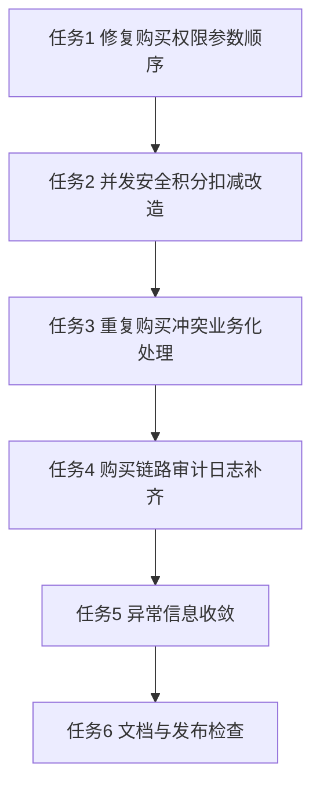

# 购买服务性能与安全优化原子任务清单

## 1. 目标与边界

### 1.1 总体目标
- 修复购买链路中的高风险正确性问题（权限校验参数、并发扣减、重复购买并发冲突表现）。
- 收敛异常返回中的敏感实现信息暴露风险。
- 补齐购买链路可观测性（关键业务审计日志），提升问题追踪能力。
- 在不改变既有业务规则前提下，提升稳定性与并发安全性。

### 1.2 明确边界
- 本清单不处理：全局校验策略改造（ValidationPipe 配置）。
- 本清单不处理：全局/接口限流策略改造（Throttler 规则与装饰器）。
- 本清单不处理：章节购买业务规则变更（仍按“章节可购 + 积分充足”）。
- 本清单不包含：测试设计、测试执行、测试报告相关内容。

### 1.3 涉及模块
- `libs/interaction/src/purchase/purchase.service.ts`
- `libs/content/src/permission/content-permission.service.ts`
- `libs/base/src/filters/http-exception.filter.ts`
- 购买相关 DTO/常量与文档文件（按实施阶段确定）

## 2. 执行顺序与依赖图

## 3. 原子任务明细

## 任务1：修复购买权限校验参数顺序
- 任务编号：T1
- 前置依赖：无
- 输入契约：
  - `PurchaseService.checkNeedPurchase`
  - `ContentPermissionService.validateChapterPurchasePermission` 方法签名
- 实施内容：
  - 修正调用参数顺序，保证 `userId` 与 `chapterId` 语义一致。
  - 对调用点和方法签名进行一次全链路核对，避免同类错误。
- 输出契约：
  - 已购校验逻辑与参数语义严格一致。
- 验收标准：
  - 已购用户命中“该章节已购买”业务分支。
  - 未购用户不被误判为已购。
- 估计影响文件：
  - `libs/interaction/src/purchase/purchase.service.ts`

## 任务2：并发安全积分扣减改造
- 任务编号：T2
- 前置依赖：T1
- 输入契约：
  - 当前“先查后写绝对值”的积分扣减实现
  - 项目内已有安全示例（条件更新 + decrement）
- 实施内容：
  - 将购买积分扣减改为事务内条件更新（`points >= targetPrice`）并原子递减。
  - 以更新结果行为准判断是否积分不足/用户异常，避免并发超扣。
  - 重新计算并写入积分流水的 `beforePoints/afterPoints`，保证账实一致。
- 输出契约：
  - 购买扣减在并发场景下不出现负积分或超扣。
- 验收标准：
  - 同用户同章节并发下不会出现超扣或负积分。
  - 失败请求不会写入错误积分流水。
  - 数据库积分与流水前后值一致。
- 估计影响文件：
  - `libs/interaction/src/purchase/purchase.service.ts`

## 任务3：重复购买冲突业务化处理
- 任务编号：T3
- 前置依赖：T2
- 输入契约：
  - 购买记录唯一约束
  - 事务中创建购买记录逻辑
- 实施内容：
  - 在购买事务内捕获唯一约束冲突并转换为业务可读错误（已购买）。
  - 确保冲突场景不产生重复扣分与重复流水。
  - 统一幂等返回行为，提升前端与调用方体验。
- 输出契约：
  - 并发重复购买场景返回稳定、可预期的业务错误。
- 验收标准：
  - 并发重复购买时仅有一条成功购买记录。
  - 积分仅扣减一次，流水仅新增一次。
  - 非冲突类异常不被误吞。
- 估计影响文件：
  - `libs/interaction/src/purchase/purchase.service.ts`
  - `libs/base/src/filters/http-exception.filter.ts`（如需错误码映射增强）

## 任务4：购买链路审计日志补齐
- 任务编号：T4
- 前置依赖：T3
- 输入契约：
  - 现有日志模块与 requestId 透传机制
- 实施内容：
  - 在购买关键节点记录结构化日志：请求进入、校验失败、扣减成功、事务失败。
  - 字段至少包含：userId、targetType、targetId、price、result、requestId。
  - 避免日志中输出敏感信息或过大对象。
- 输出契约：
  - 购买链路具备可追踪审计信息，可关联请求链路。
- 验收标准：
  - 单次购买可通过 requestId 串联完整关键事件。
  - 失败路径日志可区分“已购/积分不足/系统异常”。
- 估计影响文件：
  - `libs/interaction/src/purchase/purchase.service.ts`
  - 如有需要的日志工具封装文件。

## 任务5：异常信息收敛（避免内部信息外泄）
- 任务编号：T5
- 前置依赖：T4
- 输入契约：
  - 当前异常过滤器对数据库异常的回退文案策略
- 实施内容：
  - 调整未知数据库异常对外返回策略，避免直接透出底层异常原文。
  - 保留内部详细堆栈日志，外部返回统一安全文案。
  - 对已知错误码维持可读业务消息映射。
- 输出契约：
  - 外部响应不泄露内部数据库实现细节。
- 验收标准：
  - 未知数据库异常对外不再返回原始异常 message。
  - 服务器日志仍保留排障信息。
- 估计影响文件：
  - `libs/base/src/filters/http-exception.filter.ts`

## 任务6：文档与发布前检查
- 任务编号：T6
- 前置依赖：T5
- 输入契约：
  - 已完成并经功能侧确认的代码结果
- 实施内容：
  - 更新购买链路实现说明与异常行为说明文档。
  - 整理变更清单、风险点、回滚点、观测指标建议。
  - 输出最终验收记录，便于上线评审。
- 输出契约：
  - 一份可用于评审与交接的交付说明。
- 验收标准：
  - 文档与代码一致，覆盖行为变化与兼容性说明。
  - 明确上线后观察项与应急处理点。
- 估计影响文件：
  - `docs/purchase-service-optimization/` 下交付文档。

## 4. 统一验收清单（跨任务）
- 购买资格判定正确：不会误判已购/未购。
- 并发扣减安全：不超扣、不负分、流水一致。
- 重复购买幂等：唯一约束冲突被业务化处理。
- 异常安全：客户端响应不暴露内部数据库细节。
- 可观测性：关键路径日志可按 requestId 回溯。
- 文档一致：交付文档与最终实现行为一致。

## 5. 暂不执行项（待确认后再进入实施）
- 不提供测试相关任务与测试交付内容。
- 不处理全局校验与限流相关改造。

## 6. 本轮执行记录
- 已完成 T1：修复购买权限校验参数顺序（按 `userId, chapterId` 调用）。
- 已完成 T2：购买扣减改为事务内条件更新与原子递减，避免并发超扣。
- 已完成 T3：捕获购买唯一约束冲突并转为“该章节已购买”业务错误。
- 已完成 T4：补齐购买关键节点结构化日志（开始、成功、失败）。
- 已完成 T5：未知数据库错误对外统一为通用文案，避免透出内部异常原文。
- 已完成 T6：交付文档已同步当前实现结果。
