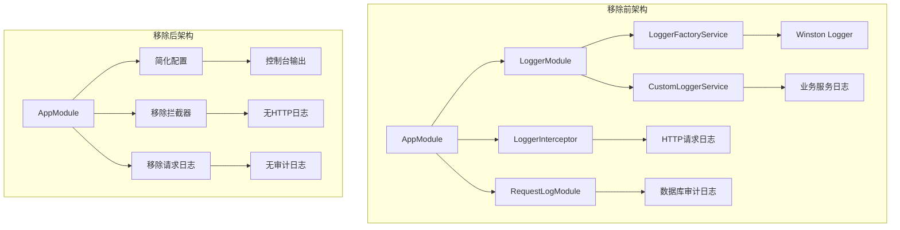
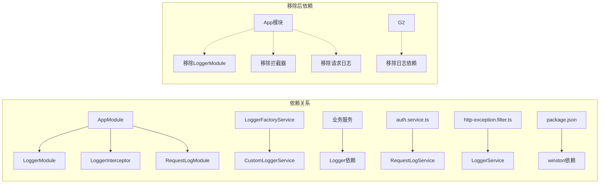
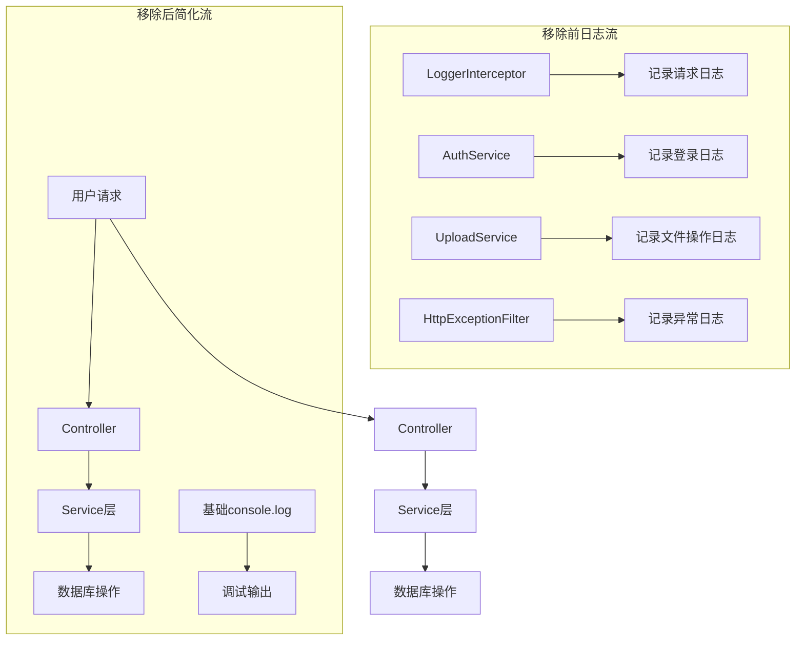

# 日志模块移除架构设计文档

## 整体架构设计

### 移除前后对比



### 分层设计和核心组件

#### 1. 核心移除组件
- **LoggerModule**: 整个日志模块完全移除
- **RequestLogModule**: 请求审计日志模块完全移除
- **LoggerInterceptor**: HTTP拦截器完全移除
- **Logger相关配置**: logger.config.ts 配置文件移除

#### 2. 受影响的服务层
- **AuthService**: 移除登录日志记录
- **AdminUserService**: 移除用户操作日志
- **UploadService**: 移除文件操作日志
- **BaseJwtService**: 移除JWT操作日志
- **HttpExceptionFilter**: 移除异常日志记录

#### 3. 基础设施层变化
- **AppModule**: 移除LoggerModule导入和Provider
- **main.ts**: 移除日志相关配置
- **app.setup.ts**: 移除日志服务设置
- **package.json**: 移除winston相关依赖

### 模块依赖关系图



### 数据流向图



### 接口契约定义

#### 移除前的核心接口
- `LoggerFactoryService`: 日志工厂服务接口
- `CustomLoggerService`: 自定义日志服务接口  
- `RequestLogService`: 请求日志服务接口

#### 移除后的简化接口
- **无日志接口**: 完全移除所有日志相关接口
- **基础调试**: 保留基础console调试能力

### 异常处理策略

#### 移除前异常处理
- 全局异常过滤器记录详细错误日志
- 分级日志记录 (ERROR, WARN, INFO, DEBUG)
- 业务异常和安全异常专门记录

#### 移除后异常处理
- 保持基础错误抛出机制
- 使用console.error进行基础错误输出
- 依赖外部监控工具进行错误追踪

## 技术实现方案

### 阶段化移除策略

#### 阶段1: 移除核心日志模块
1. 删除 `src/common/module/logger/` 目录
2. 删除 `src/config/logger.config.ts`
3. 删除 `src/interceptors/logger.interceptor.ts`

#### 阶段2: 移除请求审计日志
1. 删除 `src/modules/foundation/request-log/` 目录
2. 删除 `src/modules/admin/request-log/` 目录  
3. 更新 `foundation.module.ts`

#### 阶段3: 清理依赖关系
1. 更新所有使用日志服务的文件
2. 移除日志相关的导入和调用
3. 更新 `app.module.ts`

#### 阶段4: 清理依赖包
1. 更新 `package.json` 移除winston依赖
2. 更新相关配置文件

### 代码替换策略

#### 1. 日志服务调用替换
**替换前:**
```typescript
this.logger.logBusiness('action', 'success', meta)
this.logger.error('error message', stack, meta)
this.logger.warn('warning message')
```

**替换后:**
```typescript
// 移除或替换为console.log
console.log(`Action completed:`, meta)
// 或完全移除日志调用
```

#### 2. 依赖注入替换
**替换前:**
```typescript
constructor(private readonly logger: CustomLoggerService) {}
```

**替换后:**
```typescript
// 移除logger依赖
constructor() {}
```

#### 3. 模块导入替换
**替换前:**
```typescript
import { LoggerModule } from '@/common/module/logger/logger.module'
```

**替换后:**
```typescript
// 移除导入
```

### 质量保证措施

#### 编译检查
- 确保所有日志相关导入都已清理
- 验证TypeScript编译通过
- 检查运行时依赖完整性

#### 功能验证
- 测试核心业务功能正常运行
- 验证用户认证流程
- 测试文件上传下载功能
- 验证API响应正常

#### 代码质量
- 保持代码风格一致性
- 确保无冗余代码残留
- 维护良好的代码可读性

## 风险控制

### 高风险项
1. **编译错误**: 日志相关类型引用未清理
2. **运行时错误**: 依赖注入失败
3. **功能缺失**: 关键业务日志移除导致功能不完整

### 控制措施
1. **分阶段执行**: 每个阶段完成后立即验证
2. **全面测试**: 关键路径功能测试
3. **代码审查**: 确保修改的系统性和完整性
4. **备份策略**: 修改前做好代码备份

## 成功标准

1. **编译成功**: 项目能够无错误编译
2. **功能完整**: 核心业务功能正常运行
3. **代码整洁**: 无日志相关冗余代码
4. **依赖清理**: package.json等配置文件完全更新
5. **性能提升**: 移除日志后性能有所改善

## 状态
- **文档版本**: v1.0
- **创建时间**: 2024-12-18
- **状态**: 待执行