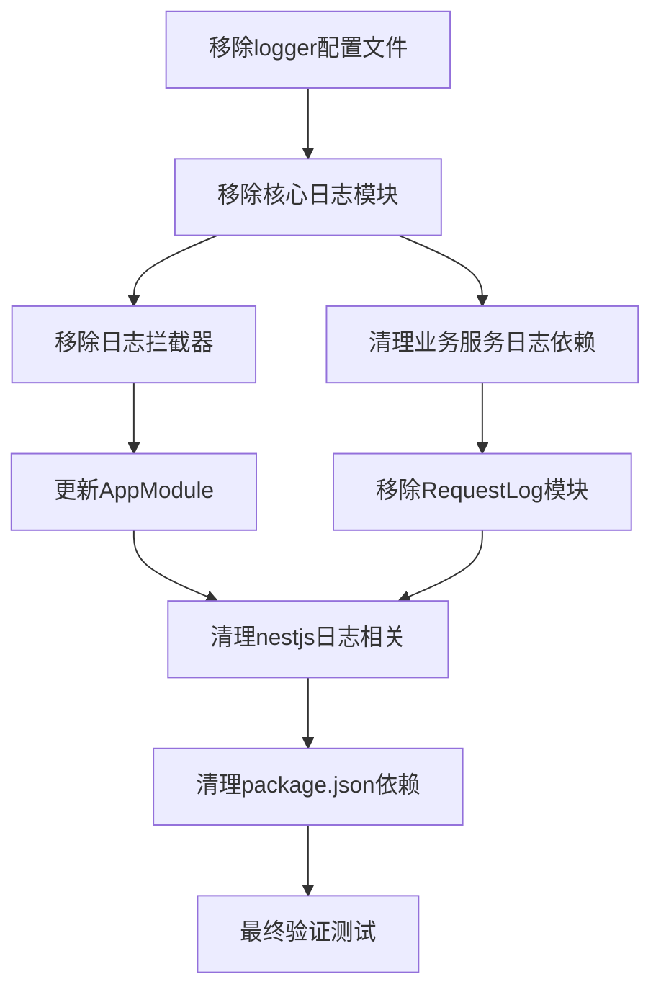

# 日志模块移除原子任务拆分

## 任务依赖图

## 原子任务列表

### 任务1: 移除Logger配置文件
**任务ID**: T1_REMOVE_LOGGER_CONFIG  
**优先级**: 高  
**输入契约**:
- `src/config/logger.config.ts` 存在
- 项目当前能够正常编译

**输出契约**:
- `src/config/logger.config.ts` 文件已删除
- 引用该文件的导入语句已被识别（准备清理）

**实现约束**:
- 直接删除配置文件
- 不需要替换内容

**依赖关系**:
- 后续任务依赖: T2, T3, T4, T5, T6
- 并行任务: 无

**验收标准**:
- 文件已删除
- 项目编译报错（预期结果，因为有依赖引用）

---

### 任务2: 移除核心日志模块
**任务ID**: T2_REMOVE_LOGGER_MODULE  
**优先级**: 高  
**输入契约**:
- `src/common/module/logger/` 目录存在
- 所有依赖文件已识别

**输出契约**:
- `src/common/module/logger/` 整个目录已删除
- 包含: logger.service.ts, logger-factory.service.ts, logger.module.ts

**实现约束**:
- 递归删除整个logger模块目录
- 不保留任何文件

**依赖关系**:
- 前置任务: T1
- 后续任务: T3, T4, T5, T6
- 并行任务: 无

**验收标准**:
- 整个logger目录已删除
- 项目编译报错（预期结果，因为有依赖引用）

---

### 任务3: 移除日志拦截器
**任务ID**: T3_REMOVE_LOGGER_INTERCEPTOR  
**优先级**: 高  
**输入契约**:
- `src/interceptors/logger.interceptor.ts` 存在
- 拦截器已在app.module.ts中注册

**输出契约**:
- `src/interceptors/logger.interceptor.ts` 已删除
- 相关的日志拦截器依赖已清理

**实现约束**:
- 删除拦截器文件
- 清理app.module.ts中的LoggerInterceptor导入和注册

**依赖关系**:
- 前置任务: T2
- 后续任务: T5
- 并行任务: 无

**验收标准**:
- 拦截器文件已删除
- app.module.ts中无LoggerInterceptor相关代码
- 项目编译状态改善

---

### 任务4: 清理业务服务日志依赖
**任务ID**: T4_CLEANUP_SERVICE_LOGGERS  
**优先级**: 高  
**输入契约**:
- 以下服务文件存在且包含日志依赖:
  - `src/filters/http-exception.filter.ts`
  - `src/modules/client/auth/client-jwt.service.ts`
  - `src/modules/upload/upload.service.ts`
  - `src/modules/admin/user/user.service.ts`
  - `src/common/module/jwt/base-jwt.service.ts`
  - `src/modules/admin/auth/auth.service.ts`

**输出契约**:
- 所有日志依赖注入已移除
- 所有日志方法调用已移除或替换为console.log
- 相关的导入语句已清理

**实现约束**:
- 保留基础错误处理逻辑，移除日志记录
- 对于必需的调试信息，可替换为console.log
- 保持代码逻辑完整性

**依赖关系**:
- 前置任务: T2
- 后续任务: T5, T6
- 并行任务: 无

**验收标准**:
- 所有文件中的logger依赖已清理
- 核心业务逻辑保持完整
- 编译错误数量减少

---

### 任务5: 移除RequestLog模块
**任务ID**: T5_REMOVE_REQUEST_LOG_MODULE  
**优先级**: 高  
**输入契约**:
- `src/modules/foundation/request-log/` 目录存在
- `src/modules/admin/request-log/` 目录存在
- foundation.module.ts包含RequestLogModule
- auth.service.ts依赖RequestLogService

**输出契约**:
- request-log相关目录和文件已删除
- foundation.module.ts已更新
- auth.service.ts中的RequestLogService依赖已移除
- 相关的登录日志记录逻辑已简化

**实现约束**:
- 删除整个request-log模块
- 保留必要的登录失败次数限制逻辑
- 移除RequestLogService的所有调用

**依赖关系**:
- 前置任务: T2, T3, T4
- 后续任务: T6
- 并行任务: 无

**验收标准**:
- RequestLog模块已完全删除
- foundation.module.ts已清理
- auth.service.ts编译通过
- 登录功能逻辑完整但无日志

---

### 任务6: 清理NestJS和主模块配置
**任务ID**: T6_CLEANUP_NESTJS_CONFIG  
**优先级**: 高  
**输入契约**:
- `src/nestjs/lifecycle.ts`包含logStartupInfo
- `src/nestjs/app.setup.ts`依赖LoggerFactoryService
- `src/app.module.ts`导入LoggerModule
- `src/main.ts`包含日志相关配置

**输出契约**:
- 所有nestjs文件中的日志相关代码已清理
- app.module.ts中的LoggerModule导入已移除
- main.ts中的日志配置已简化
- 启动信息输出简化为console.log

**实现约束**:
- 保持应用启动和运行的基本功能
- 将启动信息输出替换为console.log
- 移除复杂的日志配置

**依赖关系**:
- 前置任务: T2, T3, T4, T5
- 后续任务: T7
- 并行任务: 无

**验收标准**:
- 所有nestjs配置已清理
- 应用能够正常启动
- 启动信息通过console输出

---

### 任务7: 清理package.json依赖
**任务ID**: T7_CLEANUP_PACKAGE_DEPS  
**优先级**: 中  
**输入契约**:
- package.json包含winston相关依赖:
  - "nest-winston": "^1.10.2"
  - "winston": "^3.18.3"
  - "winston-daily-rotate-file": "^5.0.0"
  - "@types/winston": "^2.4.4"

**输出契约**:
- 所有winston相关依赖已从package.json移除
- pnpm-lock.yaml重新生成
- type定义文件引用已清理

**实现约束**:
- 精确移除指定的依赖包
- 保持其他依赖不变
- 确保pnpm安装无错误

**依赖关系**:
- 前置任务: T6
- 后续任务: T8
- 并行任务: 无

**验收标准**:
- package.json无winston依赖
- pnpm install成功
- 无类型定义错误

---

### 任务8: 最终验证测试
**任务ID**: T8_FINAL_VERIFICATION  
**优先级**: 高  
**输入契约**:
- 所有日志模块已移除
- 项目能够编译
- 核心业务功能已验证

**输出契约**:
- 完整的功能测试报告
- 性能对比报告
- 问题清单和解决状态

**实现约束**:
- 测试用户认证流程
- 测试文件上传下载
- 测试API响应
- 验证应用启动
- 检查编译和构建

**依赖关系**:
- 前置任务: T1-T7
- 后续任务: 无
- 并行任务: 无

**验收标准**:
- 所有测试通过
- 应用正常启动
- 核心功能完整
- 无编译错误

---

## 风险控制点

### 高风险任务
1. **T4**: 清理业务服务日志依赖 - 容易影响业务逻辑
2. **T5**: 移除RequestLog模块 - 影响认证流程
3. **T6**: 清理NestJS配置 - 影响应用启动

### 风险缓解措施
1. **分步验证**: 每个任务完成后立即验证编译状态
2. **代码备份**: 重要文件修改前做好备份
3. **功能测试**: 关键业务路径实时测试
4. **回滚准备**: 准备快速回滚方案

## 成功标准

### 编译成功
- TypeScript编译无错误
- 无未解析的依赖
- 所有类型检查通过

### 功能完整  
- 用户认证功能正常
- 文件上传下载功能正常
- API接口响应正常
- 应用启动和运行正常

### 代码质量
- 无冗余的日志相关代码
- 保持代码风格一致
- 注释和文档更新

### 性能改善
- 应用启动时间改善
- 内存使用量减少
- 无日志文件I/O开销

## 状态
- **文档版本**: v1.0
- **创建时间**: 2024-12-18
- **状态**: 待执行