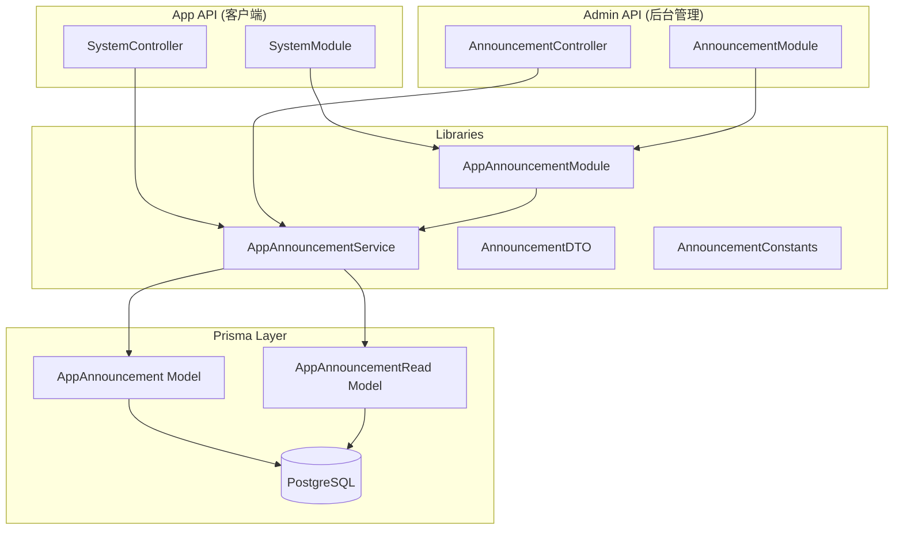
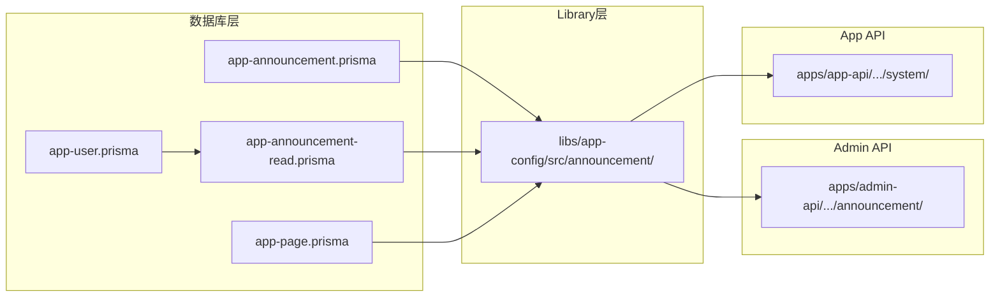
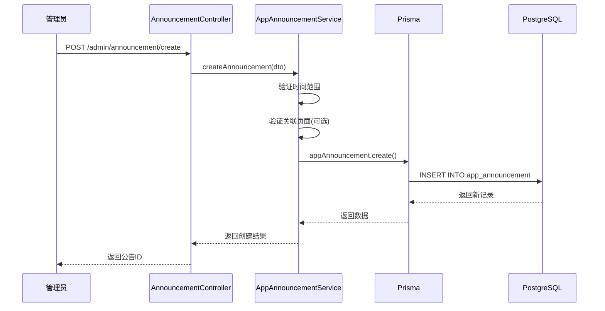
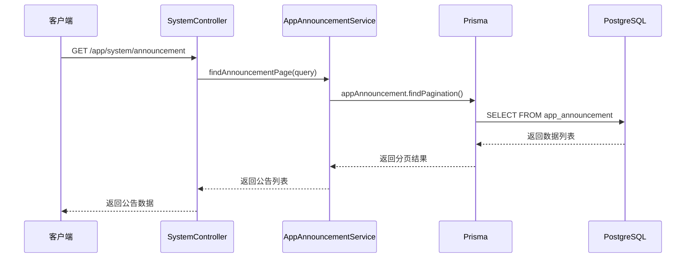
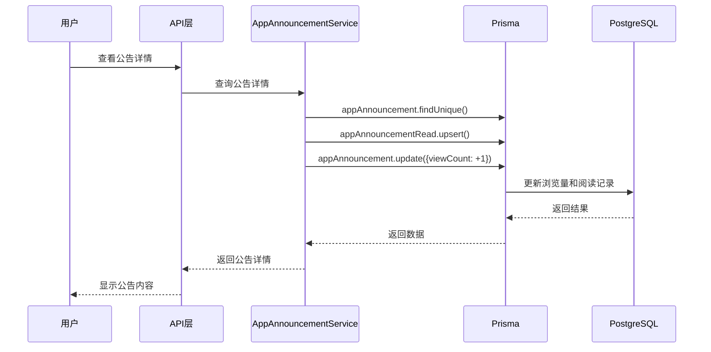

# 系统公告改造 - 架构设计文档

## 一、整体架构图



## 二、模块依赖关系图



## 三、数据流向图

### 3.1 创建公告流程



### 3.2 查询公告列表流程



### 3.3 阅读记录流程



## 四、核心组件设计

### 4.1 Prisma 模型

#### AppAnnouncement

```prisma
/// 系统公告表 - 存储平台公告、活动公告、维护公告等信息
model AppAnnouncement {
  id                Int       @id @default(autoincrement())
  pageId            Int?      @map("page_id")
  title             String    @db.VarChar(100)
  content           String
  summary           String?   @db.VarChar(500)
  announcementType  Int       @default(0) @map("announcement_type") @db.SmallInt
  priorityLevel     Int       @default(1) @map("priority_level") @db.SmallInt
  publishStartTime  DateTime? @map("publish_start_time") @db.Timestamptz(6)
  publishEndTime    DateTime? @map("publish_end_time") @db.Timestamptz(6)
  popupBackgroundImage String? @map("popup_background_image") @db.VarChar(200)
  isPublished       Boolean   @default(false) @map("is_published")
  isPinned          Boolean   @default(false) @map("is_pinned")
  showAsPopup       Boolean   @default(false) @map("show_as_popup")
  enablePlatform    Int[]     @map("enable_platform")
  viewCount         Int       @default(0) @map("view_count")

  createdAt         DateTime  @default(now()) @map("created_at") @db.Timestamptz(6)
  updatedAt         DateTime  @updatedAt @map("updated_at") @db.Timestamptz(6)

  appPage           AppPage?              @relation("announcements", fields: [pageId], references: [id])
  announcementReads AppAnnouncementRead[]

  @@index([isPublished, publishStartTime, publishEndTime])
  @@index([announcementType, isPublished])
  @@index([priorityLevel, isPinned])
  @@index([createdAt])
  @@index([pageId])
  @@index([showAsPopup, isPublished])
  @@map("app_announcement")
}
```

#### AppAnnouncementRead

```prisma
/// 系统公告阅读记录表 - 记录用户已读的公告
model AppAnnouncementRead {
  id              Int      @id @default(autoincrement())
  announcementId  Int      @map("announcement_id")
  userId          Int      @map("user_id")
  readAt          DateTime @default(now()) @map("read_at") @db.Timestamptz(6)

  announcement    AppAnnouncement @relation(fields: [announcementId], references: [id], onDelete: Cascade)
  user            AppUser         @relation(fields: [userId], references: [id], onDelete: Cascade)

  @@unique([announcementId, userId])
  @@index([announcementId])
  @@index([userId])
  @@index([readAt])
  @@map("app_announcement_read")
}
```

### 4.2 服务层接口契约

#### AppAnnouncementService

```typescript
interface AppAnnouncementService {
  // 创建公告
  createAnnouncement(dto: CreateAnnouncementDto): Promise<AppAnnouncement>

  // 分页查询公告列表
  findAnnouncementPage(dto: QueryAnnouncementDto): Promise<PaginationResult<AppAnnouncement>>

  // 更新公告
  updateAnnouncement(dto: UpdateAnnouncementDto): Promise<AppAnnouncement>

  // 获取公告详情
  findAnnouncementDetail(id: number): Promise<AppAnnouncementDetail>

  // 增加浏览量
  incrementViewCount(id: number): Promise<void>
}
```

### 4.3 控制器接口契约

#### Admin AnnouncementController

| 方法 | 路径 | 描述 |
|------|------|------|
| POST | `/admin/announcement/create` | 创建公告 |
| GET | `/admin/announcement/page` | 分页查询公告列表 |
| GET | `/admin/announcement/detail` | 获取公告详情 |
| POST | `/admin/announcement/update` | 更新公告 |
| POST | `/admin/announcement/update-status` | 更新公告状态 |
| POST | `/admin/announcement/delete` | 删除公告 |

#### App SystemController (公告相关)

| 方法 | 路径 | 描述 |
|------|------|------|
| GET | `/app/system/announcement` | 获取系统公告列表 |

## 五、异常处理策略

### 5.1 业务异常

| 异常类型 | HTTP状态码 | 触发条件 |
|----------|------------|----------|
| 公告不存在 | 400 | 查询/更新/删除不存在的公告 |
| 关联页面不存在 | 400 | 关联的页面ID不存在 |
| 时间范围无效 | 400 | 发布开始时间 >= 结束时间 |

### 5.2 数据库异常

- 外键约束违反：关联数据不存在时抛出友好错误
- 唯一约束违反：重复阅读记录时使用 upsert 处理

## 六、文件变更清单

### 6.1 需要重命名的文件

| 原路径 | 新路径 |
|--------|--------|
| `prisma/models/app/app-notice.prisma` | `prisma/models/app/app-announcement.prisma` |
| `prisma/models/app/app-notice-read.prisma` | `prisma/models/app/app-announcement-read.prisma` |
| `libs/app-config/src/notice/*` | `libs/app-config/src/announcement/*` |
| `apps/admin-api/src/modules/app-config/notice/*` | `apps/admin-api/src/modules/app-config/announcement/*` |
| `prisma/seed/modules/app/notice.ts` | `prisma/seed/modules/app/announcement.ts` |

### 6.2 需要修改内容的文件

| 文件路径 | 修改内容 |
|----------|----------|
| `prisma/models/app/app-page.prisma` | 更新关联关系名称 |
| `prisma/models/app/app-user.prisma` | 更新关联关系名称 |
| `libs/app-config/src/index.ts` | 更新导出路径 |
| `apps/app-api/src/modules/system/system.module.ts` | 更新模块引用 |
| `apps/app-api/src/modules/system/system.controller.ts` | 更新服务引用和路径 |
| `apps/admin-api/src/modules/admin.module.ts` | 更新模块引用 |
| `prisma/seed/modules/app/index.ts` | 更新种子文件引用 |
| `prisma/seed/index.ts` | 更新种子文件引用 |

### 6.3 需要删除的文件

| 文件路径 | 说明 |
|----------|------|
| `prisma/models/app/app-notice.prisma` | 重命名后删除原文件 |
| `prisma/models/app/app-notice-read.prisma` | 重命名后删除原文件 |
| `libs/app-config/src/notice/` | 重命名后删除原目录 |
| `apps/admin-api/src/modules/app-config/notice/` | 重命名后删除原目录 |

## 七、迁移策略

### 7.1 数据库迁移步骤

1. 创建迁移文件，包含：
   - DROP TABLE `app_notice_read`
   - DROP TABLE `app_notice`
   - CREATE TABLE `app_announcement`
   - CREATE TABLE `app_announcement_read`

2. 执行迁移：`npx prisma migrate dev --name rename_notice_to_announcement`

3. 执行种子数据：`npx prisma db seed`

### 7.2 代码迁移步骤

1. 修改 Prisma 模型文件
2. 运行 `npx prisma generate` 更新 Prisma Client
3. 重命名 Library 模块
4. 重命名 Admin API 模块
5. 更新 App API 模块
6. 更新种子数据文件
7. 更新其他引用文件
