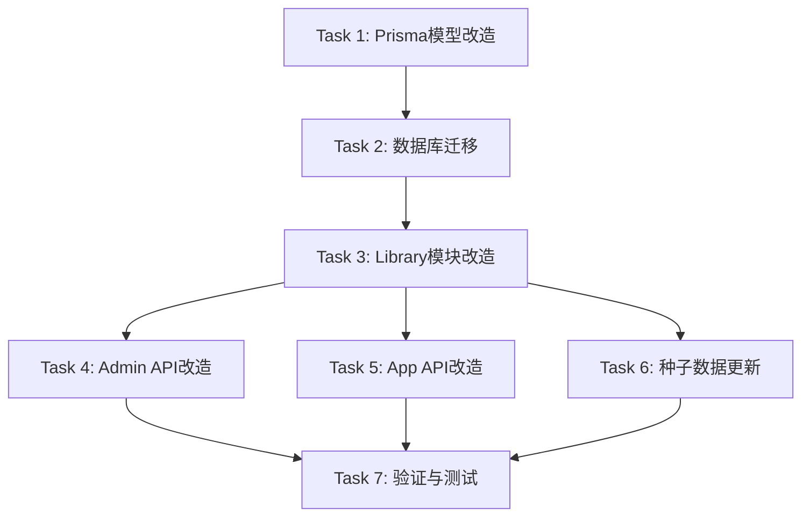

# 系统公告改造 - 任务拆分文档

## 任务依赖关系图



---

## Task 1: Prisma 模型改造

### 输入契约
- 前置依赖：无
- 输入数据：现有 `app-notice.prisma`、`app-notice-read.prisma`、`app-page.prisma`、`app-user.prisma`
- 环境依赖：Prisma CLI

### 任务内容

#### 1.1 创建 AppAnnouncement 模型
- 创建文件：`prisma/models/app/app-announcement.prisma`
- 修改内容：
  - 模型名：`AppNotice` → `AppAnnouncement`
  - 表名：`app_notice` → `app_announcement`
  - 字段名：`noticeType` → `announcementType`
  - 新增字段：`summary`（摘要）、`viewCount`（浏览量）
  - 关联关系名：`notices` → `announcements`
  - 关联表名：`noticeReads` → `announcementReads`

#### 1.2 创建 AppAnnouncementRead 模型
- 创建文件：`prisma/models/app/app-announcement-read.prisma`
- 修改内容：
  - 模型名：`AppNoticeRead` → `AppAnnouncementRead`
  - 表名：`app_notice_read` → `app_announcement_read`
  - 字段名：`noticeId` → `announcementId`
  - 关联名：`notice` → `announcement`

#### 1.3 更新 AppPage 模型
- 修改文件：`prisma/models/app/app-page.prisma`
- 修改内容：关联关系 `notices AppNotice[]` → `announcements AppAnnouncement[]`

#### 1.4 更新 AppUser 模型
- 修改文件：`prisma/models/app/app-user.prisma`
- 修改内容：关联关系 `noticeReads AppNoticeRead[]` → `announcementReads AppAnnouncementRead[]`

#### 1.5 删除旧模型文件
- 删除：`prisma/models/app/app-notice.prisma`
- 删除：`prisma/models/app/app-notice-read.prisma`

### 输出契约
- 输出数据：新的 Prisma 模型文件
- 交付物：4个修改后的模型文件
- 验收标准：Prisma schema 语法正确，关联关系完整

---

## Task 2: 数据库迁移

### 输入契约
- 前置依赖：Task 1 完成
- 输入数据：更新后的 Prisma 模型
- 环境依赖：数据库连接

### 任务内容

#### 2.1 创建迁移文件
- 执行命令：`npx prisma migrate dev --name rename_notice_to_announcement --create-only`
- 生成的迁移文件将包含：
  - DROP TABLE `app_notice_read`
  - DROP TABLE `app_notice`
  - CREATE TABLE `app_announcement`
  - CREATE TABLE `app_announcement_read`

#### 2.2 执行迁移
- 执行命令：`npx prisma migrate dev`

#### 2.3 更新 Prisma Client
- 执行命令：`npx prisma generate`

### 输出契约
- 输出数据：迁移记录
- 交付物：迁移文件、更新后的 Prisma Client
- 验收标准：迁移成功，数据库表结构正确

---

## Task 3: Library 模块改造

### 输入契约
- 前置依赖：Task 2 完成
- 输入数据：现有 `libs/app-config/src/notice/` 目录
- 环境依赖：TypeScript 编译环境

### 任务内容

#### 3.1 创建新目录结构
```
libs/app-config/src/announcement/
├── dto/
│   └── announcement.dto.ts
├── announcement.service.ts
├── announcement.module.ts
├── announcement.constant.ts
└── index.ts
```

#### 3.2 创建 announcement.constant.ts
- 重命名枚举：
  - `NoticeTypeEnum` → `AnnouncementTypeEnum`
  - `NoticePriorityEnum` → `AnnouncementPriorityEnum`
- 新增枚举值：`POLICY = 4`
- 更新枚举描述

#### 3.3 创建 announcement.dto.ts
- 重命名所有 DTO 类：
  - `BaseNoticeDto` → `BaseAnnouncementDto`
  - `CreateNoticeDto` → `CreateAnnouncementDto`
  - `UpdateNoticeDto` → `UpdateAnnouncementDto`
  - `QueryNoticeDto` → `QueryAnnouncementDto`
  - `NoticeDetailDto` → `AnnouncementDetailDto`
  - `NoticePageResponseDto` → `AnnouncementPageResponseDto`
  - `UpdateNoticeStatusDto` → `UpdateAnnouncementStatusDto`
  - `RelatedPageDto` 保持不变
- 新增字段：`summary`、`viewCount`
- 更新字段名：`noticeType` → `announcementType`

#### 3.4 创建 announcement.service.ts
- 重命名类：`AppNoticeService` → `AppAnnouncementService`
- 重命名方法：
  - `createNotice` → `createAnnouncement`
  - `findNoticePage` → `findAnnouncementPage`
  - `updateNotice` → `updateAnnouncement`
  - `findNoticeDetail` → `findAnnouncementDetail`
- 更新 Prisma 引用：
  - `appNotice` → `appAnnouncement`
  - `appPage` 保持不变
- 新增方法：`incrementViewCount`

#### 3.5 创建 announcement.module.ts
- 重命名模块：`AppNoticeModule` → `AppAnnouncementModule`
- 更新服务引用

#### 3.6 创建 index.ts
- 更新所有导出名称

#### 3.7 删除旧目录
- 删除：`libs/app-config/src/notice/`

#### 3.8 更新 libs/app-config/src/index.ts
- 更新导出路径

### 输出契约
- 输出数据：新的 announcement 模块
- 交付物：完整的 Library 模块文件
- 验收标准：TypeScript 编译通过，导出正确

---

## Task 4: Admin API 改造

### 输入契约
- 前置依赖：Task 3 完成
- 输入数据：现有 `apps/admin-api/src/modules/app-config/notice/` 目录
- 环境依赖：NestJS 编译环境

### 任务内容

#### 4.1 创建新目录结构
```
apps/admin-api/src/modules/app-config/announcement/
├── announcement.controller.ts
└── announcement.module.ts
```

#### 4.2 创建 announcement.controller.ts
- 重命名类：`AppNoticeController` → `AppAnnouncementController`
- 更新路由：`@Controller('admin/notice')` → `@Controller('admin/announcement')`
- 更新 API 标签：`APP管理/通知公告` → `APP管理/系统公告`
- 更新服务引用：`AppNoticeService` → `AppAnnouncementService`
- 更新方法引用和 DTO 类型

#### 4.3 创建 announcement.module.ts
- 重命名模块：`AppNoticeModule` → `AppAnnouncementModule`
- 更新控制器和服务引用

#### 4.4 删除旧目录
- 删除：`apps/admin-api/src/modules/app-config/notice/`

#### 4.5 更新 admin.module.ts
- 更新模块引用

### 输出契约
- 输出数据：新的 announcement 控制器模块
- 交付物：Admin API 公告管理模块
- 验收标准：路由正确，Swagger 文档正确

---

## Task 5: App API 改造

### 输入契约
- 前置依赖：Task 3 完成
- 输入数据：现有 `apps/app-api/src/modules/system/` 目录
- 环境依赖：NestJS 编译环境

### 任务内容

#### 5.1 更新 system.controller.ts
- 更新导入：`AppNoticeService` → `AppAnnouncementService`
- 更新路由：`@Get('/notice')` → `@Get('/announcement')`
- 更新服务引用和方法调用
- 更新 Swagger 文档描述

#### 5.2 更新 system.module.ts
- 更新导入：`AppNoticeModule` → `AppAnnouncementModule`

### 输出契约
- 输出数据：更新后的 system 模块
- 交付物：App API 系统模块
- 验收标准：路由正确，接口正常

---

## Task 6: 种子数据更新

### 输入契约
- 前置依赖：Task 3 完成
- 输入数据：现有 `prisma/seed/modules/app/notice.ts`
- 环境依赖：Prisma

### 任务内容

#### 6.1 创建 announcement.ts
- 重命名函数：`createInitialAppNotice` → `createInitialAppAnnouncement`
- 更新 Prisma 引用：`appNotice` → `appAnnouncement`
- 更新字段名：`noticeType` → `announcementType`
- 更新初始数据内容（5条示例公告）

#### 6.2 删除旧文件
- 删除：`prisma/seed/modules/app/notice.ts`

#### 6.3 更新 seed/modules/app/index.ts
- 更新导入和函数引用

#### 6.4 更新 seed/index.ts
- 更新导入和函数调用

### 输出契约
- 输出数据：新的种子数据文件
- 交付物：种子数据脚本
- 验收标准：种子数据可正常执行

---

## Task 7: 验证与测试

### 输入契约
- 前置依赖：Task 4, 5, 6 全部完成
- 输入数据：完整的项目代码
- 环境依赖：Node.js、PostgreSQL

### 任务内容

#### 7.1 编译验证
- 执行：`pnpm build` 或 `npm run build`
- 检查：无 TypeScript 编译错误

#### 7.2 数据库验证
- 执行：`npx prisma db seed`
- 检查：种子数据正确填充

#### 7.3 API 验证
- 启动服务
- 测试 Admin API 接口
- 测试 App API 接口

### 输出契约
- 输出数据：验证报告
- 交付物：验收文档
- 验收标准：所有功能正常

---

## 执行顺序总结

| 顺序 | 任务ID | 任务名称 | 预计影响文件数 |
|------|--------|----------|----------------|
| 1 | Task 1 | Prisma 模型改造 | 4 |
| 2 | Task 2 | 数据库迁移 | 1 (迁移文件) |
| 3 | Task 3 | Library 模块改造 | 5 |
| 4 | Task 4 | Admin API 改造 | 3 |
| 5 | Task 5 | App API 改造 | 2 |
| 6 | Task 6 | 种子数据更新 | 3 |
| 7 | Task 7 | 验证与测试 | - |
