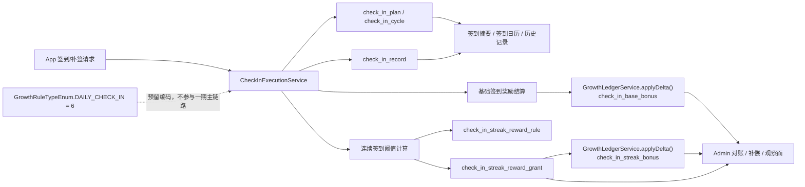

# Task / Check-In 签到方案工作包

本目录承载两类内容：

1. 全量梳理当前 `task` 相关功能模块、代码边界和可复用能力；
2. 在“不依赖 `task`、不依赖现存签到事件配置”的前提下，设计一版可落地的签到功能方案。

本目录的职责：

1. 说明当前 `task` 域已经覆盖了哪些能力、哪些不该再承担；
2. 为“签到计划配置、补签、连续签到奖励、签到记录、奖励对账与补偿”提供唯一排期事实源；
3. 记录从当前代码到目标实现的分波次演进路径。

本目录不负责：

1. 替代既有 `task` 重构文档中的已完成结论；
2. 直接充当代码实现或测试证据；
3. 维护第二套与 `execution-plan.md` 冲突的优先级、依赖和状态。

## 与既有文档的关系

- `docs/task-growth-notification-rearchitecture-work-items`：记录 `task / growth / notification` 主链路的全链路重估与既有收口结论；
- `docs/task-growth-reward-work-items`：记录已完成的定点修复与验收结果；
- 本目录：承接“签到功能”方案，但明确它不再作为 `task` 的扩展实现，而是独立子域。

## 当前梳理结论

1. 当前 `task` 域已经稳定分成 `controller -> TaskService facade -> definition/execution/runtime/support` 四层，定义态、执行态、运行态职责已经清晰。
2. `task` 的事实模型仍然只有 `task / task_assignment / task_progress_log` 三张表，本质上擅长表达“目标式任务”，不擅长表达“按自然日记录的签到日历”。
3. `task` 不适合作为签到主模型，原因是它缺少：
   - 每日签到事实；
   - 每周期补签额度；
   - 连续签到断点修复；
   - 连续阈值奖励发放记录；
   - 面向签到运营的专属配置入口。
4. `GrowthRuleTypeEnum.DAILY_CHECK_IN = 6` 现在只保留为预留编码，不再视为当前可配置、可运营的现成功能。
5. `event-definition.map.ts` 中的 `DAILY_CHECK_IN` 已降为“预留事件”，不再进入当前可配置事件视图。
6. `db/seed/modules/app/domain.ts` 中的签到积分/经验规则已不应作为现状能力继续预置。
7. 因此，签到一期方案应完全独立于 `task`，也不依赖现存 `DAILY_CHECK_IN` 事件配置；签到奖励由签到域自己配置并直接进入成长账本。
8. 若未来确实需要“签到任务化运营”或“签到事件广播”，应作为后续独立扩展任务，再显式接入 `task` 或事件桥接。

## 目标方案总览

## 文档分工

| 文档 | 角色 | 负责 | 不负责 |
| --- | --- | --- | --- |
| `execution-plan.md` | 唯一排期事实源 | 优先级、依赖、波次、状态、变更记录 | 代码实现细节 |
| `development-plan.md` | 开发补充 | 当前 task 全量盘点、签到架构、影响模块、测试重点 | 重新定义排序 |
| `p0/*` `p1/*` `p2/*` | 单任务文档 | 单任务目标、范围、非目标、主要改动、完成标准 | 跨任务验收 |
| `checklists/final-acceptance-checklist.md` | 最终验收 | 功能、回归、奖励、对账、性能、上线阻塞项 | 具体实施方案 |

## 推荐阅读顺序

1. [execution-plan.md](./execution-plan.md)
2. [development-plan.md](./development-plan.md)
3. `P0` 任务单
4. `P1` 任务单
5. `P2` 任务单
6. [checklists/final-acceptance-checklist.md](./checklists/final-acceptance-checklist.md)

## 主要代码锚点

### 当前 Task 主链路（用于边界梳理，不作为签到依赖）

- `apps/admin-api/src/modules/task/task.controller.ts`
- `apps/app-api/src/modules/task/task.controller.ts`
- `libs/growth/src/task/task.module.ts`
- `libs/growth/src/task/task.service.ts`
- `libs/growth/src/task/task-definition.service.ts`
- `libs/growth/src/task/task-execution.service.ts`
- `libs/growth/src/task/task-runtime.service.ts`
- `libs/growth/src/task/task.service.support.ts`
- `db/schema/app/task.ts`
- `db/schema/app/task-assignment.ts`
- `db/schema/app/task-progress-log.ts`

### 当前 Growth / Ledger 复用锚点

- `libs/growth/src/growth-ledger/growth-ledger.service.ts`
- `libs/growth/src/growth-ledger/growth-ledger.constant.ts`
- `db/schema/app/growth-ledger-record.ts`
- `db/schema/app/growth-audit-log.ts`
- `db/schema/app/growth-rule-usage-slot.ts`

### 预留编码治理锚点

- `libs/growth/src/growth-rule.constant.ts`
- `libs/growth/src/event-definition/event-definition.map.ts`
- `db/seed/modules/app/domain.ts`

### 本方案建议新增锚点

- `libs/growth/src/check-in/check-in.module.ts`
- `libs/growth/src/check-in/check-in.service.ts`
- `libs/growth/src/check-in/check-in-definition.service.ts`
- `libs/growth/src/check-in/check-in-execution.service.ts`
- `libs/growth/src/check-in/check-in-runtime.service.ts`
- `libs/growth/src/check-in/check-in.constant.ts`
- `libs/growth/src/check-in/check-in.type.ts`
- `apps/app-api/src/modules/check-in/*`
- `apps/admin-api/src/modules/check-in/*`
- `db/schema/app/check-in-plan.ts`
- `db/schema/app/check-in-cycle.ts`
- `db/schema/app/check-in-record.ts`
- `db/schema/app/check-in-streak-reward-rule.ts`
- `db/schema/app/check-in-streak-reward-grant.ts`

## 当前边界判断

1. `task` 仍然是“运营任务包装、assignment、bonus 奖励、任务提醒”的宿主，但这和签到主模型不是一回事。
2. 签到一期不依赖 `task`，不通过 `task_assignment` 承载签到事实，不要求任何签到相关任务联动。
3. 签到一期也不依赖现存 `DAILY_CHECK_IN` 事件配置；`DAILY_CHECK_IN = 6` 只保留为预留编码。
4. 基础签到奖励与连续签到奖励都由签到域自己配置，并直接写入成长账本。
5. 若未来要做签到任务、签到事件广播或签到活动运营，应新增独立扩展任务，而不是反向污染签到一期主模型。

## 当前默认决议

1. 签到域采用“计划 + 用户周期实例 + 每日记录 + 连续奖励规则 + 连续奖励发放记录”的五层模型。
2. 第一阶段只允许一个 `PUBLISHED + isEnabled` 且落在发布时间窗内的签到计划生效。
3. `check_in_plan` 自带 `baseRewardConfig`，用于基础签到奖励。
4. `check_in_streak_reward_rule` 用于配置连续阈值奖励。
5. 基础签到奖励与连续签到奖励都通过签到域直连 `GrowthLedgerService` 结算，而不是依赖现有规则表或 `task`。
6. `GrowthRuleTypeEnum.DAILY_CHECK_IN = 6` 保留，但不出现在当前可配置事件视图，也不在 seed 中启用对应奖励规则。
7. 补签只允许补当前周期内、早于当前自然日、且尚未签到的日期；不允许跨周期补签，不允许补未来日期。
8. 签到成功的判定以“签到事实写入成功”为准；奖励失败属于可补偿副作用，不回滚签到事实。
9. 计划发布时间窗采用左闭右开区间：`publishStartAt <= now < publishEndAt`。
10. `cycleAnchorDate`、`cycleStartDate`、`cycleEndDate`、`lastSignedDate`、`signDate`、`triggerSignDate` 统一按 `date` 语义设计；`publishStartAt`、`publishEndAt` 继续使用 timestamp。
11. 计划关键配置通过 `version + planSnapshotVersion + planSnapshot` 冻结历史事实，避免后续配置变更污染已完成周期、签到记录和奖励补偿。
12. 基础签到奖励与连续签到奖励都采用稳定基础 `bizKey`，并按资产类型派生 `:POINTS` / `:EXPERIENCE` 账本 key。
13. 补签参与当前周期连续天数重算；若首次补齐断点并达到阈值，允许按规则补发连续奖励。
14. 计划配置更新不打断用户当前周期；每个用户在自己的下一周期创建时才切换到最新已发布版本。
15. 同一次补签或奖励补算若命中当前周期内多个历史未发阈值，则一次性补发全部命中的未发奖励，而不是只发最高档。
16. 用户跨多个周期未参与时，不补建历史空周期；重新进入时只运行当前周期，补签也仅允许发生在当前周期内。
17. App/Admin 接口中的签到与奖励状态字段统一返回数字枚举，`recordType`、`rewardStatus`、`rewardResultType`、`grantStatus`、`grantResultType` 的值域需与文档冻结合同保持一致。
18. 当计划未配置基础签到奖励时，基础奖励链路视为“不适用”，相关状态字段允许为 `null` 且不进入补偿队列；未命中连续阈值时不创建连续奖励发放事实。

## 当前剩余缺口

1. 仓库里还没有签到模块、签到表结构和 App/Admin 接口。
2. 当前没有签到日历、签到记录和连续奖励读模型。
3. 当前没有签到对账视图，也没有连续奖励补偿入口。
4. 当前成长账本来源枚举还没有签到基础奖励、连续奖励的专属来源值。
5. 最终实现仍需补齐单测、接口联调证据、并发幂等验证和上线验收记录。
6. 当前账本与审计公开上下文还没有 `planId`、`cycleId`、`recordId`、`grantId` 等签到链路专属字段。

## 维护规则

- 若排序、依赖、波次、状态变化，只修改 [execution-plan.md](./execution-plan.md)。
- 若签到方案范围变化，只修改对应任务单。
- 若验收口径、阻塞项或证据位变化，只修改 [checklists/final-acceptance-checklist.md](./checklists/final-acceptance-checklist.md)。
- 若后续真的要新增签到与 `task` 或事件桥接的联动，应另开工作包，不在本目录中偷偷引入第二套主链路。
