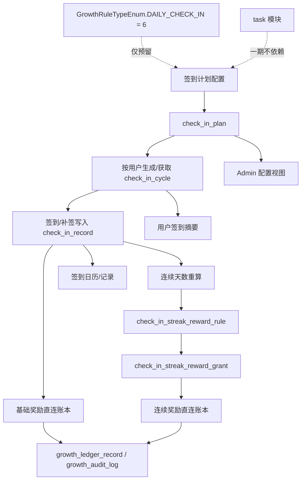

# Task / Check-In 开发补充

本文件只补充开发执行信息，不维护第二套排期。任务排序、依赖、状态请以 [execution-plan.md](/D:/code/es/es-server/docs/task-check-in-work-items/execution-plan.md) 为准。

## 当前 Task 模块全量盘点

### 现有代码分层

| 模块 | 关键文件 | 当前职责 | 对签到方案的价值判断 |
| --- | --- | --- | --- |
| Controller | `apps/app-api/src/modules/task/task.controller.ts` `apps/admin-api/src/modules/task/task.controller.ts` | App/Admin 的任务查询、认领、完成、管理入口 | 仅用于边界梳理，不复用为签到入口 |
| Facade | `libs/growth/src/task/task.service.ts` | 汇总 task 定义、执行、运行态能力 | 不是签到主服务 |
| Definition | `libs/growth/src/task/task-definition.service.ts` | 任务定义的创建、发布、配置校验 | 可借鉴管理端设计，不直接复用 |
| Execution | `libs/growth/src/task/task-execution.service.ts` | 任务认领、事件推进、奖励结算、完成态流转 | 适合目标式任务，不适合自然日签到事实 |
| Runtime | `libs/growth/src/task/task-runtime.service.ts` | 用户任务列表、状态汇总、展示辅助 | 可借鉴读模型方式 |
| Support | `libs/growth/src/task/task.service.support.ts` `task-notification.service.ts` | 查询拼装、通知、辅助校验 | 不作为一期签到依赖 |

### 现有 Task 数据模型

| 表 | 作用 | 对签到的适配性 |
| --- | --- | --- |
| `task` | 任务定义与配置 | 只能表达任务，不适合承载按日签到事实 |
| `task_assignment` | 用户任务实例 | 更像周期任务实例，不适合日历记录与补签额度 |
| `task_progress_log` | 任务进度日志 | 不能独立表达某天是否签到、是否补签、是否已奖励 |

### 结论

1. `task` 模块已经是成熟的“运营任务引擎”，不是签到事实模型。
2. 任务引擎擅长“目标达成”，签到域擅长“按天事实 + 周期策略 + 阈值奖励”。
3. 因此签到一期不能把 `task` 当成底表，也不应该要求 `task` 参与主链路。

## Growth / Event / Ledger 现状

### 当前可复用能力

| 模块 | 关键文件 | 当前结论 |
| --- | --- | --- |
| Ledger | `libs/growth/src/growth-ledger/growth-ledger.service.ts` | 可作为签到奖励统一落账入口 |
| Ledger source | `libs/growth/src/growth-ledger/growth-ledger.constant.ts` | 需要补充签到基础奖励、连续奖励来源值 |
| 审计与账本表 | `db/schema/app/growth-ledger-record.ts` `db/schema/app/growth-audit-log.ts` | 可承接签到奖励与补偿审计 |
| 事件定义 | `libs/growth/src/event-definition/event-definition.map.ts` | `DAILY_CHECK_IN` 已降为预留事件，不进入当前可配置能力 |
| 奖励类型编码 | `libs/growth/src/growth-rule.constant.ts` | `GrowthRuleTypeEnum.DAILY_CHECK_IN = 6` 保留为稳定预留编码 |
| seed | `db/seed/modules/app/domain.ts` | 已不应预置签到积分/经验规则 |

### 当前治理结论

1. `GrowthRuleTypeEnum.DAILY_CHECK_IN = 6` 继续保留，避免未来业务编码漂移。
2. 现阶段不再把 `DAILY_CHECK_IN` 视作可运营、可配置、可直接使用的现成功能。
3. 签到一期奖励不再依赖规则后台对 `DAILY_CHECK_IN` 的配置。

## 目标架构

## 建议新增模型

### 表设计

| 表 | 主要职责 | 关键字段建议 |
| --- | --- | --- |
| `check_in_plan` | 签到计划配置 | `planCode` `planName` `status` `timezone` `cycleType` `cycleAnchorDate` `allowMakeupCountPerCycle` `baseRewardConfig` `publishStartAt` `publishEndAt` |
| `check_in_cycle` | 用户周期实例与额度汇总 | `userId` `planId` `cycleKey` `cycleStartDate` `cycleEndDate` `signedCount` `makeupUsedCount` `currentStreak` `lastSignedDate` |
| `check_in_record` | 每日签到事实 | `userId` `planId` `cycleId` `signDate` `recordType` `rewardStatus` `bizKey` `operatorType` |
| `check_in_streak_reward_rule` | 连续阈值奖励规则 | `planId` `streakDays` `rewardConfig` `repeatable` `status` |
| `check_in_streak_reward_grant` | 连续奖励发放事实 | `userId` `planId` `cycleId` `ruleId` `triggerSignDate` `grantStatus` `bizKey` |

### 服务建议

| 服务 | 主要职责 |
| --- | --- |
| `CheckInDefinitionService` | 计划配置、发布校验、周期规则校验 |
| `CheckInExecutionService` | 今日签到、补签、幂等、周期额度扣减、奖励结算主流程 |
| `CheckInRuntimeService` | 签到日历、签到摘要、历史记录、运营读模型 |
| `CheckInService` | facade，聚合 Definition / Execution / Runtime |

## 奖励链路决策

1. 基础签到奖励来自 `check_in_plan.baseRewardConfig`。
2. 连续签到奖励来自 `check_in_streak_reward_rule.rewardConfig`。
3. 两类奖励都由签到域直接调用 `GrowthLedgerService.applyDelta()`。
4. 签到事实写入成功即视为主操作成功；奖励落账失败按补偿副作用处理。
5. 一期不依赖 `growth_rule` 配置，不依赖 `DAILY_CHECK_IN` 事件广播，不依赖 `task` 奖励追加。

## 接口与展示建议

### App

- `GET /check-in/summary`
- `GET /check-in/calendar`
- `GET /check-in/records`
- `POST /check-in/sign`
- `POST /check-in/makeup`

### Admin

- `GET /admin/check-in/plans`
- `GET /admin/check-in/plans/:id`
- `POST /admin/check-in/plans`
- `POST /admin/check-in/plans/:id/publish`
- `GET /admin/check-in/reconciliation`
- `POST /admin/check-in/reconciliation/repair`

## 测试重点

### 领域与事务

1. 同一天重复签到必须幂等。
2. 补签只能落在当前周期内的历史漏签日。
3. 每周期补签次数达到上限后，继续补签必须失败。
4. 连续奖励不能重复发放，除非规则显式允许重复。
5. 签到成功但奖励失败时，后续补偿不能重复写签到事实。

### 接口与展示

1. 日历视图必须正确展示正常签到、补签、漏签、奖励状态。
2. Summary 必须返回当前周期进度、剩余补签次数、当前连续天数、下一档奖励。
3. Admin 详情必须能解释计划配置、奖励规则、周期额度与账本结果。

### 回归

1. `task` 现有查询、认领、完成链路不受影响。
2. Growth 现有规则视图不再展示 `DAILY_CHECK_IN` 为可配置事件。
3. seed 初始化不再产生签到奖励规则脏数据。

## 对应任务引用

### [P0-01 Task 全量梳理与签到边界确认](/D:/code/es/es-server/docs/task-check-in-work-items/p0/01-task-domain-inventory-and-check-in-boundary.md)

- 已完成边界梳理与预留编码治理结论。

### [P0-02 签到计划、周期与补签契约](/D:/code/es/es-server/docs/task-check-in-work-items/p0/02-check-in-plan-cycle-and-makeup-contract.md)

- 冻结签到计划、周期与补签模型。

### [P0-03 签到记录、基础奖励与连续奖励结算](/D:/code/es/es-server/docs/task-check-in-work-items/p0/03-check-in-record-and-streak-reward-settlement.md)

- 冻结签到事实、奖励事实、幂等与补偿模型。

### [P1-01 App/Admin 签到接口与读模型](/D:/code/es/es-server/docs/task-check-in-work-items/p1/01-app-and-admin-check-in-read-write-api.md)

- 打通用户与运营视角的读写接口。

### [P2-01 对账、补偿与上线验收](/D:/code/es/es-server/docs/task-check-in-work-items/p2/01-check-in-reconciliation-runtime-and-acceptance.md)

- 补齐运行治理和上线验收。

## 发布前显式确认

1. 成长账本来源枚举是否已补齐签到基础奖励、连续奖励来源值。
2. 补签与连续奖励的幂等键是否已写入唯一索引约束。
3. 管理端是否明确提示：一期不依赖 `task`，也不依赖当前 `DAILY_CHECK_IN` 事件配置。
4. 所有工作项文档中是否已经移除旧的 `P1-02`、事件桥接和任务联动描述。
