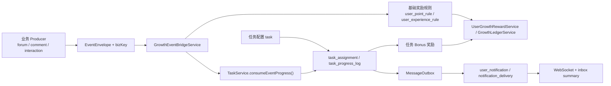

# Task / Growth / Notification 全链路重估工作包

本目录承载对 `task / growth reward / point / experience / growth ledger / message notification` 全链路代码的重估结果，以及后续重构工作的可执行文档集。

本目录的职责：

1. 给出本轮完整重构的边界判断、阅读顺序和文档职责分工。
2. 为“任务发布、任务类型、奖励发送、站内通知”提供统一的排期事实源与任务拆分。
3. 记录从当前代码到目标形态的分波次演进路径。

本目录不负责：

1. 回写上一轮已经完成的定点修复文档。
2. 直接替代实现代码或测试证据。
3. 维护第二套排期、状态或优先级。

## 与既有文档的关系

- `docs/task-growth-reward-work-items`：记录 `2026-03-30` 已完成的定点修复与验收结果。
- 本目录：承接“更完整的全链路重估与后续架构演进”，不覆盖旧目录中的已完成结论。

## 当前重估结论

1. `task` 本轮已收敛为“任务配置 + assignment + bonus 奖励 + 任务提醒”的壳层，并已具备最小事件驱动推进能力；但 `task` 单表仍同时承载模板、发布和运营展示语义。
2. `TaskTypeEnum` 已收敛为稳定场景值 `ONBOARDING / DAILY / CAMPAIGN`，历史 `REPEAT / OPERATION` 通过兼容映射保留读取与筛选能力；`sourceTag / campaignId / displayGroup` 未纳入本轮落地。
3. `objectiveType / eventCode / objectiveConfig / targetCount` 已构成最小任务目标模型；事件型任务按 `eventEnvelope.occurredAt` 落周期，`EVENT_COUNT + MANUAL claimMode` 默认不回补领取前事件。
4. `GrowthRuleTypeEnum + user_point_rule / user_experience_rule + GrowthLedgerService` 继续承担基础奖励事实源；`UserGrowthRewardService.tryRewardByRule()` 与 `tryRewardTaskComplete()` 已形成“基础奖励 / 任务 bonus”双入口。
5. `growth_ledger_record.source` 已可稳定区分 `growth_rule / task_bonus`，点数、经验与公开 DTO 也已同步透出来源语义。
6. producer 已统一经 `GrowthEventBridgeService` 派发 `EventEnvelope + bizKey`，任务侧已可通过 `TaskService.consumeEventProgress()` 消费真实业务事件并写入 `task_progress_log(eventCode / eventBizKey / progressSource)`。
7. 任务通知已抽离到 `TaskNotificationService`，主类型保持 `TASK_REMINDER`，并通过 `payload.reminderKind` 收口 `AVAILABLE / EXPIRING_SOON / REWARD_GRANTED` 三种子语义。
8. Admin 侧已补“按事件聚合”的成长规则视图，以及 assignment / event progress / reward reminder 的最小对账、奖励补偿与通知 `bizKey` 重试入口。
9. 当前剩余收口项主要是：`task.complete` 仍使用自定义 event envelope；`notification_delivery` 对任务维度过滤仍主要依赖查询视图解析 outbox payload；最终上线签收所需的运行、截图和压测证据仍需继续回填到 checklist。

## 当前实施状态

1. `P0-01 ~ P0-04` 已完成：任务类型语义、目标模型、基础奖励 / task bonus 边界、任务通知合同均已落到代码、测试和 DTO。
2. `P1-01 ~ P1-03` 已完成：producer 统一经桥接入口派发事件，任务已可消费业务事件推进，App/Admin 读模型也已收口为统一状态语义。
3. `P2-01` 已完成：后台新增“按事件聚合”的成长规则视图，可同时查看积分基础奖励、经验基础奖励与关联任务 bonus。
4. `P2-03` 已完成：补齐了 assignment / event progress / reward reminder 的对账页，以及单条 / 批量任务奖励补偿、按通知 `bizKey` 重试失败投递入口。
5. `P2-02` 当前不建议开工：现有单表发布模型虽然职责偏重，但在本轮落地后还没有证据表明它已经成为真实瓶颈，因此暂不透支复杂度去拆 `template / publish / campaign`。

## 当前全链路总览

## 文档分工

| 文档 | 角色 | 负责 | 不负责 |
| --- | --- | --- | --- |
| `execution-plan.md` | 唯一排期事实源 | 优先级、依赖、波次、状态、变更记录 | 代码实现细节 |
| `development-plan.md` | 开发补充 | 当前架构盘点、改动模块、关键文件、测试重点、迁移注意项 | 重新定义排序 |
| `p0/*` `p1/*` `p2/*` | 单任务文档 | 单任务目标、范围、非目标、主要改动、完成标准 | 跨任务验收 |
| `checklists/final-acceptance-checklist.md` | 最终验收 | 功能、回归、稳定性、迁移、上线阻塞项与证据位 | 单任务方案 |
| `checklists/event-task-mapping-checklist.md` | 事件映射清单 | 当前 producer 覆盖、事件壳补齐、任务目标接线检查项 | 排期排序 |

## 推荐阅读顺序

1. [execution-plan.md](./execution-plan.md)
2. [development-plan.md](./development-plan.md)
3. `P0` 任务单
4. `P1` 任务单
5. `P2` 任务单
6. [checklists/event-task-mapping-checklist.md](./checklists/event-task-mapping-checklist.md)
7. [checklists/final-acceptance-checklist.md](./checklists/final-acceptance-checklist.md)

## 主要代码锚点

### Task / Publish / Assignment

- `apps/admin-api/src/modules/task/task.controller.ts`
- `apps/app-api/src/modules/task/task.controller.ts`
- `libs/growth/src/task/task.service.ts`
- `libs/growth/src/task/task.constant.ts`
- `libs/growth/src/task/task.type.ts`
- `db/schema/app/task.ts`
- `db/schema/app/task-assignment.ts`
- `db/schema/app/task-progress-log.ts`

### Growth Rule / Reward / Ledger

- `libs/growth/src/growth-rule.constant.ts`
- `libs/growth/src/growth-reward/growth-reward.service.ts`
- `libs/growth/src/growth-ledger/growth-ledger.service.ts`
- `libs/growth/src/point/point-rule.service.ts`
- `libs/growth/src/point/point.service.ts`
- `libs/growth/src/experience/experience.service.ts`
- `db/schema/app/user-point-rule.ts`
- `db/schema/app/user-experience-rule.ts`
- `db/schema/app/growth-ledger-record.ts`

### Message / Notification / Outbox

- `libs/message/src/outbox/outbox.service.ts`
- `libs/message/src/outbox/outbox.worker.ts`
- `libs/message/src/notification/notification.service.ts`
- `libs/message/src/notification/notification-composer.service.ts`
- `libs/message/src/notification/notification-delivery.service.ts`
- `libs/message/src/notification/notification.constant.ts`
- `libs/message/src/inbox/inbox.service.ts`
- `db/schema/message/message-outbox.ts`
- `db/schema/message/user-notification.ts`
- `db/schema/message/notification-delivery.ts`

### 已抽样确认的 Producer

- `libs/forum/src/topic/forum-topic.service.ts`
- `libs/interaction/src/comment/comment.service.ts`
- `libs/interaction/src/comment/comment-growth.service.ts`
- `libs/interaction/src/like/like-growth.service.ts`
- `libs/interaction/src/favorite/favorite-growth.service.ts`
- `libs/interaction/src/follow/follow-growth.service.ts`
- `libs/interaction/src/browse-log/browse-log-growth.service.ts`
- `libs/interaction/src/report/report.service.ts`
- `libs/interaction/src/report/report-growth.service.ts`

## 当前边界判断

1. 积分规则与经验规则短期内不需要合表，也不应被任务系统吞掉。
2. 任务系统短期内不建议先拆 `template/publish` 两张表，但必须先补齐“目标模型”和“语义收口”。
3. 任务奖励短期内继续保留在 `task.rewardConfig` 直发链路，但文档、上下文和账本解释必须明确其为 `bonus`。
4. 事件驱动任务推进必须建立在 producer 事件壳和幂等约束可解释的前提上，不能直接绕过事件定义层硬接。

## 当前剩余缺口

1. `sourceTag / campaignId / displayGroup` 本轮未落 schema/DTO，若要继续拆“场景”和“来源”维度，应以后续结构升级任务为准。
2. `task.complete` 仍是任务域内部使用的自定义 envelope，尚未纳入 `event-definition.map.ts` 的统一定义层。
3. 最终验收清单已开始回填代码证据位，但运行截图、压测结果、上线签收项仍需在真正发布前补齐。

## 当前默认决议

1. producer 统一合同分两层：
   - 事件语义层继续复用现有 `EventEnvelope(subjectId / operatorId / governanceStatus / context)`；
   - 奖励/任务幂等层通过桥接入口额外携带稳定 `bizKey`，不把 `bizKey` 强塞进基础 envelope。
2. 事件驱动任务在第一阶段一律按 `eventEnvelope.occurredAt` 落周期；缺失时才回退到消费时刻，避免延迟消费把进度记错周期。
3. `objectiveType=EVENT_COUNT` 且 `claimMode=MANUAL` 的任务，第一阶段默认“不回补领取前事件”；只有 assignment 创建后命中的事件才累计进度。若未来需要预领取追溯，必须新增显式开关。
4. 任务通知第一阶段继续使用 `MessageNotificationTypeEnum.TASK_REMINDER`，并以 `payload.reminderKind` 固定三种子语义：`AVAILABLE / EXPIRING_SOON / REWARD_GRANTED`。
5. 治理反转后的任务回滚第一阶段不做自动化，仅要求保留审计、查询和人工修复入口。

## 维护规则

- 若排序、依赖、波次、状态变化，只修改 [execution-plan.md](./execution-plan.md)。
- 若具体任务范围变化，只修改对应任务单。
- 若验收口径或证据位变化，只修改 checklist。
- 若后续把本目录中的某些任务真正完成，应同步更新状态、清单和引用关系，不在其他文档私自维护第二套事实。
