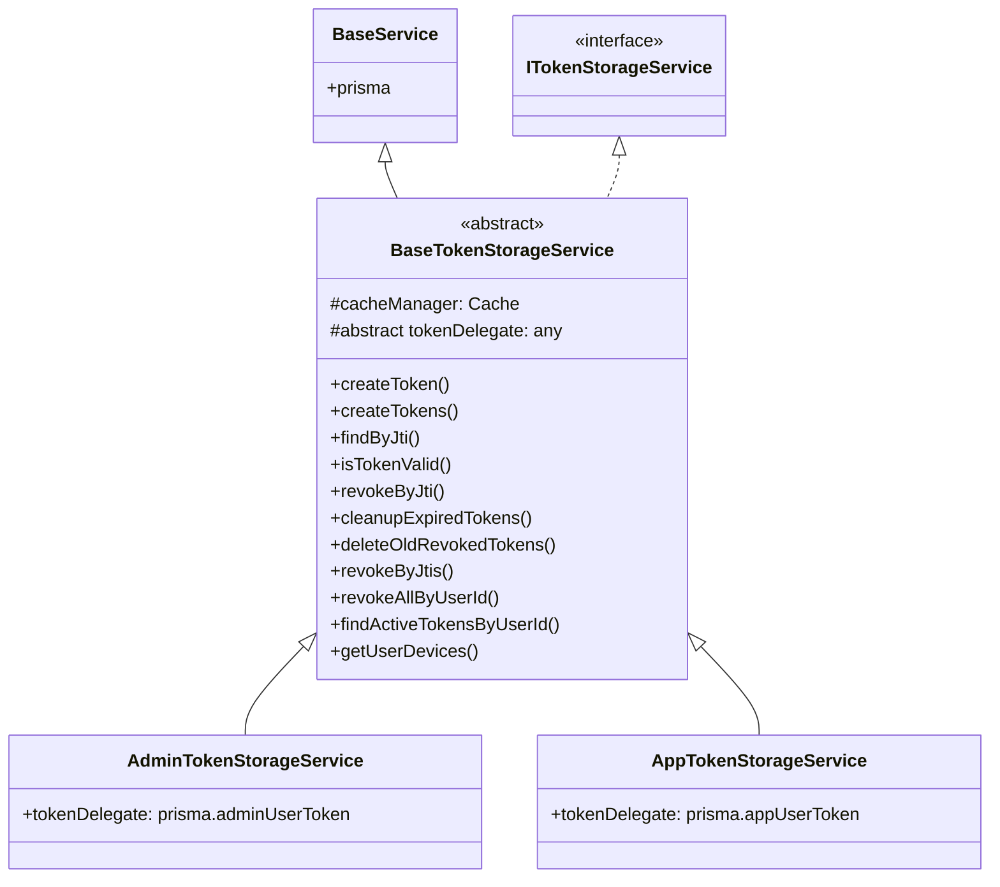

# Token Storage Service Refactoring Design

## 1. Class Structure

## 2. Key Methods

### `isTokenValid(jti: string)`
- **Logic**:
    1. Check Redis `token:${jti}`.
    2. If miss, query DB via `tokenDelegate.findUnique`.
    3. If not found, cache 'invalid' for 24h.
    4. If revoked or expired, cache 'invalid' for 24h.
    5. If valid, cache 'valid' for remaining TTL.

### `tokenDelegate`
- Abstract property.
- Returns the Prisma delegate (e.g., `this.prisma.adminUserToken`).
- Types: We will use a generic interface or `any` to accommodate the generated Prisma types.

## 3. Location
- `libs/base/src/modules/auth/base-token-storage.service.ts`
