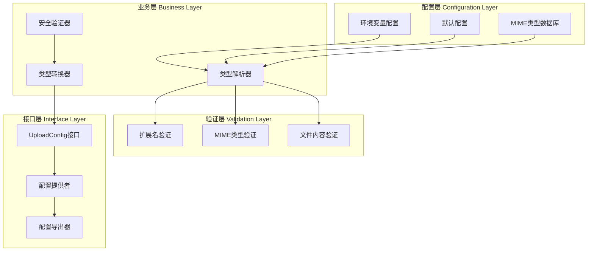
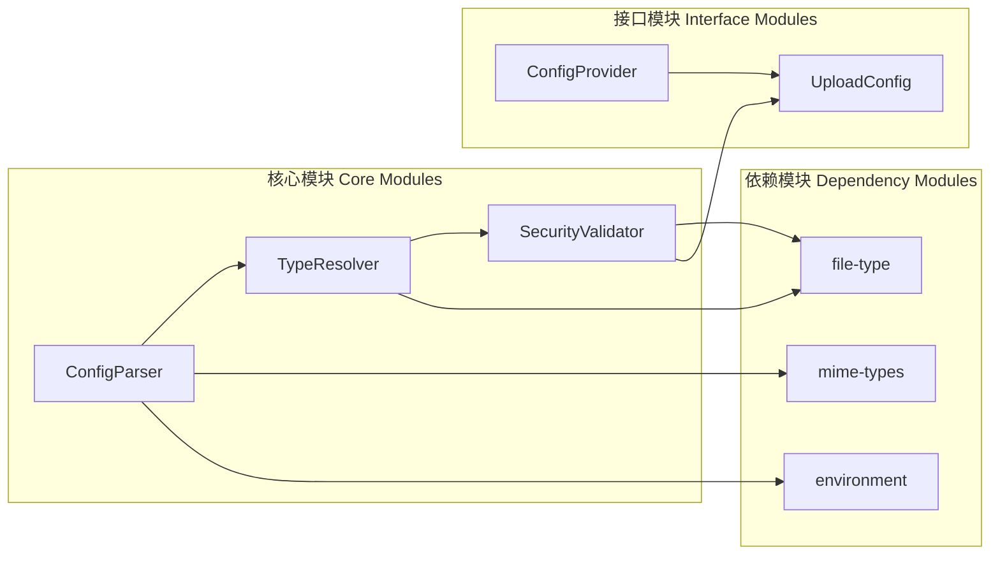
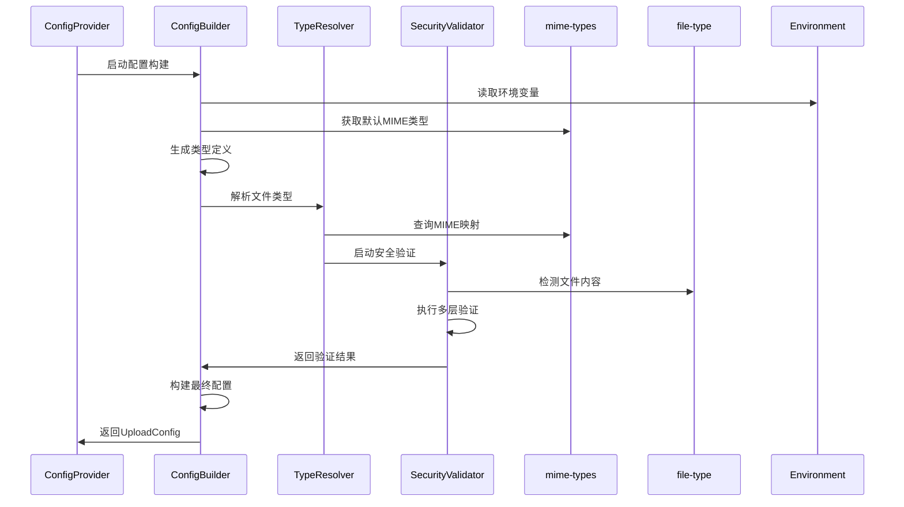

# Upload配置MIME类型优化 - 系统架构设计

## 决策确认

基于用户确认的关键决策点：

1. **技术选择**: 使用 `mime-types` + `file-type` 组合方案
2. **配置策略**: 依赖 `mime-types` 默认配置，简化维护
3. **兼容性**: 保持向后兼容，在此基础上优化配置逻辑
4. **优先级**: 更注重文件类型验证的安全性

## 整体架构图



## 分层设计和核心组件

### 1. 配置层 (Configuration Layer)
- **环境变量解析器**: 处理现有环境变量配置
- **默认配置生成器**: 基于mime-types生成默认类型配置
- **MIME类型数据库**: 集成mime-types提供的权威MIME类型映射

### 2. 验证层 (Validation Layer)
- **扩展名验证器**: 基于扩展名进行初步验证
- **MIME类型验证器**: 基于文件头信息验证MIME类型
- **文件内容验证器**: 使用file-type进行文件内容检测

### 3. 业务层 (Business Layer)
- **类型解析器**: 统一的类型解析和转换逻辑
- **安全验证器**: 多层安全验证，确保文件类型真实性
- **配置转换器**: 将验证结果转换为标准配置格式

### 4. 接口层 (Interface Layer)
- **配置接口**: 保持与现有UploadConfig接口兼容
- **配置提供者**: 兼容现有的NestJS配置提供者模式
- **配置导出器**: 标准的配置导出实现

## 模块依赖关系图



## 接口契约定义

### 主要接口

#### 1. TypeDefinition 接口
```typescript
interface TypeDefinition {
  name: string
  extensions: string[]
  mimeTypes: string[]
  securityLevel: 'basic' | 'strict' | 'enhanced'
}
```

#### 2. ValidationResult 接口
```typescript
interface ValidationResult {
  isValid: boolean
  detectedType?: string
  confidence: number
  violations: string[]
  securityChecks: {
    extensionMatch: boolean
    mimeMatch: boolean
    contentMatch: boolean
  }
}
```

#### 3. ConfigBuilder 接口
```typescript
interface ConfigBuilder {
  loadEnvironmentConfig(): Promise<EnvironmentConfig>
  loadDefaultTypes(): Promise<TypeDefinition[]>
  validateTypes(types: TypeDefinition[]): Promise<ValidationResult>
  buildConfig(types: TypeDefinition[]): UploadConfig
}
```

## 数据流向图



## 异常处理策略

### 1. 错误分类
- **配置错误**: 环境变量格式错误、类型不匹配
- **验证错误**: 文件类型检测失败、安全检查失败
- **依赖错误**: mime-types或file-type库异常
- **运行时错误**: 内存不足、I/O错误

### 2. 处理策略
- **配置错误**: 使用默认值，继续运行，记录警告
- **验证错误**: 降级到较宽松的验证模式
- **依赖错误**: 启用离线模式，使用内置备用方案
- **运行时错误**: 记录详细错误信息，继续服务运行

### 3. 降级机制
```typescript
interface FallbackStrategy {
  primary: 'mime-types + file-type'
  secondary: 'mime-types only'
  tertiary: 'hardcoded types'
  emergency: 'minimal validation'
}
```

## 性能优化策略

### 1. 缓存机制
- MIME类型映射缓存
- 文件类型检测结果缓存
- 环境变量解析结果缓存

### 2. 懒加载
- 延迟加载file-type库
- 按需生成类型定义
- 动态环境变量解析

### 3. 批处理
- 批量类型验证
- 合并配置构建步骤
- 异步处理文件检测

## 安全性增强

### 1. 多层验证
- 扩展名 → MIME类型 → 文件内容
- 逐步提高验证严格程度
- 异常情况下的安全降级

### 2. 防护机制
- 防止MIME类型伪造
- 检测文件内容与扩展名不一致
- 识别潜在的危险文件类型

### 3. 审计日志
- 记录所有验证决策
- 监控安全违规情况
- 提供调试和问题追踪信息

## 兼容性保证

### 1. 向后兼容
- 保持现有环境变量名称和格式
- 维持UploadConfig接口不变
- 保持工具函数的功能签名

### 2. 渐进迁移
- 支持现有的硬编码类型配置
- 允许混合使用新旧的类型定义方式
- 提供迁移脚本和工具

### 3. 测试覆盖
- 全面的回归测试
- 边界条件测试
- 性能基准测试