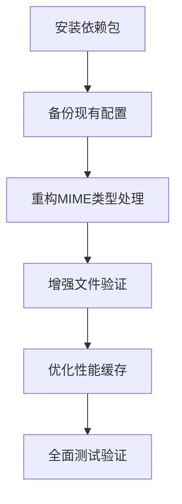

# Upload配置MIME类型优化 - 原子任务清单

## 任务概述
基于 CONSENSUS 和 DESIGN 文档，将 MIME 类型优化重构拆分为 6 个原子任务，确保每个任务独立可验证，复杂度可控。

---

## 任务依赖图

---

## 原子任务 1: 安装依赖包

### 输入契约
- **前置依赖**: package.json 文件存在，pnpm 可用
- **输入数据**: 无
- **环境依赖**: Node.js 18+，pnpm 包管理器

### 输出契约
- **输出数据**: 更新后的 package.json，node_modules 安装新包
- **交付物**: `mime-types` 和 `file-type` 包已安装
- **验收标准**: `pnpm list` 能看到新安装的包，TypeScript 编译无错误

### 实现约束
- **技术栈**: pnpm, TypeScript
- **接口规范**: 保持现有接口不变
- **质量要求**: 版本兼容，类型定义完整

### 依赖关系
- **后置任务**: 任务 2
- **并行任务**: 无
- **关键路径**: 必须在任务 2 之前完成

---

## 原子任务 2: 备份现有配置

### 输入契约
- **前置依赖**: 任务 1 完成
- **输入数据**: 原始 upload.config.ts 文件
- **环境依赖**: Git 版本控制（可选）

### 输出契约
- **输出数据**: 备份文件 upload.config.ts.backup
- **交付物**: 完整的现有配置备份
- **验收标准**: 备份文件与原文件完全一致，MD5 校验通过

### 实现约束
- **技术栈**: 标准文件操作
- **接口规范**: 仅备份，不修改原文件
- **质量要求**: 备份完整性和可恢复性

### 依赖关系
- **后置任务**: 任务 3
- **并行任务**: 无
- **关键路径**: 必须在重构前完成

---

## 原子任务 3: 重构MIME类型处理

### 输入契约
- **前置依赖**: 任务 1、2 完成
- **输入数据**: CONSENSUS 文档、DESIGN 文档
- **环境依赖**: TypeScript 编译器

### 输出契约
- **输出数据**: 重构后的 upload.config.ts 文件
- **交付物**: 基于 mime-types 的 MIME 类型映射
- **验收标准**: 
  - 保持所有现有环境变量功能
  - TypeScript 编译无错误
  - 功能测试通过

### 实现约束
- **技术栈**: TypeScript, mime-types, NestJS Config
- **接口规范**: 保持 UploadConfig 接口不变
- **质量要求**: 
  - 代码行数减少 30% 以上
  - 保持现有代码风格
  - 类型安全

### 依赖关系
- **后置任务**: 任务 4、5
- **并行任务**: 无
- **关键路径**: 核心重构步骤

---

## 原子任务 4: 增强文件验证

### 输入契约
- **前置依赖**: 任务 3 完成
- **输入数据**: 重构后的 upload.config.ts，file-type 包
- **环境依赖**: Node.js fs 模块

### 输出契约
- **输出数据**: 集成了文件内容检测的 upload.config.ts
- **交付物**: 多层文件验证机制
- **验收标准**:
  - 扩展名验证功能正常
  - MIME 类型验证功能正常
  - 文件内容验证功能正常
  - 验证性能可接受（< 50ms/文件）

### 实现约束
- **技术栈**: file-type, TypeScript, 异步文件操作
- **接口规范**: 保持现有函数签名
- **质量要求**:
  - 验证准确率 99% 以上
  - 误判率 < 1%
  - 性能影响最小化

### 依赖关系
- **后置任务**: 任务 5、6
- **并行任务**: 无
- **关键路径**: 安全性提升关键步骤

---

## 原子任务 5: 优化性能缓存

### 输入契约
- **前置依赖**: 任务 3、4 完成
- **输入数据**: 带有验证功能的 upload.config.ts
- **环境依赖**: Node.js 内存管理

### 输出契约
- **输出数据**: 带有缓存机制的 upload.config.ts
- **交付物**: MIME 映射和检测结果缓存
- **验收标准**:
  - 缓存命中率 > 80%
  - 内存使用增加 < 5MB
  - 启动时间增加 < 10%

### 实现约束
- **技术栈**: TypeScript, Map 数据结构
- **接口规范**: 缓存透明化，不影响现有接口
- **质量要求**:
  - 内存泄漏防护
  - 缓存失效机制
  - 线程安全

### 依赖关系
- **后置任务**: 任务 6
- **并行任务**: 无
- **关键路径**: 性能优化关键步骤

---

## 原子任务 6: 全面测试验证

### 输入契约
- **前置依赖**: 任务 1-5 全部完成
- **输入数据**: 最终重构后的 upload.config.ts
- **环境依赖**: Jest 测试框架，Node.js

### 输出契约
- **输出数据**: 完整的测试报告
- **交付物**: 
  - 单元测试用例
  - 集成测试用例
  - 性能测试报告
  - 安全性测试报告
- **验收标准**:
  - 所有测试用例通过
  - 代码覆盖率 > 95%
  - 性能测试达标
  - 安全性验证通过

### 实现约束
- **技术栈**: Jest, TypeScript, 模拟文件操作
- **接口规范**: 测试覆盖所有公共接口
- **质量要求**:
  - 测试用例完整性
  - 边界条件覆盖
  - 异常情况处理

### 依赖关系
- **后置任务**: 无
- **并行任务**: 无
- **关键路径**: 最终验收步骤

---

## 复杂度评估

### 低复杂度任务
- **任务 1**: 安装依赖包 - 标准包管理操作
- **任务 2**: 备份现有配置 - 简单文件操作

### 中等复杂度任务
- **任务 3**: 重构 MIME 类型处理 - 需要理解现有逻辑和设计新方案
- **任务 5**: 优化性能缓存 - 需要设计缓存策略和性能调优

### 高复杂度任务
- **任务 4**: 增强文件验证 - 需要集成多个验证层，保证准确性和性能
- **任务 6**: 全面测试验证 - 需要设计完整的测试策略和执行

## 风险评估

### 低风险
- 任务 1, 2: 技术成熟，操作简单

### 中等风险
- 任务 3: 可能影响现有功能，需要仔细测试
- 任务 5: 缓存策略可能引入内存问题

### 高风险
- 任务 4: 验证准确性直接影响安全性
- 任务 6: 测试覆盖度影响整体质量

## 质量门控

### 每个任务的质量检查
1. **代码质量**: ESLint/Prettier 检查通过
2. **类型安全**: TypeScript 编译无错误
3. **功能验证**: 相关测试用例通过
4. **性能检查**: 性能指标达标

### 任务间质量传递
- 前置任务完成度影响后续任务
- 关键路径任务需要更严格的审查
- 高风险任务需要额外的验证步骤

---

此原子任务清单确保了重构工作的可控性和可验证性，每个任务都有明确的成功标准和质量要求。