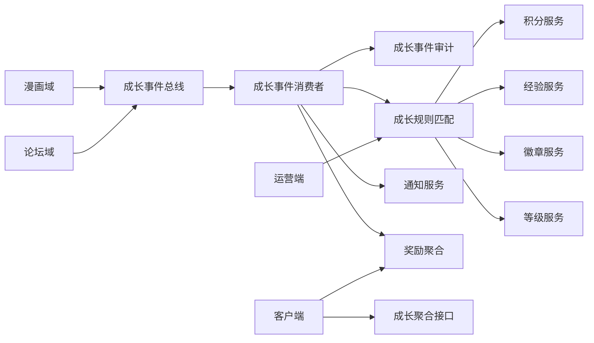
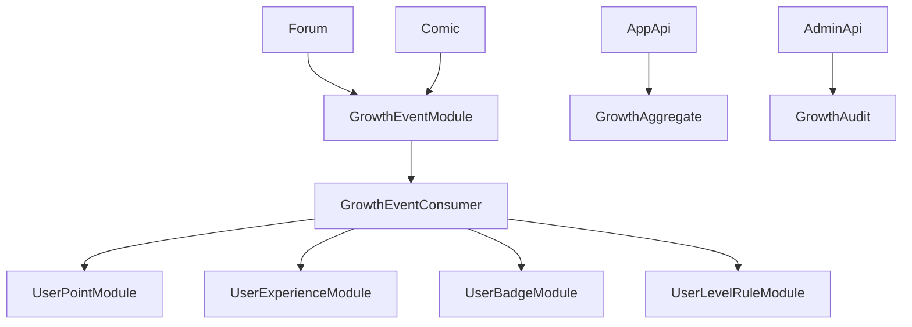
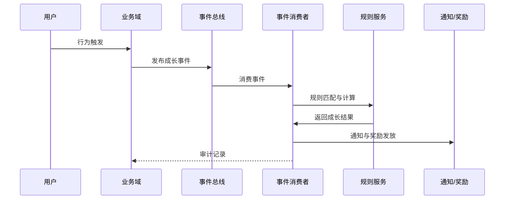

# 架构阶段（DESIGN）- 漫画与论坛成长系统接入改造

## 1. 整体架构

## 2. 分层设计与核心组件

### 2.1 业务域层
- 漫画域与论坛域只发布成长事件，不直接计算成长值

### 2.2 成长域层
- 成长事件消费者负责审计、幂等、防刷、规则匹配、奖励发放

### 2.3 接口层
- app-api 提供成长聚合、奖励领取、通知与红点状态
- admin-api 提供规则管理、审计查询与热更新入口

## 3. 模块依赖关系图

## 4. 接口契约定义

### 4.1 成长事件发布
- 输入：business, eventKey, userId, targetId, ip, deviceId, occurredAt, context
- 输出：无返回或事件审计 ID

### 4.2 成长聚合接口
- 输出：points, experience, levelInfo, badges, privileges, rewardSummary

### 4.3 奖励领取接口
- 输入：rewardId 或 eventId
- 输出：领取结果与最新成长聚合信息

### 4.4 成长审计查询
- 输入：userId, eventKey, status, timeRange
- 输出：审计分页数据与处理结果

## 5. 数据流向图

## 6. 异常处理策略
- 幂等：同一事件在窗口内只处理一次
- 防刷：命中防刷规则记录审计但不计成长
- 补偿：失败事件进入重试队列
- 降级：审计异常不阻断主业务流程
