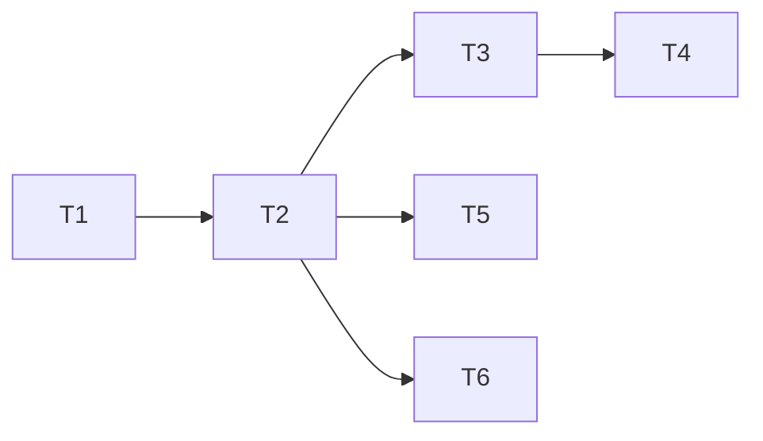

# 原子化阶段（TASK）- 漫画与论坛成长系统接入改造

## 1. 子任务清单

### T1 论坛域事件化改造（已完成）
- 输入契约：论坛业务行为数据、用户上下文
- 输出契约：成长事件发布
- 实现约束：不直接调用积分/经验服务；注释明确；复用 DTO/constant
- 依赖关系：无

### T2 成长事件消费链路（已完成）
- 输入契约：成长事件发布、事件总线可用
- 输出契约：审计记录、规则匹配与成长值发放
- 实现约束：幂等、审计、防刷、补偿；注释明确；复用 DTO/constant
- 依赖关系：T1

### T3 成长规则与奖励适配（已完成）
- 输入契约：规则配置与成长事件
- 输出契约：积分/经验/徽章/等级处理结果
- 实现约束：统一 business + eventKey 规则匹配；注释明确；复用 DTO/constant
- 依赖关系：T2

### T4 app-api 成长展示与奖励接口（已完成）
- 输入契约：成长结果与用户上下文
- 输出契约：成长聚合信息、奖励领取结果、通知状态
- 实现约束：DTO 高复用；注释明确；无冗余接口
- 依赖关系：T2, T3

### T5 admin-api 审计与热更新入口（已完成）
- 输入契约：审计记录与规则配置
- 输出契约：审计查询、规则变更触发
- 实现约束：DTO 高复用；注释明确；与现有管理端规范一致
- 依赖关系：T2, T3

### T6 数据模型与迁移（已完成）
- 输入契约：审计字段设计与索引策略
- 输出契约：迁移文件与数据库表
- 实现约束：向后兼容；注释明确
- 依赖关系：T2

## 2. 任务依赖图

## 3. 验收与验证
- 每个事件必须可在审计表追踪
- 每条规则命中必须可对账
- 论坛域无直连积分/经验调用
- 奖励与通知可通过接口验证
