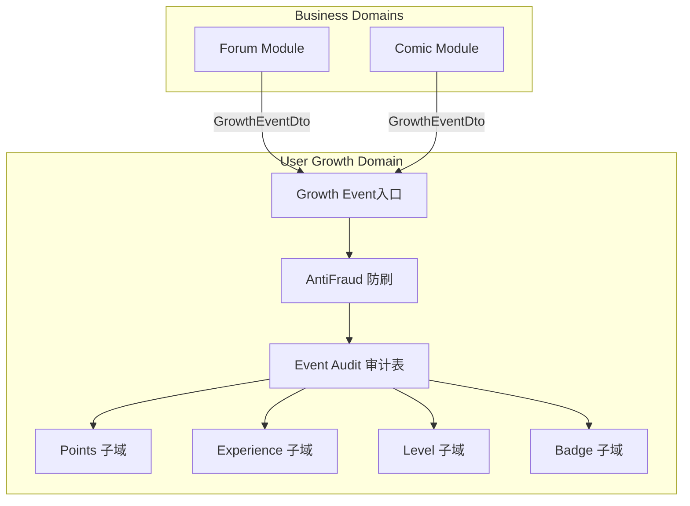
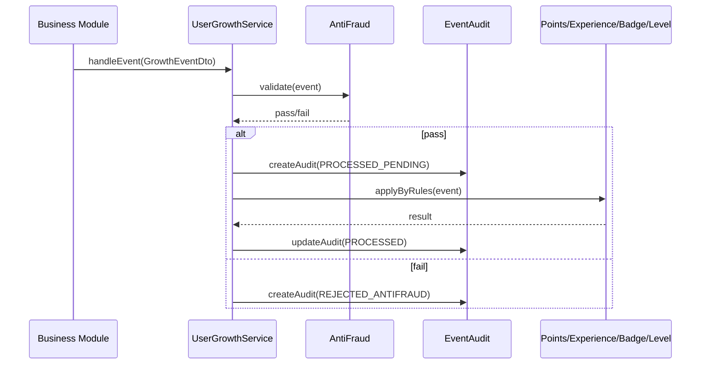

## 用户成长体系重构（User Growth Refactor）- DESIGN（单体严格版）

### 1. 架构总览

#### 1.1 目标形态

- 单体 NestJS 应用 + libs 模块化
- 重构现有 `libs/user` 为“用户成长域”库
- 业务域（forum/comic）通过成长事件接入
- 事件审计表长期保留
- 防刷严格且可配置

#### 1.2 架构图（Mermaid）



---

### 2. 模块设计与目录结构

#### 2.1 目录规划（libs/user）

- `libs/user/src/growth/`
  - `growth.module.ts`（`UserGrowthModule`）
  - `events/`
    - `growth-event.dto.ts`
    - `growth-event.service.ts`（统一入口 `handleEvent`）
  - `points/`
    - `point.service.ts`
    - `point-rule.service.ts`
    - `point-record.service.ts`
  - `experience/`
    - `experience.service.ts`
    - `experience-rule.service.ts`
    - `experience-record.service.ts`
  - `level/`
    - `level.service.ts`
    - `level-rule.service.ts`
    - `level-privilege.service.ts`
  - `badge/`
    - `badge.service.ts`
    - `badge-rule.service.ts`
    - `badge-assignment.service.ts`
  - `audit/`
    - `growth-event-audit.service.ts`
  - `antifraud/`
    - `antifraud.service.ts`
    - `antifraud-config.service.ts`

> 备注：以上为结构目标，实际文件命名会对齐现有代码风格与 NestJS 规范。

#### 2.2 业务域接入方式

- forum/comic 模块只需：
  - 构造 `GrowthEventDto`
  - 调用 `UserGrowthModule` 暴露的 `handleEvent` 接口
- 业务模块不再直接依赖积分/经验/徽章服务

---

### 3. 核心接口契约

#### 3.1 GrowthEventDto

```ts
interface GrowthEventDto {
  business: string
  eventKey: string
  userId: string
  targetId?: string
  ip?: string
  deviceId?: string
  occurredAt?: Date
  context?: Record<string, unknown>
}
```

#### 3.2 UserGrowthModule 入口

```ts
interface UserGrowthService {
  handleEvent(event: GrowthEventDto): Promise<void>
}
```

#### 3.3 事件审计表模型

```ts
interface UserGrowthEvent {
  id: string
  business: string
  eventKey: string
  userId: string
  targetId?: string
  ip?: string
  deviceId?: string
  occurredAt: Date
  context?: Record<string, unknown>
  status: 'PROCESSED' | 'REJECTED_ANTIFRAUD' | 'IGNORED_RULE_NOT_FOUND'
  ruleIds?: string[]
  pointsDeltaApplied?: number
  experienceDeltaApplied?: number
  badgeAssigned?: string[]
  createdAt: Date
  updatedAt: Date
}
```

---

### 4. 数据流与时序

#### 4.1 事件处理时序（Mermaid）



---

### 5. 防刷策略（严格 + 可配置）

#### 5.1 配置模型建议

- 各子域规则表内含基础防刷阈值字段，或通过独立防刷配置表维护：
  - `cooldownSeconds`
  - `dailyLimit`
  - `totalLimit`
- 对高价值事件：
  - 通过配置规则标记或阈值判断（例如 `pointsDelta >= X`）
  - 强化冷却时间与上限

#### 5.2 执行规则

- 每次事件处理前先执行防刷判断
- 检查维度：
  - 用户维度：`userId + eventKey`
  - IP 维度：`ip + eventKey`
  - 设备维度：`deviceId + eventKey`（如存在）
- 防刷命中后：
  - 不触发任何成长行为
  - 审计表记录为 `REJECTED_ANTIFRAUD`

---

### 6. 数据模型变更

#### 6.1 新增或改造的主要表
- `user_growth_event`
  - 审计表，长期保留
- `user_badge`
  - 通用徽章定义
- `user_badge_assignment`
  - 用户徽章关联

#### 6.2 迁移策略

- 现有 `AppPointRule` / `AppExperienceRule` / `AppLevelRule` 保留并补齐事件维度
- 徽章模型统一为用户成长通用表，仅保留 `user_badge`、`user_badge_assignment`
- 不保留 `forum_badge`、`forum_profile_badge` 等旧表，不做旧表迁移脚本

---

### 7. 接口设计（管理端）

#### 7.1 管理接口分组

- `/admin/user-growth/points-rules`
  - 积分规则 CRUD
- `/admin/user-growth/experience-rules`
  - 经验规则 CRUD
- `/admin/user-growth/level-rules`
  - 等级规则与权益管理
- `/admin/user-growth/events`
  - 审计表查询（按 userId / eventKey / status / 时间范围）
- `/admin/user-growth/badges`
  - 徽章管理
- `/admin/user-growth/overview`
  - 用户成长概览（积分/经验/等级/徽章）

---

### 8. 异常处理策略

- 防刷拒绝：直接记录审计表，业务端不抛错
- 规则未命中：记录审计表（`IGNORED_RULE_NOT_FOUND`）
- 子域执行失败：
  - 回写审计状态为 `FAILED`（如需新增状态）
  - 记录失败原因（建议存入审计表的扩展字段）

---

### 9. 验收标准

- 论坛/漫画等业务只通过成长事件接入，不直接调用积分/经验/徽章服务
- 各子域规则生效，旧规则表继续作为规则来源并补齐事件维度
- `user_growth_event` 能记录所有成长事件处理状态
- 防刷严格策略有效，可通过配置动态调整
- 管理端可统一查看与管理成长规则与审计数据
