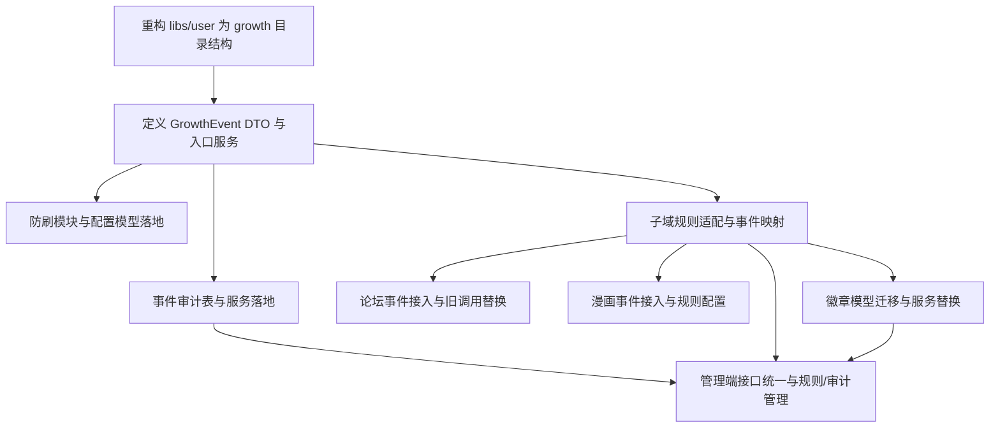

## 用户成长体系重构（User Growth Refactor）- TASK（原子任务拆分）

> 本文基于 DESIGN 与 CONSENSUS，拆分为可独立执行与验证的原子任务。

### 1. 任务依赖图（Mermaid）

---

### 2. 原子任务清单

> 当前执行状态对齐到已实现内容，未完成项保留原计划。

#### T1：重构 `libs/user` 为 growth 目录结构（未开始）

- **输入契约**
  - 现有 `libs/user` 模块（experience/level-rule/point）。
  - DESIGN 中定义的目录结构。
- **输出契约**
  - `libs/user/src/growth/*` 结构落地；
  - `UserGrowthModule` 作为唯一对外入口；
  - 原有服务迁移到新结构下并可运行。
- **实现约束**
  - 不新增新的 libs；只重构现有 `libs/user`。
  - 保持现有依赖注入风格与 NestJS Module 规范。
- **依赖关系**
  - 前置：无；
  - 后置：T2–T9。

---

#### T2：定义 GrowthEvent DTO 与事件入口服务（已完成）

- **输入契约**
  - 已完成的 `UserGrowthModule` 骨架（T1）。
- **输出契约**
  - `GrowthEventDto` 定义；
  - `UserGrowthService.handleEvent` 作为统一入口；
  - 业务模块可通过该入口触发成长逻辑。
- **实现约束**
  - 所有业务接入必须通过事件入口；
  - 入口不直接调用论坛命名服务。
- **依赖关系**
  - 前置：T1；
  - 后置：T3、T4、T5、T6、T7。

---

#### T3：防刷模块与配置模型落地（严格 + 可配置）（未开始）

- **输入契约**
  - GrowthEvent 入口已具备（T2）。
- **输出契约**
  - 防刷策略可配置：
    - 冷却时间、每日上限、总上限等参数均可通过配置管理；
  - 能识别并处理高价值事件；
  - 防刷结果会写入审计表状态（与 T4 协作）。
- **实现约束**
  - 严格策略默认开启；
  - 配置必须可被管理端维护（T9 会提供接口）。
- **依赖关系**
  - 前置：T2；
  - 后置：T5。

---

#### T4：事件审计表与服务落地（长期保留）（未开始）

- **输入契约**
  - GrowthEvent 入口已具备（T2）。
- **输出契约**
  - `user_growth_event` 表创建；
  - 审计服务可记录：
    - 事件内容
    - 处理状态
    - 命中规则与执行摘要
  - 支持长期保留策略（分表/归档策略留到设计细化）。
- **实现约束**
  - 事件处理必须写入审计表；
  - 任何防刷拒绝必须记录原因。
- **依赖关系**
  - 前置：T2；
  - 后置：T5、T9。

---

#### T5：子域规则适配与事件映射（已完成基础论坛积分映射）

- **输入契约**
  - GrowthEvent 入口已具备（T2）。
- **输出契约**
  - `AppPointRule` / `AppExperienceRule` / `AppLevelRule` 等规则表保留并补齐事件维度；
  - 子域规则服务按 `business + eventKey` 进行匹配与执行；
  - 当前已覆盖论坛积分映射：主题创建、回复创建、主题被点赞、回复被点赞、主题被收藏。
- **实现约束**
  - 不引入统一规则中心；
  - 保持既有运营配置逻辑与数据结构稳定。
- **依赖关系**
  - 前置：T2；
  - 后置：T6、T7、T8、T9。

---

#### T6：论坛事件接入与旧调用替换（已完成本轮范围）

- **输入契约**
  - GrowthEvent 入口与子域规则可用（T2、T5）。
- **输出契约**
  - forum 侧本轮涉及的成长逻辑改为发事件；
  - 已替换：主题创建、回复创建、主题点赞、回复点赞、主题收藏；
  - 继续替换其他调用时，应保持事件键统一按 `forum.*` 风格。
- **实现约束**
  - 事件键统一按 `forum.*` 风格；
  - 行为成功后才发事件。
- **依赖关系**
  - 前置：T5；
  - 后置：T9。

---

#### T7：漫画事件接入与规则配置（未开始）

- **输入契约**
  - GrowthEvent 入口与子域规则可用（T2、T5）。
- **输出契约**
  - 漫画核心行为转为成长事件上报；
  - 在各子域规则表中配置漫画事件对应规则。
- **实现约束**
  - 事件键统一按 `comic.*` 风格；
  - 与论坛事件保持同等优先级。
- **依赖关系**
  - 前置：T5；
  - 后置：T9。

---

#### T8：徽章模型迁移与服务替换（未开始）

- **输入契约**
  - 子域规则与成长域服务可用（T5）。
- **输出契约**
  - `user_badge` / `user_badge_assignment` 表建立；
  - 迁移 `ForumBadge` / `ForumProfileBadge` 数据；
  - forum 侧改为调用成长域徽章服务；
  - forum 徽章表与模型移除。
- **实现约束**
  - 迁移脚本需支持幂等；
  - 不允许双写长期存在。
- **依赖关系**
  - 前置：T5；
  - 后置：T9。

---

#### T9：管理端接口统一与运营能力收口（未开始）

- **输入契约**
  - 子域规则、审计表、徽章服务已具备（T5、T4、T8）。
- **输出契约**
  - `/admin/user-growth/*` 接口落地：
    - 积分/经验/等级/徽章规则管理
    - 审计查询
    - 徽章管理
    - 用户成长概览
  - forum 管理端成长相关接口迁移。
- **实现约束**
  - 管理端必须支持防刷配置调整；
  - 不保留 forum 管理端向后兼容接口。
- **依赖关系**
  - 前置：T4、T5、T8；
  - 后置：无。

---

### 3. 任务验收清单（总体）

- 业务侧不再直接依赖旧成长服务，统一通过 GrowthEvent 接入。
- 各子域规则可覆盖积分/经验/徽章规则。
- 审计表可查询到所有成长事件及处理状态。
- 防刷严格且可配置，运营可在管理端调整阈值。
- 徽章模型迁移完成，forum 无徽章表残留。
