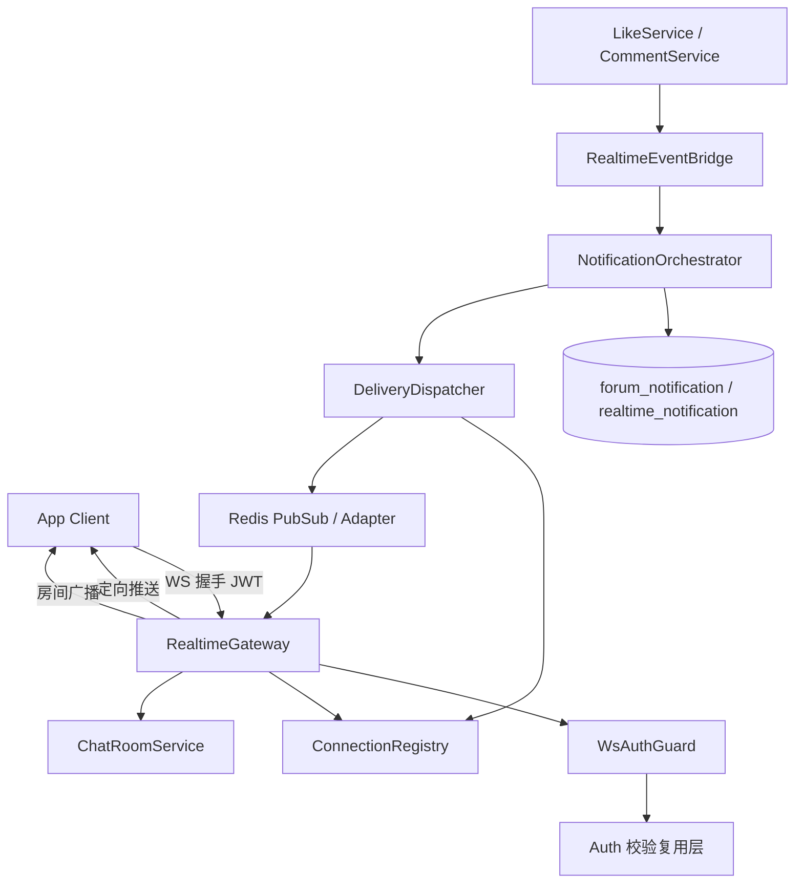
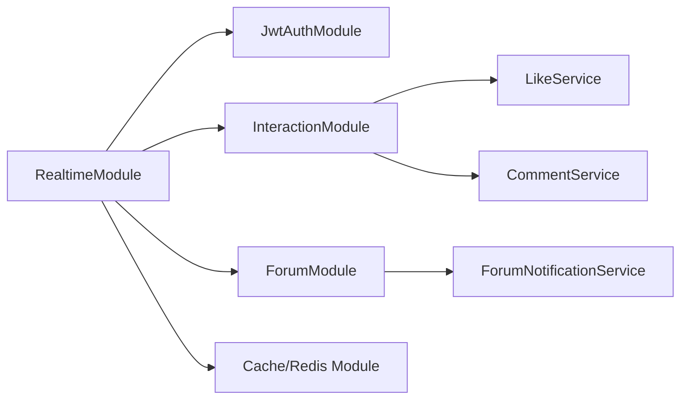
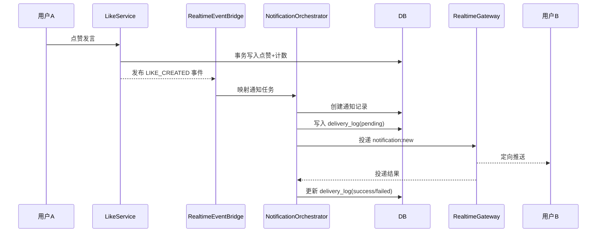
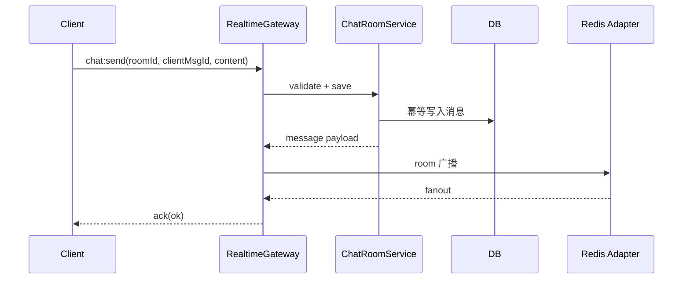

# WebSocket 实施架构设计

## 1. 总体架构



## 2. 分层设计

## 2.1 接入层（Realtime Gateway）

职责：
- 建立/断开连接
- 握手鉴权
- 用户绑定
- 事件路由
- ACK 统一返回

建议目录：
- `apps/app-api/src/modules/realtime/realtime.module.ts`
- `apps/app-api/src/modules/realtime/realtime.gateway.ts`
- `apps/app-api/src/modules/realtime/guards/ws-jwt-auth.guard.ts`
- `apps/app-api/src/modules/realtime/decorators/ws-current-user.decorator.ts`

## 2.2 应用层（聊天室与通知编排）

职责：
- 聊天室加入、离开、发送
- 通知载荷拼装、模板选择、用户路由
- 未读数增量计算与推送

建议目录：
- `libs/interaction/src/realtime/chat-room.service.ts`
- `libs/interaction/src/realtime/notification-orchestrator.service.ts`
- `libs/interaction/src/realtime/delivery-dispatcher.service.ts`

## 2.3 领域层（互动事件桥接）

职责：
- 在点赞/评论成功后发布领域事件
- 将领域事件映射为通知事件
- 保持业务服务职责单一

建议目录：
- `libs/interaction/src/realtime/realtime-event.bridge.ts`
- `libs/interaction/src/realtime/events/*.ts`

## 2.4 基础设施层（多实例与补偿）

职责：
- Redis Adapter（可选启用）
- 投递状态记录
- 重试任务
- 指标上报

建议目录：
- `libs/base/src/modules/realtime/realtime-redis.adapter.ts`
- `libs/interaction/src/realtime/delivery-retry.cron.ts`

## 3. 模块依赖关系



依赖原则：
- RealtimeModule 依赖业务模块，不反向侵入业务模块。
- 业务模块通过事件桥接依赖实时能力，避免直接调用网关。

## 4. 协议契约

## 4.1 连接与鉴权

- 握手头：`Authorization: Bearer <JWT>`
- 失败码：
  - `WS_AUTH_MISSING`
  - `WS_AUTH_INVALID`
  - `WS_AUTH_REVOKED`
- 连接上下文：
  - `socket.data.userId`
  - `socket.data.sessionId`
  - `socket.data.device`

## 4.2 客户端事件

1. `chat:join`
```json
{ "roomId": "topic:123" }
```

2. `chat:leave`
```json
{ "roomId": "topic:123" }
```

3. `chat:send`
```json
{
  "roomId": "topic:123",
  "clientMsgId": "c5e2f4a0-...",
  "content": "hello"
}
```

4. `notification:mark_read`
```json
{ "notificationId": 10001 }
```

## 4.3 服务端事件

1. `chat:message`
```json
{
  "roomId": "topic:123",
  "messageId": "m_20260306_xxx",
  "senderUserId": 9527,
  "content": "hello",
  "createdAt": "2026-03-06T10:00:00.000Z"
}
```

2. `notification:new`
```json
{
  "notificationId": 10001,
  "type": "LIKE",
  "title": "你的发言收到一个赞",
  "content": "用户A 赞了你的发言",
  "targetType": "COMMENT",
  "targetId": 888,
  "actorUserId": 100,
  "createdAt": "2026-03-06T10:00:00.000Z"
}
```

3. `notification:unread_count`
```json
{
  "totalUnread": 12
}
```

4. `system:kickout`
```json
{
  "reason": "TOKEN_REVOKED"
}
```

## 4.4 ACK 结构

```json
{
  "ok": true,
  "code": "OK",
  "message": "success",
  "data": {}
}
```

失败示例：
```json
{
  "ok": false,
  "code": "CHAT_RATE_LIMITED",
  "message": "发送过于频繁"
}
```

## 5. 数据模型设计

## 5.1 聊天消息表（新增建议）

表：`realtime_chat_message`
- `id` bigint pk
- `room_id` varchar(64) index
- `sender_user_id` int index
- `client_msg_id` varchar(64) unique
- `content` text
- `created_at` timestamptz default now
- `deleted_at` timestamptz null

说明：
- `client_msg_id` 用于幂等。
- 支持按 `room_id + created_at` 倒序分页回放。

## 5.2 实时投递表（新增建议）

表：`realtime_delivery_log`
- `id` bigint pk
- `event_id` varchar(64) unique
- `event_type` varchar(32)
- `target_user_id` int index
- `payload_json` jsonb
- `status` smallint index  (0=pending,1=success,2=failed)
- `retry_count` int default 0
- `next_retry_at` timestamptz null
- `created_at` timestamptz default now
- `updated_at` timestamptz default now

说明：
- 保障“通知落库后推送”的可追踪性与补偿能力。

## 5.3 通知主表复用

- 论坛通知场景可先复用 `forum_notification`。
- 通用互动通知如需跨域，后续可新增统一 `user_notification` 表。

## 6. 关键业务流程

## 6.1 点赞通知流程



## 6.2 评论通知流程

规则：
- 若评论审核结果为 `APPROVED` 且可见，立即推送。
- 若为 `PENDING` 或隐藏，暂不推送；审核通过时补发通知事件。

## 6.3 聊天室流程



## 7. 异常处理与补偿

- 重复点赞/重复发送：返回业务错误码，保证幂等不重复写入。
- 推送目标离线：只落库不报错，等待用户下次在线同步。
- Redis 暂时不可用：降级为单实例内存路由，并记录告警。
- 投递失败：进入 `realtime_delivery_log` 重试队列，由定时任务重投。

## 8. 安全策略

- 握手阶段强制 JWT 校验与 token 有效性检查。
- 所有客户端事件按用户维度限流（可复用现有限流能力）。
- 聊天内容走敏感词检测策略，可在发送前或落库前执行。
- payload 最小化，不下发手机号、设备指纹等敏感字段。

## 9. 可观测性与运维

关键指标：
- `ws_connections_current`
- `ws_online_users_current`
- `ws_event_push_success_total`
- `ws_event_push_failed_total`
- `ws_event_push_latency_ms`
- `chat_send_qps`

日志规范：
- 连接日志：userId、socketId、ip、device、connect/disconnect 原因
- 投递日志：eventId、targetUserId、status、retryCount、errorCode

告警建议：
- 推送失败率 5 分钟内超过阈值
- 未完成重试任务积压超过阈值
- Redis 连接异常持续超过阈值

## 10. 灰度与回滚

灰度步骤：
1. 仅开启聊天室通道，验证连接稳定性。
2. 开启点赞通知，观察投递成功率与延迟。
3. 开启评论通知，联动审核补发逻辑。
4. 开启 Redis Adapter 多实例分发。

回滚策略：
- 配置开关关闭 WebSocket 入口，保留 HTTP 查询能力。
- 通知保留落库，不影响用户查询历史。
- 重试任务暂停后可手动恢复。
