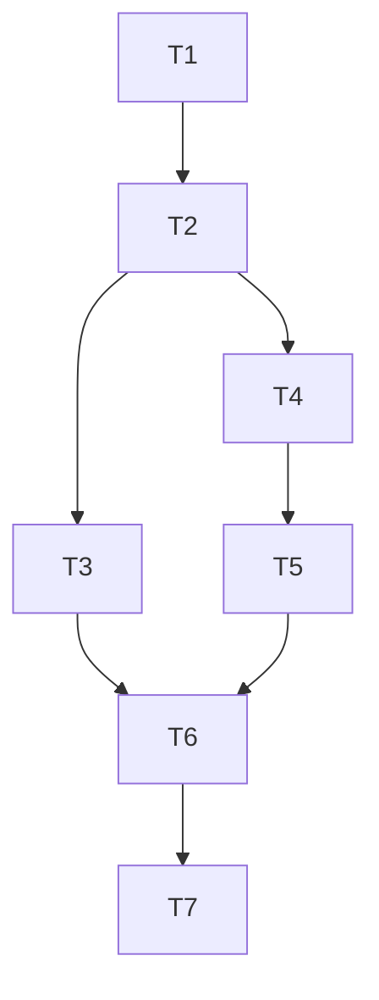

# WebSocket 实施任务拆解

## 任务拆解原则

- 按“可独立验证”进行拆分
- 每个任务具备输入契约、输出契约、实现约束、验收标准
- 优先建立基础设施，再接业务闭环

## T1 实时基础模块搭建

### 输入契约

- 现有 `app-api` 模块体系
- 现有 JWT 服务与 token 存储校验能力

### 输出契约

- 新增 `RealtimeModule`
- 新增 `RealtimeGateway`
- 新增 WS 鉴权守卫与用户上下文注入

### 实现约束

- 不改动现有 HTTP 鉴权行为
- WS 鉴权逻辑复用现有 Auth 能力，不重复实现验签

### 验收标准

- 非法 token 连接被拒绝
- 合法 token 可建立连接并拿到 userId 上下文

## T2 连接管理与用户路由

### 输入契约

- T1 输出的网关与鉴权能力
- Redis 可用配置

### 输出契约

- 连接注册表（userId -> sockets）
- 用户定向推送能力
- 在线状态基础查询能力

### 实现约束

- 支持单用户多端并发连接
- 断开连接必须及时清理索引

### 验收标准

- 指定 userId 可稳定收到定向消息
- 重连与断线场景不出现脏连接

## T3 聊天室闭环能力

### 输入契约

- T2 连接管理能力
- 聊天消息存储模型

### 输出契约

- `chat:join`、`chat:leave`、`chat:send` 事件链路
- 消息落库、广播与 ACK
- 基础限流与幂等处理

### 实现约束

- `clientMsgId` 幂等唯一
- 广播与持久化顺序一致，ACK 可追踪

### 验收标准

- 同房间多用户可实时收发
- 重复发送同一 `clientMsgId` 不产生重复消息

## T4 点赞通知接入

### 输入契约

- 现有点赞业务成功事件点
- 通知落库服务

### 输出契约

- 点赞成功后通知事件发布
- 通知落库 + 实时推送 + 未读数增量

### 实现约束

- 不通知自己点赞自己
- 推送失败不影响主业务事务

### 验收标准

- 被点赞用户在线时可实时收到通知
- 离线时可在通知列表查到记录

## T5 评论通知接入

### 输入契约

- 现有评论创建与审核策略
- T4 通知链路

### 输出契约

- 评论成功触发通知（受审核策略控制）
- 审核通过补发机制

### 实现约束

- `PENDING/隐藏` 评论不得提前推送
- 审核状态切换后补发需幂等

### 验收标准

- 可见评论实时通知正确
- 待审评论不误推，审核通过后可补推

## T6 多实例分发与补偿

### 输入契约

- T2/T4/T5 已具备单实例闭环
- Redis 基础设施可用

### 输出契约

- Redis Adapter 跨实例广播
- `realtime_delivery_log` 重试任务
- 推送失败可追踪与重投

### 实现约束

- 重试策略可配置（次数、间隔、退避）
- 防止无限重试和重复投递

### 验收标准

- 多实例下定向推送与房间广播一致可用
- 推送失败事件可自动重试并收敛

## T7 可观测与回归验证

### 输入契约

- T1-T6 已完成

### 输出契约

- 关键指标埋点
- 核心链路测试（单测/集成）
- 运维手册与回滚开关说明

### 实现约束

- 不影响现有业务 API 行为
- 测试覆盖核心成功与失败路径

### 验收标准

- 关键指标可观测
- 核心场景回归通过

## 任务依赖图

## 并行执行建议

- T3 与 T4 可在 T2 后并行
- T5 依赖 T4 通知链路，不建议提前
- T7 统一在功能闭环后执行
