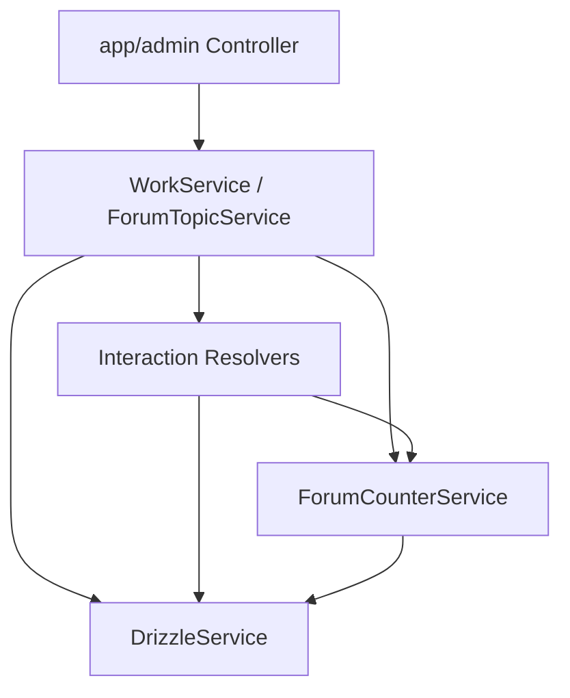

# Work Forum Fixes Design

## 分层设计

- Controller 层：
  - 仅负责 apps/admin DTO 组合、响应裁剪、鉴权入口。
- Service 层：
  - WorkService 负责作品可见性、作品与 forum section 联动、作品论坛入口查询。
  - ForumTopicService 负责 topic 创建、更新、删除、public page/detail、回复统计同步。
- Resolver 层：
  - 负责 forum topic 与 interaction(comment/like/favorite/browse/report) 的目标校验与计数副作用。
- Counter 层：
  - 负责 section/topic/profile 的计数更新与活动字段同步。

## 接口契约策略

- Work app DTO：
  - `WorkDetailDto` 扩展为真实详情结构。
  - `WorkForumSectionDto` 补齐 `topicCount/replyCount/lastPostAt`。
  - `WorkForumTopicDto` 只声明 public page 真实返回字段。
- Like/Favorite app DTO：
  - 统一只保留 `targetDetail` 承载跨目标类型详情。
- Forum app DTO：
  - 提供 page/detail/create/update/delete 五类 DTO。

## 数据流

### 作品发布状态

1. admin 调用作品发布状态更新接口
2. WorkService 在事务内更新 `work.isPublished`
3. 若存在 `forumSectionId`，同步更新 `forum_section.isEnabled`

### forum 回复

1. CommentService 在主题可评论校验通过后创建回复
2. Forum topic comment resolver 在可见回复落库后同步 topic/section/profile 计数与最近回复信息
3. 删除回复时执行逆向同步

### forum topic 可见性

- public 读取与交互统一要求：
  - topic 未删除
  - topic 审核通过
  - topic 未隐藏
  - section 启用

## 异常处理

- 资源不存在：`NotFoundException`
- 业务前置校验失败：`BadRequestException`
- 写路径统一通过 `drizzle.withErrorHandling` 包裹
