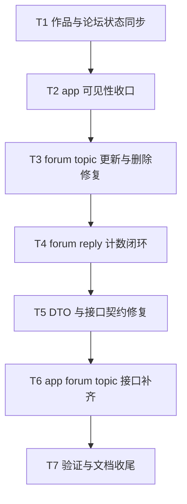

# Work Forum Fixes Tasks

## T1 作品与论坛状态同步

- 输入契约：
  - admin 作品发布状态更新请求
- 输出契约：
  - `work.isPublished` 与 `forum_section.isEnabled` 一致
- 约束：
  - 事务内完成

## T2 app 可见性收口

- 输入契约：
  - app 作品详情/列表/作品论坛入口请求
  - app 对作品、forum topic 的互动请求
- 输出契约：
  - 未发布作品、隐藏主题、未审核主题、禁用板块无法被 public 读取或互动

## T3 forum topic 更新与删除修复

- 输入契约：
  - forum topic update/delete 请求
- 输出契约：
  - 更新接口仅允许修改标题与内容
  - 删除接口只删除 forum topic 自身评论

## T4 forum reply 计数闭环

- 输入契约：
  - 创建/删除 forum 回复
  - 删除 topic
- 输出契约：
  - topic/section/profile 计数闭环
  - 最近回复和最近发帖字段同步

## T5 DTO 与接口契约修复

- 输入契约：
  - apps/admin DTO 与现有响应结构
- 输出契约：
  - DTO 文档与真实响应一致
  - 删除旧兼容字段与旧兼容路由

## T6 app forum topic 接口补齐

- 输入契约：
  - app forum topic 的 public 与用户态需求
- 输出契约：
  - page/detail/create/update/delete 接口可用

## T7 验证与文档收尾

- 输入契约：
  - 代码修改结果
- 输出契约：
  - type-check 或最小验证结果
  - acceptance/final/todo 文档
