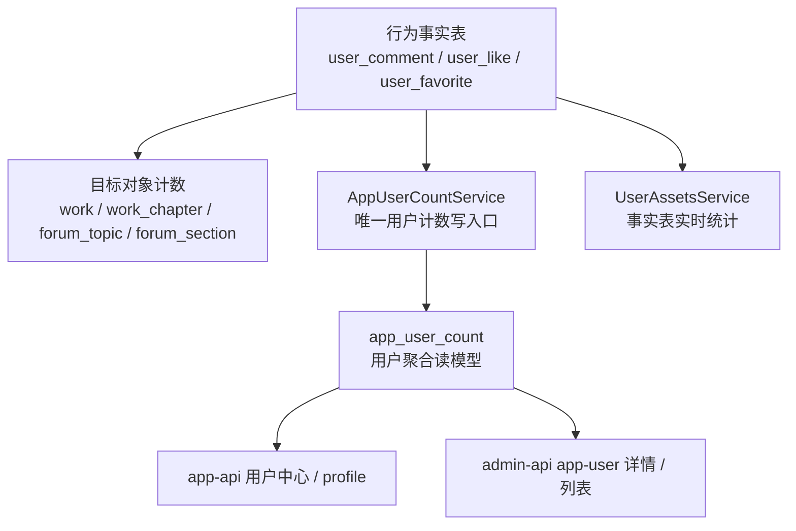

# Work User Count Final Design



## 设计目标

本方案的目标不是“把所有用户统计都塞进一张表”，而是定义一套可长期维护的用户计数模型。

本方案明确以下原则：

- `user_comment`、`user_like`、`user_favorite` 继续作为行为事实表。
- `app_user_count` 保留，但重新定义为“用户聚合读模型表”。
- `app_user_count` 只存高频展示、明确可重建、业务语义稳定的字段。
- 所有写入 `app_user_count` 的动作，统一收口到 `AppUserCountService`。
- 不再保留 `forumReplyCount`，因为论坛回复本质上就是评论子集。

## 范围与非目标

### 范围

- `app_user_count` 表最终字段设计
- 统计口径定义
- 写入责任边界
- DTO / service / resolver 的最终收敛方向
- 回填与重建策略

### 非目标

- 本文档不直接执行代码改造
- 本文档不改变评论、点赞、收藏的统一事实表模型
- 本文档不调整 controller 路由命名

## 核心判断

### 为什么继续保留冗余字段

用户侧聚合计数与目标对象热点计数不同，它们的价值在于：

- 用户中心高频读取
- 后台用户列表与详情直接展示
- 后续支持用户榜单、卡片、画像

如果这些字段每次都从事实表现场聚合：

- 查询会越来越重
- 列表批量读取成本高
- 排序与榜单场景会变复杂

因此，`app_user_count` 继续保留是合理的。

### 为什么删除 `forumReplyCount`

当前评论目标类型一共有 5 类：

- 漫画作品
- 小说作品
- 漫画章节
- 小说章节
- 论坛主题

论坛回复在事实层仍然是 `user_comment` 的一种，不存在独立事实模型。  
因此：

- `commentCount` 是完整的用户评论总数
- `forumReplyCount` 只是 `commentCount` 的论坛子集

保留 `forumReplyCount` 的问题是：

- 冗余链路更多
- 更容易漂移
- 与 `commentCount` 形成口径重叠

所以最终设计中不再保留它。

## 最终表定位

`app_user_count` 的最终定位：

- 表名保持 `app_user_count`
- 语义是“应用用户聚合读模型”
- 不是事实表
- 不是全项目所有统计的兜底垃圾桶
- 只放当前确定要高频展示且维护成本可控的指标

## 最终表结构

### 字段清单

| 字段 | 类型 | 含义 |
| --- | --- | --- |
| `userId` | `integer pk` | 用户 ID，一对一主键 |
| `commentCount` | `integer not null default 0` | 用户发出的评论总数 |
| `likeCount` | `integer not null default 0` | 用户发出的点赞总数 |
| `favoriteCount` | `integer not null default 0` | 用户发出的收藏总数 |
| `forumTopicCount` | `integer not null default 0` | 用户发布的论坛主题总数 |
| `commentReceivedLikeCount` | `integer not null default 0` | 用户评论收到的点赞总数 |
| `forumTopicReceivedLikeCount` | `integer not null default 0` | 用户论坛主题收到的点赞总数 |
| `forumTopicReceivedFavoriteCount` | `integer not null default 0` | 用户论坛主题收到的收藏总数 |
| `createdAt` | `timestamp` | 创建时间 |
| `updatedAt` | `timestamp` | 更新时间 |

### 推荐 schema 形态

```ts
export const appUserCount = pgTable('app_user_count', {
  userId: integer().primaryKey().notNull(),
  commentCount: integer().default(0).notNull(),
  likeCount: integer().default(0).notNull(),
  favoriteCount: integer().default(0).notNull(),
  forumTopicCount: integer().default(0).notNull(),
  commentReceivedLikeCount: integer().default(0).notNull(),
  forumTopicReceivedLikeCount: integer().default(0).notNull(),
  forumTopicReceivedFavoriteCount: integer().default(0).notNull(),
  createdAt: timestamp({ withTimezone: true, precision: 6 }).defaultNow().notNull(),
  updatedAt: timestamp({ withTimezone: true, precision: 6 }).$onUpdate(() => new Date()).notNull(),
})
```

## 统计口径

这部分必须固定下来，否则后续实现一定反复摇摆。

### 1. `commentCount`

定义：

- 用户发出的评论总数
- 统计范围覆盖全部评论目标类型：
  - 漫画作品
  - 小说作品
  - 漫画章节
  - 小说章节
  - 论坛主题

推荐口径：

- `user_comment.user_id = 当前用户`
- `deleted_at is null`
- 不区分 `auditStatus`
- 不区分 `isHidden`

原因：

- 这是“我发出了多少评论”，不是“当前对公众可见多少评论”
- 口径简单、稳定，便于维护
- 与事实表生命周期一致，只需跟随创建与删除

### 2. `likeCount`

定义：

- 用户主动发出的点赞总数

推荐口径：

- `user_like.user_id = 当前用户`

### 3. `favoriteCount`

定义：

- 用户主动发出的收藏总数

推荐口径：

- `user_favorite.user_id = 当前用户`

### 4. `forumTopicCount`

定义：

- 用户发布的论坛主题总数

推荐口径：

- `forum_topic.user_id = 当前用户`
- `deleted_at is null`
- 不区分 `auditStatus`
- 不区分 `isHidden`

原因：

- 这是“我发了多少主题”，不是“对外公开可见多少主题”
- 与当前主题创建链路一致

### 5. `commentReceivedLikeCount`

定义：

- 用户所有评论收到的点赞总数

统计目标：

- 被点赞目标必须是评论
- 评论作者必须是当前用户

推荐口径：

- `user_like.target_type = COMMENT`
- 对应 `user_comment.id = user_like.target_id`
- `user_comment.user_id = 当前用户`
- `user_comment.deleted_at is null`

说明：

- 覆盖全部评论类型，包括论坛回复
- 因为论坛回复本质就是评论，所以不单独拆 `forumReplyReceivedLikeCount`

### 6. `forumTopicReceivedLikeCount`

定义：

- 用户论坛主题收到的点赞总数

推荐口径：

- `user_like.target_type = FORUM_TOPIC`
- 对应 `forum_topic.id = user_like.target_id`
- `forum_topic.user_id = 当前用户`
- `forum_topic.deleted_at is null`

### 7. `forumTopicReceivedFavoriteCount`

定义：

- 用户论坛主题收到的收藏总数

推荐口径：

- `user_favorite.target_type = FORUM_TOPIC`
- 对应 `forum_topic.id = user_favorite.target_id`
- `forum_topic.user_id = 当前用户`
- `forum_topic.deleted_at is null`

## 明确不纳入本表的字段

以下字段当前不建议进入 `app_user_count`：

### `forumReplyCount`

原因：

- 是 `commentCount` 的论坛子集
- 没有独立事实模型
- 冗余收益不高

### `receivedLikeCount`

原因：

- 当前可以由以下两个字段在 service 层派生：
  - `commentReceivedLikeCount`
  - `forumTopicReceivedLikeCount`
- 再存一列只会增加漂移风险

### `receivedFavoriteCount`

原因：

- 当前只有论坛主题存在“用户自己是作者且目标可收藏”的场景
- 直接保留 `forumTopicReceivedFavoriteCount` 已足够精确

### `viewCount`

原因：

- 写入过于高频
- 用户中心场景收益不大
- 不适合优先落到这张表

### `purchaseCount` / `downloadCount`

原因：

- 更接近“资产统计”域
- 当前已有 `UserAssetsService`
- 暂不适合混入社区计数读模型

## 写入责任设计

### 核心原则

只有 `AppUserCountService` 可以直接写 `app_user_count`。  
其他 service / resolver 只能委托它，不能自己直接更新表。

### 写入责任矩阵

| 业务动作 | 事实表/目标表 | 用户计数字段 | 责任位置 |
| --- | --- | --- | --- |
| 创建评论 | `user_comment +1` | `commentCount +1` | `CommentService` |
| 回复评论 | `user_comment +1` | `commentCount +1` | `CommentService` |
| 删除评论 | `user_comment.deletedAt` | `commentCount -1` | `CommentService` |
| 点赞 | `user_like +1` | `likeCount +1` | `LikeService` |
| 取消点赞 | `user_like -1` | `likeCount -1` | `LikeService` |
| 收藏 | `user_favorite +1` | `favoriteCount +1` | `FavoriteService` |
| 取消收藏 | `user_favorite -1` | `favoriteCount -1` | `FavoriteService` |
| 创建论坛主题 | `forum_topic +1` | `forumTopicCount +1` | `ForumTopicService` |
| 删除论坛主题 | `forum_topic.deletedAt` | `forumTopicCount -1` | `ForumTopicService` |
| 点赞评论 | `user_comment.likeCount +1` | `commentReceivedLikeCount +1` | `CommentLikeResolver` |
| 取消点赞评论 | `user_comment.likeCount -1` | `commentReceivedLikeCount -1` | `CommentLikeResolver` |
| 点赞论坛主题 | `forum_topic.likeCount +1` | `forumTopicReceivedLikeCount +1` | `ForumTopicLikeResolver` |
| 取消点赞论坛主题 | `forum_topic.likeCount -1` | `forumTopicReceivedLikeCount -1` | `ForumTopicLikeResolver` |
| 收藏论坛主题 | `forum_topic.favoriteCount +1` | `forumTopicReceivedFavoriteCount +1` | `ForumTopicFavoriteResolver` |
| 取消收藏论坛主题 | `forum_topic.favoriteCount -1` | `forumTopicReceivedFavoriteCount -1` | `ForumTopicFavoriteResolver` |

## 服务设计

### `AppUserCountService` 最终职责

建议最终只保留以下职责：

- `initUserCounts(tx, userId)`
- `getUserCounts(userId)`
- `updateCommentCount(tx, userId, delta)`
- `updateLikeCount(tx, userId, delta)`
- `updateFavoriteCount(tx, userId, delta)`
- `updateForumTopicCount(tx, userId, delta)`
- `updateCommentReceivedLikeCount(tx, userId, delta)`
- `updateForumTopicReceivedLikeCount(tx, userId, delta)`
- `updateForumTopicReceivedFavoriteCount(tx, userId, delta)`
- `rebuildUserCounts(userId)`
- `rebuildAllUserCounts()` 或离线脚本

### 其他服务职责边界

#### `CommentService`

负责：

- 评论事实表写入
- 评论作者的 `commentCount`

不负责：

- 论坛主题作者收到互动的统计

#### `LikeService`

负责：

- 点赞事实表写入
- 点赞人自己的 `likeCount`

不直接负责：

- 被点赞目标作者收到的互动统计

#### `FavoriteService`

负责：

- 收藏事实表写入
- 收藏人自己的 `favoriteCount`

不直接负责：

- 被收藏目标作者收到的互动统计

#### `ForumTopicService`

负责：

- 论坛主题创建、删除
- 主题作者的 `forumTopicCount`

#### `CommentLikeResolver`

负责：

- 评论目标自身 `likeCount`
- 评论作者的 `commentReceivedLikeCount`

#### `ForumTopicLikeResolver`

负责：

- 论坛主题自身 `likeCount`
- 主题作者的 `forumTopicReceivedLikeCount`

#### `ForumTopicFavoriteResolver`

负责：

- 论坛主题自身 `favoriteCount`
- 主题作者的 `forumTopicReceivedFavoriteCount`

## 读取设计

### 对外统一输出字段

`app-api` 和 `admin-api` 对外继续统一使用：

- `counts`

内部字段按最终 schema 输出，不再出现：

- `forumReplyCount`
- `forumReceivedLikeCount`
- `forumReceivedFavoriteCount`

统一改为：

- `commentCount`
- `likeCount`
- `favoriteCount`
- `forumTopicCount`
- `commentReceivedLikeCount`
- `forumTopicReceivedLikeCount`
- `forumTopicReceivedFavoriteCount`

### DTO 设计原则

- `BaseAppUserCountDto` 必须与 `app_user_count` 表字段完全一致
- app/admin 两侧 DTO 都从 `BaseAppUserCountDto` 映射生成
- 不再创造单独的 forum-only 用户计数 DTO

## 索引设计

### `app_user_count`

初版建议索引极简：

- `PRIMARY KEY (userId)`

理由：

- 主要读法是按 `userId` 一对一查询
- 写入频率较高，不适合先给每个 count 字段都上索引

### 可选后补索引

仅当明确出现排行榜或后台排序需求时再补：

- `app_user_count_forum_topic_count_idx`
- `app_user_count_forum_topic_received_like_count_idx`
- `app_user_count_comment_received_like_count_idx`

### 现有事实表索引是否足够

当前仓库已有关键索引基本足以支撑回填与重建：

- `user_comment_user_id_idx`
- `user_like_target_type_target_id_idx`
- `user_like_user_id_scene_type_created_at_idx`
- `user_favorite_target_type_target_id_idx`
- `user_favorite_user_id_idx`
- `forum_topic_user_id_idx`

因此本方案不要求先补额外事实表索引。

## 迁移方案

### 当前表到最终表的字段调整

| 当前字段 | 最终动作 |
| --- | --- |
| `forumTopicCount` | 保留 |
| `forumReplyCount` | 删除 |
| `forumReceivedLikeCount` | 重命名为 `forumTopicReceivedLikeCount` |
| `forumReceivedFavoriteCount` | 重命名为 `forumTopicReceivedFavoriteCount` |
| 无 | 新增 `commentCount` |
| 无 | 新增 `likeCount` |
| 无 | 新增 `favoriteCount` |
| 无 | 新增 `commentReceivedLikeCount` |

### 推荐迁移顺序

1. 新增新字段
2. 回填新字段
3. 切换 DTO / service / resolver 使用新字段
4. 删除 `forumReplyCount`
5. 删除旧命名字段

## 回填与重建策略

### 为什么必须有重建能力

`app_user_count` 是读模型，不是事实表。  
只要它存在，就必须允许从事实表和目标表全量重建。

### 单用户重建口径

按以下来源重算：

- `commentCount` <- `user_comment`
- `likeCount` <- `user_like`
- `favoriteCount` <- `user_favorite`
- `forumTopicCount` <- `forum_topic`
- `commentReceivedLikeCount` <- `user_like join user_comment`
- `forumTopicReceivedLikeCount` <- `user_like join forum_topic`
- `forumTopicReceivedFavoriteCount` <- `user_favorite join forum_topic`

### 设计要求

必须至少具备以下一种能力：

- `AppUserCountService.rebuildUserCounts(userId)`
- 后台管理脚本
- 数据修复 migration / SQL 脚本

## 安全与一致性要求

### 1. 所有减法更新必须防止出现负数

`AppUserCountService` 的减法逻辑需要和通用计数器保持一致：

- 要么使用 `gte(column, amount)` 保护
- 要么使用受控 `greatest(column - amount, 0)`

推荐做法：

- 继续沿用“更新失败即抛错”的模型
- 不允许静默减成负数

### 2. 所有写路径必须在同一事务内完成

例如：

- 点赞记录插入
- 目标对象 `likeCount`
- 用户侧 received count

必须属于同一事务，避免计数漂移。

### 3. 不允许绕过 `AppUserCountService` 直接写表

否则这张表会重新变成多入口散写。

## 与当前代码的主要差异

本最终方案相对当前代码有以下关键调整：

1. 删除 `forumReplyCount`
2. 将 `forumReceivedLikeCount` 精确重命名为 `forumTopicReceivedLikeCount`
3. 将 `forumReceivedFavoriteCount` 精确重命名为 `forumTopicReceivedFavoriteCount`
4. 新增用户主动行为计数：
   - `commentCount`
   - `likeCount`
   - `favoriteCount`
5. 新增评论收到点赞计数：
   - `commentReceivedLikeCount`
6. 用户评论计数统一由 `CommentService` 维护，不再通过 forum 子路径侧写

## 实施优先级

### 第一优先级

- 改 `app_user_count` schema
- 改 `BaseAppUserCountDto`
- 改 `AppUserCountService`

### 第二优先级

- 改 `CommentService` / `LikeService` / `FavoriteService`
- 改 `CommentLikeResolver` / `ForumTopicLikeResolver` / `ForumTopicFavoriteResolver`
- 改 `ForumTopicService`

### 第三优先级

- 改 app-api / admin-api DTO 与 service 映射
- 删除旧字段名与旧描述
- 增加重建脚本或重建方法

## 最终结论

最终版方案应收敛为：

- 统一事实表继续保留
- `app_user_count` 继续保留，但只作为用户聚合读模型
- 不保留 `forumReplyCount`
- 保留论坛主题收到互动字段，但名称必须精确到 `forumTopic*`
- 增加用户主动行为计数和评论收到点赞计数
- 所有写入统一收口到 `AppUserCountService`

最终字段集合如下：

- `userId`
- `commentCount`
- `likeCount`
- `favoriteCount`
- `forumTopicCount`
- `commentReceivedLikeCount`
- `forumTopicReceivedLikeCount`
- `forumTopicReceivedFavoriteCount`
- `createdAt`
- `updatedAt`
