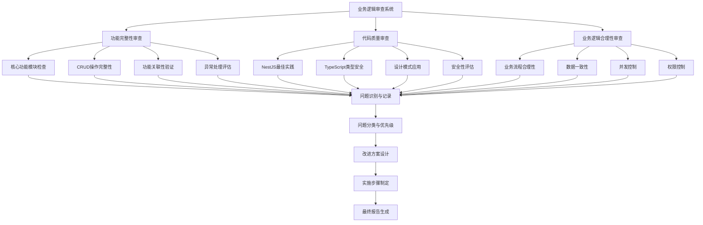
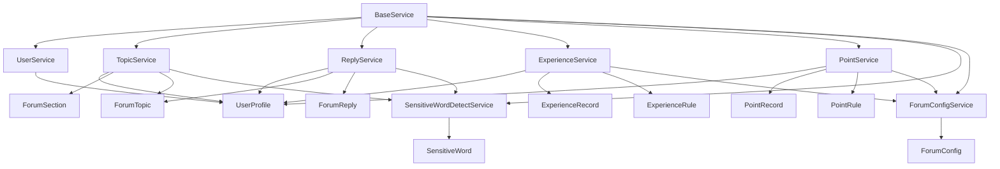
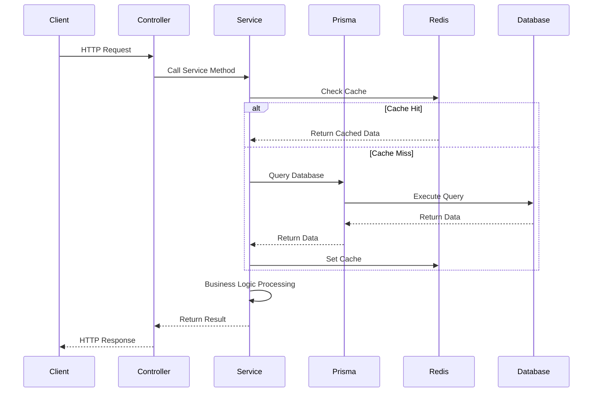
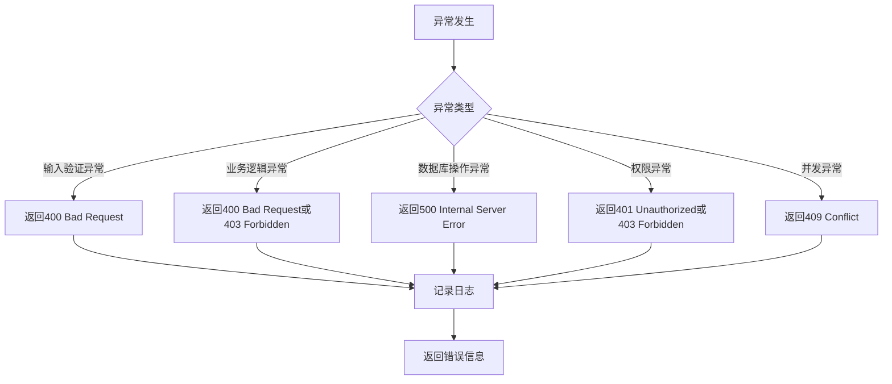

# 业务逻辑审查设计文档

## 1. 整体架构设计

### 1.1 审查架构图



### 1.2 分层设计

#### 第一层：输入层
- **代码文件读取**：读取Forum模块的所有源代码文件
- **配置文件分析**：分析Prisma schema、环境配置等
- **文档分析**：分析现有文档和注释

#### 第二层：分析层
- **静态代码分析**：分析代码结构、依赖关系、复杂度
- **模式识别**：识别设计模式、反模式
- **业务流程追踪**：追踪业务流程的完整路径

#### 第三层：评估层
- **功能完整性评估**：评估功能实现的完整性
- **代码质量评估**：评估代码质量指标
- **业务逻辑评估**：评估业务逻辑的合理性

#### 第四层：输出层
- **问题清单**：列出所有发现的问题
- **改进方案**：提供具体的改进方案
- **最终报告**：生成完整的审查报告

## 2. 核心组件设计

### 2.1 功能完整性审查组件

#### 2.1.1 核心功能模块检查器
**职责**：检查所有核心功能模块是否已实现

**检查项**：
- [ ] 用户管理模块（User）
- [ ] 主题管理模块（Topic）
- [ ] 回复管理模块（Reply）
- [ ] 经验系统模块（Experience）
- [ ] 积分系统模块（Point）
- [ ] 敏感词检测模块（Sensitive Word）
- [ ] 论坛配置模块（Config）

**评估标准**：
- ✅ 模块存在且有完整的Service实现
- ✅ 模块有对应的Controller
- ✅ 模块有对应的DTO定义
- ✅ 模块有对应的Prisma模型

#### 2.1.2 CRUD操作完整性检查器
**职责**：检查每个功能模块的CRUD操作是否完整

**检查项**：
- [ ] Create操作：创建记录
- [ ] Read操作：读取记录（单个、列表、分页）
- [ ] Update操作：更新记录
- [ ] Delete操作：删除记录（软删除、硬删除）

**评估标准**：
- ✅ 每个操作都有对应的Service方法
- ✅ 每个操作都有对应的输入验证
- ✅ 每个操作都有对应的异常处理
- ✅ 每个操作都有对应的权限控制

#### 2.1.3 功能关联性验证器
**职责**：验证功能之间的关联是否正确实现

**检查项**：
- [ ] 用户与主题的关联
- [ ] 用户与回复的关联
- [ ] 主题与回复的关联
- [ ] 主题与版块的关联
- [ ] 用户与经验记录的关联
- [ ] 用户与积分记录的关联

**评估标准**：
- ✅ 关联关系在Prisma模型中正确定义
- ✅ 关联操作在Service中正确实现
- ✅ 关联数据的一致性得到保证

#### 2.1.4 异常处理评估器
**职责**：评估异常处理的完整性和合理性

**检查项**：
- [ ] 输入验证异常
- [ ] 业务逻辑异常
- [ ] 数据库操作异常
- [ ] 权限异常
- [ ] 并发异常

**评估标准**：
- ✅ 所有可能的异常都有处理
- ✅ 异常信息清晰准确
- ✅ 异常不会暴露敏感信息
- ✅ 异常处理符合NestJS最佳实践

### 2.2 代码质量审查组件

#### 2.2.1 NestJS最佳实践检查器
**职责**：检查代码是否遵循NestJS最佳实践

**检查项**：
- [ ] 使用依赖注入模式
- [ ] 使用模块化架构
- [ ] 使用装饰器（@Controller, @Service, @Injectable等）
- [ ] 使用中间件和拦截器
- [ ] 使用守卫进行权限控制
- [ ] 使用管道进行数据验证

**评估标准**：
- ✅ 代码结构符合NestJS规范
- ✅ 正确使用NestJS特性
- ✅ 模块依赖关系清晰
- ✅ 代码可测试性良好

#### 2.2.2 TypeScript类型安全检查器
**职责**：检查TypeScript类型定义的完整性和准确性

**检查项**：
- [ ] 所有函数都有返回类型
- [ ] 所有参数都有类型定义
- [ ] 使用接口或类型别名定义数据结构
- [ ] 使用枚举定义常量
- [ ] 避免使用any类型
- [ ] 使用泛型提高代码复用性

**评估标准**：
- ✅ 类型定义完整准确
- ✅ 类型安全性得到保证
- ✅ 代码可读性和可维护性良好

#### 2.2.3 设计模式应用检查器
**职责**：检查设计模式的应用情况

**检查项**：
- [ ] 单例模式（Service类）
- [ ] 工厂模式（创建对象）
- [ ] 策略模式（不同的处理策略）
- [ ] 观察者模式（事件处理）
- [ ] 仓储模式（数据访问）

**评估标准**：
- ✅ 设计模式应用合理
- ✅ 代码结构清晰
- ✅ 代码复用性良好

#### 2.2.4 安全性评估器
**职责**：评估代码的安全性

**检查项**：
- [ ] SQL注入防护
- [ ] XSS攻击防护
- [ ] CSRF攻击防护
- [ ] 敏感信息保护
- [ ] 输入验证和输出过滤
- [ ] 权限控制

**评估标准**：
- ✅ 所有安全风险都有防护措施
- ✅ 敏感信息不暴露
- ✅ 输入验证完整
- ✅ 权限控制严格

### 2.3 业务逻辑合理性审查组件

#### 2.3.1 业务流程合理性评估器
**职责**：评估业务流程的合理性

**检查项**：
- [ ] 主题创建流程
- [ ] 主题审核流程
- [ ] 回复创建流程
- [ ] 经验增加流程
- [ ] 积分增加流程
- [ ] 敏感词检测流程

**评估标准**：
- ✅ 业务流程符合实际需求
- ✅ 流程逻辑清晰
- ✅ 流程步骤合理
- ✅ 流程边界明确

#### 2.3.2 数据一致性检查器
**职责**：检查数据一致性的保证措施

**检查项**：
- [ ] 事务使用
- [ ] 数据验证
- [ ] 数据同步
- [ ] 数据备份

**评估标准**：
- ✅ 数据一致性得到保证
- ✅ 事务使用正确
- ✅ 数据验证完整
- ✅ 数据同步及时

#### 2.3.3 并发控制检查器
**职责**：检查并发控制的实现

**检查项**：
- [ ] 乐观锁
- [ ] 悲观锁
- [ ] 分布式锁
- [ ] 并发限制

**评估标准**：
- ✅ 并发问题得到有效控制
- ✅ 并发控制策略合理
- ✅ 并发性能良好

#### 2.3.4 权限控制检查器
**职责**：检查权限控制的完整性

**检查项**：
- [ ] 用户认证
- [ ] 用户授权
- [ ] 资源访问控制
- [ ] 操作权限控制

**评估标准**：
- ✅ 权限控制完整
- ✅ 权限粒度合理
- ✅ 权限验证严格

## 3. 模块依赖关系图



## 4. 接口契约定义

### 4.1 审查接口契约

#### 4.1.1 功能完整性审查接口
```typescript
interface FunctionalCompletenessReview {
  checkCoreModules(): Promise<ModuleCheckResult[]>;
  checkCRUDOperations(moduleName: string): Promise<CRUDCheckResult>;
  verifyFunctionalRelations(): Promise<RelationCheckResult[]>;
  evaluateExceptionHandling(): Promise<ExceptionHandlingResult>;
}

interface ModuleCheckResult {
  moduleName: string;
  hasService: boolean;
  hasController: boolean;
  hasDTO: boolean;
  hasPrismaModel: boolean;
  isComplete: boolean;
}

interface CRUDCheckResult {
  moduleName: string;
  hasCreate: boolean;
  hasRead: boolean;
  hasUpdate: boolean;
  hasDelete: boolean;
  isComplete: boolean;
}
```

#### 4.1.2 代码质量审查接口
```typescript
interface CodeQualityReview {
  checkNestJSBestPractices(): Promise<NestJSBestPracticeResult>;
  checkTypeScriptTypeSafety(): Promise<TypeSafetyResult>;
  checkDesignPatterns(): Promise<DesignPatternResult>;
  evaluateSecurity(): Promise<SecurityResult>;
}

interface NestJSBestPracticeResult {
  usesDependencyInjection: boolean;
  usesModularArchitecture: boolean;
  usesDecorators: boolean;
  usesMiddleware: boolean;
  usesGuards: boolean;
  usesPipes: boolean;
  score: number;
}
```

#### 4.1.3 业务逻辑合理性审查接口
```typescript
interface BusinessLogicReview {
  evaluateBusinessProcess(processName: string): Promise<ProcessEvaluationResult>;
  checkDataConsistency(): Promise<ConsistencyCheckResult>;
  checkConcurrencyControl(): Promise<ConcurrencyControlResult>;
  checkPermissionControl(): Promise<PermissionControlResult>;
}

interface ProcessEvaluationResult {
  processName: string;
  isReasonable: boolean;
  issues: Issue[];
  suggestions: Suggestion[];
}
```

### 4.2 数据流向图



## 5. 异常处理策略

### 5.1 异常分类

#### 5.1.1 输入验证异常
- **类型**：BadRequestException
- **场景**：输入数据格式不正确、缺少必填字段、数据类型错误
- **处理**：在Controller层使用ValidationPipe进行验证

#### 5.1.2 业务逻辑异常
- **类型**：BadRequestException, ForbiddenException
- **场景**：业务规则不满足、权限不足、资源不存在
- **处理**：在Service层进行业务逻辑验证

#### 5.1.3 数据库操作异常
- **类型**：InternalServerErrorException
- **场景**：数据库连接失败、查询超时、数据冲突
- **处理**：使用事务保证数据一致性，捕获并记录异常

#### 5.1.4 权限异常
- **类型**：UnauthorizedException, ForbiddenException
- **场景**：用户未认证、用户权限不足
- **处理**：使用Guards进行权限验证

#### 5.1.5 并发异常
- **类型**：ConflictException
- **场景**：数据冲突、并发修改
- **处理**：使用乐观锁或悲观锁

### 5.2 异常处理流程



### 5.3 异常处理最佳实践

1. **使用NestJS内置异常类**
   - HttpException
   - BadRequestException
   - UnauthorizedException
   - ForbiddenException
   - NotFoundException
   - ConflictException
   - InternalServerErrorException

2. **自定义异常过滤器**
   - 统一异常响应格式
   - 记录异常日志
   - 隐藏敏感信息

3. **使用全局异常管道**
   - 自动验证输入
   - 转换异常类型
   - 提供友好的错误信息

4. **事务中的异常处理**
   - 使用try-catch捕获异常
   - 在catch中回滚事务
   - 记录详细的错误信息

## 6. 评估指标体系

### 6.1 功能完整性指标

| 指标名称 | 权重 | 评估标准 | 分值范围 |
|---------|------|---------|---------|
| 核心模块覆盖率 | 30% | 核心功能模块实现比例 | 0-100 |
| CRUD操作完整性 | 25% | CRUD操作实现比例 | 0-100 |
| 功能关联性 | 20% | 功能关联正确性 | 0-100 |
| 异常处理完整性 | 15% | 异常处理覆盖率 | 0-100 |
| 输入验证完整性 | 10% | 输入验证覆盖率 | 0-100 |

### 6.2 代码质量指标

| 指标名称 | 权重 | 评估标准 | 分值范围 |
|---------|------|---------|---------|
| NestJS最佳实践符合度 | 30% | 符合NestJS最佳实践的比例 | 0-100 |
| TypeScript类型安全性 | 25% | 类型定义完整性和准确性 | 0-100 |
| 设计模式应用合理性 | 20% | 设计模式应用合理性 | 0-100 |
| 安全性 | 15% | 安全防护措施完整性 | 0-100 |
| 代码可读性 | 10% | 代码可读性和可维护性 | 0-100 |

### 6.3 业务逻辑合理性指标

| 指标名称 | 权重 | 评估标准 | 分值范围 |
|---------|------|---------|---------|
| 业务流程合理性 | 30% | 业务流程符合实际需求程度 | 0-100 |
| 数据一致性 | 25% | 数据一致性保证措施 | 0-100 |
| 并发控制合理性 | 20% | 并发控制策略合理性 | 0-100 |
| 权限控制完整性 | 15% | 权限控制完整性 | 0-100 |
| 业务规则合理性 | 10% | 业务规则合理性 | 0-100 |

### 6.4 综合评分计算

```
综合评分 = 功能完整性得分 × 30% + 代码质量得分 × 30% + 业务逻辑合理性得分 × 40%
```

**评分等级**：
- 90-100分：优秀
- 80-89分：良好
- 70-79分：中等
- 60-69分：及格
- 0-59分：不及格

## 7. 设计原则

### 7.1 审查设计原则

1. **全面性原则**
   - 覆盖所有核心功能模块
   - 覆盖所有代码质量维度
   - 覆盖所有业务逻辑方面

2. **客观性原则**
   - 基于明确的评估标准
   - 使用量化的评估指标
   - 避免主观判断

3. **实用性原则**
   - 改进方案具体可执行
   - 代码示例完整可用
   - 实施步骤清晰明确

4. **可追溯性原则**
   - 问题有明确的来源
   - 改进方案有明确的依据
   - 审查过程有完整的记录

### 7.2 代码审查原则

1. **遵循现有架构**
   - 不改变现有架构模式
   - 复用现有组件和模式
   - 保持代码风格一致

2. **最小化改动**
   - 只修改必要的代码
   - 避免过度设计
   - 保持代码简洁

3. **向后兼容**
   - 不破坏现有功能
   - 保持API兼容性
   - 保证数据兼容性

4. **渐进式改进**
   - 优先解决高优先级问题
   - 分阶段实施改进
   - 持续优化代码质量

## 8. 质量门控

### 8.1 架构设计质量门控

- [x] 构构图清晰准确
- [x] 接口定义完整
- [x] 与现有系统无冲突
- [x] 设计可行性验证通过
- [x] 评估指标体系完整
- [x] 审查方法论明确
- [x] 组件职责清晰
- [x] 依赖关系合理

### 8.2 文档质量门控

- [x] 文档结构清晰
- [x] 内容完整准确
- [x] 图表清晰易懂
- [x] 代码示例完整
- [x] 语言简洁准确
- [x] 格式规范统一

## 9. 实施计划

### 9.1 审查实施步骤

1. **准备阶段**
   - 读取所有源代码文件
   - 分析项目结构
   - 理解业务逻辑

2. **执行阶段**
   - 执行功能完整性审查
   - 执行代码质量审查
   - 执行业务逻辑合理性审查

3. **分析阶段**
   - 汇总审查结果
   - 分类和优先级排序
   - 分析问题根本原因

4. **方案阶段**
   - 设计改进方案
   - 制定实施步骤
   - 评估预期效果

5. **报告阶段**
   - 生成审查报告
   - 创建改进方案文档
   - 创建TODO清单

### 9.2 时间安排

| 阶段 | 任务 | 预计时间 |
|-----|------|---------|
| 准备阶段 | 读取代码和分析项目 | 1小时 |
| 执行阶段 | 执行三项审查 | 4-6小时 |
| 分析阶段 | 汇总和分析结果 | 1小时 |
| 方案阶段 | 设计改进方案 | 1-2小时 |
| 报告阶段 | 生成最终报告 | 1小时 |

**总计**：8-11小时

## 10. 风险控制

### 10.1 设计风险

| 风险 | 影响 | 概率 | 应对措施 |
|-----|------|------|---------|
| 审查标准不明确 | 高 | 低 | 明确定义评估标准和指标 |
| 审查方法不适用 | 中 | 低 | 采用成熟的审查方法 |
| 评估指标不合理 | 中 | 中 | 基于行业最佳实践设计 |

### 10.2 执行风险

| 风险 | 影响 | 概率 | 应对措施 |
|-----|------|------|---------|
| 代码理解不深入 | 高 | 中 | 深入分析代码和文档 |
| 问题识别不完整 | 中 | 中 | 采用系统化的审查方法 |
| 改进方案不可行 | 中 | 低 | 与团队确认改进方案 |

**文档版本**：v1.0
**创建日期**：2026-01-10
**状态**：已完成
