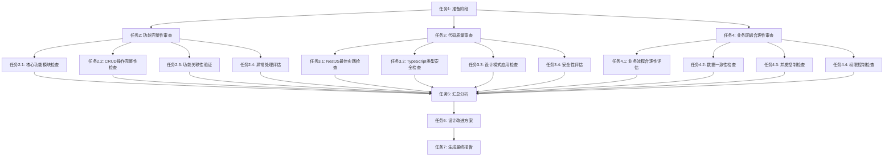

# 业务逻辑审查任务拆分文档

## 1. 任务依赖关系图

## 2. 原子任务定义

### 任务1: 准备阶段

#### 输入契约
**前置依赖**：
- ALIGNMENT_业务逻辑审查.md
- CONSENSUS_业务逻辑审查.md
- DESIGN_业务逻辑审查.md

**输入数据**：
- Forum模块源代码路径
- Prisma schema文件路径
- 项目配置文件路径

**环境依赖**：
- 可访问项目文件系统
- 可读取源代码文件

#### 输出契约
**输出数据**：
- Forum模块文件清单
- 核心服务类清单
- Prisma模型清单
- 项目结构分析报告

**交付物**：
- docs/业务逻辑审查/TEMP_文件清单.md

**验收标准**：
- [ ] 所有Forum模块文件已识别
- [ ] 所有核心服务类已列出
- [ ] 所有Prisma模型已列出
- [ ] 项目结构分析准确

#### 实现约束
**技术栈**：
- 使用Glob工具查找文件
- 使用Read工具读取文件
- 使用LS工具列出目录

**接口规范**：
- 遵循Markdown文档格式
- 使用清晰的标题层级

**质量要求**：
- 文件清单完整准确
- 分类清晰合理

#### 依赖关系
**后置任务**：任务2、任务3、任务4
**并行任务**：无

---

### 任务2.1: 核心功能模块检查

#### 输入契约
**前置依赖**：
- 任务1完成
- ALIGNMENT_业务逻辑审查.md

**输入数据**：
- Forum模块文件清单
- 核心服务类清单

**环境依赖**：
- 可读取源代码文件

#### 输出契约
**输出数据**：
- 每个核心模块的实现状态
- 缺失的模块清单
- 模块完整性评分

**交付物**：
- docs/业务逻辑审查/TEMP_核心功能模块检查.md

**验收标准**：
- [ ] 检查了所有7个核心模块
- [ ] 识别了每个模块的Service、Controller、DTO、Prisma模型
- [ ] 计算了模块完整性评分
- [ ] 列出了缺失的模块

#### 实现约束
**技术栈**：
- 使用Read工具读取文件
- 使用Grep工具搜索代码模式

**接口规范**：
- 使用表格形式展示检查结果
- 包含评分和问题列表

**质量要求**：
- 检查结果准确完整
- 评分计算正确

#### 依赖关系
**后置任务**：任务5（汇总分析）
**并行任务**：任务2.2、任务2.3、任务2.4

---

### 任务2.2: CRUD操作完整性检查

#### 输入契约
**前置依赖**：
- 任务1完成
- ALIGNMENT_业务逻辑审查.md

**输入数据**：
- 核心服务类清单
- Service源代码文件

**环境依赖**：
- 可读取源代码文件

#### 输出契约
**输出数据**：
- 每个模块的CRUD操作实现状态
- 缺失的操作清单
- CRUD完整性评分

**交付物**：
- docs/业务逻辑审查/TEMP_CRUD操作检查.md

**验收标准**：
- [ ] 检查了所有核心模块的CRUD操作
- [ ] 识别了每个模块的Create、Read、Update、Delete操作
- [ ] 计算了CRUD完整性评分
- [ ] 列出了缺失的操作

#### 实现约束
**技术栈**：
- 使用Read工具读取文件
- 使用Grep工具搜索方法定义

**接口规范**：
- 使用表格形式展示检查结果
- 包含评分和问题列表

**质量要求**：
- 检查结果准确完整
- 评分计算正确

#### 依赖关系
**后置任务**：任务5（汇总分析）
**并行任务**：任务2.1、任务2.3、任务2.4

---

### 任务2.3: 功能关联性验证

#### 输入契约
**前置依赖**：
- 任务1完成
- ALIGNMENT_业务逻辑审查.md

**输入数据**：
- Prisma schema文件
- Service源代码文件

**环境依赖**：
- 可读取源代码文件

#### 输出契约
**输出数据**：
- 功能关联关系清单
- 关联实现状态
- 关联完整性评分

**交付物**：
- docs/业务逻辑审查/TEMP_功能关联性验证.md

**验收标准**：
- [ ] 检查了所有主要功能关联
- [ ] 验证了Prisma模型中的关联定义
- [ ] 验证了Service中的关联操作
- [ ] 计算了关联完整性评分
- [ ] 列出了缺失的关联

#### 实现约束
**技术栈**：
- 使用Read工具读取文件
- 使用Grep工具搜索关联定义

**接口规范**：
- 使用表格形式展示检查结果
- 包含评分和问题列表

**质量要求**：
- 检查结果准确完整
- 评分计算正确

#### 依赖关系
**后置任务**：任务5（汇总分析）
**并行任务**：任务2.1、任务2.2、任务2.4

---

### 任务2.4: 异常处理评估

#### 输入契约
**前置依赖**：
- 任务1完成
- ALIGNMENT_业务逻辑审查.md

**输入数据**：
- Service源代码文件
- Controller源代码文件

**环境依赖**：
- 可读取源代码文件

#### 输出契约
**输出数据**：
- 异常处理覆盖情况
- 缺失的异常处理
- 异常处理评分

**交付物**：
- docs/业务逻辑审查/TEMP_异常处理评估.md

**验收标准**：
- [ ] 检查了所有Service和Controller的异常处理
- [ ] 识别了输入验证、业务逻辑、数据库操作、权限、并发异常
- [ ] 计算了异常处理评分
- [ ] 列出了缺失的异常处理

#### 实现约束
**技术栈**：
- 使用Read工具读取文件
- 使用Grep工具搜索异常处理代码

**接口规范**：
- 使用表格形式展示检查结果
- 包含评分和问题列表

**质量要求**：
- 检查结果准确完整
- 评分计算正确

#### 依赖关系
**后置任务**：任务5（汇总分析）
**并行任务**：任务2.1、任务2.2、任务2.3

---

### 任务3.1: NestJS最佳实践检查

#### 输入契约
**前置依赖**：
- 任务1完成
- DESIGN_业务逻辑审查.md

**输入数据**：
- Forum模块源代码文件

**环境依赖**：
- 可读取源代码文件

#### 输出契约
**输出数据**：
- NestJS最佳实践符合情况
- 不符合实践的清单
- NestJS最佳实践评分

**交付物**：
- docs/业务逻辑审查/TEMP_NestJS最佳实践检查.md

**验收标准**：
- [ ] 检查了依赖注入、模块化架构、装饰器、中间件、守卫、管道的使用
- [ ] 识别了不符合最佳实践的代码
- [ ] 计算了NestJS最佳实践评分
- [ ] 列出了需要改进的地方

#### 实现约束
**技术栈**：
- 使用Read工具读取文件
- 使用Grep工具搜索NestJS特性

**接口规范**：
- 使用表格形式展示检查结果
- 包含评分和问题列表

**质量要求**：
- 检查结果准确完整
- 评分计算正确

#### 依赖关系
**后置任务**：任务5（汇总分析）
**并行任务**：任务3.2、任务3.3、任务3.4

---

### 任务3.2: TypeScript类型安全检查

#### 输入契约
**前置依赖**：
- 任务1完成
- DESIGN_业务逻辑审查.md

**输入数据**：
- Forum模块源代码文件

**环境依赖**：
- 可读取源代码文件

#### 输出契约
**输出数据**：
- TypeScript类型定义情况
- 类型安全问题清单
- TypeScript类型安全评分

**交付物**：
- docs/业务逻辑审查/TEMP_TypeScript类型安全检查.md

**验收标准**：
- [ ] 检查了函数返回类型、参数类型、接口定义、枚举使用、any类型使用、泛型使用
- [ ] 识别了类型安全问题
- [ ] 计算了TypeScript类型安全评分
- [ ] 列出了需要改进的地方

#### 实现约束
**技术栈**：
- 使用Read工具读取文件
- 使用Grep工具搜索类型定义

**接口规范**：
- 使用表格形式展示检查结果
- 包含评分和问题列表

**质量要求**：
- 检查结果准确完整
- 评分计算正确

#### 依赖关系
**后置任务**：任务5（汇总分析）
**并行任务**：任务3.1、任务3.3、任务3.4

---

### 任务3.3: 设计模式应用检查

#### 输入契约
**前置依赖**：
- 任务1完成
- DESIGN_业务逻辑审查.md

**输入数据**：
- Forum模块源代码文件

**环境依赖**：
- 可读取源代码文件

#### 输出契约
**输出数据**：
- 设计模式应用情况
- 设计模式问题清单
- 设计模式应用评分

**交付物**：
- docs/业务逻辑审查/TEMP_设计模式应用检查.md

**验收标准**：
- [ ] 检查了单例模式、工厂模式、策略模式、观察者模式、仓储模式的应用
- [ ] 识别了设计模式问题
- [ ] 计算了设计模式应用评分
- [ ] 列出了需要改进的地方

#### 实现约束
**技术栈**：
- 使用Read工具读取文件
- 使用Grep工具搜索设计模式

**接口规范**：
- 使用表格形式展示检查结果
- 包含评分和问题列表

**质量要求**：
- 检查结果准确完整
- 评分计算正确

#### 依赖关系
**后置任务**：任务5（汇总分析）
**并行任务**：任务3.1、任务3.2、任务3.4

---

### 任务3.4: 安全性评估

#### 输入契约
**前置依赖**：
- 任务1完成
- DESIGN_业务逻辑审查.md

**输入数据**：
- Forum模块源代码文件
- Prisma schema文件

**环境依赖**：
- 可读取源代码文件

#### 输出契约
**输出数据**：
- 安全防护措施情况
- 安全问题清单
- 安全性评分

**交付物**：
- docs/业务逻辑审查/TEMP_安全性评估.md

**验收标准**：
- [ ] 检查了SQL注入、XSS、CSRF防护
- [ ] 检查了敏感信息保护
- [ ] 检查了输入验证和输出过滤
- [ ] 检查了权限控制
- [ ] 计算了安全性评分
- [ ] 列出了安全问题

#### 实现约束
**技术栈**：
- 使用Read工具读取文件
- 使用Grep工具搜索安全相关代码

**接口规范**：
- 使用表格形式展示检查结果
- 包含评分和问题列表

**质量要求**：
- 检查结果准确完整
- 评分计算正确

#### 依赖关系
**后置任务**：任务5（汇总分析）
**并行任务**：任务3.1、任务3.2、任务3.3

---

### 任务4.1: 业务流程合理性评估

#### 输入契约
**前置依赖**：
- 任务1完成
- DESIGN_业务逻辑审查.md

**输入数据**：
- Service源代码文件
- 常量定义文件

**环境依赖**：
- 可读取源代码文件

#### 输出契约
**输出数据**：
- 业务流程分析结果
- 业务流程问题清单
- 业务流程合理性评分

**交付物**：
- docs/业务逻辑审查/TEMP_业务流程合理性评估.md

**验收标准**：
- [ ] 分析了主题创建、主题审核、回复创建、经验增加、积分增加、敏感词检测流程
- [ ] 识别了业务流程问题
- [ ] 计算了业务流程合理性评分
- [ ] 列出了需要改进的地方

#### 实现约束
**技术栈**：
- 使用Read工具读取文件
- 使用Grep工具搜索业务流程代码

**接口规范**：
- 使用表格形式展示检查结果
- 包含评分和问题列表

**质量要求**：
- 检查结果准确完整
- 评分计算正确

#### 依赖关系
**后置任务**：任务5（汇总分析）
**并行任务**：任务4.2、任务4.3、任务4.4

---

### 任务4.2: 数据一致性检查

#### 输入契约
**前置依赖**：
- 任务1完成
- DESIGN_业务逻辑审查.md

**输入数据**：
- Service源代码文件
- Prisma schema文件

**环境依赖**：
- 可读取源代码文件

#### 输出契约
**输出数据**：
- 数据一致性保证措施
- 数据一致性问题清单
- 数据一致性评分

**交付物**：
- docs/业务逻辑审查/TEMP_数据一致性检查.md

**验收标准**：
- [ ] 检查了事务使用、数据验证、数据同步、数据备份
- [ ] 识别了数据一致性问题
- [ ] 计算了数据一致性评分
- [ ] 列出了需要改进的地方

#### 实现约束
**技术栈**：
- 使用Read工具读取文件
- 使用Grep工具搜索事务和数据验证代码

**接口规范**：
- 使用表格形式展示检查结果
- 包含评分和问题列表

**质量要求**：
- 检查结果准确完整
- 评分计算正确

#### 依赖关系
**后置任务**：任务5（汇总分析）
**并行任务**：任务4.1、任务4.3、任务4.4

---

### 任务4.3: 并发控制检查

#### 输入契约
**前置依赖**：
- 任务1完成
- DESIGN_业务逻辑审查.md

**输入数据**：
- Service源代码文件

**环境依赖**：
- 可读取源代码文件

#### 输出契约
**输出数据**：
- 并发控制措施
- 并发控制问题清单
- 并发控制评分

**交付物**：
- docs/业务逻辑审查/TEMP_并发控制检查.md

**验收标准**：
- [ ] 检查了乐观锁、悲观锁、分布式锁、并发限制
- [ ] 识别了并发控制问题
- [ ] 计算了并发控制评分
- [ ] 列出了需要改进的地方

#### 实现约束
**技术栈**：
- 使用Read工具读取文件
- 使用Grep工具搜索并发控制代码

**接口规范**：
- 使用表格形式展示检查结果
- 包含评分和问题列表

**质量要求**：
- 检查结果准确完整
- 评分计算正确

#### 依赖关系
**后置任务**：任务5（汇总分析）
**并行任务**：任务4.1、任务4.2、任务4.4

---

### 任务4.4: 权限控制检查

#### 输入契约
**前置依赖**：
- 任务1完成
- DESIGN_业务逻辑审查.md

**输入数据**：
- Service源代码文件
- Controller源代码文件
- Guard源代码文件

**环境依赖**：
- 可读取源代码文件

#### 输出契约
**输出数据**：
- 权限控制措施
- 权限控制问题清单
- 权限控制评分

**交付物**：
- docs/业务逻辑审查/TEMP_权限控制检查.md

**验收标准**：
- [ ] 检查了用户认证、用户授权、资源访问控制、操作权限控制
- [ ] 识别了权限控制问题
- [ ] 计算了权限控制评分
- [ ] 列出了需要改进的地方

#### 实现约束
**技术栈**：
- 使用Read工具读取文件
- 使用Grep工具搜索权限控制代码

**接口规范**：
- 使用表格形式展示检查结果
- 包含评分和问题列表

**质量要求**：
- 检查结果准确完整
- 评分计算正确

#### 依赖关系
**后置任务**：任务5（汇总分析）
**并行任务**：任务4.1、任务4.2、任务4.3

---

### 任务5: 汇总分析

#### 输入契约
**前置依赖**：
- 任务2.1、2.2、2.3、2.4完成
- 任务3.1、3.2、3.3、3.4完成
- 任务4.1、4.2、4.3、4.4完成

**输入数据**：
- 所有TEMP检查结果文档
- DESIGN_业务逻辑审查.md中的评估指标体系

**环境依赖**：
- 可读取TEMP文档

#### 输出契约
**输出数据**：
- 功能完整性得分
- 代码质量得分
- 业务逻辑合理性得分
- 综合评分
- 问题汇总清单
- 优先级排序

**交付物**：
- docs/业务逻辑审查/TEMP_汇总分析.md

**验收标准**：
- [ ] 计算了功能完整性得分
- [ ] 计算了代码质量得分
- [ ] 计算了业务逻辑合理性得分
- [ ] 计算了综合评分
- [ ] 汇总了所有问题
- [ ] 对问题进行了优先级排序

#### 实现约束
**技术栈**：
- 使用Read工具读取TEMP文档
- 按照DESIGN文档中的评估指标体系计算得分

**接口规范**：
- 使用表格形式展示汇总结果
- 包含得分和问题清单

**质量要求**：
- 得分计算准确
- 问题汇总完整
- 优先级排序合理

#### 依赖关系
**后置任务**：任务6（设计改进方案）
**并行任务**：无

---

### 任务6: 设计改进方案

#### 输入契约
**前置依赖**：
- 任务5完成
- CONSENSUS_业务逻辑审查.md

**输入数据**：
- TEMP_汇总分析.md
- 问题汇总清单
- 优先级排序

**环境依赖**：
- 可读取TEMP文档

#### 输出契约
**输出数据**：
- 每个问题的改进方案
- 改进方案的实施步骤
- 改进方案的预期效果

**交付物**：
- docs/业务逻辑审查/TEMP_改进方案.md

**验收标准**：
- [ ] 为每个问题提供了改进方案
- [ ] 改进方案包含问题描述、原因分析、具体改进方案、实施步骤、预期效果
- [ ] 改进方案具体可执行
- [ ] 实施步骤清晰明确
- [ ] 预期效果合理

#### 实现约束
**技术栈**：
- 使用Read工具读取TEMP文档
- 基于现有代码结构和模式设计改进方案

**接口规范**：
- 使用Markdown格式
- 包含代码示例
- 使用清晰的标题层级

**质量要求**：
- 改进方案完整可行
- 代码示例可用
- 实施步骤清晰

#### 依赖关系
**后置任务**：任务7（生成最终报告）
**并行任务**：无

---

### 任务7: 生成最终报告

#### 输入契约
**前置依赖**：
- 任务5完成
- 任务6完成

**输入数据**：
- TEMP_汇总分析.md
- TEMP_改进方案.md
- 所有TEMP检查结果文档

**环境依赖**：
- 可读取TEMP文档

#### 输出契约
**输出数据**：
- 完整的审查报告
- 改进方案汇总
- TODO清单

**交付物**：
- docs/业务逻辑审查/FINAL_业务逻辑审查.md
- docs/业务逻辑审查/TODO_业务逻辑审查.md
- docs/业务逻辑审查/ACCEPTANCE_业务逻辑审查.md

**验收标准**：
- [ ] FINAL文档包含完整的审查报告
- [ ] FINAL文档包含功能完整性评估
- [ ] FINAL文档包含代码质量评估
- [ ] FINAL文档包含业务逻辑合理性评估
- [ ] FINAL文档包含综合评分
- [ ] TODO文档包含待办事项清单
- [ ] ACCEPTANCE文档记录完成情况

#### 实现约束
**技术栈**：
- 使用Read工具读取TEMP文档
- 使用Write工具创建最终文档

**接口规范**：
- 使用Markdown格式
- 使用清晰的标题层级
- 包含图表和表格

**质量要求**：
- 报告完整准确
- 结构清晰易读
- 格式规范统一

#### 依赖关系
**后置任务**：无
**并行任务**：无

---

## 3. 任务优先级

### 高优先级任务
- 任务1: 准备阶段
- 任务2.1: 核心功能模块检查
- 任务2.2: CRUD操作完整性检查
- 任务4.1: 业务流程合理性评估
- 任务5: 汇总分析
- 任务6: 设计改进方案
- 任务7: 生成最终报告

### 中优先级任务
- 任务2.3: 功能关联性验证
- 任务2.4: 异常处理评估
- 任务3.1: NestJS最佳实践检查
- 任务3.2: TypeScript类型安全检查
- 任务4.2: 数据一致性检查

### 低优先级任务
- 任务3.3: 设计模式应用检查
- 任务3.4: 安全性评估
- 任务4.3: 并发控制检查
- 任务4.4: 权限控制检查

## 4. 任务复杂度评估

### 低复杂度任务（预计30分钟）
- 任务1: 准备阶段
- 任务2.1: 核心功能模块检查
- 任务2.2: CRUD操作完整性检查

### 中复杂度任务（预计1小时）
- 任务2.3: 功能关联性验证
- 任务2.4: 异常处理评估
- 任务3.1: NestJS最佳实践检查
- 任务3.2: TypeScript类型安全检查
- 任务4.1: 业务流程合理性评估
- 任务4.2: 数据一致性检查
- 任务4.3: 并发控制检查
- 任务4.4: 权限控制检查

### 高复杂度任务（预计2小时）
- 任务3.3: 设计模式应用检查
- 任务3.4: 安全性评估
- 任务5: 汇总分析
- 任务6: 设计改进方案
- 任务7: 生成最终报告

## 5. 任务执行顺序

### 第一批（并行执行）
- 任务1: 准备阶段

### 第二批（并行执行）
- 任务2.1: 核心功能模块检查
- 任务2.2: CRUD操作完整性检查
- 任务2.3: 功能关联性验证
- 任务2.4: 异常处理评估
- 任务3.1: NestJS最佳实践检查
- 任务3.2: TypeScript类型安全检查
- 任务3.3: 设计模式应用检查
- 任务3.4: 安全性评估
- 任务4.1: 业务流程合理性评估
- 任务4.2: 数据一致性检查
- 任务4.3: 并发控制检查
- 任务4.4: 权限控制检查

### 第三批（顺序执行）
- 任务5: 汇总分析
- 任务6: 设计改进方案
- 任务7: 生成最终报告

## 6. 质量门控

### 任务完成标准
- [ ] 所有输入契约已满足
- [ ] 所有输出契约已交付
- [ ] 所有验收标准已通过
- [ ] 所有实现约束已遵守
- [ ] 所有依赖关系已满足

### 任务验收标准
- [ ] 任务输出准确完整
- [ ] 任务输出格式正确
- [ ] 任务输出质量达标
- [ ] 任务文档清晰易读

## 7. 风险控制

### 任务执行风险
| 风险 | 影响 | 概率 | 应对措施 |
|-----|------|------|---------|
| 任务理解偏差 | 高 | 低 | 详细阅读任务定义，明确输入输出 |
| 代码理解不深入 | 高 | 中 | 深入分析代码，必要时询问 |
| 评分计算错误 | 中 | 低 | 严格按照评估指标体系计算 |
| 改进方案不可行 | 中 | 低 | 基于现有代码结构设计 |

### 任务依赖风险
| 风险 | 影响 | 概率 | 应对措施 |
|-----|------|------|---------|
| 前置任务未完成 | 高 | 低 | 按顺序执行任务 |
| 并行任务冲突 | 中 | 低 | 合理分配任务资源 |
| 依赖任务输出不完整 | 中 | 低 | 验证前置任务输出 |

**文档版本**：v1.0
**创建日期**：2026-01-10
**状态**：已完成
