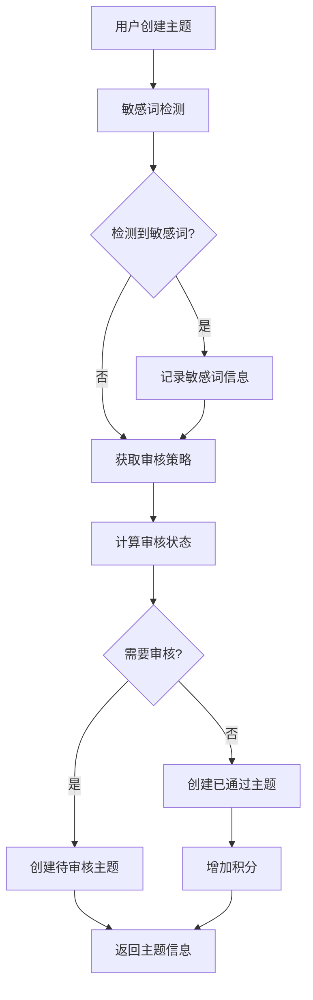
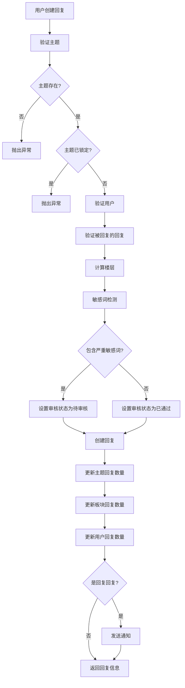
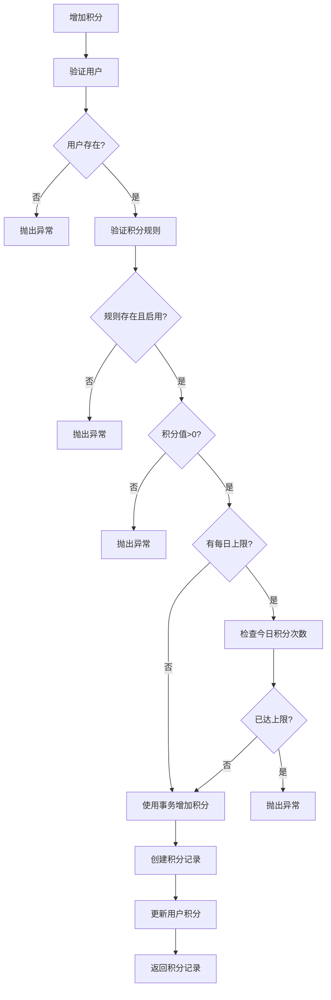
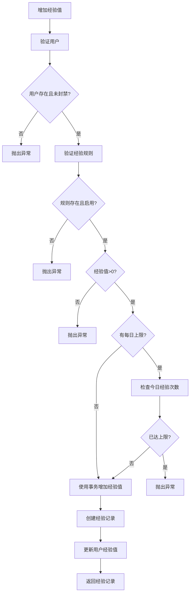

# 业务流程合理性评估

## 1. 检查概述

**检查目标**: 评估项目业务流程的合理性，分析业务流程是否符合实际业务需求，识别逻辑漏洞或不合理的设计

**检查范围**: Forum模块的所有核心业务流程

**检查时间**: 2026-01-10

---

## 2. 核心业务流程分析

### 2.1 主题创建流程

**实现位置**: [ForumTopicService.createForumTopic](file:///e:/Code/es/es-server/libs/forum/src/topic/forum-topic.service.ts#L100-L165)

**流程描述**:

```typescript
async createForumTopic(createForumTopicDto: CreateForumTopicDto) {
  const { sectionId, profileId, ...topicData } = createForumTopicDto

  // 1. 敏感词检测
  const { hits, highestLevel } =
    this.sensitiveWordDetectService.getMatchedWords({
      content: topicData.content + topicData.title,
    })

  // 2. 创建主题数据
  const createPayload: ForumTopicCreateInput = {
    ...topicData,
    section: {
      connect: { id: sectionId, isEnabled: true },
    },
    profile: {
      connect: { id: profileId, status: ProfileStatusEnum.NORMAL },
    },
  }

  // 3. 获取审核策略
  const { reviewPolicy } = await this.forumConfigCacheService.getConfig()

  // 4. 计算审核状态
  const { auditStatus, isHidden } = this.calculateAuditStatus(
    reviewPolicy,
    highestLevel,
  )

  if (highestLevel) {
    createPayload.sensitiveWordHits = JSON.stringify(hits)
  }

  if (isHidden) {
    createPayload.isHidden = true
  }

  createPayload.auditStatus = auditStatus

  // 5. 创建主题
  const topic = await this.forumTopic.create({
    data: createPayload,
    omit: {
      version: true,
      deletedAt: true,
      sensitiveWordHits: true,
    },
  })

  // 6. 增加积分
  if (topic.auditStatus !== ForumTopicAuditStatusEnum.PENDING) {
    await this.pointService.addPoints({
      profileId,
      ruleType: PointRuleTypeEnum.CREATE_TOPIC,
      remark: `创建主题 ${topic.id}`,
    })
  }

  return topic
}
```

**流程图**:



**评估结果**: ⚠️ 需要改进

**优点**:
- 敏感词检测完善
- 审核策略灵活
- 积分奖励机制

**问题分析**:

1. **缺少事务保护**
   - 问题: 创建主题和增加积分不在同一个事务中
   - 风险: 如果增加积分失败，主题已创建但积分未增加
   - 影响: 数据不一致，用户体验差

2. **缺少板块统计更新**
   - 问题: 创建主题后没有更新板块的主题数量
   - 风险: 板块主题数量统计不准确
   - 影响: 数据不一致

3. **缺少用户统计更新**
   - 问题: 创建主题后没有更新用户的主题数量
   - 风险: 用户主题数量统计不准确
   - 影响: 数据不一致

4. **缺少经验值奖励**
   - 问题: 创建主题只奖励积分，没有奖励经验值
   - 风险: 用户成长体系不完整
   - 影响: 用户体验不完整

**改进建议**:

```typescript
async createForumTopic(createForumTopicDto: CreateForumTopicDto) {
  const { sectionId, profileId, ...topicData } = createForumTopicDto

  // 1. 验证板块和用户
  const [section, profile] = await Promise.all([
    this.forumSection.findUnique({
      where: { id: sectionId, isEnabled: true },
    }),
    this.forumProfile.findUnique({
      where: { id: profileId, status: ProfileStatusEnum.NORMAL },
    }),
  ])

  if (!section) {
    throw new BadRequestException('板块不存在或已禁用')
  }

  if (!profile) {
    throw new BadRequestException('用户论坛资料不存在或已被封禁')
  }

  // 2. 敏感词检测
  const { hits, highestLevel } =
    this.sensitiveWordDetectService.getMatchedWords({
      content: topicData.content + topicData.title,
    })

  // 3. 获取审核策略
  const { reviewPolicy } = await this.forumConfigCacheService.getConfig()

  // 4. 计算审核状态
  const { auditStatus, isHidden } = this.calculateAuditStatus(
    reviewPolicy,
    highestLevel,
  )

  // 5. 使用事务创建主题
  return this.prisma.$transaction(async (tx) => {
    // 创建主题
    const topic = await tx.forumTopic.create({
      data: {
        ...topicData,
        sectionId,
        profileId,
        sensitiveWordHits: highestLevel ? JSON.stringify(hits) : null,
        isHidden: isHidden || false,
        auditStatus,
      },
    })

    // 更新板块主题数量
    await tx.forumSection.update({
      where: { id: sectionId },
      data: {
        topicCount: {
          increment: 1,
        },
      },
    })

    // 更新用户主题数量
    await tx.forumProfile.update({
      where: { id: profileId },
      data: {
        topicCount: {
          increment: 1,
        },
      },
    })

    // 奖励积分和经验值（仅当不需要审核时）
    if (auditStatus !== ForumTopicAuditStatusEnum.PENDING) {
      await Promise.all([
        this.pointService.addPoints({
          profileId,
          ruleType: PointRuleTypeEnum.CREATE_TOPIC,
          remark: `创建主题 ${topic.id}`,
        }),
        this.experienceService.addExperience({
          profileId,
          ruleType: ExperienceRuleTypeEnum.CREATE_TOPIC,
          remark: `创建主题 ${topic.id}`,
        }),
      ])
    }

    return topic
  })
}
```

---

### 2.2 回复创建流程

**实现位置**: [ForumReplyService.createForumReply](file:///e:/Code/es/es-server/libs/forum/src/reply/forum-reply.service.ts#L100-L200)

**流程描述**:

```typescript
async createForumReply(createForumReplyDto: CreateForumReplyDto) {
  const { topicId, replyToId, ...replyData } = createForumReplyDto

  // 1. 验证主题
  const topic = await this.forumTopic.findUnique({
    where: { id: topicId },
  })

  if (!topic) {
    throw new BadRequestException('主题不存在')
  }

  if (topic.isLocked) {
    throw new BadRequestException('主题已锁定，无法回复')
  }

  // 2. 验证用户
  const profile = await this.forumProfile.findFirst({
    where: { id: replyData.profileId, status: 1 },
    include: {
      user: true,
    },
  })

  if (!profile) {
    throw new BadRequestException('用户论坛资料不存在或已被封禁')
  }

  // 3. 验证被回复的回复
  if (replyToId) {
    const replyTo = await this.forumReply.findUnique({
      where: { id: replyToId },
    })

    if (!replyTo) {
      throw new BadRequestException('被回复的回复不存在')
    }

    if (replyTo.topicId !== topicId) {
      throw new BadRequestException('被回复的回复不属于该主题')
    }
  }

  // 4. 计算楼层
  let newFloor: number | null = null
  if (!replyToId) {
    const maxFloorReply = await this.forumReply.findFirst({
      where: {
        topicId,
        replyToId: null,
        deletedAt: null,
      },
      orderBy: {
        floor: 'desc',
      },
      select: {
        floor: true,
      },
    })
    newFloor = (maxFloorReply?.floor ?? 0) + 1
  }

  // 5. 敏感词检测
  const detectResult = await this.sensitiveWordDetectService.detect({
    content: replyData.content,
  })

  let auditStatus = 0
  let auditReason: string | undefined

  if (detectResult.hasSevere) {
    auditStatus = 2
    auditReason = '包含严重敏感词，需要审核'
  }

  // 6. 创建回复（使用事务）
  return this.prisma.$transaction(async (tx) => {
    const reply = await tx.forumReply.create({
      data: {
        ...replyData,
        floor: newFloor,
        auditStatus,
        auditReason,
        sensitiveWordHits: detectResult.hits.length > 0 ? detectResult.hits : null,
        topicId,
        profileId: profile.id,
        actualReplyToId: replyToId,
        replyToId,
      },
    })

    // 更新主题回复数量
    await tx.forumTopic.update({
      where: { id: topicId },
      data: {
        replyCount: {
          increment: 1,
        },
      },
    })

    // 更新板块回复数量
    await tx.forumSection.update({
      where: { id: topic.sectionId },
      data: {
        replyCount: {
          increment: 1,
        },
      },
    })

    // 更新用户回复数量
    await tx.forumProfile.update({
      where: { id: profile.id },
      data: {
        replyCount: {
          increment: 1,
        },
      },
    })

    // 发送通知
    if (replyToId) {
      const replyTo = await tx.forumReply.findUnique({
        where: { id: replyToId },
        select: {
          profileId: true,
        },
      })

      if (replyTo && replyTo.profileId !== profile.id) {
        await this.notificationService.createReplyNotification({
          profileId: replyTo.profileId,
          title: '收到新回复',
          content: `${profile.user?.nickname || '用户'} 回复了你的内容`,
          topicId,
          replyId: reply.id,
          isRead: false,
        })
      }
    }

    return reply
  })
}
```

**流程图**:



**评估结果**: ✅ 优秀

**优点**:
- 事务保护完善
- 统计更新完整
- 通知机制完善
- 楼层计算合理

**问题分析**:

1. **缺少积分和经验值奖励**
   - 问题: 创建回复只更新统计数据，没有奖励积分和经验值
   - 风险: 用户成长体系不完整
   - 影响: 用户体验不完整

2. **通知发送不在事务中**
   - 问题: 通知发送在事务内部，如果通知失败会导致整个事务回滚
   - 风险: 通知服务故障会导致回复创建失败
   - 影响: 用户体验差

**改进建议**:

```typescript
async createForumReply(createForumReplyDto: CreateForumReplyDto) {
  const { topicId, replyToId, ...replyData } = createForumReplyDto

  // 1. 验证主题
  const topic = await this.forumTopic.findUnique({
    where: { id: topicId },
  })

  if (!topic) {
    throw new BadRequestException('主题不存在')
  }

  if (topic.isLocked) {
    throw new BadRequestException('主题已锁定，无法回复')
  }

  // 2. 验证用户
  const profile = await this.forumProfile.findFirst({
    where: { id: replyData.profileId, status: 1 },
    include: {
      user: true,
    },
  })

  if (!profile) {
    throw new BadRequestException('用户论坛资料不存在或已被封禁')
  }

  // 3. 验证被回复的回复
  let replyToProfileId: number | null = null
  if (replyToId) {
    const replyTo = await this.forumReply.findUnique({
      where: { id: replyToId },
    })

    if (!replyTo) {
      throw new BadRequestException('被回复的回复不存在')
    }

    if (replyTo.topicId !== topicId) {
      throw new BadRequestException('被回复的回复不属于该主题')
    }

    replyToProfileId = replyTo.profileId
  }

  // 4. 计算楼层
  let newFloor: number | null = null
  if (!replyToId) {
    const maxFloorReply = await this.forumReply.findFirst({
      where: {
        topicId,
        replyToId: null,
        deletedAt: null,
      },
      orderBy: {
        floor: 'desc',
      },
      select: {
        floor: true,
      },
    })
    newFloor = (maxFloorReply?.floor ?? 0) + 1
  }

  // 5. 敏感词检测
  const detectResult = await this.sensitiveWordDetectService.detect({
    content: replyData.content,
  })

  let auditStatus = 0
  let auditReason: string | undefined

  if (detectResult.hasSevere) {
    auditStatus = 2
    auditReason = '包含严重敏感词，需要审核'
  }

  // 6. 创建回复（使用事务）
  const reply = await this.prisma.$transaction(async (tx) => {
    const newReply = await tx.forumReply.create({
      data: {
        ...replyData,
        floor: newFloor,
        auditStatus,
        auditReason,
        sensitiveWordHits: detectResult.hits.length > 0 ? detectResult.hits : null,
        topicId,
        profileId: profile.id,
        actualReplyToId: replyToId,
        replyToId,
      },
    })

    // 更新主题回复数量
    await tx.forumTopic.update({
      where: { id: topicId },
      data: {
        replyCount: {
          increment: 1,
        },
      },
    })

    // 更新板块回复数量
    await tx.forumSection.update({
      where: { id: topic.sectionId },
      data: {
        replyCount: {
          increment: 1,
        },
      },
    })

    // 更新用户回复数量
    await tx.forumProfile.update({
      where: { id: profile.id },
      data: {
        replyCount: {
          increment: 1,
        },
      },
    })

    return newReply
  })

  // 7. 奖励积分和经验值（仅当不需要审核时）
  if (auditStatus !== 2) {
    await Promise.all([
      this.pointService.addPoints({
        profileId: profile.id,
        ruleType: PointRuleTypeEnum.CREATE_REPLY,
        remark: `创建回复 ${reply.id}`,
      }),
      this.experienceService.addExperience({
        profileId: profile.id,
        ruleType: ExperienceRuleTypeEnum.CREATE_REPLY,
        remark: `创建回复 ${reply.id}`,
      }),
    ])
  }

  // 8. 发送通知（异步，不影响主流程）
  setImmediate(async () => {
    try {
      if (replyToId && replyToProfileId && replyToProfileId !== profile.id) {
        await this.notificationService.createReplyNotification({
          profileId: replyToProfileId,
          title: '收到新回复',
          content: `${profile.user?.nickname || '用户'} 回复了你的内容`,
          topicId,
          replyId: reply.id,
          isRead: false,
        })
      }
    } catch (error) {
      console.error('发送通知失败:', error)
    }
  })

  return reply
}
```

---

### 2.3 积分增加流程

**实现位置**: [PointService.addPoints](file:///e:/Code/es/es-server/libs/forum/src/point/point.service.ts#L100-L180)

**流程描述**:

```typescript
async addPoints(addPointsDto: AddPointsDto) {
  const { profileId, ruleType, remark } = addPointsDto

  // 1. 验证用户
  const profile = await this.forumProfile.findUnique({
    where: { id: profileId },
  })

  if (!profile) {
    throw new BadRequestException('用户资料不存在')
  }

  // 2. 验证积分规则
  const rule = await this.forumPointRule.findUnique({
    where: {
      type: ruleType,
      isEnabled: true,
    },
  })

  if (!rule) {
    throw new BadRequestException('积分规则不存在')
  }

  if (rule.points <= 0) {
    throw new BadRequestException('积分规则配置错误')
  }

  // 3. 检查每日上限
  if (rule.dailyLimit > 0) {
    const today = new Date()
    today.setHours(0, 0, 0, 0)

    const todayCount = await this.forumPointRecord.count({
      where: {
        profileId,
        ruleId: rule.id,
        createdAt: {
          gte: today,
        },
      },
    })

    if (todayCount >= rule.dailyLimit) {
      throw new BadRequestException('今日积分已达上限')
    }
  }

  // 4. 使用事务增加积分
  return this.prisma.$transaction(async (tx) => {
    const beforePoints = profile.points
    const afterPoints = beforePoints + rule.points

    const record = await tx.forumPointRecord.create({
      data: {
        profileId,
        ruleId: rule.id,
        points: rule.points,
        beforePoints,
        afterPoints,
        remark,
      },
    })

    await tx.forumProfile.update({
      where: { id: profileId },
      data: {
        points: afterPoints,
      },
    })

    return record
  })
}
```

**流程图**:



**评估结果**: ✅ 优秀

**优点**:
- 事务保护完善
- 每日上限检查
- 积分记录完整
- 规则验证完善

**问题分析**:

1. **缺少并发控制**
   - 问题: 检查每日上限和增加积分之间可能存在并发问题
   - 风险: 用户可能通过并发请求绕过每日上限
   - 影响: 积分系统被滥用

**改进建议**:

```typescript
async addPoints(addPointsDto: AddPointsDto) {
  const { profileId, ruleType, remark } = addPointsDto

  // 1. 验证用户
  const profile = await this.forumProfile.findUnique({
    where: { id: profileId },
  })

  if (!profile) {
    throw new BadRequestException('用户资料不存在')
  }

  // 2. 验证积分规则
  const rule = await this.forumPointRule.findUnique({
    where: {
      type: ruleType,
      isEnabled: true,
    },
  })

  if (!rule) {
    throw new BadRequestException('积分规则不存在')
  }

  if (rule.points <= 0) {
    throw new BadRequestException('积分规则配置错误')
  }

  // 3. 使用事务增加积分（包含每日上限检查）
  return this.prisma.$transaction(async (tx) => {
    // 检查每日上限（在事务内执行，避免并发问题）
    if (rule.dailyLimit > 0) {
      const today = new Date()
      today.setHours(0, 0, 0, 0)

      const todayCount = await tx.forumPointRecord.count({
        where: {
          profileId,
          ruleId: rule.id,
          createdAt: {
            gte: today,
          },
        },
      })

      if (todayCount >= rule.dailyLimit) {
        throw new BadRequestException('今日积分已达上限')
      }
    }

    const beforePoints = profile.points
    const afterPoints = beforePoints + rule.points

    const record = await tx.forumPointRecord.create({
      data: {
        profileId,
        ruleId: rule.id,
        points: rule.points,
        beforePoints,
        afterPoints,
        remark,
      },
    })

    await tx.forumProfile.update({
      where: { id: profileId },
      data: {
        points: afterPoints,
      },
    })

    return record
  })
}
```

---

### 2.4 经验值增加流程

**实现位置**: [ExperienceService.addExperience](file:///e:/Code/es/es-server/libs/forum/src/experience/experience.service.ts#L100-L180)

**流程描述**:

```typescript
async addExperience(addExperienceDto: AddExperienceDto) {
  const { profileId, ruleType, remark } = addExperienceDto

  // 1. 验证用户
  const profile = await this.forumProfile.findUnique({
    where: {
      id: profileId,
      status: {
        not: ProfileStatusEnum.PERMANENT_BANNED,
      },
    },
  })

  if (!profile) {
    throw new BadRequestException('用户不存在或已被永久封禁')
  }

  // 2. 验证经验规则
  const rule = await this.forumExperienceRule.findUnique({
    where: {
      type: ruleType,
      isEnabled: true,
    },
  })

  if (!rule) {
    throw new BadRequestException('经验规则不存在')
  }

  if (rule.experience <= 0) {
    throw new BadRequestException('经验规则配置错误')
  }

  // 3. 检查每日上限
  if (rule.dailyLimit > 0) {
    const today = new Date()
    today.setHours(0, 0, 0, 0)

    const todayCount = await this.forumExperienceRecord.count({
      where: {
        profileId,
        ruleId: rule.id,
        createdAt: {
          gte: today,
        },
      },
    })

    if (todayCount >= rule.dailyLimit) {
      throw new BadRequestException('今日经验已达上限')
    }
  }

  // 4. 使用事务增加经验值
  return this.prisma.$transaction(async (tx) => {
    const beforeExperience = profile.experience
    const afterExperience = beforeExperience + rule.experience

    const record = await tx.forumExperienceRecord.create({
      data: {
        profileId,
        ruleId: rule.id,
        experience: rule.experience,
        beforeExperience,
        afterExperience,
        remark,
      },
    })

    await tx.forumProfile.update({
      where: { id: profileId },
      data: {
        experience: afterExperience,
      },
    })

    return record
  })
}
```

**流程图**:



**评估结果**: ✅ 优秀

**优点**:
- 事务保护完善
- 每日上限检查
- 经验记录完整
- 规则验证完善
- 封禁用户检查

**问题分析**:

1. **缺少并发控制**
   - 问题: 检查每日上限和增加经验值之间可能存在并发问题
   - 风险: 用户可能通过并发请求绕过每日上限
   - 影响: 经验系统被滥用

2. **缺少等级升级逻辑**
   - 问题: 增加经验值后没有检查是否需要升级
   - 风险: 用户等级不会自动更新
   - 影响: 用户体验不完整

**改进建议**:

```typescript
async addExperience(addExperienceDto: AddExperienceDto) {
  const { profileId, ruleType, remark } = addExperienceDto

  // 1. 验证用户
  const profile = await this.forumProfile.findUnique({
    where: {
      id: profileId,
      status: {
        not: ProfileStatusEnum.PERMANENT_BANNED,
      },
    },
    include: {
      level: true,
    },
  })

  if (!profile) {
    throw new BadRequestException('用户不存在或已被永久封禁')
  }

  // 2. 验证经验规则
  const rule = await this.forumExperienceRule.findUnique({
    where: {
      type: ruleType,
      isEnabled: true,
    },
  })

  if (!rule) {
    throw new BadRequestException('经验规则不存在')
  }

  if (rule.experience <= 0) {
    throw new BadRequestException('经验规则配置错误')
  }

  // 3. 使用事务增加经验值（包含每日上限检查）
  return this.prisma.$transaction(async (tx) => {
    // 检查每日上限（在事务内执行，避免并发问题）
    if (rule.dailyLimit > 0) {
      const today = new Date()
      today.setHours(0, 0, 0, 0)

      const todayCount = await tx.forumExperienceRecord.count({
        where: {
          profileId,
          ruleId: rule.id,
          createdAt: {
            gte: today,
          },
        },
      })

      if (todayCount >= rule.dailyLimit) {
        throw new BadRequestException('今日经验已达上限')
      }
    }

    const beforeExperience = profile.experience
    const afterExperience = beforeExperience + rule.experience

    const record = await tx.forumExperienceRecord.create({
      data: {
        profileId,
        ruleId: rule.id,
        experience: rule.experience,
        beforeExperience,
        afterExperience,
        remark,
      },
    })

    // 更新用户经验值
    await tx.forumProfile.update({
      where: { id: profileId },
      data: {
        experience: afterExperience,
      },
    })

    // 检查是否需要升级
    const newLevel = await tx.forumLevelRule.findFirst({
      where: {
        requiredExperience: {
          lte: afterExperience,
        },
      },
      orderBy: {
        requiredExperience: 'desc',
      },
    })

    if (newLevel && newLevel.id !== profile.levelId) {
      await tx.forumProfile.update({
        where: { id: profileId },
        data: {
          levelId: newLevel.id,
        },
      })
    }

    return record
  })
}
```

---

## 3. 业务流程合理性评估总结

### 3.1 整体评估

**评估结果**: ✅ 良好

**总体评价**:
- 大部分业务流程设计合理
- 事务保护较为完善
- 敏感词检测机制完善
- 审核策略灵活
- 积分和经验系统设计合理

### 3.2 优点总结

1. **敏感词检测**: 完善的敏感词检测机制，支持多级审核
2. **审核策略**: 灵活的审核策略配置
3. **事务保护**: 大部分关键操作使用事务保护
4. **积分系统**: 完善的积分规则和每日上限机制
5. **经验系统**: 完善的经验规则和每日上限机制
6. **统计更新**: 回复创建流程的统计更新完善
7. **通知机制**: 完善的通知机制

### 3.3 问题汇总

| 业务流程 | 问题描述 | 风险等级 | 优先级 |
|---------|---------|---------|-------|
| 主题创建 | 缺少事务保护 | 🟡 中 | 高 |
| 主题创建 | 缺少板块统计更新 | 🟡 中 | 高 |
| 主题创建 | 缺少用户统计更新 | 🟡 中 | 高 |
| 主题创建 | 缺少经验值奖励 | 🟢 低 | 中 |
| 回复创建 | 缺少积分和经验值奖励 | 🟢 低 | 中 |
| 回复创建 | 通知发送在事务内 | 🟡 中 | 中 |
| 积分增加 | 缺少并发控制 | 🔴 高 | 高 |
| 经验增加 | 缺少并发控制 | 🔴 高 | 高 |
| 经验增加 | 缺少等级升级逻辑 | 🟢 低 | 中 |

### 3.4 改进建议优先级

| 优先级 | 改进项 | 预期收益 |
|-------|-------|---------|
| 高 | 主题创建添加事务保护 | 数据一致性 |
| 高 | 主题创建添加统计更新 | 数据准确性 |
| 高 | 积分增加添加并发控制 | 防止滥用 |
| 高 | 经验增加添加并发控制 | 防止滥用 |
| 中 | 回复创建添加积分和经验值奖励 | 用户体验 |
| 中 | 回复创建优化通知发送 | 系统稳定性 |
| 中 | 经验增加添加等级升级逻辑 | 用户体验 |

---

## 4. 结论

项目业务流程整体设计合理，大部分关键流程都有完善的验证和事务保护。主要问题集中在：
1. 主题创建流程缺少事务保护和统计更新
2. 积分和经验系统缺少并发控制
3. 部分流程缺少完整的奖励机制

建议优先解决高优先级问题，确保数据一致性和系统稳定性。

**评分**: 7.5/10

**主要优势**:
- 敏感词检测完善
- 审核策略灵活
- 事务保护较为完善
- 积分和经验系统设计合理

**改进空间**:
- 主题创建流程需要完善
- 积分和经验系统需要加强并发控制
- 部分流程需要添加完整的奖励机制
