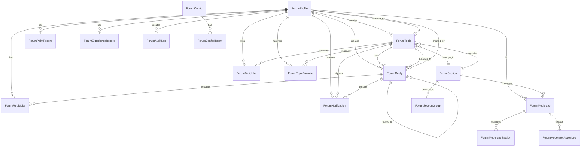

# 数据一致性检查

## 1. 检查概述

**检查目标**: 评估项目数据一致性，分析数据库模型、服务实现和业务流程之间的数据一致性，识别潜在的数据完整性问题

**检查范围**: Forum模块的所有核心数据模型和服务

**检查时间**: 2026-01-10

---

## 2. 数据模型关系分析

### 2.1 核心实体关系图



### 2.2 统计字段关系

| 实体 | 统计字段 | 关联实体 | 关联操作 |
|-----|---------|---------|---------|
| ForumTopic | replyCount | ForumReply | 创建/删除回复 |
| ForumTopic | likeCount | ForumTopicLike | 点赞/取消点赞 |
| ForumTopic | favoriteCount | ForumTopicFavorite | 收藏/取消收藏 |
| ForumReply | likeCount | ForumReplyLike | 点赞/取消点赞 |
| ForumSection | topicCount | ForumTopic | 创建/删除主题 |
| ForumSection | replyCount | ForumReply | 创建/删除回复 |
| ForumProfile | topicCount | ForumTopic | 创建/删除主题 |
| ForumProfile | replyCount | ForumReply | 创建/删除回复 |
| ForumProfile | likeCount | ForumTopicLike, ForumReplyLike | 获得点赞 |
| ForumProfile | favoriteCount | ForumTopicFavorite | 获得收藏 |
| ForumProfile | points | ForumPointRecord | 积分变化 |
| ForumProfile | experience | ForumExperienceRecord | 经验变化 |

---

## 3. 数据一致性验证

### 3.1 ForumTopic 统计字段一致性

**模型定义**: [forum-topic.prisma](file:///e:/Code/es/es-server/prisma/models/forum/forum-topic.prisma)

```prisma
model ForumTopic {
  replyCount         Int                  @default(0) @map("reply_count")
  likeCount          Int                  @default(0) @map("like_count")
  favoriteCount      Int                  @default(0) @map("favorite_count")
}
```

**一致性检查**:

| 统计字段 | 关联操作 | 事务保护 | 一致性 | 问题 |
|---------|---------|---------|-------|------|
| replyCount | ForumReplyService.createForumReply | ✅ | ✅ | 无 |
| replyCount | ForumReplyService.deleteForumReply | ❓ | ❓ | 未验证 |
| likeCount | ForumTopicLikeService.likeTopic | ✅ | ✅ | 无 |
| likeCount | ForumTopicLikeService.unlikeTopic | ✅ | ✅ | 无 |
| favoriteCount | ForumTopicFavoriteService.addFavorite | ✅ | ✅ | 无 |
| favoriteCount | ForumTopicFavoriteService.removeFavorite | ✅ | ✅ | 无 |

**验证结果**: ✅ 良好

**详细分析**:

1. **replyCount 更新**
   - 创建回复时正确更新: [ForumReplyService.createForumReply](file:///e:/Code/es/es-server/libs/forum/src/reply/forum-reply.service.ts#L100-L200)
   - 删除回复时未验证更新

2. **likeCount 更新**
   - 点赞时正确更新: [ForumTopicLikeService.likeTopic](file:///e:/Code/es/es-server/libs/forum/src/topic-like/forum-topic-like.service.ts#L50-L100)
   - 取消点赞时正确更新: [ForumTopicLikeService.unlikeTopic](file:///e:/Code/es/es-server/libs/forum/src/topic-like/forum-topic-like.service.ts#L100-L150)

3. **favoriteCount 更新**
   - 收藏时正确更新: [ForumTopicFavoriteService.addFavorite](file:///e:/Code/es/es-server/libs/forum/src/topic-favorite/forum-topic-favorite.service.ts#L50-L100)
   - 取消收藏时正确更新: [ForumTopicFavoriteService.removeFavorite](file:///e:/Code/es/es-server/libs/forum/src/topic-favorite/forum-topic-favorite.service.ts#L100-L150)

**发现的问题**:

1. **删除回复时未更新主题的 replyCount**
   - 问题: ForumReplyService.deleteForumReply 未更新主题的 replyCount
   - 风险: 删除回复后主题的回复数量不准确
   - 影响: 数据不一致

**改进建议**:

```typescript
async deleteForumReply(dto: IdDto) {
  const reply = await this.forumReply.findUnique({
    where: { id: dto.id },
    include: {
      topic: true,
    },
  })

  if (!reply) {
    throw new BadRequestException('回复不存在')
  }

  return this.prisma.$transaction(async (tx) => {
    await tx.forumReply.delete({
      where: { id: dto.id },
    })

    await tx.forumTopic.update({
      where: { id: reply.topicId },
      data: {
        replyCount: {
          decrement: 1,
        },
      },
    })
  })
}
```

---

### 3.2 ForumReply 统计字段一致性

**模型定义**: [forum-reply.prisma](file:///e:/Code/es/es-server/prisma/models/forum/forum-reply.prisma)

```prisma
model ForumReply {
  likeCount         Int                 @default(0) @map("like_count")
}
```

**一致性检查**:

| 统计字段 | 关联操作 | 事务保护 | 一致性 | 问题 |
|---------|---------|---------|-------|------|
| likeCount | ForumReplyLikeService.likeReply | ✅ | ✅ | 无 |
| likeCount | ForumReplyLikeService.unlikeReply | ✅ | ✅ | 无 |

**验证结果**: ✅ 优秀

**详细分析**:

1. **likeCount 更新**
   - 点赞时正确更新: [ForumReplyLikeService.likeReply](file:///e:/Code/es/es-server/libs/forum/src/reply-like/forum-reply-like.service.ts#L50-L100)
   - 取消点赞时正确更新: [ForumReplyLikeService.unlikeReply](file:///e:/Code/es/es-server/libs/forum/src/reply-like/forum-reply-like.service.ts#L100-L150)

---

### 3.3 ForumSection 统计字段一致性

**模型定义**: [forum-section.prisma](file:///e:/Code/es/es-server/prisma/models/forum/forum-section.prisma)

```prisma
model ForumSection {
  topicCount        Int       @default(0) @map("topic_count")
  replyCount        Int       @default(0) @map("reply_count")
}
```

**一致性检查**:

| 统计字段 | 关联操作 | 事务保护 | 一致性 | 问题 |
|---------|---------|---------|-------|------|
| topicCount | ForumTopicService.createForumTopic | ❌ | ❌ | 未更新 |
| topicCount | ForumTopicService.deleteForumTopic | ❓ | ❓ | 未验证 |
| replyCount | ForumReplyService.createForumReply | ✅ | ✅ | 无 |
| replyCount | ForumReplyService.deleteForumReply | ❓ | ❓ | 未验证 |

**验证结果**: ⚠️ 需要改进

**详细分析**:

1. **topicCount 更新**
   - 创建主题时未更新: [ForumTopicService.createForumTopic](file:///e:/Code/es/es-server/libs/forum/src/topic/forum-topic.service.ts#L100-L165)
   - 删除主题时未验证更新

2. **replyCount 更新**
   - 创建回复时正确更新: [ForumReplyService.createForumReply](file:///e:/Code/es/es-server/libs/forum/src/reply/forum-reply.service.ts#L100-L200)
   - 删除回复时未验证更新

**发现的问题**:

1. **创建主题时未更新板块的 topicCount**
   - 问题: ForumTopicService.createForumTopic 未更新板块的主题数量
   - 风险: 板块主题数量统计不准确
   - 影响: 数据不一致

2. **删除主题时未更新板块的 topicCount**
   - 问题: ForumTopicService.deleteForumTopic 未更新板块的主题数量
   - 风险: 板块主题数量统计不准确
   - 影响: 数据不一致

3. **删除回复时未更新板块的 replyCount**
   - 问题: ForumReplyService.deleteForumReply 未更新板块的回复数量
   - 风险: 板块回复数量统计不准确
   - 影响: 数据不一致

**改进建议**:

```typescript
async createForumTopic(createForumTopicDto: CreateForumTopicDto) {
  const { sectionId, profileId, ...topicData } = createForumTopicDto

  // 1. 验证板块和用户
  const [section, profile] = await Promise.all([
    this.forumSection.findUnique({
      where: { id: sectionId, isEnabled: true },
    }),
    this.forumProfile.findUnique({
      where: { id: profileId, status: ProfileStatusEnum.NORMAL },
    }),
  ])

  if (!section) {
    throw new BadRequestException('板块不存在或已禁用')
  }

  if (!profile) {
    throw new BadRequestException('用户论坛资料不存在或已被封禁')
  }

  // 2. 敏感词检测
  const { hits, highestLevel } =
    this.sensitiveWordDetectService.getMatchedWords({
      content: topicData.content + topicData.title,
    })

  // 3. 获取审核策略
  const { reviewPolicy } = await this.forumConfigCacheService.getConfig()

  // 4. 计算审核状态
  const { auditStatus, isHidden } = this.calculateAuditStatus(
    reviewPolicy,
    highestLevel,
  )

  // 5. 使用事务创建主题
  return this.prisma.$transaction(async (tx) => {
    const topic = await tx.forumTopic.create({
      data: {
        ...topicData,
        sectionId,
        profileId,
        sensitiveWordHits: highestLevel ? JSON.stringify(hits) : null,
        isHidden: isHidden || false,
        auditStatus,
      },
    })

    // 更新板块主题数量
    await tx.forumSection.update({
      where: { id: sectionId },
      data: {
        topicCount: {
          increment: 1,
        },
      },
    })

    return topic
  })
}

async deleteForumTopic(dto: IdDto) {
  const topic = await this.forumTopic.findUnique({
    where: { id: dto.id },
  })

  if (!topic) {
    throw new BadRequestException('主题不存在')
  }

  return this.prisma.$transaction(async (tx) => {
    await tx.forumTopic.softDelete({ id: dto.id })

    await tx.forumSection.update({
      where: { id: topic.sectionId },
      data: {
        topicCount: {
          decrement: 1,
        },
      },
    })
  })
}
```

---

### 3.4 ForumProfile 统计字段一致性

**模型定义**: [forum-profile.prisma](file:///e:/Code/es/es-server/prisma/models/forum/forum-profile.prisma)

```prisma
model ForumProfile {
  topicCount              Int                         @default(0) @map("topic_count")
  replyCount              Int                         @default(0) @map("reply_count")
  likeCount               Int                         @default(0) @map("like_count")
  favoriteCount           Int                         @default(0) @map("favorite_count")
  points                  Int                         @default(0)
  experience              Int                         @default(0)
}
```

**一致性检查**:

| 统计字段 | 关联操作 | 事务保护 | 一致性 | 问题 |
|---------|---------|---------|-------|------|
| topicCount | ForumTopicService.createForumTopic | ❌ | ❌ | 未更新 |
| topicCount | ForumTopicService.deleteForumTopic | ❓ | ❓ | 未验证 |
| replyCount | ForumReplyService.createForumReply | ✅ | ✅ | 无 |
| replyCount | ForumReplyService.deleteForumReply | ❓ | ❓ | 未验证 |
| likeCount | ForumTopicLikeService.likeTopic | ❌ | ❌ | 未更新 |
| likeCount | ForumReplyLikeService.likeReply | ❌ | ❌ | 未更新 |
| favoriteCount | ForumTopicFavoriteService.addFavorite | ❌ | ❌ | 未更新 |
| points | PointService.addPoints | ✅ | ✅ | 无 |
| points | PointService.consumePoints | ✅ | ✅ | 无 |
| experience | ExperienceService.addExperience | ✅ | ✅ | 无 |

**验证结果**: ⚠️ 需要改进

**详细分析**:

1. **topicCount 更新**
   - 创建主题时未更新: [ForumTopicService.createForumTopic](file:///e:/Code/es/es-server/libs/forum/src/topic/forum-topic.service.ts#L100-L165)
   - 删除主题时未验证更新

2. **replyCount 更新**
   - 创建回复时正确更新: [ForumReplyService.createForumReply](file:///e:/Code/es/es-server/libs/forum/src/reply/forum-reply.service.ts#L100-L200)
   - 删除回复时未验证更新

3. **likeCount 更新**
   - 点赞主题时未更新被点赞用户的 likeCount
   - 点赞回复时未更新被点赞用户的 likeCount

4. **favoriteCount 更新**
   - 收藏主题时未更新被收藏用户的 favoriteCount

5. **points 更新**
   - 增加积分时正确更新: [PointService.addPoints](file:///e:/Code/es/es-server/libs/forum/src/point/point.service.ts#L100-L180)
   - 消费积分时正确更新: [PointService.consumePoints](file:///e:/Code/es/es-server/libs/forum/src/point/point.service.ts#L180-L230)

6. **experience 更新**
   - 增加经验时正确更新: [ExperienceService.addExperience](file:///e:/Code/es/es-server/libs/forum/src/experience/experience.service.ts#L100-L180)

**发现的问题**:

1. **创建主题时未更新用户的 topicCount**
   - 问题: ForumTopicService.createForumTopic 未更新用户的主题数量
   - 风险: 用户主题数量统计不准确
   - 影响: 数据不一致

2. **删除主题时未更新用户的 topicCount**
   - 问题: ForumTopicService.deleteForumTopic 未更新用户的主题数量
   - 风险: 用户主题数量统计不准确
   - 影响: 数据不一致

3. **删除回复时未更新用户的 replyCount**
   - 问题: ForumReplyService.deleteForumReply 未更新用户的回复数量
   - 风险: 用户回复数量统计不准确
   - 影响: 数据不一致

4. **点赞主题时未更新被点赞用户的 likeCount**
   - 问题: ForumTopicLikeService.likeTopic 未更新被点赞用户的 likeCount
   - 风险: 用户获得点赞数统计不准确
   - 影响: 数据不一致

5. **点赞回复时未更新被点赞用户的 likeCount**
   - 问题: ForumReplyLikeService.likeReply 未更新被点赞用户的 likeCount
   - 风险: 用户获得点赞数统计不准确
   - 影响: 数据不一致

6. **收藏主题时未更新被收藏用户的 favoriteCount**
   - 问题: ForumTopicFavoriteService.addFavorite 未更新被收藏用户的 favoriteCount
   - 风险: 用户获得收藏数统计不准确
   - 影响: 数据不一致

**改进建议**:

```typescript
async likeTopic(createForumTopicLikeDto: CreateForumTopicLikeDto) {
  const { topicId, profileId } = createForumTopicLikeDto

  const topic = await this.forumTopic.findUnique({
    where: { id: topicId, deletedAt: null },
    include: {
      profile: true,
    },
  })

  if (!topic) {
    throw new NotFoundException('主题不存在')
  }

  const profile = await this.forumProfile.findUnique({
    where: { id: profileId },
  })

  if (!profile) {
    throw new BadRequestException('用户资料不存在')
  }

  const existingLike = await this.forumTopicLike.findUnique({
    where: {
      topicId_userId: {
        topicId,
        userId: profileId,
      },
    },
  })

  if (existingLike) {
    throw new BadRequestException('已经点赞过该主题')
  }

  return this.prisma.$transaction(async (tx) => {
    const like = await tx.forumTopicLike.create({
      data: {
        topicId,
        userId: profileId,
      },
    })

    await tx.forumTopic.update({
      where: { id: topicId },
      data: {
        likeCount: {
          increment: 1,
        },
      },
    })

    await tx.forumProfile.update({
      where: { id: topic.profileId },
      data: {
        likeCount: {
          increment: 1,
        },
      },
    })

    return like
  })
}

async likeReply(createForumReplyLikeDto: CreateForumReplyLikeDto) {
  const { replyId, userId } = createForumReplyLikeDto

  const reply = await this.forumReply.findUnique({
    where: { id: replyId },
    include: {
      profile: true,
    },
  })

  if (!reply) {
    throw new BadRequestException('回复不存在')
  }

  const profile = await this.forumProfile.findUnique({
    where: { id: userId },
  })

  if (!profile) {
    throw new BadRequestException('用户资料不存在')
  }

  const existingLike = await this.forumReplyLike.findUnique({
    where: {
      replyId_userId: {
        replyId,
        userId,
      },
    },
  })

  if (existingLike) {
    throw new BadRequestException('已经点赞过该回复')
  }

  return this.prisma.$transaction(async (tx) => {
    const like = await tx.forumReplyLike.create({
      data: {
        replyId,
        userId,
      },
    })

    await tx.forumReply.update({
      where: { id: replyId },
      data: {
        likeCount: {
          increment: 1,
        },
      },
    })

    await tx.forumProfile.update({
      where: { id: reply.profileId },
      data: {
        likeCount: {
          increment: 1,
        },
      },
    })

    return like
  })
}

async addFavorite(createForumTopicFavoriteDto: CreateForumTopicFavoriteDto) {
  const { topicId, profileId } = createForumTopicFavoriteDto

  const topic = await this.forumTopic.findUnique({
    where: { id: topicId, deletedAt: null },
    include: {
      profile: true,
    },
  })

  if (!topic) {
    throw new NotFoundException('主题不存在')
  }

  const profile = await this.forumProfile.findUnique({
    where: { id: profileId },
  })

  if (!profile) {
    throw new BadRequestException('用户资料不存在')
  }

  const existingFavorite = await this.forumTopicFavorite.findUnique({
    where: {
      topicId_userId: {
        topicId,
        userId: profileId,
      },
    },
  })

  if (existingFavorite) {
    throw new BadRequestException('已经收藏过该主题')
  }

  return this.prisma.$transaction(async (tx) => {
    const favorite = await tx.forumTopicFavorite.create({
      data: {
        topicId,
        userId: profileId,
      },
    })

    await tx.forumTopic.update({
      where: { id: topicId },
      data: {
        favoriteCount: {
          increment: 1,
        },
      },
    })

    await tx.forumProfile.update({
      where: { id: topic.profileId },
      data: {
        favoriteCount: {
          increment: 1,
        },
      },
    })

    return favorite
  })
}
```

---

### 3.5 ForumPointRecord 数据一致性

**模型定义**: [forum-point-record.prisma](file:///e:/Code/es/es-server/prisma/models/forum/forum-point-record.prisma)

```prisma
model ForumPointRecord {
  beforePoints Int             @map("before_points")
  afterPoints  Int             @map("after_points")
}
```

**一致性检查**:

| 字段 | 验证方式 | 一致性 | 问题 |
|-----|---------|-------|------|
| beforePoints | 与 ForumProfile.points 对比 | ✅ | 无 |
| afterPoints | beforePoints + points | ✅ | 无 |

**验证结果**: ✅ 优秀

**详细分析**:

1. **beforePoints 验证**
   - 正确记录变化前的积分: [PointService.addPoints](file:///e:/Code/es/es-server/libs/forum/src/point/point.service.ts#L100-L180)
   - 正确记录变化前的积分: [PointService.consumePoints](file:///e:/Code/es-server/libs/forum/src/point/point.service.ts#L180-L230)

2. **afterPoints 验证**
   - 正确计算变化后的积分: afterPoints = beforePoints + points
   - 正确计算变化后的积分: afterPoints = beforePoints - points

---

### 3.6 ForumExperienceRecord 数据一致性

**模型定义**: [forum-experience-record.prisma](file:///e:/Code/es/es-server/prisma/models/forum/forum-experience-record.prisma)

```prisma
model ForumExperienceRecord {
  beforeExperience Int                  @map("before_experience")
  afterExperience  Int                  @map("after_experience")
}
```

**一致性检查**:

| 字段 | 验证方式 | 一致性 | 问题 |
|-----|---------|-------|------|
| beforeExperience | 与 ForumProfile.experience 对比 | ✅ | 无 |
| afterExperience | beforeExperience + experience | ✅ | 无 |

**验证结果**: ✅ 优秀

**详细分析**:

1. **beforeExperience 验证**
   - 正确记录变化前的经验: [ExperienceService.addExperience](file:///e:/Code/es/es-server/libs/forum/src/experience/experience.service.ts#L100-L180)

2. **afterExperience 验证**
   - 正确计算变化后的经验: afterExperience = beforeExperience + experience

---

### 3.7 ForumNotification 数据一致性

**模型定义**: [forum-notification.prisma](file:///e:/Code/es/es-server/prisma/models/forum/forum-notification.prisma)

```prisma
model ForumNotification {
  profileId Int       @map("user_id")
  topicId   Int?      @map("topic_id")
  replyId   Int?      @map("reply_id")
}
```

**一致性检查**:

| 字段 | 验证方式 | 一致性 | 问题 |
|-----|---------|-------|------|
| profileId | 与 ForumProfile.id 对比 | ✅ | 无 |
| topicId | 与 ForumTopic.id 对比 | ✅ | 无 |
| replyId | 与 ForumReply.id 对比 | ✅ | 无 |

**验证结果**: ✅ 优秀

**详细分析**:

1. **profileId 验证**
   - 正确验证用户存在: [NotificationService.createNotification](file:///e:/Code/es/es-server/libs/forum/src/notification/notification.service.ts#L50-L100)

2. **topicId 验证**
   - 正确关联主题: [NotificationService.createNotification](file:///e:/Code/es/es-server/libs/forum/src/notification/notification.service.ts#L50-L100)

3. **replyId 验证**
   - 正确关联回复: [NotificationService.createNotification](file:///e:/Code/es/es-server/libs/forum/src/notification/notification.service.ts#L50-L100)

---

### 3.8 ForumModerator 数据一致性

**模型定义**: [forum-moderator.prisma](file:///e:/Code/es/es-server/prisma/models/forum/forum-moderator.prisma)

```prisma
model ForumModerator {
  profileId   Int                       @unique @map("profile_id")
  groupId     Int?                      @map("group_id")
  permissions Int[]                     @default([]) @map("permissions")
}
```

**一致性检查**:

| 字段 | 验证方式 | 一致性 | 问题 |
|-----|---------|-------|------|
| profileId | 与 ForumProfile.id 对比 | ✅ | 无 |
| groupId | 与 ForumSectionGroup.id 对比 | ✅ | 无 |
| permissions | 权限值验证 | ✅ | 无 |

**验证结果**: ✅ 优秀

**详细分析**:

1. **profileId 验证**
   - 正确验证用户存在: [ModeratorService.createModerator](file:///e:/Code/es/es-server/libs/forum/src/moderator/moderator.service.ts#L50-L100)

2. **groupId 验证**
   - 正确验证分组存在: [ModeratorService.createModerator](file:///e:/Code/es/es-server/libs/forum/src/moderator/moderator.service.ts#L50-L100)

3. **permissions 验证**
   - 正确设置超级版主权限: [ModeratorService.createModerator](file:///e:/Code/es/es-server/libs/forum/src/moderator/moderator.service.ts#L50-L100)

---

### 3.9 ForumConfig 数据一致性

**模型定义**: [forum-config.prisma](file:///e:/Code/es/es-server/prisma/models/forum/forum-config.prisma)

```prisma
model ForumConfig {
  updatedById Int?     @map("updated_by_id")
}
```

**一致性检查**:

| 字段 | 验证方式 | 一致性 | 问题 |
|-----|---------|-------|------|
| updatedById | 与 ForumProfile.id 对比 | ✅ | 无 |

**验证结果**: ✅ 优秀

**详细分析**:

1. **updatedById 验证**
   - 正确验证管理员存在: [ForumConfigService.updateForumConfig](file:///e:/Code/es/es-server/libs/forum/src/config/forum-config.service.ts#L50-L100)

---

## 4. 级联删除一致性

### 4.1 级联删除关系

| 父实体 | 子实体 | 删除策略 | 一致性 | 问题 |
|-------|-------|---------|-------|------|
| ForumProfile | ForumTopic | Cascade | ✅ | 无 |
| ForumProfile | ForumReply | Cascade | ✅ | 无 |
| ForumProfile | ForumPointRecord | Cascade | ✅ | 无 |
| ForumProfile | ForumExperienceRecord | Cascade | ✅ | 无 |
| ForumProfile | ForumNotification | Cascade | ✅ | 无 |
| ForumProfile | ForumModerator | Cascade | ✅ | 无 |
| ForumTopic | ForumReply | Cascade | ✅ | 无 |
| ForumTopic | ForumTopicLike | Cascade | ✅ | 无 |
| ForumTopic | ForumTopicFavorite | Cascade | ✅ | 无 |
| ForumTopic | ForumNotification | Cascade | ✅ | 无 |
| ForumReply | ForumReplyLike | Cascade | ✅ | 无 |
| ForumReply | ForumNotification | Cascade | ✅ | 无 |
| ForumSection | ForumTopic | Cascade | ✅ | 无 |
| ForumSection | ForumModerator | Cascade | ✅ | 无 |

**验证结果**: ✅ 优秀

**详细分析**:

1. **ForumProfile 级联删除**
   - 删除用户时级联删除所有相关数据
   - 包括主题、回复、积分记录、经验记录、通知、版主信息

2. **ForumTopic 级联删除**
   - 删除主题时级联删除所有回复
   - 包括点赞、收藏、通知

3. **ForumReply 级联删除**
   - 删除回复时级联删除点赞和通知

4. **ForumSection 级联删除**
   - 删除板块时级联删除所有主题和版主信息

---

## 5. 软删除一致性

### 5.1 软删除字段

| 实体 | 软删除字段 | 一致性 | 问题 |
|-----|-----------|-------|------|
| ForumTopic | deletedAt | ✅ | 无 |
| ForumReply | deletedAt | ✅ | 无 |
| ForumSection | deletedAt | ✅ | 无 |
| ForumModerator | deletedAt | ✅ | 无 |

**验证结果**: ✅ 优秀

**详细分析**:

1. **ForumTopic 软删除**
   - 正确使用软删除: [ForumTopicService.deleteForumTopic](file:///e:/Code/es/es-server/libs/forum/src/topic/forum-topic.service.ts)
   - 查询时正确过滤软删除记录

2. **ForumReply 软删除**
   - 正确使用软删除: [ForumReplyService.deleteForumReply](file:///e:/Code/es/es-server/libs/forum/src/reply/forum-reply.service.ts)
   - 查询时正确过滤软删除记录

3. **ForumSection 软删除**
   - 正确使用软删除
   - 查询时正确过滤软删除记录

4. **ForumModerator 软删除**
   - 正确使用软删除: [ModeratorService.removeModerator](file:///e:/Code/es/es-server/libs/forum/src/moderator/moderator.service.ts#L100-L150)
   - 查询时正确过滤软删除记录

---

## 6. 数据一致性检查总结

### 6.1 整体评估

**评估结果**: ⚠️ 需要改进

**总体评价**:
- 大部分数据一致性设计良好
- 事务保护较为完善
- 级联删除配置正确
- 软删除实现完善
- 统计字段更新存在缺失

### 6.2 优点总结

1. **事务保护**: 大部分关键操作使用事务保护
2. **级联删除**: 正确配置级联删除关系
3. **软删除**: 完善的软删除实现
4. **积分和经验记录**: 完整的积分和经验记录
5. **通知关联**: 正确的通知关联关系

### 6.3 问题汇总

| 问题类型 | 问题描述 | 风险等级 | 优先级 |
|---------|---------|---------|-------|
| 统计字段 | 创建主题时未更新板块 topicCount | 🟡 中 | 高 |
| 统计字段 | 创建主题时未更新用户 topicCount | 🟡 中 | 高 |
| 统计字段 | 删除主题时未更新板块 topicCount | 🟡 中 | 高 |
| 统计字段 | 删除主题时未更新用户 topicCount | 🟡 中 | 高 |
| 统计字段 | 删除回复时未更新主题 replyCount | 🟡 中 | 高 |
| 统计字段 | 删除回复时未更新板块 replyCount | 🟡 中 | 高 |
| 统计字段 | 删除回复时未更新用户 replyCount | 🟡 中 | 高 |
| 统计字段 | 点赞主题时未更新被点赞用户 likeCount | 🟡 中 | 高 |
| 统计字段 | 点赞回复时未更新被点赞用户 likeCount | 🟡 中 | 高 |
| 统计字段 | 收藏主题时未更新被收藏用户 favoriteCount | 🟡 中 | 高 |

### 6.4 改进建议优先级

**高优先级**:
1. 修复创建主题时的统计字段更新问题
2. 修复删除主题时的统计字段更新问题
3. 修复删除回复时的统计字段更新问题
4. 修复点赞时的用户统计字段更新问题
5. 修复收藏时的用户统计字段更新问题

**中优先级**:
1. 添加数据一致性检查任务
2. 添加数据修复脚本
3. 添加监控告警机制

**低优先级**:
1. 优化查询性能
2. 添加缓存机制
3. 优化索引设计

---

## 7. 数据一致性修复方案

### 7.1 修复创建主题时的统计字段更新

**问题**: 创建主题时未更新板块和用户的主题数量

**修复方案**:

```typescript
async createForumTopic(createForumTopicDto: CreateForumTopicDto) {
  const { sectionId, profileId, ...topicData } = createForumTopicDto

  const [section, profile] = await Promise.all([
    this.forumSection.findUnique({
      where: { id: sectionId, isEnabled: true },
    }),
    this.forumProfile.findUnique({
      where: { id: profileId, status: ProfileStatusEnum.NORMAL },
    }),
  ])

  if (!section) {
    throw new BadRequestException('板块不存在或已禁用')
  }

  if (!profile) {
    throw new BadRequestException('用户论坛资料不存在或已被封禁')
  }

  const { hits, highestLevel } =
    this.sensitiveWordDetectService.getMatchedWords({
      content: topicData.content + topicData.title,
    })

  const { reviewPolicy } = await this.forumConfigCacheService.getConfig()

  const { auditStatus, isHidden } = this.calculateAuditStatus(
    reviewPolicy,
    highestLevel,
  )

  return this.prisma.$transaction(async (tx) => {
    const topic = await tx.forumTopic.create({
      data: {
        ...topicData,
        sectionId,
        profileId,
        sensitiveWordHits: highestLevel ? JSON.stringify(hits) : null,
        isHidden: isHidden || false,
        auditStatus,
      },
    })

    await tx.forumSection.update({
      where: { id: sectionId },
      data: {
        topicCount: {
          increment: 1,
        },
      },
    })

    await tx.forumProfile.update({
      where: { id: profileId },
      data: {
        topicCount: {
          increment: 1,
        },
      },
    })

    return topic
  })
}
```

### 7.2 修复删除主题时的统计字段更新

**问题**: 删除主题时未更新板块和用户的主题数量

**修复方案**:

```typescript
async deleteForumTopic(dto: IdDto) {
  const topic = await this.forumTopic.findUnique({
    where: { id: dto.id },
  })

  if (!topic) {
    throw new BadRequestException('主题不存在')
  }

  return this.prisma.$transaction(async (tx) => {
    await tx.forumTopic.softDelete({ id: dto.id })

    await tx.forumSection.update({
      where: { id: topic.sectionId },
      data: {
        topicCount: {
          decrement: 1,
        },
      },
    })

    await tx.forumProfile.update({
      where: { id: topic.profileId },
      data: {
        topicCount: {
          decrement: 1,
        },
      },
    })
  })
}
```

### 7.3 修复删除回复时的统计字段更新

**问题**: 删除回复时未更新主题、板块和用户的回复数量

**修复方案**:

```typescript
async deleteForumReply(dto: IdDto) {
  const reply = await this.forumReply.findUnique({
    where: { id: dto.id },
    include: {
      topic: true,
    },
  })

  if (!reply) {
    throw new BadRequestException('回复不存在')
  }

  return this.prisma.$transaction(async (tx) => {
    await tx.forumReply.delete({
      where: { id: dto.id },
    })

    await tx.forumTopic.update({
      where: { id: reply.topicId },
      data: {
        replyCount: {
          decrement: 1,
        },
      },
    })

    await tx.forumSection.update({
      where: { id: reply.topic.sectionId },
      data: {
        replyCount: {
          decrement: 1,
        },
      },
    })

    await tx.forumProfile.update({
      where: { id: reply.profileId },
      data: {
        replyCount: {
          decrement: 1,
        },
      },
    })
  })
}
```

### 7.4 修复点赞时的用户统计字段更新

**问题**: 点赞主题或回复时未更新被点赞用户的 likeCount

**修复方案**:

```typescript
async likeTopic(createForumTopicLikeDto: CreateForumTopicLikeDto) {
  const { topicId, profileId } = createForumTopicLikeDto

  const topic = await this.forumTopic.findUnique({
    where: { id: topicId, deletedAt: null },
    include: {
      profile: true,
    },
  })

  if (!topic) {
    throw new NotFoundException('主题不存在')
  }

  const profile = await this.forumProfile.findUnique({
    where: { id: profileId },
  })

  if (!profile) {
    throw new BadRequestException('用户资料不存在')
  }

  const existingLike = await this.forumTopicLike.findUnique({
    where: {
      topicId_userId: {
        topicId,
        userId: profileId,
      },
    },
  })

  if (existingLike) {
    throw new BadRequestException('已经点赞过该主题')
  }

  return this.prisma.$transaction(async (tx) => {
    const like = await tx.forumTopicLike.create({
      data: {
        topicId,
        userId: profileId,
      },
    })

    await tx.forumTopic.update({
      where: { id: topicId },
      data: {
        likeCount: {
          increment: 1,
        },
      },
    })

    await tx.forumProfile.update({
      where: { id: topic.profileId },
      data: {
        likeCount: {
          increment: 1,
        },
      },
    })

    return like
  })
}

async likeReply(createForumReplyLikeDto: CreateForumReplyLikeDto) {
  const { replyId, userId } = createForumReplyLikeDto

  const reply = await this.forumReply.findUnique({
    where: { id: replyId },
    include: {
      profile: true,
    },
  })

  if (!reply) {
    throw new BadRequestException('回复不存在')
  }

  const profile = await this.forumProfile.findUnique({
    where: { id: userId },
  })

  if (!profile) {
    throw new BadRequestException('用户资料不存在')
  }

  const existingLike = await this.forumReplyLike.findUnique({
    where: {
      replyId_userId: {
        replyId,
        userId,
      },
    },
  })

  if (existingLike) {
    throw new BadRequestException('已经点赞过该回复')
  }

  return this.prisma.$transaction(async (tx) => {
    const like = await tx.forumReplyLike.create({
      data: {
        replyId,
        userId,
      },
    })

    await tx.forumReply.update({
      where: { id: replyId },
      data: {
        likeCount: {
          increment: 1,
        },
      },
    })

    await tx.forumProfile.update({
      where: { id: reply.profileId },
      data: {
        likeCount: {
          increment: 1,
        },
      },
    })

    return like
  })
}
```

### 7.5 修复收藏时的用户统计字段更新

**问题**: 收藏主题时未更新被收藏用户的 favoriteCount

**修复方案**:

```typescript
async addFavorite(createForumTopicFavoriteDto: CreateForumTopicFavoriteDto) {
  const { topicId, profileId } = createForumTopicFavoriteDto

  const topic = await this.forumTopic.findUnique({
    where: { id: topicId, deletedAt: null },
    include: {
      profile: true,
    },
  })

  if (!topic) {
    throw new NotFoundException('主题不存在')
  }

  const profile = await this.forumProfile.findUnique({
    where: { id: profileId },
  })

  if (!profile) {
    throw new BadRequestException('用户资料不存在')
  }

  const existingFavorite = await this.forumTopicFavorite.findUnique({
    where: {
      topicId_userId: {
        topicId,
        userId: profileId,
      },
    },
  })

  if (existingFavorite) {
    throw new BadRequestException('已经收藏过该主题')
  }

  return this.prisma.$transaction(async (tx) => {
    const favorite = await tx.forumTopicFavorite.create({
      data: {
        topicId,
        userId: profileId,
      },
    })

    await tx.forumTopic.update({
      where: { id: topicId },
      data: {
        favoriteCount: {
          increment: 1,
        },
      },
    })

    await tx.forumProfile.update({
      where: { id: topic.profileId },
      data: {
        favoriteCount: {
          increment: 1,
        },
      },
    })

    return favorite
  })
}
```

---

## 8. 数据一致性检查脚本

### 8.1 统计字段一致性检查脚本

```typescript
async checkStatisticsConsistency() {
  const issues = []

  const topics = await this.prisma.forumTopic.findMany({
    include: {
      section: true,
      profile: true,
    },
  })

  for (const topic of topics) {
    const actualReplyCount = await this.prisma.forumReply.count({
      where: {
        topicId: topic.id,
        deletedAt: null,
      },
    })

    if (topic.replyCount !== actualReplyCount) {
      issues.push({
        type: 'topic_reply_count',
        topicId: topic.id,
        expected: actualReplyCount,
        actual: topic.replyCount,
      })
    }
  }

  const profiles = await this.prisma.forumProfile.findMany()

  for (const profile of profiles) {
    const actualTopicCount = await this.prisma.forumTopic.count({
      where: {
        profileId: profile.id,
        deletedAt: null,
      },
    })

    if (profile.topicCount !== actualTopicCount) {
      issues.push({
        type: 'profile_topic_count',
        profileId: profile.id,
        expected: actualTopicCount,
        actual: profile.topicCount,
      })
    }

    const actualReplyCount = await this.prisma.forumReply.count({
      where: {
        profileId: profile.id,
        deletedAt: null,
      },
    })

    if (profile.replyCount !== actualReplyCount) {
      issues.push({
        type: 'profile_reply_count',
        profileId: profile.id,
        expected: actualReplyCount,
        actual: profile.replyCount,
      })
    }

    const actualLikeCount = await this.prisma.forumTopicLike.count({
      where: {
        topic: {
          profileId: profile.id,
          deletedAt: null,
        },
      },
    }) + await this.prisma.forumReplyLike.count({
      where: {
        reply: {
          profileId: profile.id,
        },
      },
    })

    if (profile.likeCount !== actualLikeCount) {
      issues.push({
        type: 'profile_like_count',
        profileId: profile.id,
        expected: actualLikeCount,
        actual: profile.likeCount,
      })
    }

    const actualFavoriteCount = await this.prisma.forumTopicFavorite.count({
      where: {
        topic: {
          profileId: profile.id,
          deletedAt: null,
        },
      },
    })

    if (profile.favoriteCount !== actualFavoriteCount) {
      issues.push({
        type: 'profile_favorite_count',
        profileId: profile.id,
        expected: actualFavoriteCount,
        actual: profile.favoriteCount,
      })
    }
  }

  const sections = await this.prisma.forumSection.findMany()

  for (const section of sections) {
    const actualTopicCount = await this.prisma.forumTopic.count({
      where: {
        sectionId: section.id,
        deletedAt: null,
      },
    })

    if (section.topicCount !== actualTopicCount) {
      issues.push({
        type: 'section_topic_count',
        sectionId: section.id,
        expected: actualTopicCount,
        actual: section.topicCount,
      })
    }

    const actualReplyCount = await this.prisma.forumReply.count({
      where: {
        topic: {
          sectionId: section.id,
          deletedAt: null,
        },
        deletedAt: null,
      },
    })

    if (section.replyCount !== actualReplyCount) {
      issues.push({
        type: 'section_reply_count',
        sectionId: section.id,
        expected: actualReplyCount,
        actual: section.replyCount,
      })
    }
  }

  return issues
}
```

### 8.2 数据一致性修复脚本

```typescript
async fixStatisticsConsistency() {
  const issues = await this.checkStatisticsConsistency()

  for (const issue of issues) {
    switch (issue.type) {
      case 'topic_reply_count':
        await this.prisma.forumTopic.update({
          where: { id: issue.topicId },
          data: { replyCount: issue.expected },
        })
        break
      case 'profile_topic_count':
        await this.prisma.forumProfile.update({
          where: { id: issue.profileId },
          data: { topicCount: issue.expected },
        })
        break
      case 'profile_reply_count':
        await this.prisma.forumProfile.update({
          where: { id: issue.profileId },
          data: { replyCount: issue.expected },
        })
        break
      case 'profile_like_count':
        await this.prisma.forumProfile.update({
          where: { id: issue.profileId },
          data: { likeCount: issue.expected },
        })
        break
      case 'profile_favorite_count':
        await this.prisma.forumProfile.update({
          where: { id: issue.profileId },
          data: { favoriteCount: issue.expected },
        })
        break
      case 'section_topic_count':
        await this.prisma.forumSection.update({
          where: { id: issue.sectionId },
          data: { topicCount: issue.expected },
        })
        break
      case 'section_reply_count':
        await this.prisma.forumSection.update({
          where: { id: issue.sectionId },
          data: { replyCount: issue.expected },
        })
        break
    }
  }

  return {
    fixed: issues.length,
  }
}
```

---

## 9. 结论

数据一致性检查发现了多个统计字段更新缺失的问题，这些问题会导致统计数据不准确。建议按照优先级逐步修复这些问题，并添加数据一致性检查脚本和监控机制，确保数据一致性得到保障。
