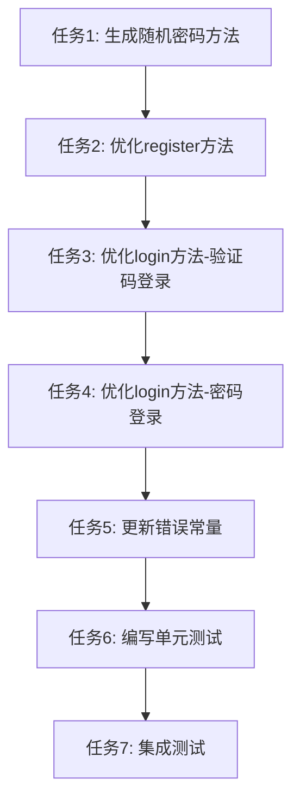

# CONSENSUS_优化用户认证系统

## 1. 明确的需求描述和验收标准

### 1.1 需求描述

优化用户认证系统的注册与登录功能，实现以下具体需求：

#### 1.1.1 登录方式支持
- 手机号+验证码登录
- 账号或手机号+密码登录

#### 1.1.2 手机号验证码登录流程
1. 用户输入手机号并获取验证码
2. 验证验证码有效性
3. 若用户不存在，自动执行注册流程：
   - 创建新用户记录
   - 填充基础默认值（包括但不限于必要的用户信息字段）
   - 生成随机密码并安全存储
4. 验证通过后完成登录并返回用户认证信息

#### 1.1.3 账号密码登录流程
1. 用户输入账号和密码
2. 验证账号是否存在
3. 若账号不存在，直接返回"账号不存在"的明确提示
4. 若账号存在，验证密码正确性并完成登录

#### 1.1.4 安全要求
1. 随机密码需符合安全复杂度要求
2. 密码存储必须采用系统的rsa加密

#### 1.1.5 错误处理
1. 提供清晰的错误提示信息
2. 对异常情况进行适当处理和反馈

### 1.2 验收标准

#### 1.2.1 功能验收标准
- [ ] 手机号+验证码登录功能正常
- [ ] 账号+密码登录功能正常
- [ ] 手机号+密码登录功能正常
- [ ] 手机号验证码登录时自动注册功能正常
- [ ] 随机密码生成符合安全复杂度要求
- [ ] 密码使用RSA加密和Scrypt哈希存储
- [ ] 错误提示信息清晰明确

#### 1.2.2 性能验收标准
- [ ] 登录接口响应时间 < 500ms
- [ ] 注册接口响应时间 < 500ms
- [ ] 验证码验证响应时间 < 300ms

#### 1.2.3 安全验收标准
- [ ] 随机密码长度为16位
- [ ] 随机密码包含大小写字母、数字、特殊字符
- [ ] 密码传输使用RSA加密
- [ ] 密码存储使用Scrypt哈希
- [ ] 使用常量时间比较防止时序攻击

#### 1.2.4 测试验收标准
- [ ] 单元测试覆盖率 > 80%
- [ ] 所有单元测试用例通过
- [ ] 所有集成测试用例通过

#### 1.2.5 代码质量验收标准
- [ ] 代码符合项目现有规范
- [ ] 代码通过ESLint检查
- [ ] 代码通过TypeScript类型检查
- [ ] 代码添加必要的注释

## 2. 技术实现方案

### 2.1 技术栈
- **框架**: NestJS + Fastify
- **数据库**: PostgreSQL + Prisma ORM
- **缓存**: Redis
- **认证**: JWT (Access Token + Refresh Token)
- **加密**: RSA (数据传输加密) + Scrypt (密码哈希)
- **短信服务**: 阿里云短信服务
- **测试**: Jest + Supertest

### 2.2 核心技术方案

#### 2.2.1 随机密码生成
- **算法**: 使用crypto.randomBytes生成随机数
- **长度**: 16位
- **字符组成**:
  - 大写字母: 2位 (A-Z)
  - 小写字母: 2位 (a-z)
  - 数字: 2位 (0-9)
  - 特殊字符: 2位 (!@#$%^&*)
  - 随机字符: 8位 (混合所有字符类型)

#### 2.2.2 密码加密流程
1. 生成随机密码
2. 使用RSA加密（传输层）
3. 使用Scrypt哈希（存储层）
4. 存储到数据库

#### 2.2.3 登录流程优化
1. 验证必填字段
2. 查找用户（通过phone或account）
3. 如果用户不存在且使用验证码，则自动注册
4. 如果用户不存在且使用密码，则抛出"账号不存在"错误
5. 验证密码或验证码
6. 检查账号状态
7. 更新登录信息
8. 生成JWT Token
9. 存储Token到数据库和Redis
10. 返回用户信息和Token

### 2.3 技术约束和集成方案

#### 2.3.1 技术约束
- 必须使用现有的RSA和Scrypt加密机制
- 必须使用现有的SmsService发送和验证验证码
- 必须使用现有的BaseAuthService生成JWT Token
- 必须使用现有的AppTokenStorageService管理Token
- 必须遵循现有的代码规范和架构模式

#### 2.3.2 集成方案
- 修改AuthService.login方法，优化登录逻辑
- 修改AuthService.register方法，支持自动生成随机密码
- 新增generateSecureRandomPassword方法，生成安全的随机密码
- 新增updateUserLoginInfo方法，更新用户登录信息
- 新增storeTokens方法，存储Token到数据库和Redis
- 更新auth.constant.ts，添加新的错误提示

## 3. 任务边界限制和验收标准

### 3.1 任务边界

#### 3.1.1 包含范围
- 优化登录接口，支持手机号验证码登录和账号密码登录
- 实现手机号验证码登录时的自动注册功能
- 生成安全的随机密码
- 完善错误处理和提示信息
- 编写单元测试和集成测试

#### 3.1.2 不包含范围
- 修改注册接口（保持现有注册接口不变）
- 修改忘记密码和重置密码功能
- 修改Token管理机制
- 修改设备管理功能
- 修改用户资料管理功能

### 3.2 验收标准

#### 3.2.1 功能验收
- [ ] 手机号+验证码登录功能正常
- [ ] 账号+密码登录功能正常
- [ ] 手机号+密码登录功能正常
- [ ] 手机号验证码登录时自动注册功能正常
- [ ] 随机密码生成符合安全复杂度要求
- [ ] 密码使用RSA加密和Scrypt哈希存储
- [ ] 错误提示信息清晰明确

#### 3.2.2 性能验收
- [ ] 登录接口响应时间 < 500ms
- [ ] 注册接口响应时间 < 500ms
- [ ] 验证码验证响应时间 < 300ms

#### 3.2.3 安全验收
- [ ] 随机密码长度为16位
- [ ] 随机密码包含大小写字母、数字、特殊字符
- [ ] 密码传输使用RSA加密
- [ ] 密码存储使用Scrypt哈希
- [ ] 使用常量时间比较防止时序攻击

#### 3.2.4 测试验收
- [ ] 单元测试覆盖率 > 80%
- [ ] 所有单元测试用例通过
- [ ] 所有集成测试用例通过

#### 3.2.5 代码质量验收
- [ ] 代码符合项目现有规范
- [ ] 代码通过ESLint检查
- [ ] 代码通过TypeScript类型检查
- [ ] 代码添加必要的注释

## 4. 确认所有不确定性已解决

### 4.1 已解决的问题

#### 4.1.1 随机密码复杂度要求
- **问题**: 随机密码需要符合什么安全复杂度要求？
- **解决方案**: 
  - 长度：16位
  - 字符类型：大写字母(2) + 小写字母(2) + 数字(2) + 特殊字符(2) + 随机字符(8)
  - 特殊字符：!@#$%^&*

#### 4.1.2 自动注册的默认值
- **问题**: 自动注册时需要设置哪些默认值？
- **解决方案**: 
  - nickname: 用户{account}
  - gender: GenderEnum.UNKNOWN
  - isEnabled: true
  - 其他字段不设置默认值

#### 4.1.3 Token生成
- **问题**: 验证码登录后是否需要和密码登录使用相同的Token生成逻辑？
- **解决方案**: 
  - 使用相同的Token生成逻辑
  - 存储设备信息（与现有逻辑一致）

#### 4.1.4 错误提示
- **问题**: 验证码错误和账号不存在时如何提示？
- **解决方案**: 
  - 验证码错误：统一提示"验证码错误或已过期"
  - 账号不存在：统一提示"账号不存在"

### 4.2 确认的技术方案

#### 4.2.1 登录流程
- 手机号+验证码登录：验证验证码 → 查找用户 → 如果不存在则自动注册 → 登录
- 账号+密码登录：查找用户 → 如果不存在则报错 → 验证密码 → 登录
- 手机号+密码登录：查找用户 → 如果不存在则报错 → 验证密码 → 登录

#### 4.2.2 密码加密
- 生成随机密码 → RSA加密 → Scrypt哈希 → 存储到数据库

#### 4.2.3 Token管理
- 使用相同的Token生成逻辑
- 存储到数据库和Redis
- 支持撤销和刷新

### 4.3 确认的代码规范

#### 4.3.1 代码风格
- 使用TypeScript严格模式
- 使用class-validator进行数据验证
- 使用class-transformer进行数据转换
- 使用装饰器进行路由配置和文档生成
- 错误信息集中管理在constant文件

#### 4.3.2 安全规范
- 密码传输必须使用RSA加密
- 密码存储必须使用Scrypt哈希
- 敏感信息不得在日志中输出
- 使用常量时间比较防止时序攻击

#### 4.3.3 测试规范
- 单元测试覆盖率要求：>80%
- 集成测试覆盖主要业务流程
- 测试数据使用seed脚本生成

#### 4.3.4 文档规范
- API文档使用Swagger自动生成
- 代码注释使用JSDoc格式
- 复杂逻辑需要添加行内注释

## 5. 实施计划

### 5.1 任务列表

1. **任务1: 生成随机密码方法**
   - 输入：无
   - 输出：16位随机密码
   - 验收标准：密码长度16位，包含大小写字母、数字、特殊字符

2. **任务2: 优化register方法**
   - 输入：LoginDto { phone, code?, password? }
   - 输出：LoginResponseDto { user, tokens }
   - 验收标准：支持验证码注册和密码注册，自动生成随机密码

3. **任务3: 优化login方法-验证码登录**
   - 输入：LoginDto { phone, code }
   - 输出：LoginResponseDto { user, tokens }
   - 验收标准：验证码登录成功，自动注册功能正常

4. **任务4: 优化login方法-密码登录**
   - 输入：LoginDto { account, password } 或 { phone, password }
   - 输出：LoginResponseDto { user, tokens }
   - 验收标准：密码登录成功，账号不存在时抛出错误

5. **任务5: 更新错误常量**
   - 输入：无
   - 输出：更新后的ErrorMessages对象
   - 验收标准：添加"验证码错误或已过期"错误信息

6. **任务6: 编写单元测试**
   - 输入：无
   - 输出：auth.service.spec.ts文件
   - 验收标准：测试覆盖率 > 80%，所有测试用例通过

7. **任务7: 集成测试**
   - 输入：无
   - 输出：auth.e2e-spec.ts文件
   - 验收标准：所有集成测试用例通过

### 5.2 任务依赖关系

### 5.3 实施步骤

1. **阶段1: 准备工作**
   - 创建docs目录
   - 创建ALIGNMENT文档
   - 创建DESIGN文档
   - 创建TASK文档
   - 创建CONSENSUS文档

2. **阶段2: 代码实现**
   - 实现generateSecureRandomPassword方法
   - 优化register方法
   - 优化login方法（验证码登录）
   - 优化login方法（密码登录）
   - 更新错误常量

3. **阶段3: 测试**
   - 编写单元测试
   - 编写集成测试
   - 运行测试并修复问题

4. **阶段4: 验收**
   - 运行lint检查
   - 运行类型检查
   - 运行所有测试
   - 验证功能完整性
   - 验证性能指标
   - 验证安全要求

5. **阶段5: 交付**
   - 创建ACCEPTANCE文档
   - 创建FINAL文档
   - 创建TODO文档

## 6. 风险评估

### 6.1 技术风险

#### 6.1.1 随机密码生成
- **风险**: 随机密码可能不够安全
- **缓解措施**: 使用crypto.randomBytes生成随机数，确保密码复杂度

#### 6.1.2 密码加密
- **风险**: RSA解密或Scrypt哈希可能失败
- **缓解措施**: 添加异常处理，捕获并记录错误

#### 6.1.3 验证码验证
- **风险**: 阿里云短信服务可能不稳定
- **缓解措施**: 添加重试机制，记录失败日志

### 6.2 业务风险

#### 6.2.1 自动注册
- **风险**: 自动注册可能被滥用
- **缓解措施**: 添加验证码验证，限制注册频率

#### 6.2.2 登录安全
- **风险**: 登录可能被暴力破解
- **缓解措施**: 添加验证码验证，限制登录频率

### 6.3 性能风险

#### 6.3.1 登录响应时间
- **风险**: 登录接口响应时间可能过长
- **缓解措施**: 使用Redis缓存，优化数据库查询

#### 6.3.2 并发处理
- **风险**: 高并发时可能出现性能问题
- **缓解措施**: 使用连接池，优化数据库查询

## 7. 质量保证

### 7.1 代码质量

#### 7.1.1 代码规范
- 遵循项目现有代码规范
- 使用TypeScript严格模式
- 添加必要的注释

#### 7.1.2 代码检查
- 运行ESLint检查
- 运行TypeScript类型检查
- 运行Prettier格式化

### 7.2 测试质量

#### 7.2.1 单元测试
- 测试覆盖率 > 80%
- 测试用例独立可运行
- 使用Mock隔离依赖

#### 7.2.2 集成测试
- 测试覆盖主要业务流程
- 测试环境与生产环境一致
- 测试完成后清理数据

### 7.3 性能质量

#### 7.3.1 响应时间
- 登录接口响应时间 < 500ms
- 注册接口响应时间 < 500ms
- 验证码验证响应时间 < 300ms

#### 7.3.2 并发处理
- 支持100并发登录
- 支持100并发注册
- 数据库连接池配置合理

### 7.4 安全质量

#### 7.4.1 密码安全
- 随机密码长度16位
- 密码包含大小写字母、数字、特殊字符
- 密码传输使用RSA加密
- 密码存储使用Scrypt哈希

#### 7.4.2 会话安全
- JWT Token有效期合理
- Token存储到数据库和Redis
- 支持Token撤销和刷新

## 8. 交付物清单

### 8.1 代码交付物
- [ ] 优化后的AuthService类
- [ ] 更新后的auth.constant.ts文件
- [ ] 单元测试文件auth.service.spec.ts
- [ ] 集成测试文件auth.e2e-spec.ts

### 8.2 文档交付物
- [ ] ALIGNMENT_优化用户认证系统.md
- [ ] DESIGN_优化用户认证系统.md
- [ ] TASK_优化用户认证系统.md
- [ ] CONSENSUS_优化用户认证系统.md
- [ ] ACCEPTANCE_优化用户认证系统.md
- [ ] FINAL_优化用户认证系统.md
- [ ] TODO_优化用户认证系统.md

### 8.3 其他交付物
- [ ] API文档（Swagger自动生成）
- [ ] 测试报告
- [ ] 性能测试报告
- [ ] 安全测试报告

## 9. 后续支持

### 9.1 待办事项
- [ ] 监控登录接口性能
- [ ] 监控注册接口性能
- [ ] 监控验证码发送成功率
- [ ] 监控Token刷新成功率
- [ ] 监控异常登录次数
- [ ] 监控账号锁定次数

### 9.2 优化建议
- [ ] 添加多因素认证（2FA）
- [ ] 添加设备指纹识别
- [ ] 添加异地登录检测
- [ ] 添加登录风险评估
- [ ] 优化Token刷新机制
- [ ] 优化验证码发送机制

### 9.3 扩展建议
- [ ] 支持邮箱登录
- [ ] 支持第三方登录（微信、QQ、GitHub等）
- [ ] 支持生物识别登录
- [ ] 支持图形验证码
- [ ] 支持滑动验证码
- [ ] 支持行为验证
